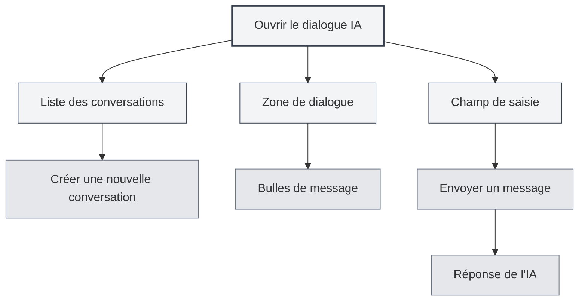
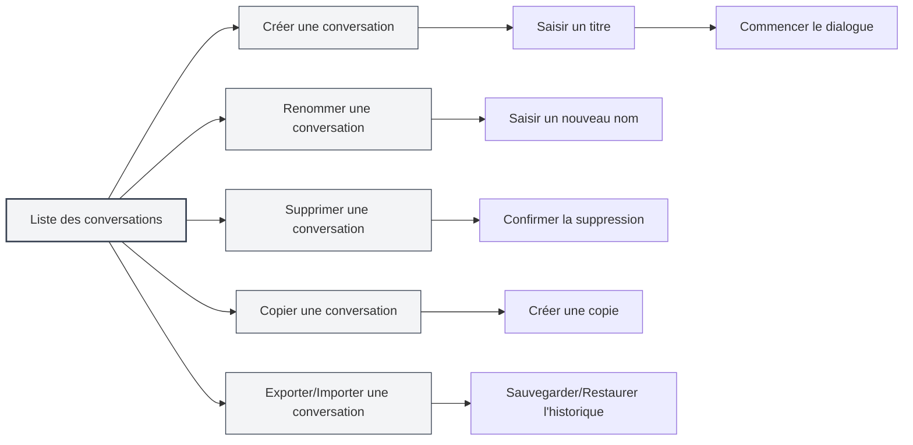
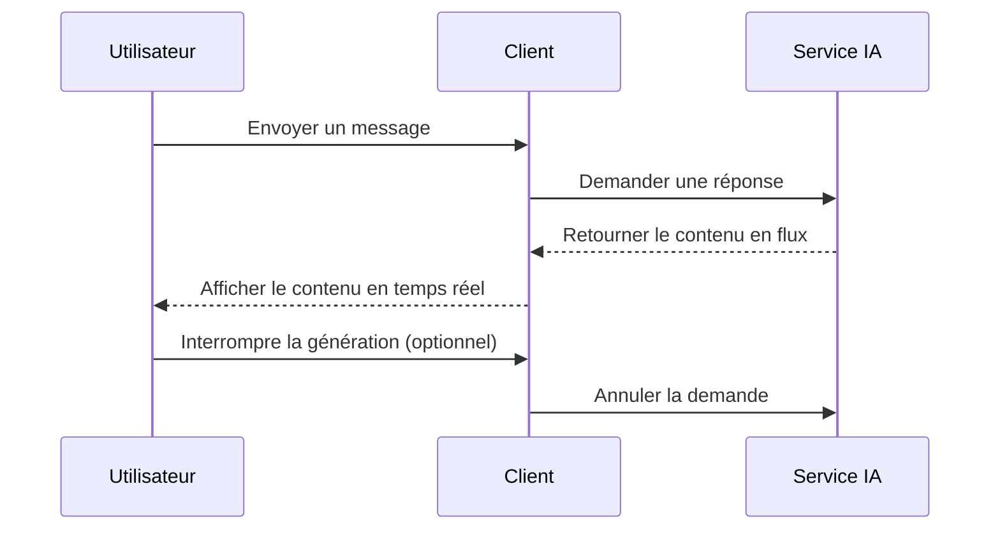
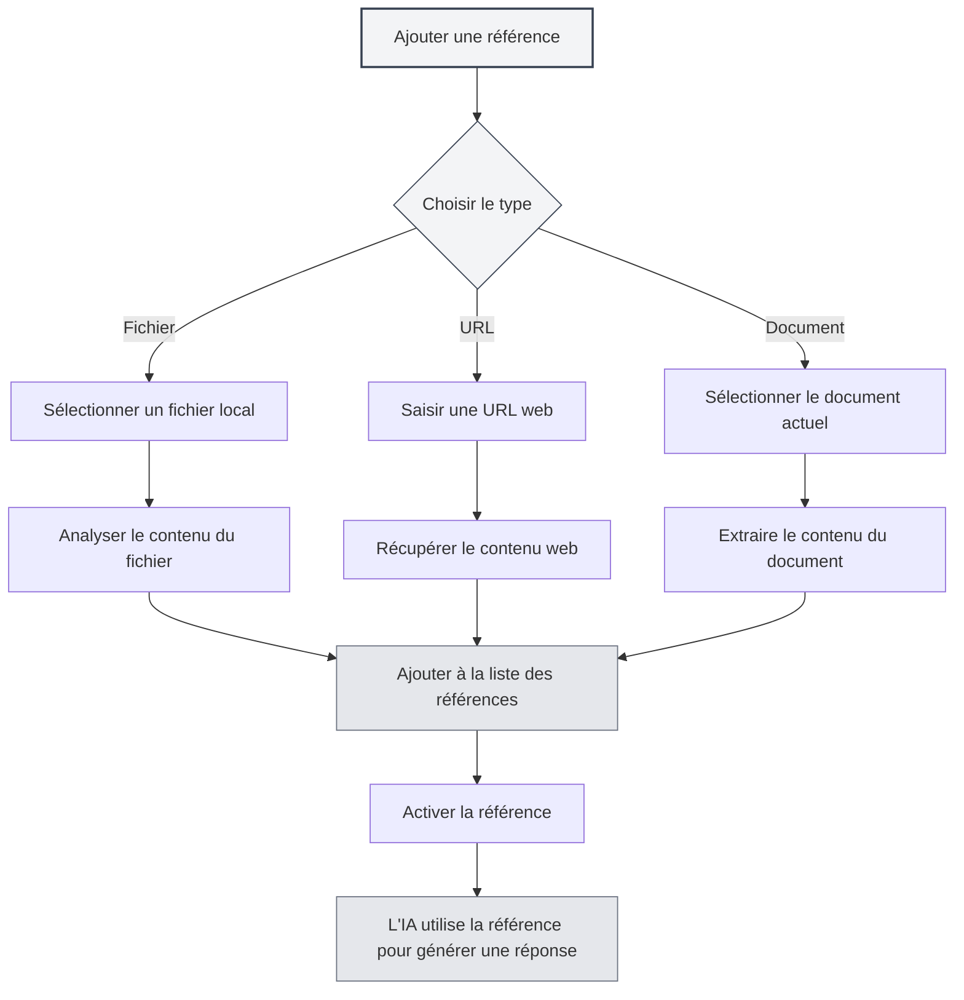

# Dialogue IA

## Vue d'ensemble

La fonction de dialogue IA fournit un assistant conversationnel intelligent qui peut vous aider à répondre à des questions, générer du contenu, analyser des documents, etc. Grâce au dialogue IA, vous pouvez interagir avec l'IA en langage naturel et obtenir une aide et des suggestions intelligentes.

Le dialogue IA prend en charge la gestion de conversations multiples, la référence à des ressources, l'intégration de bases de connaissances et d'autres fonctionnalités, vous permettant d'utiliser efficacement l'IA pour accomplir diverses tâches.

## Ouvrir le dialogue IA

### Méthodes d'ouverture

Il existe plusieurs façons d'ouvrir le dialogue IA :

- **Barre de menu** : Cliquez sur le menu "IA", sélectionnez "Dialogue IA"
- **Raccourci clavier** : Utilisez un raccourci clavier pour ouvrir rapidement (si configuré)
- **Barre latérale** : Ouvrez le panneau de dialogue IA depuis la barre latérale

Vous pouvez accéder à la fonction de dialogue IA via le menu Assistant IA de la barre de menu supérieure :

<MenuItemsDemo mode="demo" :items='[{"id": "ai-assistant", "items": ["ai-chat"]}]' />

### Présentation de l'interface

L'interface du dialogue IA comprend les parties suivantes :

<AIChat mode="demo" />

- **Liste des conversations** : Affiche la liste de toutes les conversations sur la gauche
- **Zone de dialogue** : Affiche les messages de la conversation au centre
- **Champ de saisie** : Saisissez les messages en bas
- **Gestion des références** : Gérez les ressources référencées

## Gestion des conversations

Le dialogue IA prend en charge la gestion de conversations multiples. Vous pouvez créer, renommer, supprimer et copier des conversations.

<AIChat mode="demo" />

### Créer une conversation

Créer une nouvelle conversation de dialogue IA :

1. **Cliquer sur Nouveau** : Cliquez sur le bouton "Nouvelle conversation" au-dessus de la liste des conversations
2. **Saisir un titre** : Saisissez éventuellement un titre pour la conversation (le premier message est utilisé par défaut)
3. **Commencer le dialogue** : Saisissez le premier message pour commencer la conversation

### Opérations sur les conversations

### Renommer une conversation

Renommer une conversation existante :

1. **Menu contextuel** : Faites un clic droit sur la conversation, sélectionnez "Renommer"
2. **Saisir un nouveau nom** : Saisissez le nouveau nom de la conversation
3. **Confirmer l'enregistrement** : Confirmez pour enregistrer le nouveau nom

### Supprimer une conversation

Supprimer une conversation non désirée :

1. **Menu contextuel** : Faites un clic droit sur la conversation, sélectionnez "Supprimer"
2. **Confirmer la suppression** : Confirmez pour supprimer la conversation

La suppression d'une conversation supprime également tout l'historique des messages de cette conversation.

### Copier une conversation

Copier une conversation existante :

1. **Menu contextuel** : Faites un clic droit sur la conversation, sélectionnez "Copier"
2. **Créer une copie** : Le système crée une nouvelle copie de la conversation

La copie d'une conversation copie tout l'historique des messages, vous permettant de poursuivre la discussion à partir d'un dialogue existant.

### Exporter/Importer une conversation

Exporter et importer des conversations :

- **Exporter une conversation** : Faites un clic droit sur la conversation, sélectionnez "Exporter", enregistrez en tant que fichier JSON
- **Importer une conversation** : Importez une conversation depuis un fichier pour restaurer l'historique des messages

La fonction d'exportation/importation vous permet de sauvegarder et de partager facilement le contenu des conversations.

<MenuItemsDemo mode="demo" :items='[{"id": "file", "items": ["save", "open"]}]' />

## Envoyer un message

Le dialogue IA offre des fonctionnalités riches pour l'envoi de messages.

<AIChat mode="demo" />

### Saisir un message

Saisissez un message dans le champ de saisie :

1. **Saisir du texte** : Saisissez votre question ou demande dans le champ de saisie
2. **Mise en forme** : Prend en charge le format Markdown, vous pouvez formater le texte
3. **Envoyer le message** : Cliquez sur le bouton d'envoi ou appuyez sur `Entrée` pour envoyer

### Types de messages

Les types de messages suivants sont pris en charge :

- **Message texte** : Message texte standard
- **Message Markdown** : Message prenant en charge le format Markdown
- **Message code** : Message contenant du code

### Raccourcis clavier

Raccourcis clavier pour envoyer des messages :

- **Entrée** : Envoyer le message
- **Maj+Entrée** : Aller à la ligne (sans envoyer)
- **Ctrl+Entrée** : Envoyer le message (selon certaines configurations)

## Réponse de l'IA

La fonction de réponse de l'IA fournit une sortie en flux continu et des fonctionnalités d'action sur les messages.

<AIChat mode="demo" />

<AIChat mode="demo" />

### Sortie en flux continu

La réponse de l'IA utilise une sortie en flux continu :

- **Affichage en temps réel** : Le contenu généré par l'IA s'affiche en temps réel
- **Génération progressive** : Le contenu est généré progressivement, pas besoin d'attendre la fin
- **Interruptible** : Vous pouvez interrompre la génération de l'IA à tout moment

### Actions sur les messages

Les actions suivantes peuvent être effectuées sur les réponses de l'IA :

- **Copier** : Copier le contenu de la réponse de l'IA
- **Regénérer** : Regénérer la réponse de l'IA
- **Modifier** : Modifier la réponse de l'IA (si pris en charge)
- **Supprimer** : Supprimer la réponse de l'IA

### Modification des messages

Modifier un message utilisateur :

1. **Cliquer sur Modifier** : Cliquez sur le bouton de modification à côté du message
2. **Modifier le contenu** : Modifiez le contenu du message
3. **Renvoyer** : Renvoyez le message modifié

La modification d'un message supprime tous les messages qui le suivent et redémarre la conversation.

## Référencer des ressources

Vous pouvez ajouter des ressources de référence au dialogue IA pour aider l'IA à mieux comprendre le contexte.

<AIChat mode="demo" />

### Ajouter une référence

Ajouter une ressource de référence à une conversation :

1. **Ouvrir la gestion des références** : Cliquez sur l'onglet Références au-dessus de la zone de dialogue
2. **Ajouter une référence** : Cliquez sur le bouton "Ajouter une référence"
3. **Choisir le type** : Sélectionnez le type de référence (fichier, URL, etc.)
4. **Choisir le contenu** : Sélectionnez le contenu à référencer

### Types de références

Les types de références suivants sont pris en charge :

- **Référence de fichier** : Référencer un fichier local
- **Référence d'URL** : Référencer une URL web
- **Référence de document** : Référencer le document actuellement ouvert

### Activer une référence

Activer et désactiver des références :

- **Activer une référence** : Cliquez sur l'onglet de référence pour l'activer
- **Désactiver une référence** : Cliquez à nouveau pour la désactiver
- **État d'activation** : Les références activées sont utilisées lors de la réponse de l'IA

Une fois une référence activée, l'IA tiendra compte de son contenu pour générer la réponse.

### Aperçu des références

Aperçu du contenu d'une référence :

- **Cliquer pour prévisualiser** : Cliquez sur l'onglet de référence pour voir son contenu
- **Voir les détails** : Consultez le contenu détaillé de la référence
- **Modifier la référence** : Modifier ou supprimer la référence

## Intégration de la base de connaissances

Le dialogue IA peut s'intégrer à la base de connaissances pour rechercher automatiquement des informations pertinentes.

<KnowledgeBase mode="demo" />

<AIChat mode="demo" />

### Activer la base de connaissances

Activer l'interrogation de la base de connaissances :

1. **Ouvrir les paramètres** : Trouvez l'interrupteur de la base de connaissances sous le champ de saisie
2. **Activer l'interrogation** : Basculez l'interrupteur pour activer l'interrogation de la base de connaissances
3. **Recherche automatique** : L'IA recherchera automatiquement dans la base de connaissances lors de ses réponses

### Recherche dans la base de connaissances

Fonctionnalité de recherche dans la base de connaissances :

- **Recherche automatique** : Recherche automatique d'informations pertinentes lors de l'envoi d'un message
- **Compréhension du contexte** : Recherche de contenu pertinent en fonction du contexte de la conversation
- **Intégration des résultats** : Intégration des résultats de recherche dans la réponse de l'IA

### Paramètres de recherche

Paramètres de recherche dans la base de connaissances :

- **Seuil de confiance** : Définir le seuil de confiance pour la recherche
- **Nombre de résultats** : Définir le nombre de résultats de recherche
- **Portée de recherche** : Définir la portée de la recherche

Voir [[knowledge-base.config|Configuration de la base de connaissances]] pour plus de détails.

## Gestion des messages

Gérer les messages dans le dialogue IA.

<AIChat mode="demo" />

### Actions sur les messages

Les actions suivantes peuvent être effectuées sur les messages :

- **Copier un message** : Copier le contenu d'un message
- **Modifier un message** : Modifier un message utilisateur
- **Supprimer un message** : Supprimer un message
- **Regénérer** : Regénérer la réponse de l'IA

### Historique des messages

Gestion de l'historique des messages :

- **Sauvegarde automatique** : L'historique des messages est sauvegardé automatiquement
- **Isolation des conversations** : L'historique des messages est indépendant pour chaque conversation
- **Restauration de l'historique** : L'historique est restauré lors de la réouverture d'une conversation

### Format des messages

Les messages prennent en charge les formats suivants :

<AIChat mode="demo" />

- **Markdown** : Prend en charge le format Markdown
- **Bloc de code** : Prend en charge la coloration syntaxique des blocs de code
- **Formules mathématiques** : Prend en charge les formules mathématiques LaTeX
- **Tableaux** : Prend en charge l'affichage des tableaux

## Astuces d'utilisation

Les astuces suivantes vous permettent d'utiliser plus efficacement la fonction de dialogue IA.

<AIChat mode="demo" />

### Dialogue efficace

1. **Poser des questions claires** : Formulez des questions précises pour obtenir de meilleures réponses
2. **Fournir du contexte** : Fournissez suffisamment d'informations contextuelles
3. **Utiliser des références** : Utilisez des ressources de référence pour fournir plus d'informations

### Organisation des conversations

1. **Gestion par catégorie** : Créez des conversations distinctes pour différents sujets
2. **Convention de nommage** : Utilisez des noms de conversation clairs
3. **Nettoyage régulier** : Supprimez régulièrement les conversations non nécessaires

### Utilisation de la base de connaissances

1. **Ajouter des documents pertinents** : Ajoutez des documents pertinents à la base de connaissances
2. **Activer l'interrogation** : Activez l'interrogation de la base de connaissances pour obtenir de meilleures réponses
3. **Ajuster les paramètres** : Ajustez les paramètres de recherche selon vos besoins

## Questions fréquentes

<AIChat mode="demo" />

<MenuItemsDemo mode="demo" :items='[{"id": "ai-assistant"}]' />

### Q : La réponse de l'IA est inexacte ?

R : La réponse de l'IA est basée sur des données d'entraînement et peut être inexacte. Vous pouvez fournir plus d'informations contextuelles ou utiliser des ressources de référence pour améliorer la précision.

### Q : Comment interrompre la génération de l'IA ?

R : Cliquez sur le bouton "Annuler" pour interrompre la génération de l'IA. Le contenu déjà généré ne sera pas perdu.

### Q : L'historique des messages est perdu ?

R : L'historique des messages est sauvegardé automatiquement. S'il est perdu, vérifiez si vous avez supprimé la conversation ou effacé les données.

### Q : Comment améliorer la qualité des réponses ?

R : Fournir un contexte clair, utiliser des ressources de référence et activer l'interrogation de la base de connaissances peuvent tous améliorer la qualité des réponses.

### Q : Quels LLM sont pris en charge ?

R : Plusieurs LLM sont pris en charge, notamment OpenAI, Ollama, DeepSeek, etc. Voir [[ai.llm-config|Configuration LLM]] pour plus de détails.

## Documents connexes

- [[ai.proofread|Relecture IA]]
- [[ai.completion|Complétion automatique IA]]
- [[knowledge-base.config|Configuration de la base de connaissances]]
- [[ai.llm-config|Configuration LLM]]
