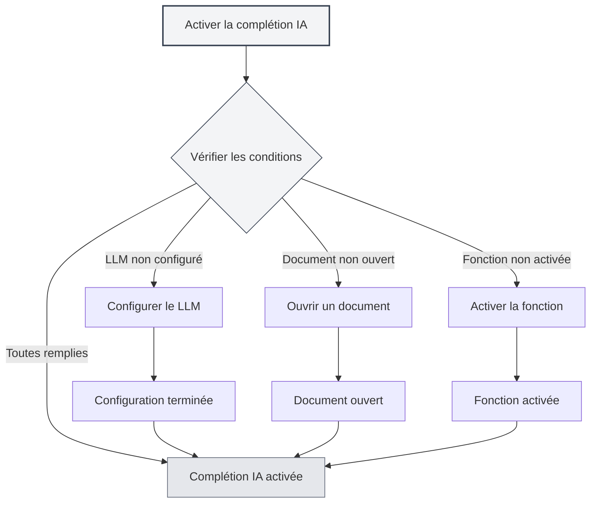
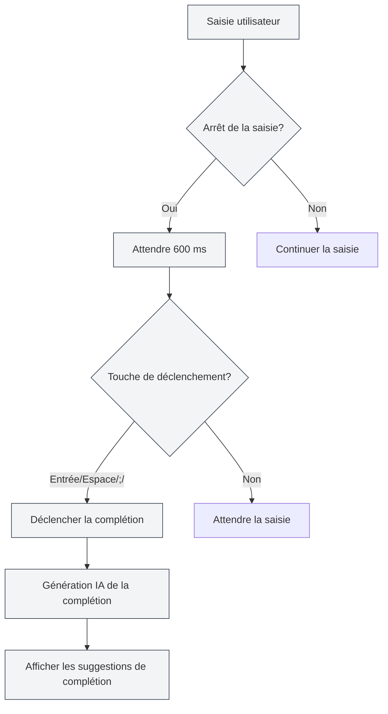
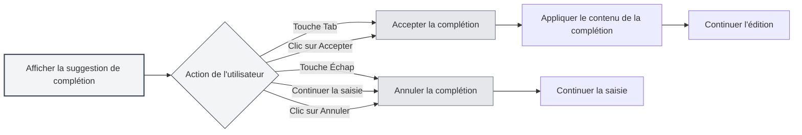

# Complétion automatique par IA

## Vue d'ensemble

La fonction de complétion automatique par IA utilise la technologie de l'IA pour compléter automatiquement ce que vous êtes en train de saisir. Lorsque vous arrêtez de saisir, l'IA génère automatiquement des suggestions de complétion en fonction du contexte, vous aidant ainsi à rédiger vos documents plus rapidement.

La complétion automatique par IA prend en charge plusieurs formats de documents (Markdown, LaTeX, texte brut) et peut comprendre intelligemment le contexte pour générer des suggestions de complétion qui correspondent au style et au contenu du document.

## Activer la complétion par IA

### Méthodes d'activation

Il existe plusieurs façons d'activer la complétion automatique par IA :

- **Menu contextuel** : Faites un clic droit dans l'éditeur et sélectionnez "Activer la complétion automatique par IA"
- **Page des paramètres** : Activez la fonction de complétion automatique par IA dans les paramètres
- **Raccourci clavier** : Utilisez un raccourci clavier pour basculer rapidement (si configuré)

Vous pouvez accéder aux paramètres via la barre de menus supérieure :

<MenuItemsDemo mode="demo" :items='[{"id": "settings"}]' />

<CompletionSettingsPanel mode="demo" />

### Conditions d'activation

L'activation de la complétion automatique par IA nécessite de remplir les conditions suivantes :

- **LLM configuré** : Un service LLM doit être configuré
- **Document ouvert** : Un document doit être ouvert dans l'éditeur
- **Fonction activée** : La fonction de complétion par IA doit être activée dans les paramètres

Voir [[ai.llm-config|Configuration LLM]] pour plus de détails.

<CompletionSettingsPanel mode="demo" />

## Déclenchement automatique

<AISuggestionGhost mode="demo" />

### Conditions de déclenchement

La complétion automatique par IA se déclenche automatiquement dans les situations suivantes :

- **Arrêt de la saisie** : Déclenchement automatique après 600 ms d'arrêt de la saisie
- **Touche de déclenchement** : Déclenchement après la saisie de touches spécifiques (Entrée, Espace, `;`, `,`, etc.)

### Délai de déclenchement

Paramètres du délai de déclenchement :

- **Délai par défaut** : 600 ms (0,6 seconde)
- **Configurable** : Le délai peut être ajusté dans les paramètres
- **Équilibre** : Un délai trop court déclenche trop fréquemment, un délai trop long nuit à l'expérience

<CompletionSettingsPanel mode="demo" />

### Touches de déclenchement

Touches de déclenchement prises en charge :

- **Entrée** : Déclenchement par la touche Entrée
- **Espace** : Déclenchement par la barre d'espace
- **;** : Déclenchement par le point-virgule
- **,** : Déclenchement par la virgule

Les touches de déclenchement peuvent être configurées dans les paramètres, plusieurs touches peuvent être activées simultanément.

## Déclenchement manuel

<AISuggestionGhost mode="demo" />

### Méthodes de déclenchement

Méthodes pour déclencher manuellement la complétion :

- **Raccourci clavier** : Appuyez sur `Maj+Tab` pour déclencher manuellement la complétion
- **Menu contextuel** : Faites un clic droit et sélectionnez "Déclencher la complétion manuellement"

Le déclenchement manuel lance immédiatement la complétion, en contournant le délai du déclenchement automatique.

<CompletionSettingsPanel mode="demo" />

### Cas d'utilisation

Scénarios adaptés au déclenchement manuel :

- **Besoin immédiat de complétion** : Lorsque vous avez besoin d'obtenir immédiatement une suggestion de complétion
- **Échec du déclenchement automatique** : Lorsque le déclenchement automatique n'a pas fonctionné
- **Position spécifique** : Lorsqu'une complétion est nécessaire à un endroit spécifique

## Contenu de la complétion

<AISuggestionGhost mode="demo" />

### Compréhension du contexte

La complétion par IA comprend le contexte suivant :

- **Paragraphe actuel** : Comprend le contenu du paragraphe en cours
- **Structure du document** : Comprend la structure globale du document
- **Style du document** : Comprend le style d'écriture du document
- **Thème du document** : Comprend le thème et le contenu du document

### Modes de complétion

La complétion par IA prend en charge deux modes :

- **Génération complète** : Génère un contenu de complétion complet
- **Génération partielle** : Génère uniquement une partie du contenu (selon les paramètres)

Le mode de complétion peut être configuré dans les paramètres.

<CompletionSettingsPanel mode="demo" />

### Longueur de la complétion

Contrôle de la longueur du contenu de complétion :

- **Nombre maximum de tokens** : Vous pouvez définir le nombre maximum de tokens pour la complétion
- **Valeur par défaut** : 50 tokens
- **Plage** : De 20 tokens à illimité (0 signifie illimité)

Plus le nombre de tokens est élevé, plus le contenu de la complétion est important, mais le temps de génération est également plus long.

<CompletionSettingsPanel mode="demo" />

## Accepter la complétion

<AISuggestionGhost mode="demo" />

### Méthodes d'acceptation

Méthodes pour accepter une suggestion de complétion :

- **Touche Tab** : Appuyez sur la touche `Tab` pour accepter la suggestion de complétion
- **Clic sur Accepter** : Cliquez sur le bouton "Accepter" de la suggestion de complétion

### Annuler la complétion

Méthodes pour annuler une suggestion de complétion :

- **Touche Échap** : Appuyez sur la touche `Échap` pour annuler la suggestion de complétion
- **Continuer la saisie** : Continuer à saisir annule automatiquement la complétion
- **Clic sur Annuler** : Cliquez sur le bouton "Annuler" de la suggestion de complétion

### Modifier la complétion

Après avoir accepté une complétion, vous pouvez continuer à l'éditer :

- **Édition directe** : Après acceptation, vous pouvez éditer directement le contenu de la complétion
- **Acceptation partielle** : Vous pouvez n'accepter qu'une partie du contenu de la complétion
- **Modification de la complétion** : Vous pouvez modifier le contenu de la complétion avant de l'utiliser

## Intégration de la base de connaissances

### Activer la base de connaissances

Pour activer l'intégration de la base de connaissances :

1. **Ouvrir les paramètres** : Activez l'intégration de la base de connaissances dans les paramètres
2. **Configurer la base de connaissances** : Configurez les paramètres liés à la base de connaissances
3. **Recherche automatique** : La base de connaissances est automatiquement interrogée lors de la complétion

Voir [[knowledge-base.config|Configuration de la base de connaissances]] pour plus de détails.

### Recherche contextuelle

Fonctionnalité de recherche dans la base de connaissances :

- **Recherche automatique** : Recherche automatique des connaissances pertinentes lors de la complétion
- **Correspondance sémantique** : Correspondance du contenu pertinent basée sur la similarité sémantique
- **Intégration des résultats** : Intégration des résultats de recherche dans les suggestions de complétion

### Paramètres de recherche

Paramètres de recherche dans la base de connaissances :

- **Seuil de confiance** : Définir le seuil de confiance pour la recherche
- **Nombre de résultats** : Définir le nombre de résultats de recherche
- **Portée de la recherche** : Définir la portée de la recherche

## Paramètres de complétion

### Paramètres de base

Paramètres de base de la complétion par IA :

- **Activer/Désactiver** : Activer ou désactiver la fonction de complétion par IA
- **Délai de déclenchement** : Définir le délai de déclenchement automatique
- **Touches de déclenchement** : Configurer les touches de déclenchement
- **Nombre maximum de tokens** : Définir le nombre maximum de tokens pour la complétion

<CompletionSettingsPanel mode="demo" />

### Paramètres avancés

Paramètres avancés de la complétion par IA :

- **Mode de complétion** : Choisir le mode de complétion (génération complète/partielle)
- **Longueur du contexte** : Définir la longueur du contexte utilisé pour la complétion
- **Paramètre de température** : Définir le paramètre de température pour la génération par IA
- **Intégration de la base de connaissances** : Configurer les options d'intégration de la base de connaissances

<CompletionSettingsPanel mode="demo" />

### Paramètres de format

Paramètres de complétion pour différents formats :

- **Markdown** : Paramètres de complétion pour le format Markdown
- **LaTeX** : Paramètres de complétion pour le format LaTeX
- **Texte brut** : Paramètres de complétion pour le format texte brut

Différents formats peuvent avoir des stratégies et des paramètres de complétion différents.

## Conseils d'utilisation

### Améliorer la qualité de la complétion

1. **Fournir du contexte** : Fournissez suffisamment d'informations contextuelles dans le document
2. **Activer la base de connaissances** : Activer l'intégration de la base de connaissances peut améliorer la qualité de la complétion
3. **Ajuster les paramètres** : Ajustez les paramètres de complétion selon vos besoins

### Utilisation efficace

1. **Utilisation raisonnable** : Ne pas dépendre excessivement de la complétion par IA
2. **Vérifier le contenu** : Vérifiez l'exactitude du contenu après avoir accepté une complétion
3. **Ajustements manuels** : Ajustez manuellement le contenu de la complétion si nécessaire

### Éviter les problèmes

1. **Éviter les déclenchements fréquents** : Évitez de déclencher trop fréquemment la complétion, ce qui nuit à l'expérience de saisie
2. **Vérifier l'exactitude** : Vérifiez l'exactitude du contenu de la complétion
3. **Annuler rapidement** : Annulez rapidement les complétions non nécessaires

## Questions fréquentes

### Q : La complétion est inexacte ?

R : La complétion par IA est basée sur le contexte et les données d'entraînement, elle peut donc être inexacte. Vous pouvez fournir plus d'informations contextuelles ou activer l'intégration de la base de connaissances pour améliorer l'exactitude.

### Q : La complétion est lente ?

R : La vitesse de complétion dépend de la vitesse de réponse du service d'IA. Vous pouvez ajuster les paramètres de complétion ou utiliser un service LLM plus rapide.

### Q : Comment désactiver la complétion automatique ?

R : Désactivez la fonction de complétion automatique par IA dans les paramètres, ou utilisez le menu contextuel pour la désactiver.

### Q : Peut-on personnaliser les touches de déclenchement ?

R : Oui. Configurez les touches de déclenchement dans les paramètres, plusieurs touches peuvent être activées simultanément.

### Q : Le contenu de la complétion est trop long ?

R : Vous pouvez ajuster le nombre maximum de tokens pour la complétion dans les paramètres, afin de limiter la longueur du contenu de la complétion.

## Documents connexes

- [[ai.chat|Chat IA]]
- [[ai.proofread|Relecture par IA]]
- [[knowledge-base.config|Configuration de la base de connaissances]]
- [[ai.llm-config|Configuration LLM]]
