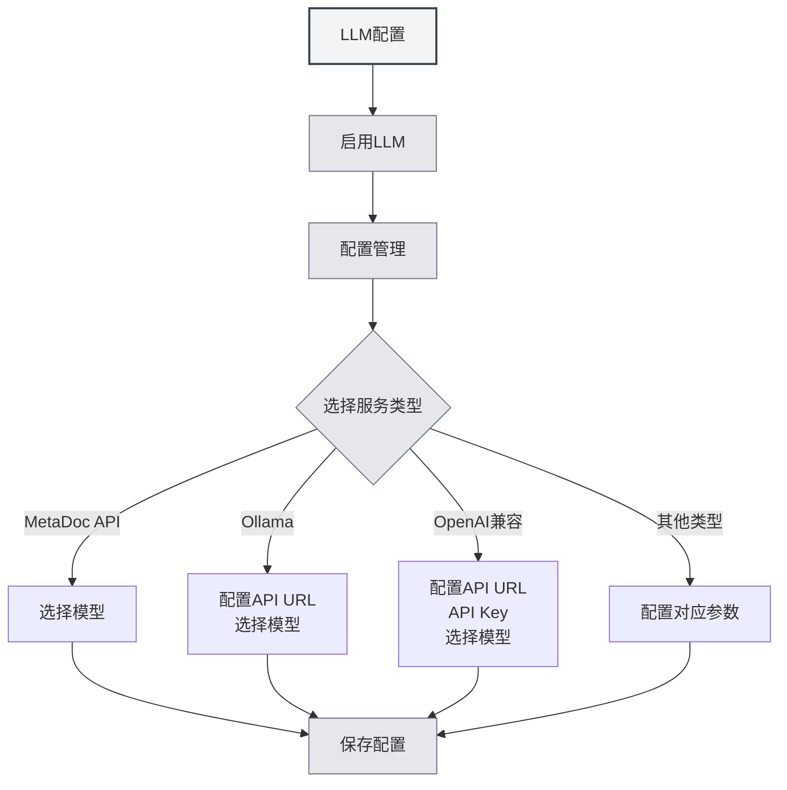

# Guide de configuration des LLM

## Vue d'ensemble

Les LLM (modèles de langage de grande taille) constituent la base commune des fonctionnalités de MetaDoc telles que le dialogue IA, la correction, la complétion, les assistants et les Agents. Ce document explique pourquoi configurer un LLM, quelles fonctionnalités sont affectées par la configuration, et comment accéder à l'interface de configuration spécifique.

<Demo component="SettingLlmSection" mode="demo" />

## Pourquoi configurer un LLM

- **Appels API** : Les fonctionnalités comme le dialogue, la complétion ou la correction envoient des requêtes à l'interface LLM que vous avez sélectionnée, nécessitant une configuration correcte de l'adresse et de la clé API.
- **Différences entre modèles** : Les modèles varient considérablement en termes de qualité, de vitesse et de coût. Choisir le modèle adapté à chaque scénario améliore l'expérience et permet de maîtriser les coûts.
- **Point d'entrée unique** : Gérez de manière centralisée dans [[settings.llm|Configuration LLM]] l'état d'activation, la température, les balises de raisonnement, etc. Une seule configuration affecte toutes les fonctionnalités IA.

## Fonctionnalités affectées par la configuration

Après avoir configuré et activé un LLM, les capacités suivantes sont impactées :

| Fonctionnalité | Description |
| ----------- | -------------------- | ---------------------------------------------- |
| **Dialogue IA** | [[ai.chat | Fonctionnalité de dialogue IA]] : Dialogues multi-tours avec l'IA, réponses contextuelles |
| **Correction IA** | [[ai.proofread | Fonctionnalité de correction IA]] : Vérification grammaticale et orthographique, suggestions de modifications |
| **Complétion IA** | [[ai.completion | Complétion automatique IA]] : Continuation et complétion intelligentes lors de l'écriture |
| **Assistant IA** | [[ai.assistants | Fonctionnalité d'assistants IA]] : Reconnaissance de formules, assistant de dessin, analyse de données, etc. |
| **Agent**   | [[agent.introduction | Cadre Agent]] : Sessions, appels d'outils, exécution de flux de travail |

Si le LLM est désactivé ou si aucun service utilisable n'est configuré, les fonctionnalités ci-dessus seront indisponibles ou demanderont de terminer la configuration.

## Comment configurer un LLM

### Accéder à la page de configuration

1. Ouvrez **Paramètres** → **Configuration LLM** (ou l'entrée équivalente dans l'application).
2. Sur la page « [[settings.llm|Configuration LLM]] », vous pouvez :
   - Activer/désactiver le LLM
   - Définir des options globales comme la température, le retrait automatique des balises de raisonnement, etc.
   - Gérer plusieurs configurations LLM (créer, modifier, supprimer, trier)

Vous pouvez accéder aux paramètres LLM via la barre de menu supérieure :

<MenuItemsDemo mode="demo" :items='[{"id": "settings"}]' />

<MenuItemsDemo mode="demo" :items='[{"id": "ai"}]' />

### Configurer un service spécifique

Dans la **Gestion de la configuration LLM**, sélectionnez ou créez une configuration, puis renseignez les champs selon le type de service :

- **MetaDoc API / Ollama / Compatible OpenAI / OpenAI officiel / DeepSeek / Gemini**, etc.  
  Pour les champs détaillés et les étapes, consultez [[settings.llm-types|Configuration des types LLM]] (adresse API, clé API, nom du modèle, Token maximum, etc.).

### Recommandations d'utilisation

- **Première utilisation** : Commencez par créer et enregistrer une configuration LLM utilisable, puis activez « Activer le LLM ».
- **Configurations multiples** : Vous pouvez créer plusieurs configurations pour différents scénarios (ex. « Dialogue quotidien », « Dédié à la correction ») et les sélectionner dans la configuration de la fonctionnalité ou de l'Agent correspondant.
- **Coût et confidentialité** : L'utilisation d'une API cloud génère des coûts et peut impliquer l'envoi de contenu. Pour un usage local et privé, privilégiez des solutions de déploiement local comme Ollama (voir [[settings.llm-types|Configuration des types LLM]]).

## Documentation associée

- [[settings.llm|Configuration LLM]]
- [[settings.llm-types|Configuration des types LLM]]
- [[settings.llm-management|Gestion de la configuration LLM]]
- [[ai.chat|Fonctionnalité de dialogue IA]]
- [[agent.introduction|Vue d'ensemble du cadre Agent]]

<AIChat mode="demo" />