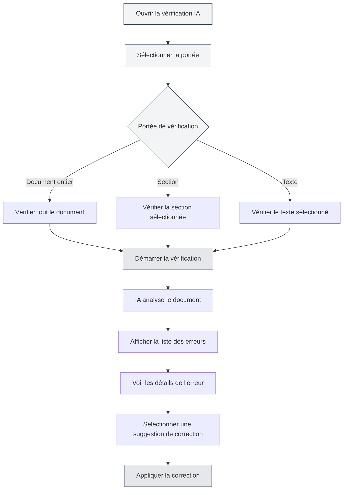
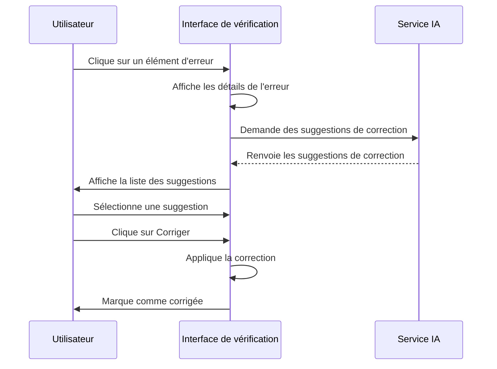

# Vérification orthographique par IA

## Vue d'ensemble

La fonction de vérification orthographique par IA utilise la technologie de l'IA pour vérifier automatiquement les erreurs grammaticales, les fautes d'orthographe, les erreurs de syntaxe LaTeX, etc., dans les documents, et fournit des suggestions de correction. Grâce à la vérification par IA, vous pouvez rapidement détecter et corriger les erreurs dans vos documents, améliorant ainsi leur qualité.

La vérification par IA prend en charge plusieurs formats de documents (Markdown, LaTeX, texte brut), peut vérifier un document entier ou des sections spécifiques, et fournit des informations détaillées sur les erreurs ainsi que des suggestions de correction.

## Ouvrir la vérification par IA

### Méthodes d'ouverture

Il existe plusieurs façons d'ouvrir la vérification par IA :

- **Barre de menu** : Cliquez sur le menu "IA", puis sélectionnez "Vérification orthographique par IA"
- **Raccourci clavier** : Utilisez un raccourci clavier pour l'ouvrir rapidement (s'il est configuré)
- **Barre latérale** : Ouvrez le panneau de vérification par IA depuis la barre latérale

Vous pouvez accéder à la fonction de vérification par IA via le menu de l'assistant IA dans la barre de menu supérieure :

<MenuItemsDemo mode="demo" :items='[{"id": "ai-assistant", "items": ["proofread"]}]' />

### Présentation de l'interface

L'interface de vérification par IA comprend les parties suivantes :

- **Liste des erreurs** : Affichée à gauche, elle montre toutes les erreurs
- **Aperçu du document** : Affiché à droite, il montre le contenu du document
- **Statistiques des erreurs** : Affichées en haut, elles montrent les informations statistiques sur les erreurs
- **Boutons d'action** : Fournis en haut pour les opérations

<ProofreadView mode="demo" />

<ProofreadDisplay mode="demo" />



## Portée de la vérification

### Vérifier le document entier

Vérifier l'intégralité du document :

1. **Ouvrir la vérification** : Ouvrez le panneau de vérification par IA
2. **Cliquer sur Démarrer** : Cliquez sur le bouton "Démarrer la vérification"
3. **Attendre la fin** : Attendez que l'IA termine la vérification

La vérification du document entier examine automatiquement tout le contenu du document.

<ProofreadView mode="demo" />

<ProofreadDisplay mode="demo" />

### Vérifier une section spécifique

Vérifier une section spécifique du document :

1. **Sélectionner la section** : Sélectionnez la section à vérifier dans la vue du plan
2. **Ouvrir la vérification** : Ouvrez le panneau de vérification par IA
3. **Spécifier la section** : Spécifiez le chemin de la section dans les paramètres de vérification
4. **Démarrer la vérification** : Cliquez sur le bouton "Démarrer la vérification"

La vérification d'une section spécifique n'examine que le contenu de la section sélectionnée et de ses sous-sections.

<ProofreadView mode="demo" />

<ProofreadDisplay mode="demo" />

### Vérifier un texte spécifié

Vérifier un contenu textuel spécifié :

1. **Sélectionner le texte** : Sélectionnez le texte à vérifier dans l'éditeur
2. **Ouvrir la vérification** : Ouvrez le panneau de vérification par IA
3. **Coller le texte** : Collez le texte dans la zone de saisie de vérification
4. **Démarrer la vérification** : Cliquez sur le bouton "Démarrer la vérification"

<ProofreadDisplay mode="demo" />

## Types d'erreurs

La vérification par IA peut détecter les types d'erreurs suivants :

```mermaid
graph TB
    A[Types d'erreurs] --> B[Erreurs grammaticales]
    A --> C[Fautes d'orthographe]
    A --> D[Erreurs de syntaxe LaTeX]
    A --> E[Problèmes de style]
    B --> F[Accord sujet-verbe]
    B --> G[Accord des temps]
    B --> H[Problèmes d'ordre des mots]
    C --> I[Orthographe des mots]
    C --> J[Noms propres]
    C --> K[Casse (majuscules/minuscules)]
    D --> L[Erreurs de commande]
    D --> M[Erreurs d'environnement]
    D --> N[Correspondance des parenthèses]
    E --> O[Mots inappropriés]
    E --> P[Expression peu claire]
    E --> Q[Problèmes de format]
    style A fill:#f3f4f6,stroke:#374151,stroke-width:2px
    style B fill:#e5e7eb,stroke:#6b7280
    style C fill:#e5e7eb,stroke:#6b7280
    style D fill:#e5e7eb,stroke:#6b7280
    style E fill:#e5e7eb,stroke:#6b7280
```

### Erreurs grammaticales

Vérifier les erreurs grammaticales dans le document :

<ProofreadDisplay mode="demo" />

- **Accord sujet-verbe** : Vérifie les problèmes d'accord sujet-verbe
- **Accord des temps** : Vérifie les problèmes de concordance des temps
- **Problèmes d'ordre des mots** : Vérifie les problèmes d'ordre des mots
- **Autres problèmes grammaticaux** : Vérifie d'autres problèmes grammaticaux

### Fautes d'orthographe

Vérifier les fautes d'orthographe dans le document :

- **Orthographe des mots** : Vérifie les fautes d'orthographe des mots
- **Noms propres** : Vérifie l'orthographe des noms propres
- **Casse (majuscules/minuscules)** : Vérifie les problèmes de casse

### Erreurs de syntaxe LaTeX

Vérifier les erreurs de syntaxe dans les documents LaTeX :

- **Erreurs de commande** : Vérifie les erreurs de commande LaTeX
- **Erreurs d'environnement** : Vérifie les erreurs d'environnement LaTeX
- **Correspondance des parenthèses** : Vérifie les problèmes de correspondance des parenthèses
- **Autres problèmes de syntaxe** : Vérifie d'autres problèmes de syntaxe LaTeX

### Problèmes de style

Vérifier les problèmes de style dans le document :

- **Mots inappropriés** : Vérifie si les mots utilisés sont appropriés
- **Expression peu claire** : Vérifie si l'expression est claire
- **Problèmes de format** : Vérifie les problèmes de formatage

## Informations sur les erreurs

### Affichage des erreurs

Les informations sur les erreurs contiennent les éléments suivants :

<ProofreadDisplay mode="demo" />

- **Type d'erreur** : Affiche le type d'erreur (grammaire, orthographe, LaTeX, etc.)
- **Emplacement de l'erreur** : Affiche le numéro de ligne et de colonne où se trouve l'erreur
- **Texte erroné** : Affiche le contenu textuel de l'erreur
- **Suggestion de correction** : Affiche la suggestion de correction
- **Gravité** : Affiche le niveau de gravité de l'erreur

### Niveaux de gravité

Les erreurs sont classées par niveau de gravité :

- **Erreur (Error)** : Une erreur qui doit être corrigée
- **Avertissement (Warning)** : Un problème qu'il est recommandé de corriger
- **Information (Info)** : Une information fournie à titre indicatif

### Localisation des erreurs

Localiser rapidement l'emplacement d'une erreur :

1. **Cliquer sur l'erreur** : Cliquez sur l'élément d'erreur dans la liste des erreurs
2. **Localisation automatique** : L'éditeur défile automatiquement jusqu'à l'emplacement de l'erreur
3. **Mise en surbrillance** : L'emplacement de l'erreur est mis en surbrillance

## Suggestions de correction

### Voir les suggestions

Consulter les suggestions de correction fournies par l'IA :

<ProofreadDisplay mode="demo" />

- **Suggestion unique** : Si une seule suggestion existe, elle est affichée directement
- **Suggestions multiples** : S'il y a plusieurs suggestions, elles sont affichées sous forme d'étiquettes
- **Sélectionner une suggestion** : Cliquez sur l'étiquette de suggestion pour la sélectionner

### Appliquer une correction

Appliquer une suggestion de correction :

<ProofreadDisplay mode="demo" />

1. **Sélectionner une suggestion** : Cliquez sur l'étiquette de suggestion pour la sélectionner
2. **Cliquer sur Corriger** : Cliquez sur le bouton "Corriger"
3. **Confirmer la correction** : Après confirmation, la correction est appliquée

Après correction, l'erreur est marquée comme "Corrigée".



### Correction en un clic

Corriger toutes les erreurs en un clic :

1. **Cliquer sur Tout corriger** : Cliquez sur le bouton "Corriger tout en un clic"
2. **Confirmer la correction** : Après confirmation, toutes les erreurs sont corrigées

La correction en un clic utilise la première suggestion pour corriger toutes les erreurs.

## Gestion des erreurs

### Ignorer une erreur

Ignorer une erreur qui n'a pas besoin d'être corrigée :

1. **Sélectionner l'erreur** : Sélectionnez l'erreur à ignorer
2. **Cliquer sur Ignorer** : Cliquez sur le bouton "Ignorer"
3. **Confirmer l'ignorance** : Après confirmation, l'erreur est ignorée

Les erreurs ignorées sont retirées de la liste des erreurs.

### Ajouter au dictionnaire

Ajouter un mot au dictionnaire :

1. **Sélectionner l'erreur** : Sélectionnez une faute d'orthographe
2. **Ajouter au dictionnaire** : Cliquez sur le bouton "Ajouter au dictionnaire"
3. **Confirmer l'ajout** : Après confirmation, le mot est ajouté au dictionnaire

Après ajout au dictionnaire, ce mot ne sera plus marqué comme faute d'orthographe.

### Vider les erreurs corrigées

Vider les erreurs déjà corrigées :

1. **Cliquer sur Vider** : Cliquez sur le bouton "Vider les corrigées"
2. **Confirmer le vidage** : Après confirmation, les erreurs corrigées sont vidées

Vider les erreurs corrigées permet d'avoir une liste d'erreurs plus claire.

## Astuces d'utilisation

<ProofreadView mode="demo" />

### Vérification efficace

1. **Vérifier d'abord le document entier** : Vérifiez d'abord le document entier pour avoir une vue d'ensemble
2. **Puis vérifier les sections** : Effectuez une vérification détaillée des sections problématiques
3. **Correction par lots** : Utilisez la correction en un clic pour corriger rapidement les erreurs courantes

### Traitement des erreurs

1. **Traiter les erreurs en priorité** : Traitez d'abord les erreurs graves
2. **Vérifier les suggestions** : Examinez attentivement les suggestions de correction
3. **Ajustement manuel** : Ajustez manuellement le contenu corrigé si nécessaire

### Gestion du dictionnaire

1. **Ajouter la terminologie professionnelle** : Ajoutez la terminologie professionnelle au dictionnaire
2. **Mettre à jour régulièrement** : Mettez régulièrement à jour le contenu du dictionnaire
3. **Exporter le dictionnaire** : Exportez le dictionnaire pour sauvegarde

## Questions fréquentes

### Q : Les résultats de la vérification sont-ils inexacts ?

R : La vérification par IA est basée sur un modèle d'IA et peut être inexacte. Il est recommandé de vérifier manuellement les résultats, en particulier pour la terminologie professionnelle et les expressions spéciales.

### Q : Comment vérifier une section spécifique ?

R : Spécifiez le chemin de la section (par exemple "1.1") dans les paramètres de vérification, ou utilisez la vue du plan pour sélectionner la section.

### Q : Puis-je ignorer certaines erreurs ?

R : Oui. Vous pouvez ignorer les erreurs qui n'ont pas besoin d'être corrigées en cliquant sur le bouton "Ignorer".

### Q : Comment ajouter au dictionnaire ?

R : Sélectionnez une faute d'orthographe, cliquez sur le bouton "Ajouter au dictionnaire" pour ajouter le mot au dictionnaire.

### Q : La vérification est lente ?

R : La vitesse de vérification dépend de la taille du document et de la vitesse de réponse du service IA. Pour les grands documents, il est recommandé de vérifier par sections.

## Documents connexes

- [[ai.chat|Chat IA]]
- [[ai.completion|Complétion automatique par IA]]
- [[outline.basics|Fonctionnalités de la vue du plan]]