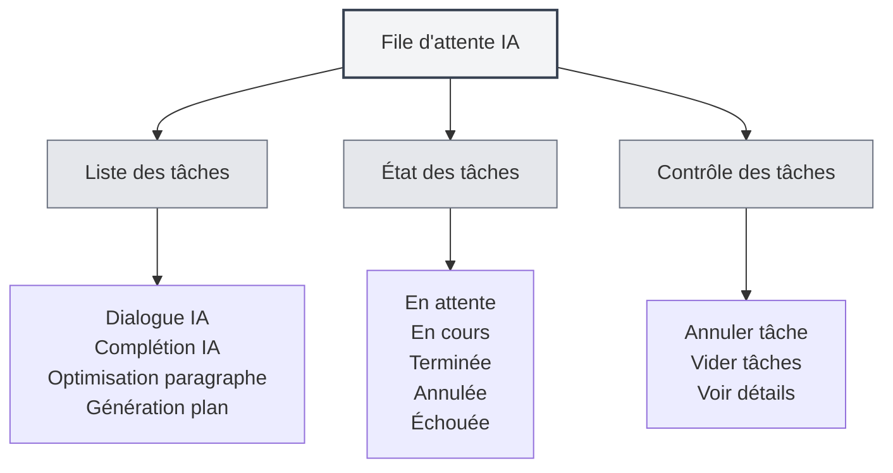

# File d'attente des tâches IA

## Vue d'ensemble

La file d'attente des tâches IA sert à gérer et surveiller toutes les tâches IA en cours d'exécution. Grâce à la file d'attente, vous pouvez consulter l'état des tâches, les annuler, voir leur progression et garantir le fonctionnement efficace des fonctionnalités IA.

## Présentation de la file d'attente

<AITaskQueue mode="demo" />

### Qu'est-ce que la file d'attente ?

La file d'attente des tâches IA est une interface de gestion qui affiche toutes les tâches IA en cours d'exécution ou en attente :

- **Liste des tâches** : Affiche toutes les tâches et leur état.
- **État des tâches** : Indique le statut d'exécution d'une tâche.
- **Progression des tâches** : Montre l'avancement de l'exécution.
- **Contrôle des tâches** : Permet d'annuler ou de gérer les tâches.

### Types de tâches

La file d'attente peut contenir les types de tâches suivants :

- **Dialogue IA** : Tâches de conversation avec l'IA.
- **Complétion IA** : Tâches de complétion automatique par l'IA.
- **Optimisation de paragraphe** : Tâches d'optimisation de paragraphes.
- **Génération de plan** : Tâches de création de structure.
- **Autres tâches IA** : Autres tâches liées à l'IA.

## Ouvrir la file d'attente

### Méthodes d'accès

Vous pouvez ouvrir la file d'attente des tâches de plusieurs façons :

- **Barre latérale** : Un accès peut être présent dans la barre latérale.
- **Options de menu** : Certains menus peuvent proposer une option pour la file d'attente.
- **Raccourci clavier** : Un raccourci peut être disponible dans certains cas (prise en charge future possible).

### Panneau de la file d'attente

<AITaskQueue mode="demo" />

La file d'attente s'affiche généralement sous forme de panneau latéral :

- **Liste des tâches** : Affiche toutes les tâches.
- **Détails de la tâche** : Montre les informations détaillées de la tâche sélectionnée.
- **Boutons de contrôle** : Fournissent les fonctionnalités de gestion des tâches.

## Visualisation des tâches

<AITaskQueue mode="demo" />

### Liste des tâches

La liste affiche toutes les tâches :

- **Nom de la tâche** : Indique le nom de la tâche.
- **État de la tâche** : Indique le statut actuel.
- **Progression de la tâche** : Montre le pourcentage d'avancement.
- **Heure de la tâche** : Indique l'heure de création.

### États des tâches

Une tâche peut se trouver dans l'un des états suivants :

- **En attente** : Tâche créée, en attente d'exécution.
- **En cours** : Tâche en cours d'exécution.
- **Terminée** : Exécution de la tâche achevée.
- **Annulée** : Tâche ayant été annulée.
- **Échouée** : Échec de l'exécution de la tâche.

### Détails d'une tâche

Vous pouvez consulter les informations détaillées d'une tâche :

- **Nom de la tâche** : Le nom de la tâche.
- **Type de tâche** : Le type de la tâche.
- **Paramètres de la tâche** : Les paramètres utilisés.
- **Résultat de la tâche** : Le résultat (si terminée).
- **Message d'erreur** : L'erreur survenue (si échec).

## Contrôle des tâches

<AITaskQueue mode="demo" />

### Annuler une tâche

Vous pouvez annuler une tâche en cours d'exécution :

1. **Sélectionner la tâche** : Choisir la tâche à annuler dans la liste.
2. **Cliquer sur Annuler** : Cliquer sur le bouton "Annuler".
3. **Confirmer l'annulation** : Confirmer l'opération.
4. **Tâche annulée** : La tâche est annulée et retirée.

<AITaskQueue mode="demo" />

### Vider les tâches

Vous pouvez supprimer toutes les tâches :

1. **Ouvrir la file d'attente** : Ouvrir le panneau de la file d'attente.
2. **Cliquer sur Vider** : Cliquer sur le bouton "Vider".
3. **Confirmer le vidage** : Confirmer l'opération.
4. **Tâches vidées** : Toutes les tâches sont annulées et retirées.

### Priorité des tâches

Certaines tâches peuvent avoir une priorité :

- **Haute priorité** : Les tâches importantes sont exécutées en premier.
- **Priorité normale** : Les tâches ordinaires sont exécutées dans l'ordre.
- **Basse priorité** : Les tâches de faible priorité sont exécutées en dernier.

## Affichage de la progression

<AITaskQueue mode="demo" />

### Barre de progression

La progression d'une tâche est affichée via une barre :

- **Pourcentage de progression** : Indique le pourcentage accompli.
- **Barre de progression** : Représentation visuelle de l'avancement.
- **Mise à jour de la progression** : La progression est mise à jour en temps réel.

### Informations de progression

Vous pouvez consulter les informations de progression d'une tâche :

- **Étape actuelle** : Affiche l'étape en cours d'exécution.
- **Étapes terminées** : Affiche le nombre d'étapes achevées.
- **Nombre total d'étapes** : Indique le nombre total d'étapes.
- **Temps estimé** : Affiche le temps restant estimé.

<AITaskQueue mode="demo" />

## Report des tâches

<AITaskQueue mode="demo" />

### Report de complétion

Vous pouvez reporter une tâche de complétion IA :

1. **Ouvrir la file d'attente** : Ouvrir le panneau de la file d'attente.
2. **Sélectionner le délai** : Choisir un délai (en minutes).
3. **Appliquer le délai** : Appliquer le paramètre de report.
4. **Tâche reportée** : La tâche de complétion sera exécutée après le délai.

### Affichage du report

Le délai de report est affiché dans la file d'attente :

- **Temps restant** : Affiche le temps de report restant.
- **Compte à rebours** : Affichage en temps réel du compte à rebours.
- **Exécution automatique** : La tâche s'exécute automatiquement à la fin du délai.

## Historique des tâches

<AITaskQueue mode="demo" />

### Enregistrement historique

La file d'attente peut conserver un historique des tâches :

- **Tâches terminées** : Affiche les tâches achevées.
- **Tâches échouées** : Affiche les tâches ayant échoué.
- **Tâches annulées** : Affiche les tâches annulées.

### Consultation de l'historique

Vous pouvez consulter l'historique des tâches :

- **Liste historique** : Affiche la liste des tâches passées.
- **Détails de la tâche** : Permet de voir les informations détaillées d'une tâche historique.
- **Consultation des résultats** : Permet de voir le résultat d'une tâche.

## Bonnes pratiques

<AITaskQueue mode="demo" />

1. **Consultation régulière** : Vérifiez régulièrement la file d'attente pour suivre l'exécution.
2. **Annulation rapide** : Annulez rapidement les tâches inutiles pour libérer des ressources.
3. **Surveillance de la progression** : Suivez l'avancement des tâches pour garantir une exécution normale.
4. **Gestion des erreurs** : Traitez rapidement les tâches échouées pour éviter un impact sur les tâches suivantes.
5. **Gestion des ressources** : Gérez les tâches de manière raisonnable pour éviter le gaspillage de ressources.

## Points d'attention

1. **Nombre de tâches** : Un nombre excessif de tâches peut affecter les performances.
2. **Annulation de tâche** : Annuler une tâche peut affecter les opérations en cours.
3. **État des tâches** : L'état d'une tâche peut changer en temps réel.
4. **Utilisation des ressources** : Les tâches consomment des ressources système.
5. **Dépendance réseau** : Certaines tâches nécessitent une connexion réseau.

## Documentation associée

- [[ai.chat|Fonctionnalité de dialogue IA]]
- [[ai.completion|Complétion automatique IA]]
- [[features.paragraph-optimization|Fonctionnalité d'optimisation de paragraphe]]
