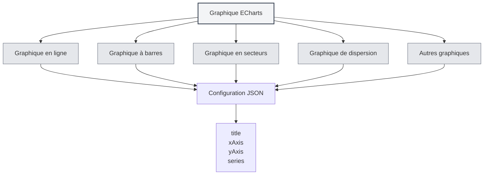

# Graphiques ECharts

## Vue d'ensemble

ECharts est une puissante bibliothèque de visualisation de données prenant en charge de nombreux types de graphiques. MetaDoc prend en charge les graphiques ECharts, permettant de créer diverses visualisations de données dans les documents Markdown en utilisant la configuration ECharts.

<DataAnalysisWindow mode="demo" />

## Syntaxe ECharts

<ChartGenerationDisplay mode="demo" />

### Syntaxe de base

ECharts utilise un format de configuration JSON :

````markdown
```echarts
{
  "title": {
    "text": "Exemple de graphique"
  },
  "xAxis": {
    "type": "category",
    "data": ["A", "B", "C"]
  },
  "yAxis": {
    "type": "value"
  },
  "series": [{
    "data": [10, 20, 30],
    "type": "bar"
  }]
}
```
````

### Format de configuration

La configuration ECharts doit être un JSON valide :

- **Format JSON** : Utiliser le format JSON standard
- **Ponctuation anglaise** : Utiliser des virgules, deux-points et guillemets anglais
- **Configuration complète** : Inclure les éléments de configuration nécessaires



## Types de graphiques pris en charge

<DataAnalysisDisplay mode="demo" />

### Graphique en ligne

Créer un graphique en ligne :

````markdown
```echarts
{
  "xAxis": {
    "type": "category",
    "data": ["Lun", "Mar", "Mer"]
  },
  "yAxis": {
    "type": "value"
  },
  "series": [{
    "data": [120, 200, 150],
    "type": "line"
  }]
}
```
````

### Graphique à barres

<ChartGenerationDisplay mode="demo" />

Créer un graphique à barres :

````markdown
```echarts
{
  "xAxis": {
    "type": "category",
    "data": ["A", "B", "C"]
  },
  "yAxis": {
    "type": "value"
  },
  "series": [{
    "data": [10, 20, 30],
    "type": "bar"
  }]
}
```
````

### Graphique en secteurs

<DataAnalysisDisplay mode="demo" />

Créer un graphique en secteurs :

````markdown
```echarts
{
  "series": [{
    "type": "pie",
    "data": [
      {"value": 335, "name": "Catégorie A"},
      {"value": 310, "name": "Catégorie B"},
      {"value": 234, "name": "Catégorie C"}
    ]
  }]
}
```
````

### Graphique de dispersion

<ChartGenerationDisplay mode="demo" />

Créer un graphique de dispersion :

````markdown
```echarts
{
  "xAxis": {
    "type": "value"
  },
  "yAxis": {
    "type": "value"
  },
  "series": [{
    "type": "scatter",
    "data": [[10, 20], [15, 25], [20, 30]]
  }]
}
```
````

### Graphique radar

<OutlineTreeDisplay mode="demo" />

Créer un graphique radar :

````markdown
```echarts
{
  "radar": {
    "indicator": [
      {"name": "Indicateur 1", "max": 100},
      {"name": "Indicateur 2", "max": 100}
    ]
  },
  "series": [{
    "type": "radar",
    "data": [{
      "value": [80, 90]
    }]
  }]
}
```
````

### Carte thermique

<DataAnalysisDisplay mode="demo" />

Créer une carte thermique :

````markdown
```echarts
{
  "xAxis": {
    "type": "category",
    "data": ["A", "B", "C"]
  },
  "yAxis": {
    "type": "category",
    "data": ["X", "Y", "Z"]
  },
  "series": [{
    "type": "heatmap",
    "data": [[0, 0, 10], [0, 1, 20], [1, 0, 30]]
  }]
}
```
````

## Configuration des graphiques

<OutlineTreeDisplay mode="demo" />

### Configuration du titre

Définir le titre du graphique :

```json
{
  "title": {
    "text": "Titre du graphique",
    "subtext": "Sous-titre"
  }
}
```

### Configuration des axes

Configurer les axes :

```json
{
  "xAxis": {
    "type": "category",
    "data": ["A", "B", "C"]
  },
  "yAxis": {
    "type": "value"
  }
}
```

### Configuration des séries

Configurer les séries de données :

```json
{
  "series": [
    {
      "name": "Nom de la série",
      "type": "bar",
      "data": [10, 20, 30]
    }
  ]
}
```

### Configuration de la légende

Configurer la légende :

```json
{
  "legend": {
    "data": ["Série 1", "Série 2"]
  }
}
```

### Configuration de l'infobulle

Configurer l'infobulle :

```json
{
  "tooltip": {
    "trigger": "axis"
  }
}
```

## Fonctionnalités avancées

<ChartGenerationDisplay mode="demo" />

### Graphique à séries multiples

Créer un graphique à séries multiples :

````markdown
```echarts
{
  "xAxis": {
    "type": "category",
    "data": ["Lun", "Mar", "Mer"]
  },
  "yAxis": {
    "type": "value"
  },
  "series": [
    {
      "name": "Série 1",
      "type": "bar",
      "data": [10, 20, 30]
    },
    {
      "name": "Série 2",
      "type": "line",
      "data": [15, 25, 35]
    }
  ]
}
```
````

### Zoom des données

Ajouter un zoom des données :

```json
{
  "dataZoom": [
    {
      "type": "slider",
      "start": 0,
      "end": 100
    }
  ]
}
```

### Mappage visuel

Ajouter un mappage visuel :

```json
{
  "visualMap": {
    "min": 0,
    "max": 100,
    "inRange": {
      "color": ["#50a3ba", "#eac736", "#d94e5d"]
    }
  }
}
```

## Méthodes de rendu

### Rendu dans le processus principal

ECharts utilise le rendu dans le processus principal :

- **Rendu côté serveur** : Les graphiques sont rendus dans le processus principal
- **Format SVG** : Rendu par défaut au format SVG
- **Format PNG** : Peut être converti au format PNG

### Performance du rendu

Caractéristiques du rendu ECharts :

- **Vitesse de rendu** : Le rendu dans le processus principal est rapide
- **Utilisation des ressources** : Utilise les ressources du processus principal pendant le rendu
- **Gestion des erreurs** : Les erreurs de rendu sont affichées dans la console

## Points d'attention

### Points d'attention syntaxiques

1. **Format JSON** : Doit utiliser un format JSON valide
2. **Ponctuation anglaise** : Utiliser des virgules, deux-points et guillemets anglais
3. **Configuration complète** : Inclure les éléments de configuration nécessaires
4. **Syntaxe correcte** : S'assurer que la syntaxe JSON est correcte, sinon le rendu échouera

### Points d'attention pour le rendu

1. **Validation de la configuration** : Le format de configuration est validé avant le rendu
2. **Erreurs de syntaxe** : Le graphique ne peut pas être rendu en cas d'erreur de syntaxe JSON
3. **Graphiques complexes** : Des graphiques trop complexes peuvent affecter les performances de rendu
4. **Compatibilité à l'export** : S'assurer que le graphique s'affiche correctement dans le format cible lors de l'export

## Bonnes pratiques

1. **Normes de configuration** : Suivre les normes de configuration officielles d'ECharts
2. **Format JSON** : S'assurer que le format JSON est correct
3. **Code clair** : Maintenir un code de configuration clair et lisible
4. **Tester le rendu** : Tester l'effet de rendu du graphique après édition
5. **Documentation de référence** : Consulter la documentation officielle et les exemples d'ECharts

## Documentation associée

- [[charts.introduction|Présentation des fonctionnalités graphiques]]
- [[charts.mermaid|Graphiques Mermaid]]
- [[charts.plantuml|Graphiques PlantUML]]