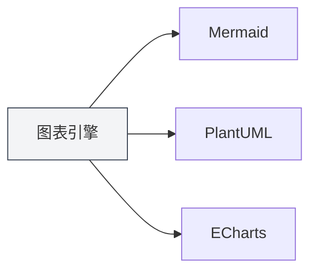
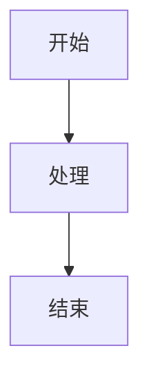

# Fonctionnalités des graphiques

## Vue d'ensemble

MetaDoc prend en charge plusieurs moteurs de dessin de graphiques, permettant d'insérer et de rendre divers types de diagrammes dans les documents Markdown. La fonctionnalité graphique vous permet de créer des organigrammes, des diagrammes UML, des visualisations de données, etc., enrichissant ainsi le contenu de vos documents.

<GraphWindow mode="demo" />

## Moteurs de graphiques pris en charge

<ChartGenerationDisplay mode="demo" />

### Types de graphiques

MetaDoc prend en charge les moteurs de graphiques suivants :

- **Mermaid** : Organigrammes, diagrammes UML, diagrammes de Gantt, etc.
- **PlantUML** : Diagrammes de modélisation UML professionnels
- **ECharts** : Graphiques de visualisation de données
- **Flowchart** : Organigrammes de base
- **Graphviz** : Visualisation de graphes
- **Mindmap** : Cartes mentales
- **Markmap** : Cartes mentales en Markdown
- **SMILES** : Formules de structure chimique
- **ABC** : Partitions musicales

### Comparaison des moteurs

<DataAnalysisDisplay mode="demo" />

| Moteur    | Scénarios d'utilisation                     | Méthode de rendu     |
| --------- | ------------------------------------------- | -------------------- |
| Mermaid   | Organigrammes, diagrammes de séquence, diagrammes de classes, diagrammes de Gantt | Rendu navigateur     |
| PlantUML  | Modélisation UML professionnelle            | Rendu processus principal |
| ECharts   | Visualisation de données (graphiques linéaires, histogrammes, etc.) | Rendu processus principal |
| Flowchart | Organigrammes de base                       | Rendu Vditor         |
| Graphviz  | Visualisation de graphes                    | Rendu Vditor         |
| Mindmap   | Cartes mentales                             | Rendu Vditor         |

### Graphique de comparaison des moteurs

<OutlineTreeDisplay mode="demo" />



## Insérer un graphique

<DataAnalysisWindow mode="demo" />

### Syntaxe des blocs de code

Utilisez des blocs de code dans votre document Markdown pour insérer des graphiques :

````markdown

````

### Identifiants de type de graphique

Différents types de graphiques utilisent différents identifiants de bloc de code :

- **Mermaid** : ` ```mermaid `
- **PlantUML** : ` ```plantuml `
- **ECharts** : ` ```echarts `
- **Flowchart** : ` ```flowchart `
- **Graphviz** : ` ```graphviz `
- **Mindmap** : ` ```mindmap `

## Rendu des graphiques

<ChartGenerationDisplay mode="demo" />

### Rendu en temps réel

Les graphiques sont rendus en temps réel dans l'éditeur :

- **Rendu automatique** : Le rendu s'effectue automatiquement après la saisie du code
- **Aperçu en direct** : Le graphique s'affiche en temps réel dans la fenêtre d'aperçu
- **Indication d'erreur** : Les erreurs de syntaxe affichent un message d'erreur

### Méthodes de rendu

Différents graphiques utilisent différentes méthodes de rendu :

- **Rendu navigateur** : Mermaid, etc., utilisent les API du navigateur
- **Rendu processus principal** : PlantUML, ECharts utilisent le rendu par le processus principal
- **Rendu Vditor** : Flowchart, etc., utilisent le rendu Vditor

### Formats de rendu

Les graphiques peuvent être rendus dans différents formats :

- **SVG** : Format vectoriel (par défaut)
- **PNG** : Format bitmap (convertible)

## Exportation des graphiques

<OutlineTreeDisplay mode="demo" />

### Formats d'export pris en charge

Les graphiques peuvent être exportés vers plusieurs formats :

- **Export PDF** : Le graphique est inclus dans le PDF
- **Export HTML** : Le graphique est inclus dans le HTML
- **Export image** : Le graphique peut être exporté séparément en tant qu'image

### Qualité d'export

La qualité du graphique est préservée à l'export :

- **Image vectorielle** : Le format SVG conserve la netteté
- **Image bitmap** : Le format PNG est adapté à l'impression
- **Résolution** : La résolution est ajustée selon le format d'export

## Édition des graphiques

<DataAnalysisDisplay mode="demo" />

### Édition du code

Vous pouvez éditer directement le code du graphique :

- **Coloration syntaxique** : Les blocs de code prennent en charge la coloration syntaxique
- **Auto-complétion** : Certains éditeurs prennent en charge l'auto-complétion
- **Vérification des erreurs** : Vérification en temps réel des erreurs de syntaxe

### Mise à jour de l'aperçu

L'aperçu se met à jour automatiquement après l'édition du code :

- **Mise à jour en temps réel** : L'aperçu se met à jour immédiatement après modification du code
- **Affichage des erreurs** : Les erreurs de syntaxe affichent un message d'information
- **État du rendu** : Affiche l'état du rendu du graphique

## Prise en charge multilingue

<DataAnalysisWindow mode="demo" />

### Code de graphique multilingue

Le code des graphiques prend en charge plusieurs langues :

- **Prise en charge du chinois** : Vous pouvez utiliser des étiquettes et du texte en chinois
- **Prise en charge de l'anglais** : Vous pouvez utiliser des étiquettes et du texte en anglais
- **Utilisation mixte** : Vous pouvez mélanger le chinois et l'anglais

### Internationalisation

La fonctionnalité graphique prend en charge l'internationalisation :

- **Langue de l'interface** : L'interface liée aux graphiques suit la langue du système
- **Messages d'erreur** : Les messages d'erreur utilisent la langue actuelle
- **Documentation d'aide** : La documentation d'aide est disponible en plusieurs langues

## Bonnes pratiques

1. **Choisir le moteur approprié** : Sélectionnez le moteur de graphique adapté à vos besoins
2. **Respecter la syntaxe** : Suivez les spécifications syntaxiques de chaque moteur
3. **Code clair** : Maintenez un code de graphique clair et lisible
4. **Tester le rendu** : Testez l'effet de rendu du graphique après l'édition
5. **Tester l'export** : Testez l'affichage du graphique dans le format cible avant l'export

## Points à noter

1. **Syntaxe correcte** : Assurez-vous que la syntaxe du code du graphique est correcte, sinon le rendu échouera
2. **Performance du rendu** : Les graphiques complexes peuvent affecter les performances de rendu
3. **Compatibilité à l'export** : Certains formats de graphique peuvent être incompatibles avec certains formats d'export
4. **Sécurité du code** : Soyez attentif à la sécurité du code des graphiques, évitez le code malveillant
5. **Compatibilité des versions** : Différentes versions des moteurs de graphique peuvent présenter des différences syntaxiques

## Documentation associée

- [[charts.mermaid|Graphiques Mermaid]]
- [[charts.plantuml|Graphiques PlantUML]]
- [[charts.echarts|Graphiques ECharts]]
- [[markdown.features|Fonctionnalités de l'éditeur Markdown]]
