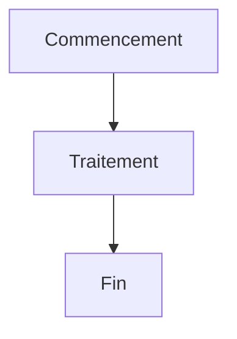
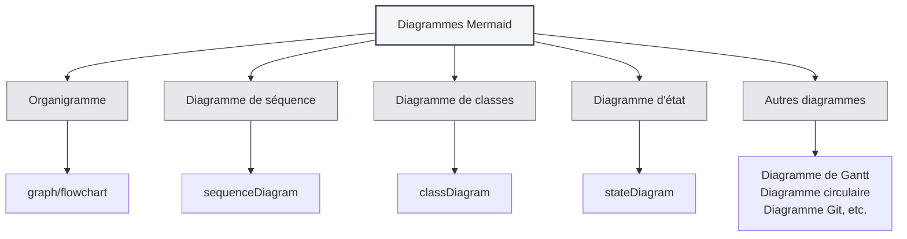
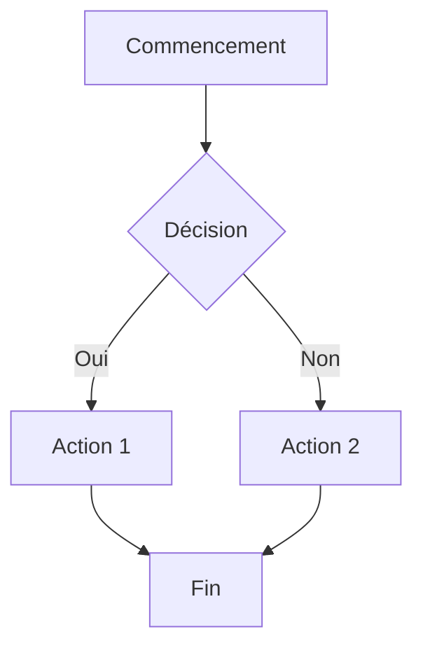
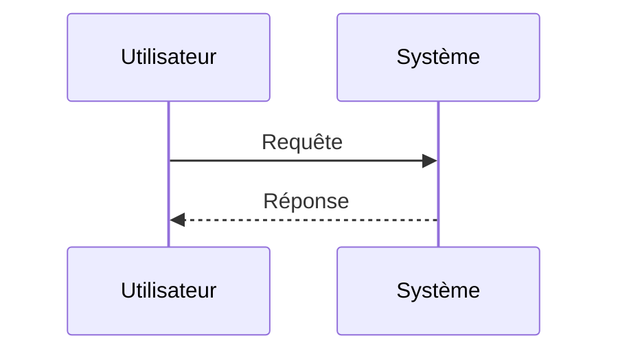
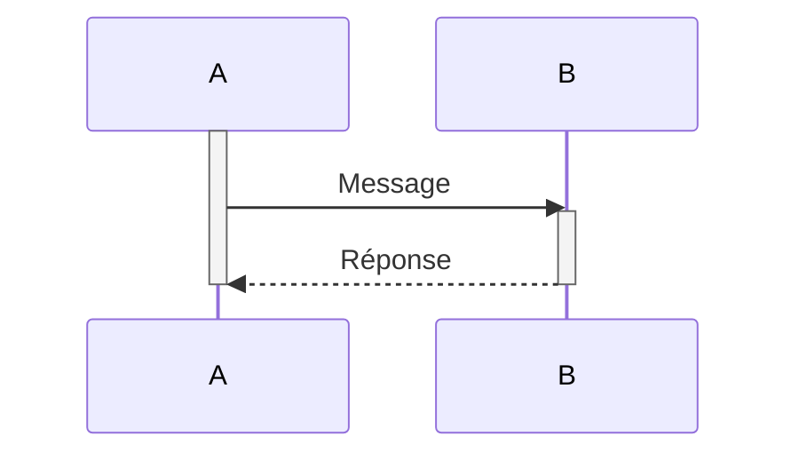
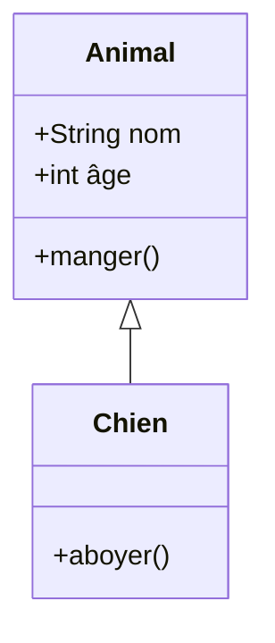
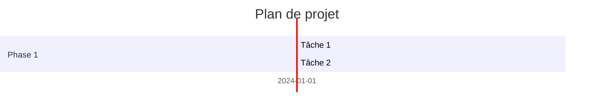
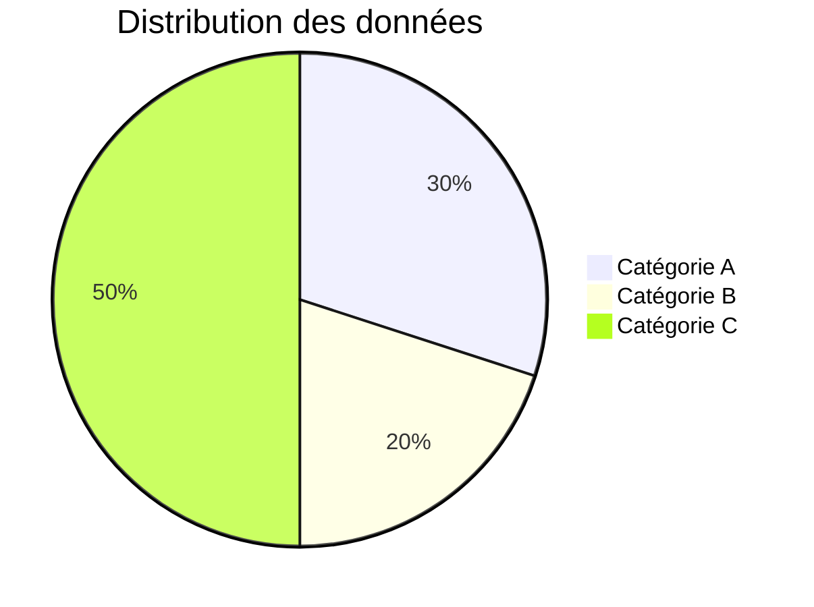
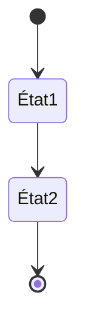
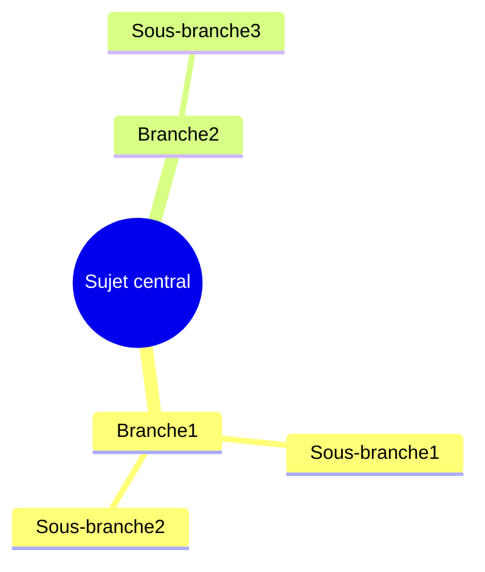

# Diagrammes Mermaid

## Vue d'ensemble

Mermaid est un outil populaire de création de diagrammes, adapté pour dessiner rapidement des organigrammes, des diagrammes de séquence, des diagrammes de classes, des diagrammes de Gantt, etc. MetaDoc prend en charge les diagrammes Mermaid, permettant de créer directement divers diagrammes dans les documents Markdown en utilisant la syntaxe Mermaid.

<GraphWindow mode="demo" initialTool="mermaid" />

## Syntaxe Mermaid

<OutlineTreeDisplay mode="demo" />

### Syntaxe de base

Mermaid utilise une syntaxe textuelle simple pour décrire les diagrammes :

````markdown

````

### Types de diagrammes

<ChartGenerationDisplay mode="demo" />

Mermaid prend en charge de nombreux types de diagrammes :

- **Organigramme** (graph/flowchart)
- **Diagramme de séquence** (sequenceDiagram)
- **Diagramme de classes** (classDiagram)
- **Diagramme d'état** (stateDiagram)
- **Diagramme de relation d'entités** (erDiagram)
- **Diagramme de Gantt** (gantt)
- **Diagramme circulaire** (pie)
- **Diagramme Git** (gitgraph)
- **Diagramme de parcours utilisateur** (journey)
- **Carte mentale** (mindmap)
- **Chronologie** (timeline)



## Organigramme

<OutlineTreeDisplay mode="demo" />

### Organigramme de base

Créer un organigramme de base :

````markdown

````

### Orientation de l'organigramme

Il est possible de définir l'orientation de l'organigramme :

- **TD** : De haut en bas (Top Down)
- **BT** : De bas en haut (Bottom Top)
- **LR** : De gauche à droite (Left Right)
- **RL** : De droite à gauche (Right Left)

### Formes des nœuds

Différentes formes de nœuds peuvent être utilisées :

- **Rectangle** : `[texte]`
- **Rectangle arrondi** : `(texte)`
- **Losange** : `{texte}`
- **Cercle** : `((texte))`
- **Hexagone** : `{{texte}}`
- **Trapèze** : `[/texte\]`
- **Trapèze inversé** : `[\texte/]`

## Diagramme de séquence

<DataAnalysisDisplay mode="demo" />

### Diagramme de séquence de base

Créer un diagramme de séquence :

````markdown

````

### Types de messages

Différents types de messages peuvent être utilisés :

- **Flèche pleine** : `->>` Message synchrone
- **Flèche pointillée** : `-->>` Message asynchrone
- **Ligne pleine** : `->` Message synchrone (sans retour)
- **Ligne pointillée** : `-->` Message asynchrone (sans retour)

### Boîtes d'activation

Des boîtes d'activation peuvent être ajoutées pour représenter l'activité d'un objet :

````markdown

````

## Diagramme de classes

<ChartGenerationDisplay mode="demo" />

### Diagramme de classes de base

Créer un diagramme de classes :

````markdown

````

### Relations entre classes

Différentes relations entre classes peuvent être représentées :

- **Héritage** : `<|--` ou `--|>`
- **Implémentation** : `<|..` ou `..|>`
- **Composition** : `*--` ou `--*`
- **Agrégation** : `o--` ou `--o`
- **Association** : `-->` ou `<--`
- **Dépendance** : `..>` ou `<..`

### Membres de classe

Les membres d'une classe peuvent être définis :

- **Attributs** : `+nom: String` (public), `-nom: String` (privé)
- **Méthodes** : `+méthode()` (public), `-méthode()` (privé)

## Diagramme de Gantt

<OutlineTreeDisplay mode="demo" />

### Diagramme de Gantt de base

Créer un diagramme de Gantt :

````markdown

````

### Format de date

Le format de date peut être défini :

- **YYYY-MM-DD** : Année-Mois-Jour
- **MM/DD/YYYY** : Mois/Jour/Année
- **Autres formats** : Plusieurs formats de date sont pris en charge

### Relations entre tâches

Les relations entre tâches peuvent être définies :

- **after** : Après une tâche spécifique
- **Jalon** : Utiliser `milestone` pour marquer un jalon

## Diagramme circulaire

<DataAnalysisDisplay mode="demo" />

### Diagramme circulaire de base

Créer un diagramme circulaire :

````markdown

````

## Diagramme d'état

<ChartGenerationDisplay mode="demo" />

### Diagramme d'état de base

Créer un diagramme d'état :

````markdown

````

## Carte mentale

<OutlineTreeDisplay mode="demo" />

### Carte mentale de base

Créer une carte mentale :

````markdown

````

## Points d'attention

<DataAnalysisDisplay mode="demo" />

### Points d'attention sur la syntaxe

1.  **Encadrement des chaînes** : Il est recommandé d'utiliser `["..."]` pour encadrer les chaînes afin d'éviter les erreurs d'échappement.
2.  **Identifiants** : Dans les diagrammes de classes, éviter les identifiants contenant des espaces ou des caractères spéciaux.
3.  **Support du chinois** : Le chinois peut être utilisé, mais il est recommandé d'utiliser des identifiants en anglais.
4.  **Version de la syntaxe** : Faire attention à la version de la syntaxe Mermaid, des différences peuvent exister entre les versions.

### Points d'attention sur le rendu

1.  **Erreurs de syntaxe** : En cas d'erreur de syntaxe, le diagramme ne peut pas être rendu.
2.  **Diagrammes complexes** : Des diagrammes trop complexes peuvent affecter les performances de rendu.
3.  **Compatibilité des navigateurs** : Certains navigateurs peuvent ne pas supporter certaines fonctionnalités de Mermaid.
4.  **Compatibilité à l'export** : S'assurer que les diagrammes s'affichent correctement dans le format cible lors de l'export.

## Bonnes pratiques

1.  **Normes de syntaxe** : Suivre les normes de syntaxe officielles de Mermaid.
2.  **Code clair** : Maintenir le code du diagramme clair et lisible.
3.  **Tester le rendu** : Tester l'effet de rendu du diagramme après l'édition.
4.  **Utiliser les exemples** : Se référer aux exemples de la documentation officielle de Mermaid.
5.  **Compatibilité des versions** : Faire attention à la compatibilité des versions de Mermaid.

## Documentation associée

- [[charts.introduction|Présentation des fonctionnalités des diagrammes]]
- [[charts.plantuml|Diagrammes PlantUML]]
- [[charts.echarts|Diagrammes ECharts]]
