# Diagrammes PlantUML

## Vue d'ensemble

PlantUML est un outil professionnel de modélisation UML qui prend en charge de nombreux types de diagrammes UML. MetaDoc prend en charge les diagrammes PlantUML, permettant de créer des diagrammes UML professionnels dans des documents Markdown en utilisant la syntaxe PlantUML.

<GraphWindow mode="demo" initialTool="plantuml" />

## Syntaxe PlantUML

<OutlineTreeDisplay mode="demo" />

### Syntaxe de base

PlantUML utilise des balises et une syntaxe spécifiques :

````markdown
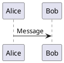
````

### Balises obligatoires

<ChartGenerationDisplay mode="demo" />

Un diagramme PlantUML doit contenir :

- **@startuml** : Balise de début du diagramme
- **@enduml** : Balise de fin du diagramme

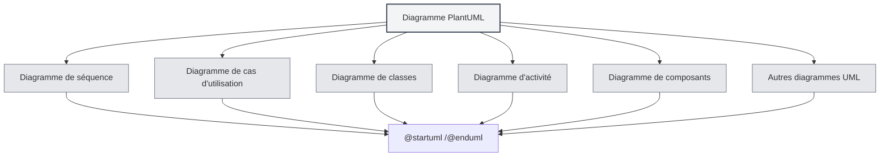

## Types de diagrammes pris en charge

<DataAnalysisDisplay mode="demo" />

### Diagramme de séquence

Créer un diagramme de séquence :

````markdown
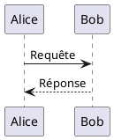
````

### Diagramme de cas d'utilisation

<OutlineTreeDisplay mode="demo" />

Créer un diagramme de cas d'utilisation :

````markdown
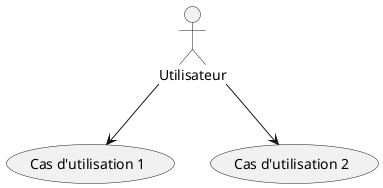
````

### Diagramme de classes

<ChartGenerationDisplay mode="demo" />

Créer un diagramme de classes :

````markdown
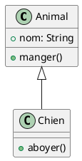
````

### Diagramme d'activité

<DataAnalysisDisplay mode="demo" />

Créer un diagramme d'activité :

````markdown
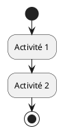
````

### Diagramme de composants

<OutlineTreeDisplay mode="demo" />

Créer un diagramme de composants :

````markdown
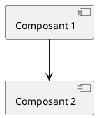
````

### Diagramme de déploiement

<ChartGenerationDisplay mode="demo" />

Créer un diagramme de déploiement :

````markdown
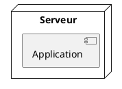
````

### Diagramme d'état

<DataAnalysisDisplay mode="demo" />

Créer un diagramme d'état :

````markdown
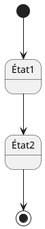
````

## Détails du diagramme de séquence

<OutlineTreeDisplay mode="demo" />

### Acteurs

Définir des acteurs :

````markdown
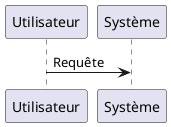
````

### Types de messages

Différents types de messages peuvent être utilisés :

- **Message synchrone** : `->`
- **Message asynchrone** : `-->`
- **Message de retour** : `<-` ou `<--`
- **Auto-appel** : `->` pointant vers soi-même

### Boîtes d'activation

Ajouter des boîtes d'activation :

````markdown
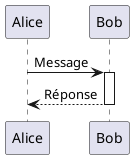
````

## Détails du diagramme de classes

<ChartGenerationDisplay mode="demo" />

### Définition de classe

Définir une classe :

````markdown
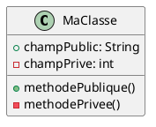
````

### Relations entre classes

Représenter les relations entre classes :

- **Héritage** : `<|--` ou `--|>`
- **Implémentation** : `<|..` ou `..|>`
- **Composition** : `*--` ou `--*`
- **Agrégation** : `o--` ou `--o`
- **Association** : `-->` ou `<--`
- **Dépendance** : `..>` ou `<..`

### Interfaces et classes abstraites

Définir des interfaces et des classes abstraites :

````markdown
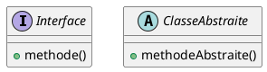
````

## Détails du diagramme d'activité

### Activités de base

Définir des activités :

````markdown

````

### Nœuds de décision

Ajouter une décision :

````markdown
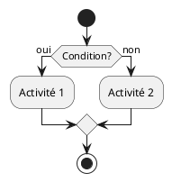
````

### Boucles

Ajouter une boucle :

````markdown
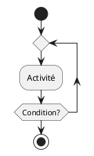
````

## Styles et thèmes

### Configuration du thème

Il est possible de définir un thème :

````markdown
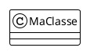
````

### Configuration des couleurs

Il est possible de définir des couleurs :

````markdown
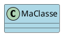
````

## Méthodes de rendu

### Rendu par le processus principal

PlantUML utilise le processus principal pour le rendu :

- **Rendu côté serveur** : Les diagrammes sont rendus dans le processus principal
- **Format SVG** : Rendu par défaut au format SVG
- **Format PNG** : Peut être converti au format PNG

### Performance du rendu

Caractéristiques du rendu PlantUML :

- **Vitesse de rendu** : Le rendu par le processus principal est rapide
- **Utilisation des ressources** : Utilise les ressources du processus principal pendant le rendu
- **Gestion des erreurs** : Les erreurs de rendu sont affichées dans la console

## Points d'attention

### Points d'attention sur la syntaxe

1. **Balises obligatoires** : Doit contenir `@startuml` et `@enduml`
2. **Norme syntaxique** : Suivre la norme syntaxique officielle de PlantUML
3. **Support du chinois** : Le chinois peut être utilisé, mais les identifiants en anglais sont recommandés
4. **Compatibilité des versions** : Faire attention à la compatibilité des versions de PlantUML

### Points d'attention sur le rendu

1. **Extraction du code** : S'assurer que l'extraction du code est correcte, éviter d'inclure des balises XML
2. **Erreurs de syntaxe** : Le diagramme ne peut pas être rendu en cas d'erreur de syntaxe
3. **Diagrammes complexes** : Des diagrammes trop complexes peuvent affecter les performances de rendu
4. **Compatibilité à l'export** : S'assurer que le diagramme s'affiche correctement dans le format cible lors de l'export

## Bonnes pratiques

1. **Norme syntaxique** : Suivre la norme syntaxique officielle de PlantUML
2. **Code clair** : Maintenir le code du diagramme clair et lisible
3. **Utiliser les balises** : Toujours utiliser les balises `@startuml` et `@enduml`
4. **Tester le rendu** : Tester l'effet de rendu du diagramme après édition
5. **Documentation de référence** : Consulter la documentation officielle de PlantUML

## Documentation associée

- [[charts.introduction|Présentation des fonctionnalités des diagrammes]]
- [[charts.mermaid|Diagrammes Mermaid]]
- [[charts.echarts|Diagrammes ECharts]]