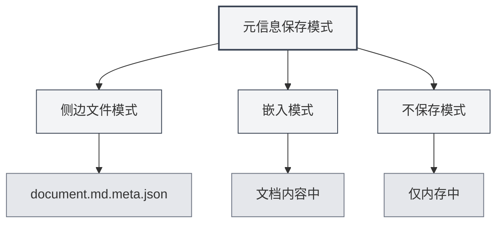

# Métadonnées du document

## Vue d'ensemble

Les métadonnées du document sont des données décrivant les propriétés fondamentales d'un document, incluant le titre, l'auteur, la description, les mots-clés, etc. Une configuration appropriée des métadonnées facilite la gestion et la recherche des documents, et ces informations sont automatiquement incluses lors de l'exportation du document.

MetaDoc permet de définir des métadonnées pour chaque document. Ces informations peuvent être sauvegardées dans un fichier latéral, intégrées au contenu du document, ou non sauvegardées. Vous pouvez également utiliser l'IA pour générer automatiquement les métadonnées.

<MetaInfoPanel mode="demo" :meta='{"title": "", "author": "", "description": "", "keywords": []}' :outlineJson='""' />

## Présentation des métadonnées

### Titre (Title)

Le titre du document, généralement affiché en haut du document et dans l'onglet.

- **Utilité** : Identifier le contenu principal du document
- **Emplacement d'affichage** : Titre de l'onglet, page de titre du document exporté
- **Exemple** : `"Guide utilisateur de MetaDoc"`

<MetaInfoPanel mode="demo" :meta='{"title": "MetaDoc用户手册", "author": "", "description": "", "keywords": []}' :outlineJson='""' />

### Auteur (Author)

L'auteur ou le créateur du document.

- **Utilité** : Identifier le créateur du document
- **Emplacement d'affichage** : Informations sur l'auteur dans le document exporté
- **Exemple** : `"Zhang San"`

<MetaInfoPanel mode="demo" :meta='{"title": "示例文档", "author": "张三", "description": "", "keywords": []}' :outlineJson='""' />

### Description (Description)

Une brève description ou un résumé du document.

- **Utilité** : Résumer le contenu principal du document
- **Emplacement d'affichage** : Section de résumé du document exporté
- **Exemple** : `"Ce document présente les méthodes d'utilisation de base de MetaDoc"`

<MetaInfoPanel mode="demo" :meta='{"title": "示例文档", "author": "作者名", "description": "本文档介绍MetaDoc的基本使用方法", "keywords": []}' :outlineJson='""' />

### Mots-clés (Keywords)

Une liste de mots-clés pour le document, utilisée pour la recherche et la classification des documents.

- **Utilité** : Aider à la recherche et à la classification des documents
- **Format** : Tableau de chaînes de caractères
- **Exemple** : `["MetaDoc", "Guide utilisateur", "Édition de documents"]`

<MetaInfoPanel mode="demo" :meta='{"title": "示例文档", "author": "作者名", "description": "文档描述", "keywords": ["MetaDoc", "用户手册", "文档编辑"]}' :outlineJson='""' />

## Configuration des métadonnées

### Configuration manuelle

1. **Ouvrir le panneau des métadonnées** :

   - Cliquez sur le bouton "Métadonnées" dans la barre d'outils de l'éditeur
   - Ou utilisez le raccourci clavier (s'il est configuré)

2. **Remplir les métadonnées** :

   - **Titre** : Saisissez le titre du document
   - **Auteur** : Saisissez le nom de l'auteur
   - **Description** : Saisissez la description du document (prise en charge de plusieurs lignes)
   - **Mots-clés** : Saisissez les mots-clés, séparez plusieurs mots-clés par des virgules

3. **Sauvegarder** : Cliquez sur le bouton "Sauvegarder" pour enregistrer les métadonnées

L'interface du panneau des métadonnées est la suivante :

<MetaInfoPanel mode="demo" :meta='{"title": "示例文档", "author": "作者名", "description": "文档描述", "keywords": ["关键词1", "关键词2"]}' :outlineJson='""' />

### Configuration par lot

Vous pouvez configurer tous les champs de métadonnées en une seule fois :

1. Ouvrez le panneau des métadonnées
2. Remplissez tous les champs
3. Cliquez sur le bouton "Sauvegarder"

<MetaInfoPanel mode="demo" :meta='{"title": "批量设置示例", "author": "管理员", "description": "批量设置所有元信息字段的示例", "keywords": ["批量", "设置", "元信息"]}' :outlineJson='""' />

### Modification des métadonnées

Les métadonnées déjà configurées peuvent être modifiées à tout moment :

1. Ouvrez le panneau des métadonnées
2. Modifiez les champs à changer
3. Cliquez sur le bouton "Sauvegarder"

Les métadonnées modifiées prennent effet immédiatement et sont sauvegardées lors de la prochaine sauvegarde du document.

## Modes de sauvegarde des métadonnées

MetaDoc prend en charge trois modes de sauvegarde des métadonnées, configurables dans les [[settings.basic|paramètres de base]] :



### Mode fichier latéral

Les métadonnées sont sauvegardées dans un fichier latéral portant le même nom que le document (`.meta.json`).

<MetaInfoPanel mode="demo" :meta='{"title": "侧边文件模式示例", "author": "系统", "description": "元信息保存在.meta.json文件中", "keywords": ["侧边文件", "元数据"]}' :outlineJson='""' />

**Avantages** :

- Ne modifie pas le contenu original du document
- Permet de restaurer le document original en supprimant le fichier latéral à tout moment
- Adapté au contrôle de version

**Inconvénients** :

- Crée des fichiers supplémentaires
- Nécessite de déplacer le fichier latéral en même temps que le document

**Exemple** :

- Document : `document.md`
- Fichier de métadonnées : `document.md.meta.json`

### Mode intégré

Les métadonnées sont intégrées dans le contenu du document (front matter Markdown ou commentaires LaTeX).

<MetaInfoPanel mode="demo" :meta='{"title": "嵌入模式示例", "author": "嵌入作者", "description": "元信息嵌入在文档中", "keywords": ["嵌入", "front matter"]}' :outlineJson='""' />

**Avantages** :

- Le document et ses métadonnées sont ensemble, facilitant la gestion
- Aucun fichier supplémentaire nécessaire

**Inconvénients** :

- Modifie le contenu original du document
- Certains formats peuvent ne pas supporter l'intégration

**Exemple** (Markdown) :

```markdown
---
title: Titre du document
author: Nom de l'auteur
description: Description du document
keywords: [Mot-clé1, Mot-clé2]
---

Contenu du document...
```

### Mode non sauvegardé

Les métadonnées sont utilisées uniquement pendant l'édition et ne sont pas sauvegardées dans un fichier.

<MetaInfoPanel mode="demo" :meta='{"title": "不保存模式", "author": "临时", "description": "仅在内存中保存元信息", "keywords": ["临时", "不保存"]}' :outlineJson='""' />

**Avantages** :

- N'affecte pas le document original
- Ne crée pas de fichiers supplémentaires

**Inconvénients** :

- Les métadonnées sont perdues après la fermeture du document
- Impossible d'utiliser les métadonnées lors de l'exportation

## Génération IA des métadonnées

MetaDoc prend en charge la génération automatique des métadonnées du document par IA, basée sur le contenu du document et la structure du plan.

### Génération d'un champ spécifique

Générer les métadonnées pour un champ spécifique :

1. Ouvrez le panneau des métadonnées
2. Cliquez sur le bouton "Générer par IA" à côté du champ
3. Attendez le résultat de la génération par IA
4. Consultez le contenu généré, vous pouvez l'accepter ou le regénérer

### Génération de tous les champs

Générer tous les champs de métadonnées en une seule fois :

1. Ouvrez le panneau des métadonnées
2. Cliquez sur le bouton "Tout générer par IA"
3. Attendez le résultat de la génération par IA
4. Consultez le contenu généré, vous pouvez l'accepter, le modifier ou le regénérer

<MetaInfoPanel mode="demo" :meta='{"title": "AI生成示例", "author": "AI助手", "description": "使用AI自动生成的元信息", "keywords": ["AI", "自动生成", "智能"]}' :outlineJson='""' />

### Principe de génération

La génération IA des métadonnées est basée sur :

- **Le plan du document** : Analyse la structure des titres du document
- **Le contenu du document** : Analyse le contenu principal du document
- **La compréhension du contexte** : Comprend le thème et l'objectif du document

Les résultats générés sont automatiquement ajustés en fonction du contenu du document, garantissant que les métadonnées reflètent avec précision le contenu du document.

## Application des métadonnées lors de l'exportation

Les documents exportés incluent automatiquement les métadonnées :

### Export PDF

- **Titre** : Affiché dans les propriétés du document PDF
- **Auteur** : Affiché dans les propriétés du document PDF
- **Description** : Utilisée comme sujet (Subject) du PDF
- **Mots-clés** : Affichés dans les propriétés du document PDF

### Export DOCX

- **Titre** : Affiché dans les propriétés du document Word
- **Auteur** : Affiché dans les propriétés du document Word
- **Description** : Utilisée comme résumé Word
- **Mots-clés** : Affichés dans les propriétés du document Word

### Export HTML

- **Titre** : Affiché dans la balise `<title>` HTML
- **Auteur** : Affiché dans la balise `<meta>` HTML
- **Description** : Affichée dans la balise `<meta>` HTML
- **Mots-clés** : Affichés dans la balise `<meta>` HTML

## Conseils d'utilisation

### Configuration appropriée du titre

- **Concis et clair** : Le titre doit résumer brièvement le contenu du document
- **Éviter les titres trop longs** : Un titre trop long peut nuire à l'affichage
- **Utiliser des mots-clés** : Inclure des mots-clés importants dans le titre

### Configuration des mots-clés

- **Nombre modéré** : Il est recommandé de définir 3 à 10 mots-clés
- **Pertinence élevée** : Les mots-clés doivent être très liés au contenu du document
- **Éviter les répétitions** : Éviter de définir des mots-clés répétés ou similaires

### Optimisation de la génération IA

- **Vérifier après génération** : Le contenu généré par IA nécessite une vérification manuelle
- **Modifier si nécessaire** : Modifier le contenu généré selon les besoins réels
- **Générer plusieurs fois** : Si le résultat n'est pas satisfaisant, vous pouvez générer plusieurs fois et choisir le meilleur résultat

<MetaInfoPanel mode="demo" :meta='{"title": "元信息完整示例", "author": "演示用户", "description": "展示完整的元信息配置示例", "keywords": ["元信息", "配置", "示例"]}' :outlineJson='""' />

## Questions fréquentes

### Q : Où sont sauvegardées les métadonnées ?

R : Selon le mode de sauvegarde, les métadonnées peuvent être sauvegardées dans un fichier latéral, intégrées au contenu du document, ou non sauvegardées. Le mode de sauvegarde peut être configuré dans les paramètres.

### Q : Comment supprimer les métadonnées ?

R : Dans le panneau des métadonnées, videz tous les champs et sauvegardez pour supprimer les métadonnées.

### Q : Que faire si le contenu généré par IA est inexact ?

R : Le contenu généré par IA est fourni à titre indicatif uniquement. Vous pouvez le modifier manuellement ou le regénérer. Il est recommandé de vérifier et d'ajuster après la génération.

### Q : Les métadonnées affectent-elles le contenu du document ?

R : Si le mode intégré est utilisé, les métadonnées sont intégrées au contenu du document. Si le mode fichier latéral ou le mode non sauvegardé est utilisé, le contenu original du document n'est pas affecté.

### Q : Les métadonnées sont-elles perdues lors de l'exportation ?

R : Non. Les métadonnées sont automatiquement incluses lors de l'exportation et apparaissent dans les propriétés du document exporté.

## Documents connexes

- [[core.file-operations|Opérations sur les fichiers]]
- [[core.export|Fonctionnalités d'exportation]]
- [[settings.basic|Paramètres de base]]
- [[ai.assistants|Fonctionnalités de l'assistant IA]]
