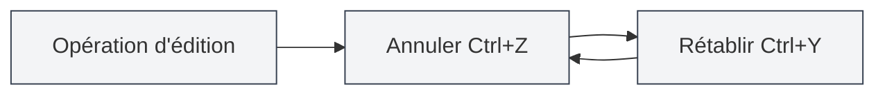
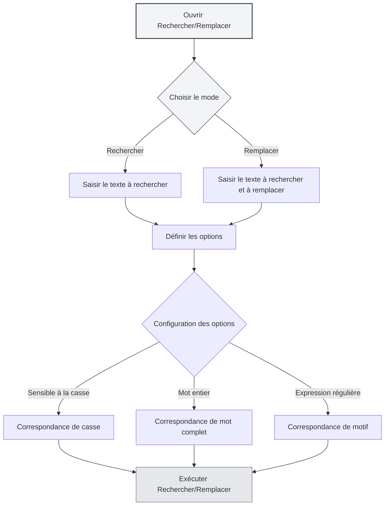

# Opérations de base de l'éditeur

## Vue d'ensemble

Les opérations de base de l'éditeur sont les compétences fondamentales pour éditer des documents avec MetaDoc. Maîtriser ces opérations peut améliorer considérablement votre efficacité d'édition.

L'éditeur de MetaDoc prend en charge les opérations d'édition de texte standard, y compris l'annulation, le rétablissement, la copie, le collage, le couper, la sélection totale et la recherche-remplacement, entre autres.

<SearchReplaceMenu mode="demo" :position='{"top": 100, "left": 200}' :adapter='null' />

<MenuItemsDemo mode="demo" :items='[{"id": "edit"}]' />

## Annuler et rétablir

### Annuler une opération

Annuler la dernière opération d'édition :

- **Raccourci clavier** : `Ctrl+Z` (Windows/Linux) ou `Cmd+Z` (macOS)
- **Menu** : Cliquez sur "Édition" → "Annuler"

Il est possible d'annuler plusieurs opérations successivement, jusqu'à revenir à l'état initial du document.

### Rétablir une opération

<MenuItemsDemo mode="demo" :items='[{"id": "edit"}]' />

Rétablir une opération précédemment annulée :

- **Raccourci clavier** : `Ctrl+Y` ou `Ctrl+Shift+Z` (Windows/Linux) ou `Cmd+Shift+Z` (macOS)
- **Menu** : Cliquez sur "Édition" → "Rétablir"

L'opération de rétablissement restaure les actions dans l'ordre inverse de leur annulation.

## Copier, coller, couper

<MenuItemsDemo mode="demo" :items='[{"id": "edit"}]' />

### Copier

Copier le texte sélectionné dans le presse-papiers :

- **Raccourci clavier** : `Ctrl+C` (Windows/Linux) ou `Cmd+C` (macOS)
- **Menu** : Cliquez sur "Édition" → "Copier"
- **Menu contextuel** : Sélectionnez le texte, faites un clic droit et choisissez "Copier"

### Coller

<MenuItemsDemo mode="demo" :items='[{"id": "edit"}]' />

Coller le contenu du presse-papiers à la position actuelle :

- **Raccourci clavier** : `Ctrl+V` (Windows/Linux) ou `Cmd+V` (macOS)
- **Menu** : Cliquez sur "Édition" → "Coller"
- **Menu contextuel** : Faites un clic droit et choisissez "Coller"

L'opération de collage insère le contenu à la position du curseur. Si du texte est déjà sélectionné, il sera remplacé.

### Couper

<MenuItemsDemo mode="demo" :items='[{"id": "edit"}]' />

Couper le texte sélectionné vers le presse-papiers (supprime le contenu de son emplacement d'origine) :

- **Raccourci clavier** : `Ctrl+X` (Windows/Linux) ou `Cmd+X` (macOS)
- **Menu** : Cliquez sur "Édition" → "Couper"
- **Menu contextuel** : Sélectionnez le texte, faites un clic droit et choisissez "Couper"

L'opération de couper supprime le texte de son emplacement d'origine et le sauvegarde dans le presse-papiers, pour pouvoir ensuite le coller ailleurs.

## Sélectionner tout

<MenuItemsDemo mode="demo" :items='[{"id": "edit"}]' />

Sélectionner tout le contenu du document :

- **Raccourci clavier** : `Ctrl+A` (Windows/Linux) ou `Cmd+A` (macOS)
- **Menu** : Cliquez sur "Édition" → "Sélectionner tout"

Après avoir tout sélectionné, vous pouvez :

- Copier tout le contenu du document
- Supprimer tout le contenu du document
- Formater uniformément tout le texte

## Rechercher et remplacer

### Rechercher

<SearchReplaceMenu mode="demo" :position='{"top": 100, "left": 200}' :adapter='null' />

Rechercher un texte spécifique dans le document :

- **Raccourci clavier** : `Ctrl+F` (Windows/Linux) ou `Cmd+F` (macOS)
- **Menu** : Cliquez sur "Édition" → "Rechercher"

La fonction de recherche prend en charge :

- **Correspondance de casse** : Recherche sensible à la casse
- **Correspondance de mot entier** : Ne correspond qu'aux mots complets
- **Expressions régulières** : Utilisation d'expressions régulières pour des recherches avancées
- **Mise en surbrillance** : Les résultats de recherche sont mis en surbrillance dans le document

### Remplacer

<SearchReplaceMenu mode="demo" :position='{"top": 100, "left": 200}' :adapter='null' />

Rechercher et remplacer du texte :

- **Raccourci clavier** : `Ctrl+H` (Windows/Linux) ou `Cmd+H` (macOS)
- **Menu** : Cliquez sur "Édition" → "Rechercher et remplacer"

La fonction de remplacement prend en charge :

- **Remplacement unique** : Remplacer les textes correspondants un par un
- **Remplacer tout** : Remplacer tous les textes correspondants en une seule fois
- **Prévisualisation** : Prévisualiser le résultat avant de remplacer

### Options de recherche-remplacement

La boîte de dialogue de recherche-remplacement offre les options suivantes :

- **Sensible à la casse** : Ne correspond qu'au texte avec une casse identique
- **Mot entier** : Ne correspond qu'aux mots complets (ne correspond pas à une partie de mot)
- **Expression régulière** : Utiliser des expressions régulières pour la correspondance de motifs
- **Recherche circulaire** : Reprendre la recherche depuis le début après avoir atteint la fin du document

L'interface du menu de recherche-remplacement est la suivante :

<SearchReplaceMenu mode="demo" :position='{"top": 100, "left": 200}' :adapter='null' />

## Sélection de texte

### Sélection de base

- **Clic simple** : Positionne le curseur à l'endroit cliqué
- **Glisser-déposer** : Sélectionne le texte du point de départ au point d'arrivée
- **Double-clic** : Sélectionne le mot entier
- **Triple-clic** : Sélectionne la ligne entière

### Sélection étendue

- **Maj+clic** : Étend la sélection jusqu'à la position cliquée
- **Ctrl+clic** : Ajoute plusieurs zones de sélection non contiguës (si l'éditeur le prend en charge)
- **Alt+glisser** : Mode de sélection en colonne (si l'éditeur le prend en charge)

## Déplacement du curseur

### Déplacement de base

- **Touches de direction** : Déplace le curseur vers le haut, le bas, la gauche, la droite
- **Début/Fin** : Se déplace au début/à la fin de la ligne
- **Ctrl+Début/Fin** : Se déplace au début/à la fin du document
- **Page précédente/Page suivante** : Fait défiler vers le haut/vers le bas

### Déplacement par mots

- **Ctrl+flèche gauche/droite** : Déplace le curseur mot par mot
- **Ctrl+flèche haut/bas** : Déplace le curseur paragraphe par paragraphe vers le haut/le bas

## Opérations de suppression

### Suppression de base

- **Retour arrière** : Supprime le caractère avant le curseur
- **Supprimer** : Supprime le caractère après le curseur
- **Ctrl+Retour arrière** : Supprime le mot entier avant le curseur
- **Ctrl+Supprimer** : Supprime le mot entier après le curseur

## Différences entre éditeurs

MetaDoc propose deux éditeurs principaux :

### Éditeur Markdown (Vditor)

- Prend en charge l'aperçu en temps réel
- Fournit une barre d'outils de formatage
- Prend en charge plusieurs modes d'édition (IR/WYSIWYG/SV)
- Voir [[markdown.editor|Guide d'utilisation de l'éditeur Markdown]]

### Éditeur LaTeX (Monaco)

- Expérience d'édition de code professionnelle
- Coloration syntaxique et auto-complétion
- Prend en charge le pliage de code
- Voir [[latex.editor|Guide d'utilisation de l'éditeur LaTeX]]

Les opérations de base sont fondamentalement les mêmes pour les deux éditeurs, mais ils diffèrent au niveau des fonctionnalités avancées.

## Référence des raccourcis clavier

### Raccourcis universels

| Opération | Windows/Linux              | macOS         |
| --------- | -------------------------- | ------------- |
| Annuler   | `Ctrl+Z`                   | `Cmd+Z`       |
| Rétablir  | `Ctrl+Y` ou `Ctrl+Shift+Z` | `Cmd+Shift+Z` |
| Copier    | `Ctrl+C`                   | `Cmd+C`       |
| Coller    | `Ctrl+V`                   | `Cmd+V`       |
| Couper    | `Ctrl+X`                   | `Cmd+X`       |
| Tout sélectionner | `Ctrl+A`           | `Cmd+A`       |
| Rechercher | `Ctrl+F`                  | `Cmd+F`       |
| Rechercher-Remplacer | `Ctrl+H`      | `Cmd+H`       |

## Points à noter

1. **Historique d'annulation** : L'historique d'annulation est effacé après la fermeture du document, il est recommandé de sauvegarder régulièrement.
2. **Presse-papiers** : Le contenu copié ou coupé est sauvegardé dans le presse-papiers système et peut être perdu après la fermeture de l'application.
3. **Recherche-remplacement** : Lors de l'utilisation d'expressions régulières, faites attention à l'échappement des caractères spéciaux.
4. **Documents volumineux** : Les opérations de recherche-remplacement peuvent prendre un certain temps lors du traitement de documents volumineux.

## Documents connexes

- [[core.file-operations|Opérations sur les fichiers]]
- [[core.editor-settings|Paramètres de l'éditeur]]
- [[markdown.editor|Guide d'utilisation de l'éditeur Markdown]]
- [[latex.editor|Guide d'utilisation de l'éditeur LaTeX]]