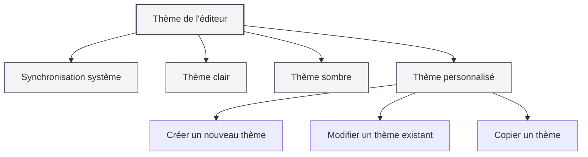
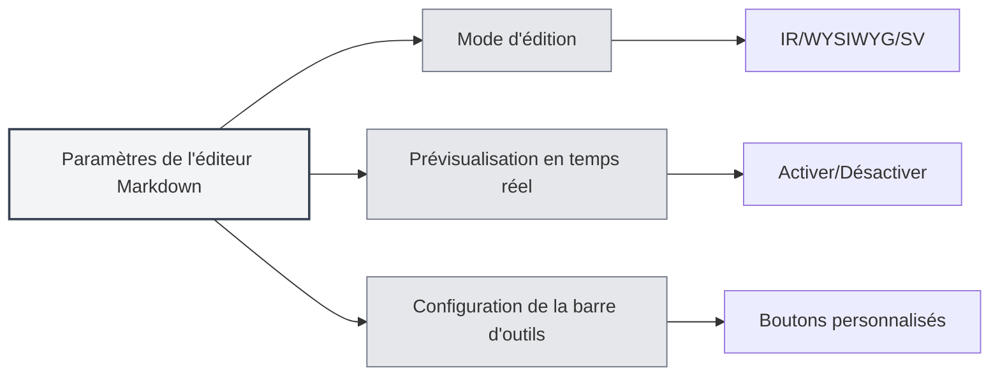

# Paramètres de l'éditeur

## Vue d'ensemble

Les paramètres de l'éditeur vous permettent de personnaliser son apparence et son comportement, y compris le thème, la police, l'affichage des numéros de ligne, etc. Des paramètres appropriés peuvent améliorer votre expérience d'édition et votre productivité.

Les paramètres de l'éditeur sont divisés en paramètres globaux et en paramètres spécifiques à l'éditeur. Les paramètres globaux affectent tous les éditeurs, tandis que certains paramètres peuvent s'appliquer uniquement à des types d'éditeurs spécifiques (comme l'éditeur Markdown ou l'éditeur LaTeX).

<MenuItemsDemo mode="demo" :items='[{"id": "settings"}]' />

## Thème de l'éditeur

<MenuItemsDemo mode="demo" :items='[{"id": "settings"}]' />

### Types de thèmes

MetaDoc prend en charge plusieurs modes de thème :

- **Synchronisation système** : suit automatiquement le thème du système (clair/sombre)
- **Thème clair** : utilise toujours un thème clair
- **Thème sombre** : utilise toujours un thème sombre
- **Thème personnalisé** : utilise une configuration de couleurs personnalisée

### Définir le thème

<SettingThemeSection mode="demo" />

1. Ouvrez la page des paramètres (cliquez sur le menu "Paramètres" ou utilisez le raccourci clavier)
2. Accédez à la section "Paramètres du thème"
3. Sélectionnez le thème de votre choix

Vous pouvez accéder aux paramètres via la barre de menu supérieure :

Cliquez sur le menu "Paramètres" dans la barre de menu supérieure pour ouvrir le panneau de configuration, où vous pouvez configurer le thème de l'éditeur, le thème du contenu, le thème du code, etc.

<MenuItemsDemo mode="demo" :items='[{"id": "settings"}]' />

Les paramètres du thème prennent effet immédiatement, sans redémarrage de l'application.

### Thème personnalisé

<SettingThemeSection mode="demo" />

Vous pouvez créer et modifier des thèmes personnalisés :

1. Cliquez sur "Nouveau thème" dans la page des paramètres du thème
2. Définissez le nom du thème et les couleurs du thème
3. Après l'enregistrement, le thème est prêt à être utilisé

Les thèmes personnalisés prennent en charge :

- **Modification** : changer le nom et les couleurs du thème
- **Copie** : copier un thème existant comme point de départ pour un nouveau thème
- **Suppression** : supprimer les thèmes personnalisés inutiles

## Thème du contenu

<SettingThemeSection mode="demo" />

Le thème du contenu contrôle le style d'affichage de la zone de prévisualisation des documents :

- **Automatique** : sélectionne automatiquement en fonction du thème global
- **Clair** : utilise toujours un style de prévisualisation clair
- **Sombre** : utilise toujours un style de prévisualisation sombre

Le thème du contenu affecte principalement l'affichage de la prévisualisation Markdown et de la prévisualisation PDF.

## Thème du code

<SettingThemeSection mode="demo" />

Le thème du code contrôle le style de surlignage syntaxique des blocs de code :

- **Automatique** : sélectionne automatiquement en fonction du thème global
- **Thèmes prédéfinis** : choisissez parmi des thèmes de code prédéfinis (comme GitHub, Monokai, Solarized, etc.)

Le thème du code affecte :

- Le surlignage syntaxique des blocs de code Markdown
- Le surlignage syntaxique de l'éditeur LaTeX
- Le style d'affichage de la sortie de la console

## Paramètres de police

<SettingBasicSection mode="demo" />

### Police de l'éditeur

La police utilisée par l'éditeur peut être configurée dans les paramètres système. Par défaut, une police à chasse fixe est utilisée, telle que :

- JetBrains Mono
- Consolas
- Courier New
- Microsoft YaHei Mono

### Taille de la police

- **Agrandir** : utilisez `Ctrl+=` ou `Ctrl+molette de la souris vers le haut`
- **Réduire** : utilisez `Ctrl+-` ou `Ctrl+molette de la souris vers le bas`
- **Réinitialiser** : utilisez `Ctrl+0` pour revenir à la taille par défaut

L'ajustement de la taille de la police prend effet immédiatement, mais n'est pas enregistré dans les paramètres.

## Affichage des numéros de ligne

<SettingBasicSection mode="demo" />

### Afficher/Masquer les numéros de ligne

Le paramètre d'affichage des numéros de ligne contrôle si l'éditeur affiche les numéros de ligne :

- **Activé** : affiche les numéros de ligne, facilitant le repérage dans le code
- **Désactivé** : masque les numéros de ligne, offrant une zone d'édition plus grande

### Configurer l'affichage des numéros de ligne

1. Ouvrez la page des paramètres
2. Dans la section "Paramètres de l'éditeur", trouvez "Affichage des numéros de ligne"
3. Basculez l'interrupteur pour activer ou désactiver les numéros de ligne

Le paramètre des numéros de ligne affecte :

- L'éditeur LaTeX
- L'éditeur de texte brut
- La zone de prévisualisation du code

Remarque : L'affichage des numéros de ligne dans l'éditeur Markdown (Vditor) est contrôlé par sa propre configuration.

## Affichage de la mini-carte

La mini-carte (Minimap) est une vignette du code située sur le côté droit de l'éditeur, vous aidant à parcourir et à localiser rapidement le contenu du document.

### Afficher/Masquer la mini-carte

Paramètre d'affichage de la mini-carte :

- **Activé** : affiche la mini-carte, facilitant la navigation dans les longs documents
- **Désactivé** : masque la mini-carte, offrant une zone d'édition plus grande

### Configurer la mini-carte

Les paramètres de la mini-carte se trouvent généralement dans le menu contextuel ou la barre d'outils de l'éditeur :

1. Faites un clic droit dans l'éditeur
2. Recherchez l'option "Mini-carte" ou "Minimap"
3. Basculez l'état d'affichage

La fonctionnalité de mini-carte s'applique principalement à :

- L'éditeur LaTeX (Monaco)
- L'éditeur de texte brut (Monaco)

## Paramètres spécifiques à l'éditeur

### Paramètres de l'éditeur Markdown

Paramètres spécifiques à l'éditeur Markdown (Vditor) :

- **Mode d'édition** : mode IR, mode WYSIWYG, mode SV
- **Prévisualisation en temps réel** : activer/désactiver la prévisualisation en temps réel
- **Configuration de la barre d'outils** : personnaliser les boutons de la barre d'outils

Voir [[markdown.editor|Guide d'utilisation de l'éditeur Markdown]] pour plus de détails.

### Paramètres de l'éditeur LaTeX

Paramètres spécifiques à l'éditeur LaTeX (Monaco) :

- **Plage de code** : activer/désactiver la fonction de pliage de code
- **Retour à la ligne automatique** : contrôler l'affichage des longues lignes
- **Vérification syntaxique** : activer/désactiver la vérification syntaxique LaTeX

Voir [[latex.editor|Guide d'utilisation de l'éditeur LaTeX]] pour plus de détails.

## Synchronisation des paramètres

Les paramètres de l'éditeur sont enregistrés dans la configuration locale, y compris :

- Le choix du thème
- La préférence d'affichage des numéros de ligne
- La taille de la police (session en cours)
- L'état d'affichage de la mini-carte

Les paramètres sont automatiquement restaurés après le redémarrage de l'application.

## Référence des raccourcis clavier

### Ajustement de la police

| Action               | Windows/Linux | macOS        |
| -------------------- | ------------- | ------------ |
| Agrandir la police   | `Ctrl+=`      | `Cmd+=`      |
| Réduire la police    | `Ctrl+-`      | `Cmd+-`      |
| Réinitialiser police | `Ctrl+0`      | `Cmd+0`      |
| Zoom molette souris  | `Ctrl+molette`| `Cmd+molette`|

## Bonnes pratiques

1. **Choix du thème** :

   - Pour des sessions d'édition longues, il est recommandé d'utiliser un thème sombre pour réduire la fatigue oculaire
   - Utilisez un thème clair pour la prévisualisation d'impression, pour de meilleurs résultats d'impression

2. **Affichage des numéros de ligne** :

   - Il est recommandé d'activer les numéros de ligne lors de l'écriture de code, pour faciliter la localisation des erreurs
   - Vous pouvez désactiver les numéros de ligne lors de l'édition de texte brut, pour obtenir une zone d'édition plus grande

3. **Mini-carte** :

   - Activez la mini-carte lors de l'édition de longs documents, pour parcourir rapidement la structure du document
   - Vous pouvez désactiver la mini-carte lors de l'édition de documents courts

4. **Taille de la police** :
   - Ajustez la taille de la police en fonction de la taille de l'écran et de vos habitudes personnelles
   - Il est recommandé d'utiliser une taille de police de 14 à 16 px, pour un équilibre entre lisibilité et espace à l'écran

## Points à noter

1. **Synchronisation du thème** : après avoir sélectionné "Synchronisation système", le thème basculera automatiquement en fonction des paramètres système
2. **Portée des paramètres** : certains paramètres n'affectent que des éditeurs spécifiques, sans affecter les autres
3. **Impact sur les performances** : l'activation de certaines fonctionnalités (comme la prévisualisation en temps réel) peut affecter les performances d'édition
4. **Thème personnalisé** : les couleurs d'un thème personnalisé affectent le schéma de couleurs de l'ensemble de l'application

## Documentation associée

- [[core.editor-basics|Opérations de base de l'éditeur]]
- [[settings.basic|Paramètres de base]]
- [[settings.theme|Paramètres du thème]]
- [[markdown.editor|Guide d'utilisation de l'éditeur Markdown]]
- [[latex.editor|Guide d'utilisation de l'éditeur LaTeX]]