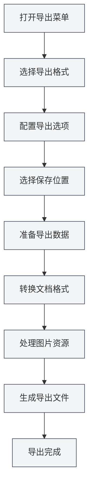

# Fonction d'exportation

## Vue d'ensemble

MetaDoc prend en charge l'exportation de documents vers de nombreux formats, notamment PDF, HTML, DOCX, LaTeX, Markdown, JSON, etc. La fonction d'exportation propose différentes options selon le format du document, garantissant que le document exporté conserve sa mise en forme et son style d'origine.

La fonction d'exportation inclut automatiquement les métadonnées du document (titre, auteur, description, mots-clés) et traite les éléments tels que les images, les tableaux, les formules mathématiques, etc., pendant le processus d'exportation.

<MenuItemsDemo mode="demo" :items='[{"id": "file", "items": ["export"]}]' />

<MetaInfoPanel mode="demo" :meta='{"title": "导出示例", "author": "作者", "description": "文档描述", "keywords": ["导出", "PDF"]}' :outlineJson='""' />

<MenuItemsDemo mode="demo" :items='[{"id": "file", "items": ["export"]}]' />

<MetaInfoPanel mode="demo" :meta='{"title": "导出格式", "author": "MetaDoc", "description": "支持的导出格式介绍", "keywords": ["导出", "格式"]}' :outlineJson='""' />

## Formats d'exportation pris en charge

<MenuItemsDemo mode="demo" :items='[{"id": "file", "items": ["export"]}]' />

### Exportation de documents Markdown

Les documents Markdown (`.md`) peuvent être exportés vers les formats suivants :

- **PDF** : adapté à l'impression et au partage
- **HTML** : adapté à l'affichage web
- **DOCX** : adapté à l'édition dans Word
- **LaTeX** : adapté aux articles académiques
- **JSON** : adapté au traitement par programme

<MetaInfoPanel mode="demo" :meta='{"title": "LaTeX导出", "author": "系统", "description": "LaTeX文档导出选项", "keywords": ["LaTeX", "导出"]}' :outlineJson='""' /

### Exportation de documents LaTeX

Les documents LaTeX (`.tex`) peuvent être exportés vers les formats suivants :

- **PDF** : généré par compilation LaTeX
- **Markdown** : converti au format Markdown
- **HTML** : converti au format HTML
- **DOCX** : converti au format Word

<MenuItemsDemo mode="demo" :items='[{"id": "file", "items": ["export"]}]' /

### Exportation de documents JSON

Les documents JSON (`.json`) peuvent être exportés vers :

- **JSON** : conserve le format JSON

## Opérations d'exportation

### Exportation de base

1. **Ouvrir le menu d'exportation** :
   - Cliquez sur "Fichier" → "Exporter" dans la barre de menu
   - Ou utilisez le raccourci clavier (s'il est configuré)

Les options d'exportation dans le menu Fichier sont les suivantes :

<MenuItemsDemo mode="demo" :items='[{"id": "file", "items": ["export"]}]' />

2. **Choisir le format d'exportation** :

   - Sélectionnez le format cible dans le menu d'exportation
   - Le système affichera les options d'exportation disponibles en fonction du format du document actuel

3. **Choisir l'emplacement de sauvegarde** :

   - Choisissez l'emplacement de sauvegarde dans la boîte de dialogue d'enregistrement de fichier
   - Saisissez le nom du fichier (l'extension correcte sera ajoutée automatiquement par le système)

4. **Attendre la fin de l'exportation** :
   - Une barre de progression s'affiche pendant l'exportation
   - Une notification de réussite s'affiche une fois l'exportation terminée

### Exportation rapide

Pour les formats couramment utilisés, vous pouvez utiliser des raccourcis clavier pour un export rapide :

- **Exporter en PDF** : `Ctrl+Shift+E` (s'il est configuré)
- **Exporter en HTML** : via la sélection du menu

## Détails de l'exportation Markdown

<MenuItemsDemo mode="demo" :items='[{"id": "file", "items": ["export"]}]' />

### Exportation en PDF

L'exportation PDF convertit le Markdown au format PDF :

- **Contenu inclus** : corps du document, images, tableaux, formules mathématiques
- **Métadonnées incluses** : titre, auteur, description, mots-clés
- **Style** : utilise un style dédié au PDF, adapté à l'impression
- **Traitement des images** : les images sont automatiquement redimensionnées pour s'adapter à la page

**Cas d'utilisation** :

- Impression de documents
- Partage de documents avec d'autres
- Archivage

### Exportation en HTML

<MetaInfoPanel mode="demo" :meta='{"title": "HTML导出", "author": "系统", "description": "HTML导出设置和选项", "keywords": ["HTML", "导出"]}' :outlineJson='""' />

L'exportation HTML convertit le Markdown au format web :

- **Contenu inclus** : corps du document, images, tableaux, formules mathématiques
- **Métadonnées incluses** : titre, auteur, description, mots-clés (dans les balises meta HTML)
- **Style** : utilise un style HTML, adapté à l'affichage web
- **Traitement des images** : vous pouvez choisir de conserver l'URL d'origine, de convertir en base64 ou de sauvegarder dans un dossier

**Cas d'utilisation** :

- Publication sur un site web
- Visualisation dans un navigateur
- Partage avec d'autres

### Exportation en DOCX

<MenuItemsDemo mode="demo" :items='[{"id": "file", "items": ["export"]}]' />

L'exportation DOCX convertit le Markdown au format Word :

- **Contenu inclus** : corps du document, images, tableaux, formules mathématiques
- **Métadonnées incluses** : titre, auteur, description, mots-clés (dans les propriétés du document Word)
- **Style** : utilise des styles Word, permettant une édition ultérieure dans Word
- **Traitement des images** : les images sont intégrées dans le document Word

**Cas d'utilisation** :

- Édition ultérieure dans Word
- Collaboration avec d'autres
- Soumission de documents

### Exportation en LaTeX

<MetaInfoPanel mode="demo" :meta='{"title": "LaTeX导出", "author": "学术", "description": "Markdown转LaTeX导出", "keywords": ["LaTeX", "学术"]}' :outlineJson='""' />

L'exportation LaTeX convertit le Markdown au format LaTeX :

- **Contenu inclus** : corps du document, images, tableaux, formules mathématiques
- **Métadonnées incluses** : titre, auteur, description, mots-clés (dans le document LaTeX)
- **Conversion de format** : la syntaxe Markdown est convertie en commandes LaTeX correspondantes
- **Formules mathématiques** : conserve le format des formules mathématiques LaTeX

**Cas d'utilisation** :

- Rédaction d'articles académiques
- Scénarios nécessitant le format LaTeX
- Édition ultérieure de documents LaTeX

### Exportation en JSON

<MenuItemsDemo mode="demo" :items='[{"id": "file", "items": ["export"]}]' />

L'exportation JSON sauvegarde le document au format JSON :

- **Contenu inclus** : toutes les données du document (contenu, métadonnées, plan, etc.)
- **Format** : données JSON structurées
- **Utilité** : traitement par programme, sauvegarde de données

## Détails de l'exportation LaTeX

<MetaInfoPanel mode="demo" :meta='{"title": "LaTeX导出详解", "author": "系统", "description": "LaTeX文档导出详细说明", "keywords": ["LaTeX", "PDF", "导出"]}' :outlineJson='""' />

### Exportation en PDF

L'exportation d'un document LaTeX en PDF nécessite une compilation LaTeX :

1. **Compiler LaTeX** : le système compile automatiquement le document LaTeX
2. **Générer le PDF** : une fois la compilation réussie, le fichier PDF est généré
3. **Métadonnées incluses** : les propriétés du document PDF contiennent les métadonnées

**Points à noter** :

- Une distribution LaTeX doit être installée (comme TeX Live)
- La compilation peut prendre un certain temps
- En cas d'échec de compilation, un message d'erreur s'affiche

### Exportation en Markdown

Les documents LaTeX peuvent être convertis au format Markdown :

- **Conversion de format** : les commandes LaTeX sont converties en syntaxe Markdown
- **Formules mathématiques** : les formules LaTeX sont converties au format de formules mathématiques Markdown
- **Tableaux** : les tableaux LaTeX sont convertis en tableaux Markdown

### Exportation en HTML

Les documents LaTeX peuvent être convertis au format HTML :

- **Conversion de format** : les commandes LaTeX sont converties en balises HTML
- **Formules mathématiques** : rendues avec MathJax ou KaTeX
- **Style** : affichage avec un style HTML

### Exportation en DOCX

Les documents LaTeX peuvent être convertis au format Word :

- **Conversion de format** : les commandes LaTeX sont converties au format Word
- **Formules mathématiques** : converties au format de formules mathématiques Word
- **Tableaux** : convertis au format de tableaux Word

## Configuration des options d'exportation

### Options de traitement des images

Vous pouvez configurer le traitement des images lors de l'exportation :

- **Conserver l'URL d'origine** : conserve l'URL d'origine de l'image (adapté à l'exportation HTML)
- **Convertir en Base64** : intègre l'image dans le document (adapté aux exportations HTML, DOCX)
- **Sauvegarder dans un dossier** : sauvegarde l'image dans un dossier spécifié (adapté à l'exportation HTML)

### Options d'exportation PDF

L'exportation PDF prend en charge les options suivantes :

- **Taille de page** : A4, Letter, etc.
- **Marges** : marges personnalisables
- **Police** : choix de la police et de la taille de police
- **Qualité d'image** : ajustement de la qualité des images

### Options d'exportation HTML

L'exportation HTML prend en charge les options suivantes :

- **Style** : choix du thème de style HTML
- **Rendu des formules mathématiques** : choix entre MathJax ou KaTeX
- **Coloration syntaxique** : activer ou désactiver la coloration syntaxique du code

## Progression de l'exportation

Une barre de progression s'affiche pendant l'exportation :

- **Phase de préparation** : préparation des données à exporter
- **Phase de conversion** : conversion du format du document
- **Traitement des images** : traitement des images dans le document
- **Génération du fichier** : génération du fichier final

Si l'exportation prend du temps, vous pouvez :

- **Vérifier la progression** : consulter la progression actuelle dans la barre de progression
- **Annuler l'exportation** : cliquer sur le bouton "Annuler" pour interrompre l'opération d'exportation

## Nommage des fichiers exportés

Les fichiers exportés sont nommés automatiquement :

- **Nom par défaut** : utilise le titre du document ou le nom du fichier
- **Extension automatique** : l'extension appropriée est ajoutée automatiquement selon le format d'exportation
- **Nom personnalisé** : vous pouvez choisir un nom personnalisé dans la boîte de dialogue de sauvegarde

## Astuces d'utilisation

### Choisir le format approprié

- **PDF** : adapté à l'impression et au partage formel
- **HTML** : adapté à l'affichage web et à la visualisation en ligne
- **DOCX** : adapté aux scénarios nécessitant une édition ultérieure
- **LaTeX** : adapté à la rédaction académique et aux scénarios nécessitant le format LaTeX

### Conseils pour le traitement des images

- **Exportation HTML** : pour un affichage web, il est recommandé d'utiliser Base64 ou de sauvegarder dans un dossier
- **Exportation DOCX** : les images sont automatiquement intégrées, aucun traitement supplémentaire n'est nécessaire
- **Exportation PDF** : les images sont automatiquement redimensionnées pour s'adapter à la page

### Exportation par lots

Si vous devez exporter plusieurs documents :

1. Ouvrez les documents un par un
2. Exportez-les individuellement dans le format souhaité
3. Ou utilisez un script pour un traitement par lots (utilisateurs avancés)

## Questions fréquentes

### Q : Que faire en cas d'échec de l'exportation ?

R : Vérifiez si le document contient des erreurs, assurez-vous que toutes les images et ressources sont accessibles. Si l'exportation PDF échoue, vérifiez s'il y a des erreurs de compilation LaTeX.

### Q : Le format PDF exporté est incorrect ?

R : Vérifiez les paramètres des options d'exportation PDF, ajustez la taille de page et les marges. Assurez-vous que le contenu du document est correctement formaté.

### Q : Les images ne s'affichent pas après l'exportation ?

R : Vérifiez que le chemin des images est correct, assurez-vous que les fichiers image existent. Pour l'exportation HTML, choisissez le mode de traitement des images approprié.

### Q : Peut-on personnaliser le style d'exportation ?

R : Certains formats prennent en charge la personnalisation du style, configurable dans les options d'exportation. Les exportations PDF et HTML prennent en charge la personnalisation du style.

### Q : Les métadonnées sont-elles incluses dans l'exportation ?

R : Oui, les métadonnées du document (titre, auteur, description, mots-clés) sont automatiquement incluses lors de l'exportation et apparaissent dans les propriétés du document exporté.

## Documents connexes

- [[core.file-operations|Opérations sur les fichiers]]
- [[core.document-metadata|Métadonnées du document]]
- [[markdown.basics|Syntaxe Markdown]]
- [[latex.basics|Syntaxe LaTeX]]
- [[latex.compilation|Compilation et prévisualisation LaTeX]]