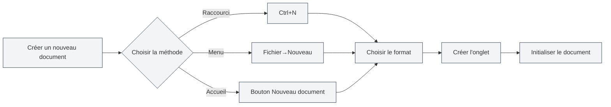
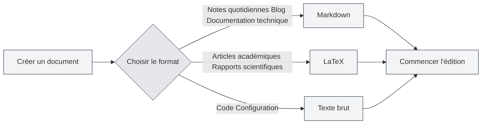
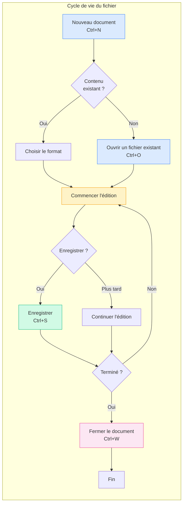

# Opérations sur les fichiers

## Vue d'ensemble

Les opérations sur les fichiers sont une fonctionnalité fondamentale de MetaDoc. Que vous rédigiez une documentation technique, un article académique ou que vous preniez des notes quotidiennes, maîtriser ces opérations rend le processus de création plus fluide. Cet article détaille comment créer, ouvrir, enregistrer et gérer vos documents.

## Créer un nouveau document

<MainTabs mode="demo" />

<MenuItemsDemo mode="demo" :items='[{"id": "file", "items": ["new"]}]' />

### Créer un document vierge

MetaDoc offre plusieurs méthodes pratiques pour créer un nouveau document. Vous pouvez choisir celle qui correspond le mieux à vos habitudes de travail :

**Méthode 1 : Raccourci clavier (le plus rapide)**

- Appuyez sur `Ctrl+N` pour créer instantanément un nouveau document.
- Idéal pour créer rapidement un document pendant une session d'édition.

**Méthode 2 : Menu Fichier**

- Cliquez sur l'icône "Fichier" dans la barre de menu de gauche.
- Sélectionnez "Nouveau" dans le menu déroulant.

**Méthode 3 : Page d'accueil**

- Cliquez sur le bouton "Nouveau document" sur la page d'accueil.
- Idéal pour commencer à créer dès l'ouverture de l'application.

L'interface ci-dessous montre le menu Fichier, incluant les opérations courantes comme Nouveau, Ouvrir, Enregistrer, etc. :

<MenuItemsDemo mode="demo" :items='[{"id": "file", "items": ["new", "open", "save", "save-as", "save-all", "close"]}]' />

<MainTabs mode="demo" />

**État après la création d'un document** :

Après avoir créé un nouveau document, vous verrez :

- Un nouvel onglet apparaît en haut, avec le titre "Sans titre".
- Le système vous demandera de choisir un format de document (Markdown, LaTeX ou Texte brut).
- Le document n'existe que dans la mémoire vive ; vous devez l'enregistrer pour le conserver sur le disque.

### Choisir le format du document

Lors de la création d'un document, vous devez choisir son format. Différents formats sont adaptés à différents scénarios :

**Markdown (.md)** — Le format léger le plus courant

- **Adapté pour** : Notes quotidiennes, articles de blog, documentation technique, documentation de projet.
- **Avantages** : Syntaxe simple, facile à lire, nombreux formats d'export.
- **Exemples d'utilisation** : Noter les points clés d'une réunion, écrire un blog technique, organiser des notes d'apprentissage.

**LaTeX (.tex)** — Format de mise en page professionnel pour l'académique

- **Adapté pour** : Articles académiques, thèses, rapports scientifiques, documents mathématiques.
- **Avantages** : Mise en page de haute qualité, excellente prise en charge des formules, génération automatique de tables des matières et de références.
- **Exemples d'utilisation** : Rédiger un article de recherche, écrire un manuel de mathématiques, préparer une présentation académique.

**Texte brut (.txt)** — Le format texte le plus simple

- **Adapté pour** : Extraits de code, fichiers de configuration, notes temporaires.
- **Avantages** : Grande universalité, peut être ouvert par n'importe quel éditeur.
- **Exemples d'utilisation** : Sauvegarder des extraits de code, noter des informations temporaires.

## Ouvrir un document

<MenuItemsDemo mode="demo" :items='[{"id": "file", "items": ["open"]}]' />

### Ouvrir un fichier existant

1. **Par raccourci clavier** : Appuyez sur `Ctrl+O` pour ouvrir la boîte de dialogue de sélection de fichier.
2. **Par menu** : Cliquez sur "Fichier" → "Ouvrir".
3. **Par la page d'accueil** : Cliquez sur le bouton "Ouvrir un fichier" sur la page d'accueil.

### Formats de fichiers pris en charge

MetaDoc peut ouvrir les fichiers aux formats suivants :

- `.md` - Documents Markdown
- `.tex` - Documents LaTeX
- `.txt` - Fichiers texte brut
- `.json` - Fichiers au format JSON

### Liste des fichiers récents

La page d'accueil affiche une liste des documents récemment ouverts, pour un accès rapide :

- Cliquez sur une carte de document récent pour l'ouvrir rapidement.
- Cliquez avec le bouton droit pour supprimer une entrée de l'historique.
- Un maximum de 12 documents récents est affiché.

### Association de fichiers

MetaDoc prend en charge l'association de fichiers :

- Double-cliquez sur un fichier `.md` ou `.tex` dans le système, il s'ouvrira automatiquement avec MetaDoc.
- Si le fichier est déjà ouvert dans une autre fenêtre, vous serez averti qu'il est déjà ouvert ailleurs.

## Enregistrer un document

<MenuItemsDemo mode="demo" :items='[{"id": "file", "items": ["save", "save-as", "save-all"]}]' />

### Enregistrer le document actuel

Prenez l'habitude d'enregistrer fréquemment pour éviter de perdre votre travail en cas d'incident.

**Méthodes d'enregistrement** :

- **Raccourci clavier** (recommandé) : `Ctrl+S` — La méthode la plus courante, sans quitter le clavier.
- **Menu** : Cliquez sur le menu "Fichier" → "Enregistrer".

**Premier enregistrement** :
Si le document est nouveau, le premier enregistrement ouvrira une boîte de dialogue "Enregistrer sous". Vous devrez :

1. Choisir l'emplacement de sauvegarde (par exemple, le dossier "Documents").
2. Saisir un nom de fichier (par exemple, "plan_projet.md").
3. Cliquer sur le bouton "Enregistrer".

**Enregistrement d'un document déjà sauvegardé** :
Si le document a déjà été enregistré précédemment, appuyer sur `Ctrl+S` écrasera directement le fichier original sans ouvrir de boîte de dialogue.

### Enregistrer sous — Créer une copie du document

Utilisez la fonction "Enregistrer sous" lorsque vous souhaitez conserver le document original tout en créant une nouvelle version.

**Cas d'utilisation** :

- Créer une copie de sauvegarde avant de modifier un document.
- Enregistrer le document à un emplacement différent.
- Sauvegarder différentes versions d'un document sous des noms différents.

**Méthodes** :

- **Raccourci clavier** : `Ctrl+Maj+S`
- **Menu** : Cliquez sur "Fichier" → "Enregistrer sous"

**Exemple** :
Vous éditez "rapport_v1.md" et souhaitez enregistrer une sauvegarde avant d'apporter des modifications importantes :

1. Appuyez sur `Ctrl+Maj+S`.
2. Saisissez le nouveau nom de fichier, par exemple "rapport_v1_sauvegarde.md".
3. Cliquez sur Enregistrer.
4. Continuez à éditer le document original et modifiez-le en toute tranquillité.

### Enregistrer tout — Sauvegarder tous les documents en un clic

Lorsque plusieurs documents sont ouverts simultanément, utilisez la fonction "Enregistrer tout" pour les sauvegarder tous en une seule fois.

**Méthodes** :

- **Raccourci clavier** : `Ctrl+K S` (appuyez d'abord sur `Ctrl+K`, puis sur `S`).
- **Menu** : Cliquez sur "Fichier" → "Enregistrer tout".

**Cas d'utilisation** :

- Sauvegarder rapidement tous les documents ouverts en fin de session de travail.
- S'assurer que toutes les modifications sont enregistrées.

### Enregistrement automatique — Laissez le système sauvegarder pour vous

MetaDoc prend en charge l'enregistrement automatique, qui peut sauvegarder vos documents pendant que vous vous concentrez sur la création.

**Comment configurer** :
Accédez à [[settings.basic|Paramètres de base]], trouvez l'option "Enregistrement automatique" et choisissez un intervalle approprié :

- **Désactivé** : Contrôle manuel du moment de l'enregistrement.
- **1 minute** : Le plus sûr, mais augmente les écritures sur le disque.
- **5 minutes** : Un bon équilibre (recommandé).
- **10 minutes/30 minutes/1 heure** : Adapté aux longs documents, réduit la fréquence d'enregistrement.

**Fonctionnement** :

- L'enregistrement automatique s'effectue silencieusement en arrière-plan, sans interrompre votre édition.
- Lors de l'enregistrement automatique, l'indicateur "Non enregistré" sur l'onglet disparaît.
- Vous pouvez enregistrer manuellement à tout moment (`Ctrl+S`), indépendamment de l'enregistrement automatique.

**Recommandations** :

- Pour les documents importants, il est recommandé d'activer l'enregistrement automatique à 5 minutes.
- Même avec l'enregistrement automatique activé, il est conseillé de sauvegarder manuellement aux étapes clés (par exemple, à la fin d'un chapitre).

## Fermer un fichier

<MainTabs mode="demo" />

### Fermer l'onglet actuel

- **Raccourci clavier** : `Ctrl+W`
- **Bouton de fermeture de l'onglet** : Cliquez sur le bouton × à droite de l'onglet.

### Avertissement avant fermeture

Si le document contient des modifications non enregistrées, un avertissement s'affichera à la fermeture :

- **Enregistrer** : Enregistre les modifications puis ferme.
- **Ne pas enregistrer** : Ferme en abandonnant les modifications.
- **Annuler** : Annule l'opération de fermeture.

### Rouvrir un onglet fermé

- **Raccourci clavier** : `Ctrl+Maj+T`

Permet de restaurer les onglets récemment fermés (jusqu'à 20 maximum).

## Gestion des onglets multiples

<MainTabs mode="demo" />

MetaDoc permet d'ouvrir plusieurs documents simultanément, chacun s'affichant dans un onglet séparé :

La barre d'onglets affiche tous les documents ouverts et prend en charge la navigation, la fermeture, le glisser-déposer, etc. :

<MainTabs mode="demo" />

- **Changer d'onglet** : Utilisez `Ctrl+Tab` pour passer à l'onglet suivant, `Ctrl+Maj+Tab` pour passer au précédent.
- **Ordonner par glisser-déposer** : Faites glisser un onglet pour le réorganiser.
- **Épingler un onglet** : Cliquez avec le bouton droit sur un onglet et sélectionnez "Épingler". Les onglets épinglés restent toujours affichés à gauche et ne peuvent pas être fermés.

Pour plus d'opérations sur les onglets, consultez [[core.multi-tab|Gestion des onglets multiples]].

## Indicateurs d'état du fichier

Les onglets affichent l'état du document :

- **Non enregistré** : Un point (●) apparaît à côté du titre de l'onglet, indiquant des modifications non sauvegardées.
- **Enregistré** : Aucun marqueur spécial.
- **Lecture seule** : Une icône de cadenas s'affiche, indiquant que le fichier est en mode lecture seule.

## Points d'attention

1. **Chemin du fichier** : Lors de l'enregistrement, assurez-vous d'avoir suffisamment d'espace disque et les permissions d'écriture.
2. **Format de fichier** : Faites attention au format de fichier choisi lors de l'enregistrement pour éviter les incompatibilités.
3. **Sauvegarde** : Pour les documents importants, il est recommandé de faire des sauvegardes régulières, par exemple en utilisant la fonction "Enregistrer sous" pour créer des copies.
4. **Conflits de fichiers** : Si un fichier est modifié en externe, MetaDoc le détectera et vous invitera à gérer le conflit.

## Documentation associée

- [[core.editor-basics|Opérations de base de l'éditeur]]
- [[core.multi-tab|Gestion des onglets multiples]]
- [[core.document-metadata|Métadonnées du document]]
- [[core.export|Fonctionnalités d'export]]
- [[settings.basic|Paramètres de base]]