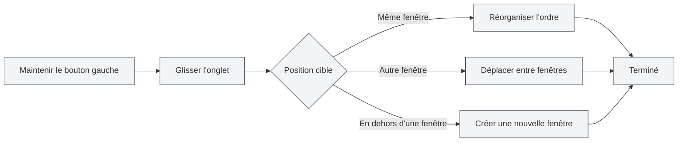

# Gestion des onglets multiples

## Vue d'ensemble

MetaDoc prend en charge la gestion des onglets multiples, vous permettant d'ouvrir plusieurs documents simultanément, chaque document s'affichant dans un onglet indépendant. Maîtriser les opérations sur les onglets peut améliorer considérablement votre productivité.

La gestion des onglets comprend des fonctionnalités telles que la création, la navigation, la fermeture, le tri par glisser-déposer, l'épinglage, etc., vous offrant une grande flexibilité pour organiser et gérer plusieurs documents.

<MainTabs mode="demo" />

<AIChat mode="demo" />

<KnowledgeBase mode="demo" />

<ProofreadView mode="demo" />

<GraphWindow mode="demo" />

<OcrWindow mode="demo" />

<DataAnalysisWindow mode="demo" />

<AgentView mode="demo" />

<MenuItemsDemo mode="demo" :items='[{"id": "file", "items": ["new", "open", "save"]}]' />

<ViewMenuItemsDemo mode="demo" :items='["editor", "outline"]' />

<Outline mode="demo" />

<ResizableDivider mode="demo" />

<TitleMenu mode="demo" title="Exemple d'onglet" :position='{"top": 100, "left": 200}' path="1" :tree='{}' />

## Créer un nouvel onglet

### Créer un nouvel onglet

Il existe plusieurs façons de créer un nouvel onglet :

1. **Raccourci clavier** : Appuyez sur `Ctrl+T` pour créer rapidement un nouvel onglet
2. **Bouton** : Cliquez sur le bouton "+" à droite de la barre d'onglets
3. **Menu** : Cliquez sur "Fichier" → "Nouveau"

La barre d'onglets affiche tous les documents ouverts et prend en charge les opérations de création, navigation, fermeture, etc. :

<MainTabs mode="demo" />

Le nouvel onglet ouvre un document vierge. Vous pouvez choisir le format du document (Markdown/LaTeX/texte brut).

### Créer un onglet à partir d'un fichier

L'ouverture d'un fichier crée automatiquement un nouvel onglet :

1. **Raccourci clavier** : Appuyez sur `Ctrl+O` pour ouvrir la boîte de dialogue de sélection de fichier
2. **Menu** : Cliquez sur "Fichier" → "Ouvrir"
3. **Page d'accueil** : Cliquez sur le bouton "Ouvrir un fichier" sur la page d'accueil

Le fichier ouvert s'affiche dans un nouvel onglet.

## Naviguer entre les onglets

### Navigation par raccourcis clavier

- **Onglet suivant** : `Ctrl+Tab` pour passer à l'onglet suivant
- **Onglet précédent** : `Ctrl+Maj+Tab` pour passer à l'onglet précédent

La navigation est cyclique ; après le dernier onglet, on revient au premier.

### Navigation à la souris

- **Cliquer sur un onglet** : Cliquez directement sur le titre de l'onglet pour y accéder
- **Molette de la souris** : Faites défiler la molette de la souris sur la barre d'onglets pour naviguer
  - **Défilement vers le bas** : Passe à l'onglet suivant
  - **Défilement vers le haut** : Passe à l'onglet précédent

### Indicateur de navigation des onglets

Lorsque vous utilisez les raccourcis clavier pour naviguer, un indicateur de navigation s'affiche, montrant l'onglet actuellement sélectionné, facilitant ainsi un repérage rapide.

## Fermer un onglet

### Fermer l'onglet actif

- **Raccourci clavier** : `Ctrl+W` pour fermer l'onglet actif
- **Bouton de fermeture** : Cliquez sur le bouton × à droite de l'onglet
- **Clic molette** : Cliquez avec le bouton du milieu de la souris sur l'onglet pour le fermer

### Avertissement avant fermeture

Si le document dans l'onglet contient des modifications non enregistrées, un avertissement s'affiche à la fermeture :

- **Enregistrer** : Enregistre les modifications puis ferme l'onglet
- **Ne pas enregistrer** : Ferme l'onglet en abandonnant les modifications
- **Annuler** : Annule l'opération de fermeture et continue l'édition

### Rouvrir un onglet fermé

- **Raccourci clavier** : `Ctrl+Maj+T` pour rouvrir le dernier onglet fermé

Le système conserve les 20 derniers onglets fermés. Vous pouvez les restaurer dans l'ordre inverse de leur fermeture.

## Glisser-déposer des onglets

### Réorganiser l'ordre

Vous pouvez faire glisser les onglets pour modifier leur ordre :

1. **Maintenir le bouton gauche** : Maintenez le bouton gauche de la souris enfoncé sur le titre de l'onglet
2. **Glisser** : Faites glisser l'onglet vers la position cible
3. **Relâcher** : Relâchez le bouton gauche pour finaliser le tri

Un retour visuel indique la position cible de l'onglet pendant le glissement.

### Glisser-déposer entre fenêtres

Les onglets peuvent être déplacés vers d'autres fenêtres :

1. **Glisser l'onglet** : Maintenez le bouton gauche et faites glisser l'onglet
2. **Déplacer vers une autre fenêtre** : Faites glisser l'onglet vers une autre fenêtre MetaDoc
3. **Relâcher** : Relâchez le bouton dans la fenêtre cible ; l'onglet y sera déplacé

Le glisser-déposer entre fenêtres vous permet d'organiser vos documents de manière flexible entre plusieurs fenêtres.

### Créer une nouvelle fenêtre

Faites glisser un onglet en dehors d'une fenêtre pour créer une nouvelle fenêtre :

1. **Glisser l'onglet** : Maintenez le bouton gauche et faites glisser l'onglet
2. **Déplacer hors de la fenêtre** : Faites glisser l'onglet en dehors de la fenêtre actuelle
3. **Relâcher** : Relâchez le bouton ; le système crée une nouvelle fenêtre et y ouvre l'onglet

## Épingler un onglet

### Épingler un onglet

Un onglet épinglé reste toujours visible à l'extrême gauche de la barre d'onglets et ne peut pas être fermé :

- **Double-clic sur l'onglet** : Double-cliquez sur le titre de l'onglet pour l'épingler
- **Menu contextuel** : Faites un clic droit sur l'onglet et sélectionnez "Épingler"

Un onglet épinglé :

- S'affiche à l'extrême gauche de la barre d'onglets
- Affiche une icône de verrouillage
- Ne peut pas être fermé par les méthodes habituelles
- Ne peut pas être déplacé par glisser-déposer

### Désépingler

- **Menu contextuel** : Faites un clic droit sur l'onglet épinglé et sélectionnez "Désépingler"

Après désépinglage, l'onglet retrouve son état normal (fermable et déplaçable).

## État des onglets

### État non enregistré

L'onglet indique l'état d'enregistrement du document :

- **Non enregistré** : Un point (●) s'affiche à côté du titre de l'onglet, indiquant des modifications non enregistrées
- **Enregistré** : Aucun marqueur spécial

### État en lecture seule

Si le document est en lecture seule, l'onglet affiche une icône de verrouillage :

- **Document en lecture seule** : Affiche une icône de verrouillage, indiquant que le document n'est pas modifiable
- **Document modifiable** : Aucun marqueur spécial

### État de prévisualisation

Les onglets en état de prévisualisation :

- **Mode prévisualisation** : Les fichiers ouverts par un simple clic s'affichent en mode prévisualisation
- **Double-clic pour activer** : Double-cliquez sur l'onglet de prévisualisation pour l'activer en tant qu'onglet standard
- **Activation automatique** : S'active automatiquement après édition ou changement de vue

## Menu contextuel des onglets

Un clic droit sur un onglet affiche un menu contextuel proposant les actions suivantes :

- **Fermer** : Ferme l'onglet actuel
- **Fermer les autres** : Ferme tous les onglets sauf l'actuel
- **Fermer à droite** : Ferme tous les onglets à droite de l'onglet actuel
- **Épingler/Désépingler** : Épingle ou désépingle l'onglet
- **Déplacer vers une nouvelle fenêtre** : Déplace l'onglet vers une nouvelle fenêtre
- **Copier le chemin** : Copie le chemin du document dans le presse-papiers

## Limite du nombre d'onglets

MetaDoc n'impose pas de limite stricte au nombre d'onglets ouverts simultanément, mais il est recommandé :

- **Nombre raisonnable** : 10 à 20 onglets ouverts simultanément est raisonnable
- **Impact sur les performances** : Trop d'onglets ouverts peut affecter les performances de l'application
- **Utilisation de la mémoire** : Chaque onglet consomme une certaine quantité de mémoire

Si vous avez trop d'onglets, il est conseillé de fermer ceux qui ne sont pas nécessaires.

## Référence des raccourcis clavier

### Raccourcis pour les opérations sur les onglets

| Opération                | Windows/Linux    | macOS           |
| ------------------------ | ---------------- | --------------- |
| Nouvel onglet            | `Ctrl+T`         | `Cmd+T`         |
| Fermer l'onglet          | `Ctrl+W`         | `Cmd+W`         |
| Onglet suivant           | `Ctrl+Tab`       | `Cmd+Tab`       |
| Onglet précédent         | `Ctrl+Maj+Tab`   | `Cmd+Maj+Tab`   |
| Rouvrir l'onglet fermé   | `Ctrl+Maj+T`     | `Cmd+Maj+T`     |

### Actions à la souris

| Opération          | Méthode                               |
| ------------------ | ------------------------------------- |
| Naviguer entre onglets | Cliquer sur le titre de l'onglet      |
| Fermer un onglet   | Cliquer sur le bouton × ou clic molette |
| Épingler un onglet | Double-cliquer sur le titre de l'onglet |
| Trier par glisser  | Maintenir le bouton gauche et glisser |
| Navigation par molette | Faire défiler la molette sur la barre d'onglets |

## Astuces d'utilisation

### Organiser les onglets

1. **Épingler les documents fréquents** : Épinglez les documents que vous utilisez souvent pour un accès rapide
2. **Grouper par projet** : Placez les documents liés ensemble et organisez-les par glisser-déposer
3. **Utiliser plusieurs fenêtres** : Placez les documents de différents projets dans des fenêtres distinctes

### Navigation rapide

1. **Utiliser les raccourcis clavier** : Maîtrisez `Ctrl+Tab` pour naviguer rapidement
2. **Utiliser la molette** : Faites défiler la molette sur la barre d'onglets pour parcourir rapidement
3. **Utiliser l'indicateur de navigation** : L'indicateur s'affiche avec les raccourcis, facilitant le repérage

### Opérations par lot

1. **Fermer plusieurs onglets** : Utilisez les options "Fermer les autres" ou "Fermer à droite" du menu contextuel
2. **Enregistrer tous les onglets** : Utilisez `Ctrl+K S` pour enregistrer tous les documents ouverts
3. **Rouvrir** : Utilisez `Ctrl+Maj+T` pour restaurer rapidement les onglets fermés

## Questions fréquentes

### Q : Comment trouver rapidement un onglet spécifique ?

R : Utilisez le raccourci `Ctrl+Tab`. L'indicateur de navigation affiche tous les onglets. Vous pouvez continuer à appuyer sur Tab pour sélectionner ou cliquer directement.

### Q : Que faire si j'ai trop d'onglets ?

R : Vous pouvez épingler les onglets fréquents, fermer ceux qui ne sont pas nécessaires, ou utiliser plusieurs fenêtres pour grouper les documents.

### Q : Comment restaurer un onglet fermé par erreur ?

R : Utilisez le raccourci `Ctrl+Maj+T` pour rouvrir le dernier onglet fermé.

### Q : Peut-on fermer un onglet épinglé ?

R : Un onglet épinglé ne peut pas être fermé par les méthodes habituelles. Il faut d'abord le désépingler. Faites un clic droit sur l'onglet épinglé et sélectionnez "Désépingler".

### Q : Peut-on déplacer des onglets entre fenêtres par glisser-déposer ?

R : Oui. Faites glisser un onglet vers une autre fenêtre MetaDoc pour le déplacer dans cette fenêtre.

## Documents connexes

- [[core.file-operations|Opérations sur les fichiers]]
- [[core.multi-window|Gestion des fenêtres multiples]]
- [[core.editor-basics|Opérations de base de l'éditeur]]
