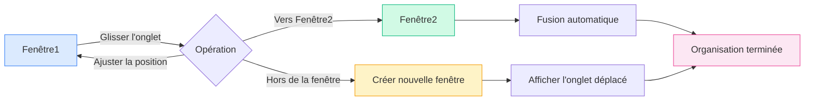

# Gestion multi-fenêtres

## Vue d'ensemble

MetaDoc prend en charge la gestion multi-fenêtres, vous permettant d'ouvrir différents documents dans différentes fenêtres. Grâce à cette gestion, vous pouvez visualiser et éditer plusieurs documents simultanément, améliorant ainsi votre productivité.

## Prise en charge multi-fenêtres

### Types de fenêtres

MetaDoc prend en charge deux types de fenêtres :

- **Fenêtre principale** : Héberge les fonctions principales comme l'édition de documents, la page d'accueil, et prend en charge la gestion d'onglets multiples.
- **Fenêtre auxiliaire** : Fenêtres d'outils comme les paramètres, le chat IA, la reconnaissance OCR, généralement en instance unique.

### Caractéristiques des fenêtres

Caractéristiques de la fenêtre principale :

- **Onglets multiples** : Chaque fenêtre possède sa propre liste d'onglets.
- **État indépendant** : Chaque fenêtre maintient un état de document indépendant.
- **Prise en charge du glisser-déposer** : Permet de séparer et de fusionner des onglets par glisser-déposer.
- **Pool de fenêtres** : Pré-création de fenêtres inactives pour un affichage rapide.

## Créer une nouvelle fenêtre

### Création par glisser-déposer

Vous pouvez créer une nouvelle fenêtre en faisant glisser un onglet :

1. **Glisser l'onglet** : Faites glisser l'onglet en dehors des limites de la fenêtre actuelle.
2. **Création de la fenêtre** : Le système crée automatiquement une nouvelle fenêtre.
3. **Affichage du contenu** : La nouvelle fenêtre affiche le contenu de l'onglet déplacé.

La barre d'onglets prend en charge le glisser-déposer, permettant de créer une nouvelle fenêtre en faisant glisser un onglet hors de la fenêtre :

<MainTabs mode="demo" />

**Remarques** :

- Une fenêtre avec un seul onglet ne peut pas en créer une nouvelle par glisser-déposer.
- Lors du glisser-déposer, une fenêtre préchargée est automatiquement récupérée du pool de fenêtres pour un affichage instantané.

### Création via le menu contextuel

Vous pouvez créer une nouvelle fenêtre via le menu contextuel :

1. **Clic droit sur l'onglet** : Faites un clic droit sur l'onglet à déplacer.
2. **Sélection de l'option** : Choisissez "Ouvrir dans une nouvelle fenêtre".
3. **Création de la fenêtre** : Le système crée une nouvelle fenêtre et y déplace l'onglet.

### Mécanisme du pool de fenêtres

MetaDoc utilise un mécanisme de pool de fenêtres pour optimiser la création :

- **Fenêtres préchargées** : Le système pré-crée 2 fenêtres inactives.
- **Affichage rapide** : L'utilisation d'une fenêtre préchargée permet un affichage quasi instantané (<100ms).
- **Réapprovisionnement automatique** : Après utilisation, une nouvelle fenêtre est automatiquement ajoutée au pool.

## Glisser-déposer d'onglets entre fenêtres

### Fusion par glisser-déposer

Vous pouvez faire glisser un onglet d'une fenêtre vers une autre pour une organisation flexible :

**Étapes de l'opération** :

1. **Glisser l'onglet** : Faites glisser l'onglet depuis la fenêtre source.
2. **Déposer sur la fenêtre cible** : Déposez l'onglet sur la barre d'onglets de la fenêtre cible.
3. **Fusion automatique** : L'onglet est automatiquement ajouté à la fenêtre cible.

### Position de dépôt

Vous pouvez spécifier la position d'insertion lors du glisser-déposer :

- **Positionnement automatique** : La position d'insertion est déterminée automatiquement selon l'emplacement du curseur.
- **Position spécifique** : Vous pouvez déposer à un emplacement précis pour l'insertion.
- **Insertion en fin** : Déposer à la fin de la barre insère l'onglet en dernière position.

### Fusion de fenêtres à onglet unique

Si la fenêtre source ne contient qu'un seul onglet :

- **Fusion automatique** : Lorsqu'il est déposé sur une autre fenêtre, l'onglet fusionne automatiquement.
- **Fermeture de la fenêtre** : La fenêtre source se ferme automatiquement après la fusion.
- **Éviter les fenêtres vides** : Empêche l'apparition de fenêtres sans contenu.

## Gestion des fenêtres

### Commutation entre fenêtres

Vous pouvez utiliser les raccourcis système pour changer de fenêtre :

- **Alt+Tab** (Windows/Linux) : Commuter entre les fenêtres.
- **Cmd+Tab** (macOS) : Commuter entre les fenêtres.

### État des fenêtres

Chaque fenêtre possède un état indépendant :

- **Liste d'onglets** : Chaque fenêtre a sa propre liste d'onglets.
- **État du document** : Chaque fenêtre maintient un état de document indépendant.
- **État de la vue** : Chaque fenêtre a son propre état d'affichage.

### Fermeture d'une fenêtre

Méthodes pour fermer une fenêtre :

- **Bouton de fermeture** : Cliquez sur le bouton de fermeture de la fenêtre.
- **Raccourci clavier** : Utilisez le raccourci système pour fermer la fenêtre.
- **Option de menu** : Fermez la fenêtre via le menu.

**Remarques** :

- Une confirmation de sauvegarde est demandée pour les documents non enregistrés avant fermeture.
- Les fenêtres auxiliaires sont masquées plutôt que fermées définitivement.

## Synchronisation des fenêtres

### Synchronisation d'état

Certains états sont synchronisés entre les fenêtres :

- **Paramètres de langue** : Le changement de langue est appliqué à toutes les fenêtres.
- **Paramètres de thème** : Le changement de thème est appliqué à toutes les fenêtres.
- **Paramètres système** : Les paramètres système sont synchronisés sur toutes les fenêtres.

### Association de fichiers

Fonctionnalité d'association de fichiers :

- **Éviter les doublons** : Un même fichier ne peut pas être ouvert simultanément dans plusieurs fenêtres.
- **Localisation de fenêtre** : Si un fichier est déjà ouvert dans une autre fenêtre, le système vous en informe et y navigue.
- **Verrouillage de fichier** : Les fichiers sont temporairement verrouillés lors d'un transfert pour éviter les conflits.

## Bonnes pratiques

1. **Fractionnement d'écran raisonnable** : Utilisez plusieurs fenêtres pour éditer en fractionné et gagner en efficacité.
2. **Organisation des fenêtres** : Placez les documents liés dans la même fenêtre, séparez les documents non liés.
3. **Gestion des onglets** : Utilisez judicieusement le glisser-déposer d'onglets pour organiser la disposition des fenêtres.
4. **Commutation de fenêtres** : Maîtrisez Alt+Tab pour changer rapidement de fenêtre.
5. **Sauvegarde d'état** : Assurez-vous que les documents importants sont sauvegardés avant de fermer une fenêtre.

## Remarques importantes

1. **Nombre de fenêtres** : Un trop grand nombre de fenêtres peut affecter les performances, il est conseillé de le contrôler.
2. **Verrouillage de fichiers** : Les fichiers sont temporairement verrouillés lors d'un transfert pour éviter les conflits.
3. **Indépendance d'état** : L'état de chaque fenêtre est indépendant et n'affecte pas les autres.
4. **Pool de fenêtres** : Le mécanisme du pool de fenêtres est géré automatiquement, aucune intervention manuelle n'est nécessaire.
5. **Fenêtres auxiliaires** : Les fenêtres auxiliaires sont à instance unique et sont masquées lors de la fermeture.

## Documents connexes

- [[core.multi-tab|Gestion multi-onglets]]
- [[core.file-operations|Opérations sur les fichiers]]

<ViewMenuItemsDemo mode="demo" :items='["home", "outline"]' />

<ViewMenuItemsDemo mode="demo" :items='["chat", "agent"]' />

<MenuItemsDemo mode="demo" :items='[{"id": "file"}]' />

<MenuItemsDemo mode="demo" :items='[{"id": "edit"}]' />

<MenuItemsDemo mode="demo" :items='[{"id": "view"}]' />

<LeftMenu mode="demo" />
