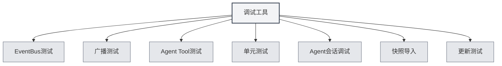

# Outils de débogage

## Vue d'ensemble

Les outils de débogage sont une fonctionnalité de l'environnement de développement fournie par MetaDoc, utilisée pour tester et déboguer les fonctionnalités de l'application. Ces outils sont uniquement disponibles dans l'environnement de développement et aident les développeurs à tester et déboguer rapidement leur code.

<SettingDebugSection mode="demo" />

## Présentation des outils de débogage

<SettingDebugSection mode="demo" />

<ConsoleTerminal mode="demo" consoleKey="debug" :history='[]' />

### Accéder aux outils de débogage

Les outils de débogage sont uniquement disponibles dans l'environnement de développement :

1. **Environnement de développement** : Assurez-vous de fonctionner dans l'environnement de développement.
2. **Page des paramètres** : Ouvrez la page des paramètres.
3. **Outils de débogage** : Trouvez l'option "Outils de débogage" dans la page des paramètres.
4. **Ouvrir l'outil** : Cliquez pour ouvrir l'interface des outils de débogage.

Vous pouvez accéder aux outils de débogage via la barre de menu supérieure (uniquement en environnement de développement) :

<MenuItemsDemo mode="demo" :items='[{"id": "settings"}]' />

### Types d'outils

Les outils de débogage comprennent les modules fonctionnels suivants :

- **Test EventBus** : Tester les événements EventBus.
- **Test de diffusion** : Tester les événements de diffusion.
- **Test d'outil Agent** : Tester les outils Agent.
- **Tests unitaires** : Exécuter des tests unitaires.
- **Débogage de session Agent** : Déboguer les sessions Agent.
- **Importation de capture** : Importer des captures de documents.
- **Test de mise à jour** : Tester la fonctionnalité de mise à jour.

<SettingDebugSection mode="demo" />

## Test EventBus

### Envoyer un événement

Vous pouvez envoyer un événement EventBus pour le tester :

1. **Nom de l'événement** : Saisissez le nom de l'événement à envoyer.
2. **Données de l'événement** : Optionnel, saisissez les données de l'événement au format JSON.
3. **Envoyer l'événement** : Cliquez sur le bouton "Envoyer l'événement".
4. **Voir le résultat** : Consultez le résultat de l'envoi de l'événement.

<ConsoleTerminal mode="demo" consoleKey="debug" :history='[]' />

### Écoute d'événements

Vous pouvez écouter les événements EventBus :

- **Liste des événements** : Affiche tous les événements envoyés.
- **Détails de l'événement** : Consultez les informations détaillées de l'événement.
- **Données de l'événement** : Consultez le contenu des données de l'événement.

## Test de diffusion

### Envoyer une diffusion

Vous pouvez envoyer un événement de diffusion pour le tester :

1. **Fenêtre cible** : Sélectionnez la cible de diffusion (all/home/ai-chat, etc.).
2. **Nom de l'événement** : Saisissez le nom de l'événement à diffuser.
3. **Données de l'événement** : Optionnel, saisissez les données de l'événement au format JSON.
4. **Envoyer la diffusion** : Cliquez sur le bouton "Envoyer la diffusion".
5. **Voir le résultat** : Consultez le résultat de l'envoi de la diffusion.

<ConsoleTerminal mode="demo" consoleKey="debug" :history='[]' />

### Écoute de diffusion

Vous pouvez écouter les événements de diffusion :

- **Liste des diffusions** : Affiche toutes les diffusions envoyées.
- **Détails de la diffusion** : Consultez les informations détaillées de la diffusion.
- **Fenêtre cible** : Consultez la fenêtre cible de la diffusion.

## Test d'outil Agent

### Tester un outil

Vous pouvez tester un outil Agent :

1. **Sélectionner l'outil** : Sélectionnez l'outil Agent à tester.
2. **Saisir les paramètres** : Saisissez les paramètres de test de l'outil (format JSON).
3. **Sélectionner le contexte** : Sélectionnez l'ID de l'onglet de contexte pour le test.
4. **Exécuter le test** : Cliquez sur le bouton "Exécuter le test".
5. **Voir le résultat** : Consultez le résultat du test.

### Historique des tests

Vous pouvez consulter l'historique des tests :

- **Liste de l'historique** : Affiche tout l'historique des tests.
- **Résultat du test** : Consultez le résultat de chaque test.
- **Message d'erreur** : Consultez les messages d'erreur des tests.

## Tests unitaires

### Test unique

Vous pouvez exécuter un test unitaire unique :

1. **Sélectionner le module** : Sélectionnez le module à tester.
2. **Sélectionner le test** : Sélectionnez la fonction de test à exécuter.
3. **Modifier les paramètres** : Modifiez les paramètres de la fonction de test.
4. **Exécuter le test** : Cliquez sur le bouton "Exécuter le test".
5. **Voir le résultat** : Consultez le résultat du test.

<ConsoleTerminal mode="demo" consoleKey="debug" :history='[]' />

### Tests par lots

Vous pouvez exécuter des tests unitaires par lots :

1. **Sélectionner le module** : Sélectionnez un ou plusieurs modules.
2. **Sélectionner le contexte** : Sélectionnez l'ID de l'onglet de contexte pour le test.
3. **Démarrer le test** : Cliquez sur le bouton "Démarrer les tests par lots".
4. **Voir la progression** : Consultez la progression des tests.
5. **Voir les résultats** : Consultez tous les résultats des tests.

### Résultats des tests

Les résultats des tests contiennent :

- **État du test** : Indique si le test a réussi.
- **Sortie du test** : Affiche les informations de sortie du test.
- **Message d'erreur** : Affiche les messages d'erreur du test (le cas échéant).
- **Temps d'exécution** : Affiche le temps d'exécution du test.

## Débogage de session Agent

### Débogage de session

Vous pouvez déboguer une session Agent :

1. **Sélectionner la session** : Sélectionnez la session Agent à déboguer.
2. **Voir les messages** : Consultez l'historique des messages de la session.
3. **Envoyer un message** : Envoyez un message de test.
4. **Voir la réponse** : Consultez la réponse de l'Agent.

<ConsoleTerminal mode="demo" consoleKey="debug" :history='[]' />

### Informations de débogage

Vous pouvez consulter les informations de débogage :

- **État de la session** : Affiche l'état actuel de la session.
- **Appels d'outils** : Consultez l'historique des appels d'outils.
- **Messages d'erreur** : Consultez les messages d'erreur.

## Importation de capture

### Importer une capture

Vous pouvez importer une capture de document :

1. **Sélectionner la capture** : Sélectionnez le fichier de capture à importer.
2. **Importer la capture** : Cliquez sur le bouton "Importer la capture".
3. **Voir le résultat** : Consultez le résultat de l'importation.

<ConsoleTerminal mode="demo" consoleKey="debug" :history='[]' />

### Format de capture

Format du fichier de capture :

- **Format JSON** : Le fichier de capture est au format JSON.
- **Contenu du document** : Contient le contenu complet du document.
- **État du document** : Contient les informations d'état du document.

## Test de mise à jour

### Tester la mise à jour

Vous pouvez tester la fonctionnalité de mise à jour :

1. **Sélectionner le canal de mise à jour** : Sélectionnez le canal de mise à jour (release/dev).
2. **Vérifier les mises à jour** : Cliquez sur le bouton "Vérifier les mises à jour".
3. **Voir le résultat** : Consultez le résultat de la vérification des mises à jour.

<SettingDebugSection mode="demo" />

## Bonnes pratiques

1. **Environnement de développement** : Utilisez les outils de débogage uniquement dans l'environnement de développement.
2. **Isolation des tests** : Utilisez des données de test indépendantes lors des tests.
3. **Gestion des erreurs** : Veillez à gérer les erreurs pendant les tests.
4. **Enregistrement des résultats** : Enregistrez les résultats de test importants.
5. **Utilisation des outils** : Utilisez raisonnablement les outils de débogage pour améliorer l'efficacité du développement.

## Points d'attention

1. **Environnement de développement** : Les outils de débogage sont uniquement disponibles dans l'environnement de développement.
2. **Sécurité des données** : Faites attention à la sécurité des données lors des tests pour éviter d'affecter les données de production.
3. **Impact sur les performances** : Certains tests peuvent affecter les performances de l'application.
4. **Gestion des erreurs** : Les erreurs pendant les tests doivent être correctement traitées.
5. **Limitations des outils** : Certains outils peuvent avoir des limitations d'utilisation.

## Documentation associée

- [[agent.session|Gestion des sessions Agent]]
- [[agent.tools|Gestion des ensembles d'outils]]
- [[settings.basic|Paramètres de base]]
