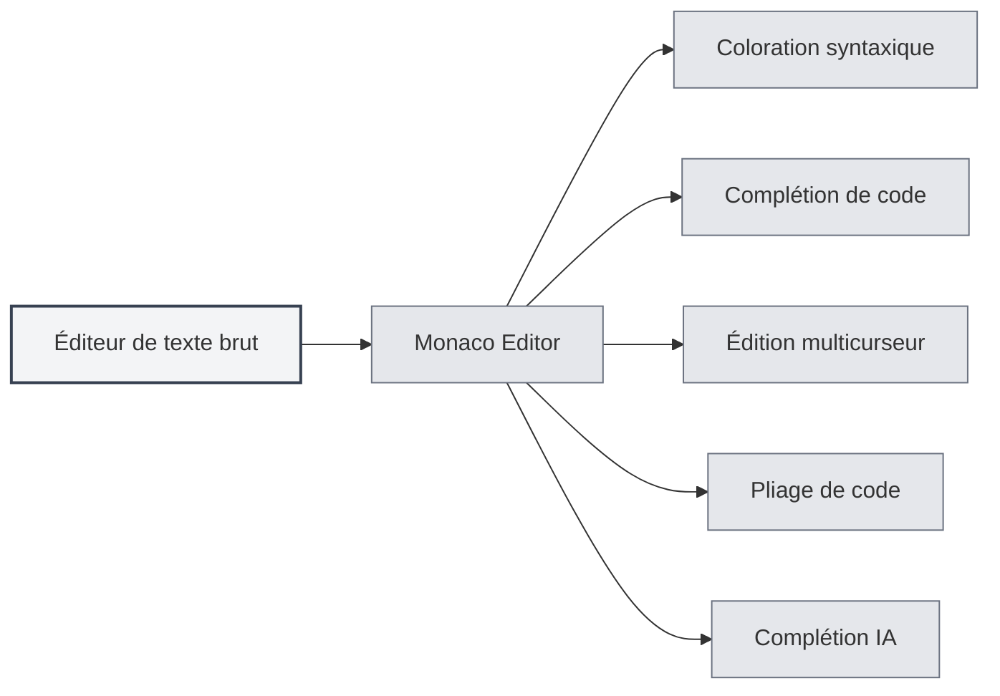
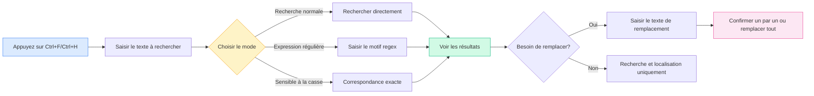

# Éditeur de texte brut

## Vue d'ensemble

L'éditeur de texte brut est utilisé pour modifier des fichiers texte brut et des fichiers de code. L'éditeur de texte brut de MetaDoc est basé sur Monaco Editor, offrant une expérience d'édition de code professionnelle avec des fonctionnalités telles que la coloration syntaxique, la complétion de code, la complétion IA, etc.

L'éditeur de texte brut prend en charge de nombreux formats de fichiers, y compris les fichiers de code (`.js`, `.py`, `.java`, etc.) et les fichiers de configuration (`.json`, `.yaml`, `.ini`, etc.). Il reconnaît automatiquement le langage en fonction de l'extension du fichier et applique la coloration syntaxique correspondante.

## Fonctionnalités de l'éditeur Monaco

<LaTeXEditorDemo mode="demo" />

<SearchReplaceMenu mode="demo" :position='{"top": 100, "left": 200}' :adapter='null' />

<MenuItemsDemo mode="demo" :items='[{"id": "file"}]' />

<ViewMenuItemsDemo mode="demo" :items='["editor", "outline"]' />

### Présentation de l'éditeur

L'éditeur de texte brut utilise Monaco Editor, qui présente les caractéristiques suivantes :

- **Édition de code professionnelle** : Offre une expérience d'édition similaire à Visual Studio Code
- **Coloration syntaxique** : Applique automatiquement la coloration syntaxique selon le type de fichier
- **Complétion de code** : Prend en charge la complétion intelligente de code
- **Édition multicurseur** : Permet l'édition simultanée avec plusieurs curseurs
- **Pliage de code** : Prend en charge le pliage des blocs de code

### Formats de fichiers pris en charge

L'éditeur de texte brut prend en charge les formats de fichiers suivants :

**Fichiers de code** :

- JavaScript/TypeScript : `.js`, `.jsx`, `.ts`, `.tsx`
- Python : `.py`
- Java : `.java`
- C/C++ : `.c`, `.cpp`, `.h`, `.hpp`
- C# : `.cs`
- Go : `.go`
- Rust : `.rs`
- Swift : `.swift`
- Kotlin : `.kt`
- Autres : `.php`, `.rb`, `.scala`, `.dart`, `.lua`, etc.

**Fichiers de configuration** :

- JSON : `.json`
- YAML : `.yaml`, `.yml`
- XML : `.xml`
- TOML : `.toml`
- INI : `.ini`, `.conf`
- SQL : `.sql`

**Fichiers de script** :

- Shell : `.sh`, `.bash`, `.zsh`
- PowerShell : `.ps1`
- Autres : `.vim`, `.diff`, `.patch`, `.log`

### Reconnaissance automatique du langage

L'éditeur reconnaît automatiquement le langage en fonction de l'extension du fichier :

- **Extension de fichier** : Sélectionne le mode de langage correspondant à l'extension
- **Coloration syntaxique** : Applique automatiquement les règles de coloration syntaxique appropriées
- **Complétion de code** : Active la fonction de complétion de code pour le langage correspondant

Si le fichier n'a pas d'extension ou si l'extension n'est pas reconnue, l'éditeur utilise le mode texte brut.

## Coloration syntaxique

### Coloration syntaxique

L'éditeur applique automatiquement la coloration syntaxique selon le type de fichier :

- **Coloration des mots-clés** : Les mots-clés du langage sont affichés avec des couleurs différentes
- **Coloration des chaînes** : Les chaînes de caractères sont affichées avec une couleur spécifique
- **Coloration des commentaires** : Les commentaires sont affichés en gris
- **Coloration des fonctions** : Les noms de fonctions sont affichés avec une couleur spécifique

La coloration syntaxique rend la structure du code plus claire, facilitant la lecture et l'édition.

### Synchronisation des thèmes

Le thème de coloration syntaxique suit le thème de l'éditeur :

- **Thème clair** : Utilise une coloration syntaxique claire sous le thème clair
- **Thème sombre** : Utilise une coloration syntaxique sombre sous le thème sombre
- **Synchronisation automatique** : Se synchronise automatiquement avec les paramètres de thème de l'éditeur

## Affichage des numéros de ligne

### Afficher les numéros de ligne

Les numéros de ligne sont affichés à gauche de l'éditeur, vous aidant à :

- **Localiser le code** : Atteindre rapidement une ligne spécifique
- **Référencer le code** : Faciliter la référence à des lignes de code spécifiques dans la documentation
- **Déboguer le code** : Localiser rapidement l'emplacement des erreurs

### Configurer les numéros de ligne

L'affichage des numéros de ligne peut être configuré dans les paramètres :

1. Ouvrez la page des paramètres
2. Dans la section "Paramètres de l'éditeur", trouvez "Affichage des numéros de ligne"
3. Basculez l'interrupteur pour activer ou désactiver les numéros de ligne

Le paramètre des numéros de ligne affecte tous les éditeurs Monaco (éditeur de texte brut, éditeur LaTeX, etc.).

<MenuItemsDemo mode="demo" :items='[{"id": "file", "items": ["new", "open", "save"]}]' />

<ViewMenuItemsDemo mode="demo" :items='["editor", "outline"]' />

<MainTabs mode="demo" />

<AISuggestionGhost mode="demo" />

<LaTeXEditorDemo mode="demo" />

## Aperçu du fichier et informations statistiques

### Statistiques du fichier

L'éditeur affiche des informations statistiques sur le fichier :

- **Nombre de caractères** : Affiche le nombre total de caractères du fichier
- **Nombre de lignes** : Affiche le nombre total de lignes du fichier
- **Nombre de mots** : Affiche le nombre total de mots du fichier (le cas échéant)

Les informations statistiques sont affichées dans la barre d'état ou au bas de l'éditeur.

### Aperçu du fichier

Lors de l'ouverture d'un fichier, l'éditeur :

- **Charge le contenu** : Charge rapidement le contenu du fichier
- **Applique la coloration** : Applique la coloration syntaxique selon le type de fichier
- **Affiche les statistiques** : Affiche les informations statistiques du fichier

### Détection du format de fichier

L'éditeur détecte automatiquement le format du fichier :

- **Détection par extension** : Identifie le format en fonction de l'extension du fichier
- **Détection par contenu** : Si l'extension n'est pas claire, tente d'identifier le format en fonction du contenu
- **Sélection manuelle** : Il est possible de sélectionner manuellement le format de fichier

## Fonctionnalité de complétion IA

### Complétion automatique IA

L'éditeur de texte brut prend en charge la fonction de complétion automatique IA :

- **Déclenchement automatique** : Se déclenche automatiquement après l'arrêt de la saisie
- **Déclenchement manuel** : Utilisez `Maj+Tab` pour déclencher manuellement la complétion
- **Complétion intelligente** : Génère des suggestions de complétion en fonction du contexte

La fonction de complétion IA peut vous aider à :

- **Générer du code** : Générer du code à partir de commentaires ou du contexte
- **Compléter des fonctions** : Compléter des définitions ou des appels de fonctions
- **Générer des commentaires** : Générer des commentaires pour le code

### Paramètres de complétion

Les paramètres de la complétion IA sont les mêmes que pour l'éditeur Markdown :

- **Activer/Désactiver** : Peut être activée ou désactivée dans les paramètres
- **Touche de déclenchement** : La touche de déclenchement peut être configurée (Entrée, Espace, `;`, `,`)
- **Mode de complétion** : Peut choisir entre génération complète ou partielle
- **Nombre maximum de tokens** : Peut définir le nombre maximum de tokens pour la complétion

Voir [[ai.completion|Complétion automatique IA]] pour plus de détails.

## Fonctionnalités de l'éditeur

### Pliage de code

L'éditeur prend en charge le pliage des blocs de code :

- **Plier un bloc de code** : Cliquez sur l'icône de pliage à gauche du numéro de ligne
- **Déplier un bloc de code** : Cliquez sur le marqueur de pliage pour le déplier
- **Raccourcis clavier** : `Ctrl+Shift+[` pour plier, `Ctrl+Shift+]` pour déplier

Le pliage de code vous permet de vous concentrer sur la partie que vous êtes en train de modifier.

### Rechercher et remplacer

L'éditeur prend en charge une fonction puissante de recherche et remplacement, vous aidant à localiser et modifier rapidement du contenu dans le code :

**Opérations de base** :

- **Rechercher** : `Ctrl+F` ouvre la boîte de dialogue de recherche, saisissez le texte à rechercher
- **Remplacer** : `Ctrl+H` ouvre la boîte de dialogue de recherche et remplacement, saisissez le texte à rechercher et le texte de remplacement
- **Remplacer un par un** : Remplacer après confirmation pour chaque occurrence
- **Remplacer tout** : Remplacer toutes les occurrences en une fois

**Options avancées** :

- **Expressions régulières** : Utiliser des expressions régulières pour des correspondances de motifs complexes
- **Respect de la casse** : Recherche sensible à la casse
- **Mot entier** : Ne correspondre qu'aux mots complets

**Cas d'utilisation** :

- Modifier des noms de variables en lot
- Rechercher des appels de fonctions spécifiques
- Remplacer des chaînes dans le code
- Effectuer des remplacements complexes avec des expressions régulières

L'interface du panneau de recherche et remplacement est la suivante :

<SearchReplaceMenu mode="demo" :position='{"top": 100, "left": 200}' :adapter='null' />

### Édition multicurseur

L'éditeur prend en charge l'édition simultanée avec plusieurs curseurs :

- **Ajouter un curseur** : `Alt+clic` ajoute un nouveau curseur à l'emplacement du clic
- **Ajouter un curseur au-dessus** : `Ctrl+Alt+↑` ajoute un curseur au-dessus
- **Ajouter un curseur en dessous** : `Ctrl+Alt+↓` ajoute un curseur en dessous
- **Sélectionner le même mot** : `Ctrl+D` sélectionne le prochain mot identique

L'édition multicurseur permet de modifier plusieurs positions simultanément, améliorant l'efficacité de l'édition.

## Astuces d'utilisation

<LaTeXEditorDemo mode="demo" />

<ConsoleTerminal mode="demo" consoleKey="plaintext" :history='[]' />

### Édition efficace

1. **Utiliser les raccourcis clavier** : Maîtriser les raccourcis clavier courants pour améliorer l'efficacité de l'édition
2. **Utiliser le pliage de code** : Plier les blocs de code dont vous n'avez pas besoin de voir le contenu
3. **Utiliser les curseurs multiples** : Utiliser plusieurs curseurs pour éditer plusieurs positions en même temps

### Complétion de code

1. **Activer la complétion IA** : Activer la fonction de complétion IA pour obtenir des suggestions intelligentes
2. **Utiliser le déclenchement manuel** : Utiliser `Maj+Tab` pour déclencher manuellement la complétion lorsque nécessaire
3. **Ajuster les paramètres** : Ajuster les paramètres de complétion selon vos besoins

### Gestion des fichiers

1. **Reconnaître le format** : S'assurer que l'extension du fichier est correcte pour une reconnaissance automatique du format
2. **Consulter les statistiques** : Consulter les informations statistiques du fichier pour connaître sa taille
3. **Sauvegarder le fichier** : Sauvegarder le fichier régulièrement pour éviter de perdre les modifications

## Questions fréquentes

### Q : La coloration syntaxique est incorrecte ?

R : Vérifiez que l'extension du fichier est correcte. Si l'extension est incorrecte, l'éditeur peut ne pas reconnaître le type de fichier. Vous pouvez sélectionner manuellement le format de fichier.

### Q : La complétion de code ne s'affiche pas ?

R : Assurez-vous que la fonction de complétion IA est activée. Certains types de fichiers peuvent ne pas prendre en charge la complétion de code.

### Q : Comment changer le format de fichier ?

R : Le format de fichier est automatiquement reconnu en fonction de l'extension du fichier. Si vous devez le modifier, vous pouvez renommer le fichier ou sélectionner manuellement le format.

### Q : Les numéros de ligne ne s'affichent pas ?

R : Vérifiez si l'option "Affichage des numéros de ligne" est activée dans les paramètres. Le paramètre des numéros de ligne affecte tous les éditeurs Monaco.

### Q : Le fichier est trop volumineux pour être édité ?

R : Pour les fichiers très volumineux, l'éditeur peut limiter certaines fonctionnalités. Il est recommandé d'utiliser un éditeur de texte spécialisé pour traiter les fichiers extrêmement volumineux.

## Documentation associée

- [[core.editor-basics|Opérations de base de l'éditeur]]
- [[core.editor-settings|Paramètres de l'éditeur]]
- [[latex.editor|Guide d'utilisation de l'éditeur LaTeX]]
- [[ai.completion|Complétion automatique IA]]
