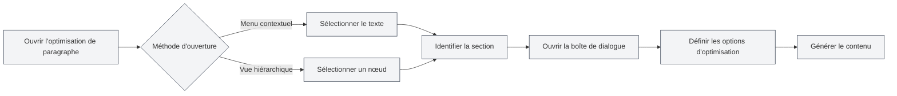

# Fonction d'optimisation de paragraphe

## Vue d'ensemble

La fonction d'optimisation de paragraphe vous permet d'utiliser l'IA pour optimiser des paragraphes ou sections spécifiques dans un document. Vous pouvez ouvrir la fonction d'optimisation de paragraphe depuis le menu contextuel ou la vue hiérarchique pour générer ou optimiser le contenu d'un paragraphe.

## Ouvrir l'optimisation de paragraphe

### Ouvrir depuis le menu contextuel

Vous pouvez ouvrir l'optimisation de paragraphe par un clic droit dans l'éditeur :

1. **Sélectionner le texte** : Sélectionnez le texte à optimiser dans l'éditeur.
2. **Menu contextuel** : Faites un clic droit sur le texte sélectionné.
3. **Choisir l'optimisation** : Sélectionnez "Optimisation de paragraphe" ou une option similaire dans le menu contextuel.
4. **Ouvrir la boîte de dialogue** : La boîte de dialogue d'optimisation de paragraphe s'ouvre.

### Ouvrir depuis la hiérarchie

Vous pouvez ouvrir l'optimisation de paragraphe depuis la vue hiérarchique :

1. **Sélectionner un nœud** : Sélectionnez le nœud à optimiser dans l'arborescence hiérarchique.
2. **Menu contextuel** : Faites un clic droit sur le nœud.
3. **Choisir l'optimisation** : Sélectionnez "Optimisation de paragraphe" ou une option similaire dans le menu contextuel.
4. **Ouvrir la boîte de dialogue** : La boîte de dialogue d'optimisation de paragraphe s'ouvre.

Vous pouvez accéder à la vue hiérarchique via la barre latérale :

<ViewMenuItemsDemo mode="demo" :items='["outline"]' />

<ViewMenuItemsDemo mode="demo" :items='["chat"]' />

<AIChat mode="demo" />

L'interface de l'optimiseur de paragraphe est la suivante :

<SectionOptimizer mode="demo" title="Exemple de section" path="1" :tree='{"text": "Exemple de section", "children": []}' language="markdown" :adapter='null' />

### Identification automatique de la section

L'optimisation de paragraphe identifie automatiquement la section actuelle :

- **Position du curseur** : Identifie la section actuelle en fonction de la position du curseur.
- **Texte sélectionné** : Si du texte est sélectionné, utilise le texte sélectionné.
- **Nœud hiérarchique** : Si ouvert depuis la hiérarchie, utilise le nœud hiérarchique correspondant.

## Options d'optimisation

### Mode d'optimisation

Vous pouvez choisir différents modes d'optimisation :

- **Générer du contenu** : Génère un nouveau contenu de paragraphe.
- **Optimiser le contenu** : Optimise le contenu existant du paragraphe.
- **Ajouter du contenu** : Ajoute du nouveau contenu après le contenu existant.
- **Remplacer le contenu** : Remplace le contenu existant du paragraphe.

### Mode de contexte

Vous pouvez choisir le mode de contexte :

- **Contexte du document entier** : Utilise l'ensemble du document comme contexte.
- **Contexte de la section** : Utilise uniquement la section actuelle comme contexte.
- **Pas de contexte** : N'utilise pas d'informations contextuelles.

### Invite personnalisée

Vous pouvez saisir une invite personnalisée :

- **Objectif d'optimisation** : Décrit l'objectif de l'optimisation.
- **Exigences de contenu** : Spécifie les exigences de contenu.
- **Exigences de style** : Définit le style d'écriture.

### Invites prédéfinies

Vous pouvez utiliser des invites prédéfinies :

- **Étendre le contenu** : Étend le contenu du paragraphe.
- **Simplifier le contenu** : Simplifie le contenu du paragraphe.
- **Reformuler le contenu** : Reformule le contenu du paragraphe.
- **Compléter le contenu** : Complète le contenu du paragraphe.

## Générer du contenu

### Processus de génération

Le processus de génération de contenu :

1. **Analyser la section** : Analyse la structure et le contenu de la section actuelle.
2. **Construire l'invite** : Construit l'invite d'optimisation en fonction des options.
3. **Appeler l'IA** : Appelle l'IA pour générer le contenu optimisé.
4. **Afficher le résultat** : Affiche le contenu généré dans la boîte de dialogue.

### Résultat de la génération

Le contenu généré s'affiche dans la boîte de dialogue :

- **Aperçu du contenu** : Vous pouvez prévisualiser le contenu généré.
- **Modifier le contenu** : Vous pouvez modifier le contenu généré.
- **Appliquer le contenu** : Vous pouvez appliquer le contenu au document.

### Options de génération

Vous pouvez définir des options lors de la génération :

- **Sortie en flux continu** : Affiche le processus de génération en temps réel.
- **Génération en une fois** : Attend la fin de la génération avant d'afficher.
- **Annuler la génération** : Vous pouvez annuler le processus de génération à tout moment.

## Appliquer le contenu

### Méthode d'application

Vous pouvez appliquer le contenu généré au document :

- **Remplacer** : Remplace le contenu original du paragraphe.
- **Insérer** : Insère le contenu à une position spécifiée.
- **Ajouter** : Ajoute le contenu à la fin du paragraphe.

### Position d'application

Vous pouvez spécifier la position d'application :

- **Position actuelle** : Applique à la position actuelle du curseur.
- **Début de la section** : Applique au début de la section.
- **Fin de la section** : Applique à la fin de la section.

## Fonction de conversation

### Continuer la conversation

Vous pouvez continuer la conversation après avoir généré du contenu :

1. **Ouvrir la conversation** : Cliquez sur le bouton "Continuer la conversation".
2. **Entrer dans la conversation** : Accédez à l'interface de conversation IA.
3. **Continuer l'optimisation** : Vous pouvez continuer à optimiser ou modifier le contenu.

### Contexte de la conversation

La conversation inclut le contexte suivant :

- **Contenu original** : Le contenu original du paragraphe.
- **Contenu généré** : Le contenu généré.
- **Historique d'optimisation** : L'historique des optimisations.

## Bonnes pratiques

1. **Définir un objectif clair** : Clarifiez l'objectif d'optimisation, utilisez des invites précises.
2. **Choisir le contexte** : Sélectionnez le mode de contexte approprié selon la situation.
3. **Prévisualiser le contenu** : Prévisualisez le contenu après génération pour vous assurer qu'il répond aux exigences.
4. **Modifier et ajuster** : Vous pouvez éditer et ajuster davantage après la génération.
5. **Optimisations multiples** : Vous pouvez optimiser plusieurs fois pour perfectionner progressivement le contenu.

## Points à noter

1. **Identification de la section** : Assurez-vous que la section est correctement identifiée pour éviter d'optimiser le mauvais contenu.
2. **Utilisation du contexte** : Utilisez le contexte de manière raisonnable pour éviter un contenu trop long.
3. **Qualité du contenu** : Le contenu généré nécessite une vérification et un ajustement manuels.
4. **Consommation de tokens** : La fonction d'optimisation consomme des tokens, surveillez l'utilisation.
5. **Sauvegarder le document** : N'oubliez pas de sauvegarder le document après avoir appliqué le contenu.

## Documentation associée

- [[outline.basics|Fonction de vue hiérarchique]]
- [[ai.chat|Fonction de conversation IA]]
- [[ai.completion|Fonction de complétion automatique IA]]

<Outline mode="demo" />

<CompletionSettingsPanel mode="demo" />

<MenuItemsDemo mode="demo" :items='[{"id": "ai"}]' />

<ViewMenuItemsDemo mode="demo" :items='["chat"]' />