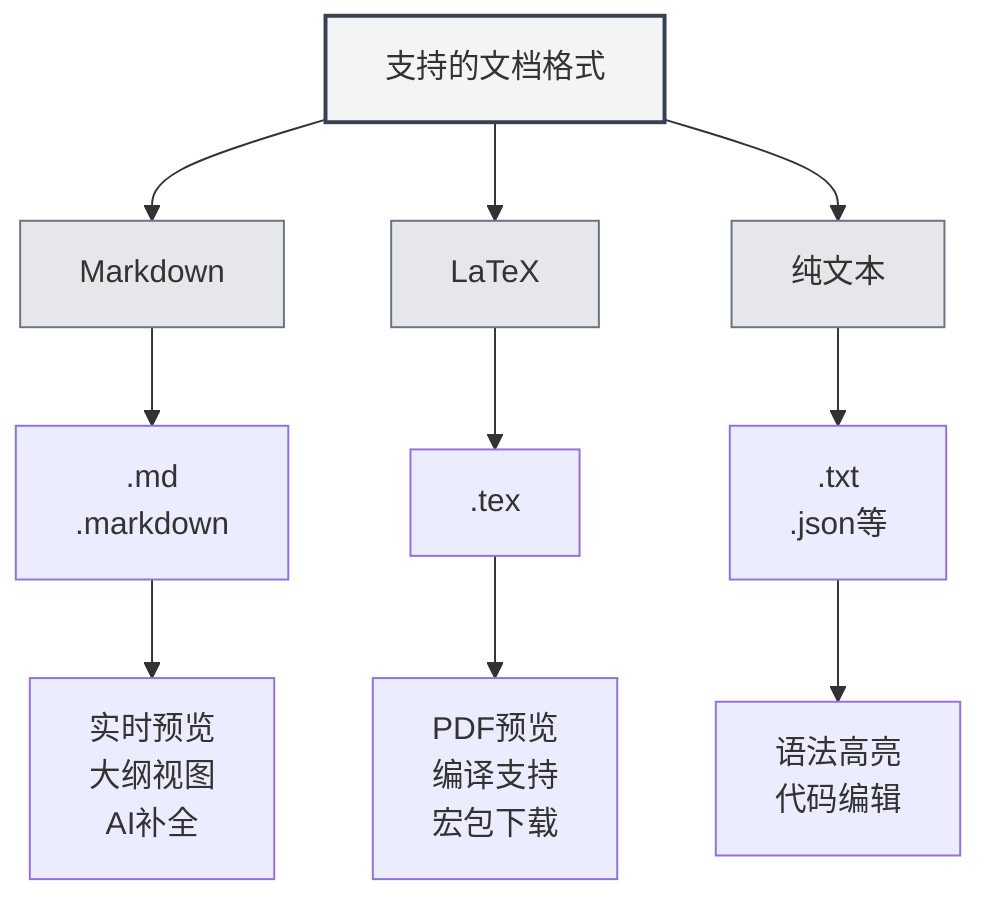

# Formats de documents pris en charge

## Vue d'ensemble

MetaDoc prend en charge plusieurs formats de documents, notamment Markdown, LaTeX et le format texte brut. Le système détecte automatiquement le format des fichiers et permet également une sélection manuelle du format.

<MenuItemsDemo mode="demo" :items='[{"id": "file"}]' />

<MenuItemsDemo mode="demo" :items='[{"id": "edit"}]' />

<MenuItemsDemo mode="demo" :items='[{"id": "view"}]' />

<ViewMenuItemsDemo mode="demo" :items='["home", "outline", "chat"]' />

<MainTabs mode="demo" />

<QuickStartPanel mode="demo" />

<QuickStartMarkdown mode="demo" />

<QuickStartLatex mode="demo" />

## Formats pris en charge

### Format Markdown

**Extensions de fichier** : `.md`, `.markdown`

**Caractéristiques** :

- Prise en charge de la syntaxe Markdown standard
- Prise en charge des syntaxes étendues (tableaux, blocs de code, formules mathématiques, etc.)
- Prise en charge de la prévisualisation en temps réel
- Prise en charge de la vue hiérarchique (plan)
- Prise en charge de la complétion par IA

**Cas d'utilisation** :

- Rédaction de documentation technique
- Création d'articles de blog
- Prise de notes
- Rédaction de documents

### Format LaTeX

**Extension de fichier** : `.tex`

**Caractéristiques** :

- Format professionnel pour la rédaction d'articles académiques
- Prise en charge des formules mathématiques, tableaux, graphiques
- Prévisualisation PDF en temps réel
- Prise en charge du téléchargement automatique des packages
- Prise en charge des indications d'erreurs de compilation

**Cas d'utilisation** :

- Rédaction d'articles académiques
- Rédaction de rapports techniques
- Mise en page de livres
- Mise en page de documents complexes

### Format texte brut

**Extensions de fichier** : `.txt`, `.json`, etc.

**Caractéristiques** :

- Édition de texte simple
- Prise en charge de la coloration syntaxique
- Fonctionnalités d'édition de code
- Pas de prévisualisation ni de vue hiérarchique

**Cas d'utilisation** :

- Édition de fichiers de code
- Édition de fichiers de configuration
- Édition de texte simple
- Édition de fichiers de données

## Détection du format de fichier

### Détection automatique

MetaDoc détecte automatiquement le format des fichiers :

1. **Détection par extension** : Le format est détecté en priorité selon l'extension du fichier

   - `.md`, `.markdown` → Format Markdown
   - `.tex` → Format LaTeX
   - `.txt`, `.json`, etc. → Format texte brut

2. **Détection par contenu** : Si l'extension ne permet pas de déterminer le format, le contenu du fichier est analysé

   - Le contenu LaTeX est prioritairement identifié comme format LaTeX
   - Les autres contenus sont identifiés par défaut comme format Markdown

3. **Format par défaut** : Si la détection est impossible, le format Markdown est utilisé par défaut

### Priorité de détection

La détection de format suit la priorité suivante :

1. **Extension du fichier** : Utilisation prioritaire de la détection par extension
2. **Contenu du fichier** : Si l'extension est indéterminée, analyse du contenu
3. **Format par défaut** : Utilisation du format par défaut en cas d'échec de détection

### Règles de détection

- **Détection Markdown** : Identifié comme Markdown lorsque l'extension est `.md` ou `.markdown`
- **Détection LaTeX** : Identifié comme LaTeX lorsque l'extension est `.tex` ou que le contenu contient des commandes LaTeX
- **Détection texte brut** : Identifié comme texte brut pour les autres extensions ou en cas d'indétermination

## Sélection manuelle du format

### Sélection lors de l'ouverture d'un fichier

Il est possible de choisir manuellement le format lors de l'ouverture d'un fichier :

1. **Boîte de dialogue d'ouverture** : Dans la boîte de dialogue d'ouverture de fichier
2. **Sélection du format** : Choisir le format de fichier (si la détection automatique est incorrecte)
3. **Confirmer l'ouverture** : Ouvrir le fichier dans le format sélectionné après confirmation

### Sélection lors de la création d'un fichier

Il est possible de choisir le format lors de la création d'un nouveau fichier :

1. **Nouveau document** : Cliquer sur le bouton "Nouveau document"
2. **Choisir le format** : Sélectionner le format dans la boîte de dialogue de choix de format
3. **Créer le document** : Créer un document du format spécifié

### Changer de format

Il est possible de changer le format d'un document déjà ouvert :

1. **Ouvrir le document** : Ouvrir le document dont on souhaite changer le format
2. **Menu Format** : Trouver l'option de changement de format dans le menu
3. **Choisir le format** : Sélectionner le nouveau format
4. **Confirmer le changement** : Confirmer le changement de format

**Remarques** :

- Le changement de format peut affecter le contenu du document
- Certaines fonctionnalités spécifiques à un format peuvent ne pas être converties
- Il est recommandé de sauvegarder le document avant de changer de format

## Comparaison des caractéristiques des formats

### Fonctionnalités prises en charge

| Fonctionnalité | Markdown | LaTeX    | Texte brut |
| -------------- | -------- | -------- | ---------- |
| Prévisualisation en temps réel | ✅       | ✅ (PDF) | ❌         |
| Vue hiérarchique (plan) | ✅       | ✅       | ❌         |
| Complétion par IA | ✅       | ✅       | ✅         |
| Formules mathématiques | ✅       | ✅       | ❌         |
| Prise en charge des tableaux | ✅       | ✅       | ❌         |
| Coloration syntaxique du code | ✅       | ✅       | ✅         |
| Prise en charge des métadonnées | ✅       | ✅       | ❌         |

### Caractéristiques de l'éditeur

| Caractéristique | Markdown | LaTeX | Texte brut |
| --------------- | -------- | ----- | ---------- |
| Coloration syntaxique | ✅       | ✅    | ✅         |
| Complétion automatique | ✅       | ✅    | ✅         |
| Indication d'erreurs | ✅       | ✅    | ❌         |
| Fonction de repli (folding) | ✅       | ✅    | ✅         |
| Édition multicurseur | ✅       | ✅    | ✅         |

## Conversion de format

### Formats d'export

Il est possible d'exporter un document vers d'autres formats :

- **Markdown → PDF** : Exporter en document PDF
- **Markdown → HTML** : Exporter en document HTML
- **Markdown → DOCX** : Exporter en document Word
- **LaTeX → PDF** : Compiler en document PDF
- **LaTeX → Markdown** : Convertir en format Markdown

### Remarques sur la conversion

Lors de la conversion de format, il faut noter :

- **Compatibilité du contenu** : Certaines fonctionnalités spécifiques à un format peuvent ne pas être converties
- **Perte de style** : Une partie du style peut être perdue après conversion
- **Ajustement du contenu** : Le contenu peut nécessiter des ajustements manuels après conversion

## Bonnes pratiques

1. **Choisir le format approprié** : Sélectionner le format adapté au type de document
2. **Utiliser des extensions standard** : Utiliser des extensions de fichier standard pour faciliter la détection automatique
3. **Cohérence de format** : Utiliser un format uniforme pour un même projet
4. **Sauvegarder les documents** : Sauvegarder le document original avant toute conversion de format
5. **Tester la conversion** : Vérifier que le contenu est correct après conversion

## Remarques importantes

1. **Détection de format** : La détection automatique peut être inexacte, une sélection manuelle est possible
2. **Changement de format** : Changer de format peut affecter le contenu du document
3. **Compatibilité** : Les fonctionnalités prises en charge diffèrent selon les formats
4. **Extension de fichier** : Il est recommandé d'utiliser des extensions standard
5. **Conversion de format** : La conversion peut entraîner la perte d'une partie du contenu ou du style

## Documents connexes

- [[markdown.basics|Syntaxe Markdown]]
- [[latex.basics|Syntaxe LaTeX]]
- [[editor.plain-text|Éditeur de texte brut]]
- [[core.file-operations|Opérations sur les fichiers]]