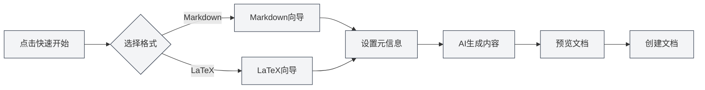

# Fonctionnalités de la page d'accueil

## Vue d'ensemble

La page d'accueil est l'interface d'entrée de MetaDoc, offrant des fonctionnalités telles que Démarrer rapidement, Nouveau document, Ouvrir un fichier, etc. Conçue pour être simple et esthétique, elle vous aide à commencer à utiliser MetaDoc rapidement.

## Démarrer rapidement

### Assistant de démarrage rapide

Cliquez sur le bouton "Démarrer rapidement" pour lancer l'assistant de démarrage rapide :

1.  **Choisir le format** : Sélectionnez le format du document (Markdown ou LaTeX)
2.  **Définir les métadonnées** : Saisissez le titre du document, l'auteur, etc.
3.  **Générer du contenu avec l'IA** : Utilisez l'assistance IA pour générer le contenu du document
4.  **Aperçu du document** : Visualisez le contenu généré du document
5.  **Créer le document** : Confirmez pour créer le document

L'interface de sélection de format de l'assistant de démarrage rapide est la suivante :

<QuickStartPanel mode="demo" />

### Démarrage rapide Markdown

Après avoir sélectionné le format Markdown :

-   **Choix du modèle** : Vous pouvez sélectionner un modèle Markdown
-   **Génération de contenu** : L'IA peut générer du contenu Markdown
-   **Édition rapide** : Commencez à éditer immédiatement après la création

L'interface de l'assistant après avoir choisi Markdown :

<QuickStartMarkdown mode="demo" />

### Démarrage rapide LaTeX

Après avoir sélectionné le format LaTeX :

-   **Type de document** : Vous pouvez choisir le type de document (article, livre, etc.)
-   **Génération de contenu** : L'IA peut générer du contenu LaTeX
-   **Compilation et aperçu** : Après création, vous pouvez compiler et prévisualiser le PDF

L'interface de l'assistant après avoir choisi LaTeX :

<QuickStartLatex mode="demo" />

## Nouveau document

### Créer un document vierge

Cliquez sur le bouton "Nouveau document" pour créer rapidement un document vierge :

1.  Cliquez sur le bouton "Nouveau document"
2.  Sélectionnez le format du document (Markdown/LaTeX/texte brut)
3.  Le document s'ouvre dans un nouvel onglet

**Raccourci clavier** : Vous pouvez également utiliser `Ctrl+N` (Windows/Linux) ou `Cmd+N` (macOS) pour créer rapidement.

## Ouvrir un fichier

### Ouvrir un fichier existant

Cliquez sur le bouton "Ouvrir un fichier" pour ouvrir un fichier existant :

1.  Cliquez sur le bouton "Ouvrir un fichier"
2.  Sélectionnez un fichier dans la boîte de dialogue de sélection de fichiers
3.  Le fichier s'ouvre dans un nouvel onglet

**Raccourci clavier** : Vous pouvez également utiliser `Ctrl+O` (Windows/Linux) ou `Cmd+O` (macOS) pour ouvrir rapidement.

### Formats de fichiers pris en charge

-   **Markdown** (.md)
-   **LaTeX** (.tex)
-   **Texte brut** (.txt)
-   **JSON** (.json)

## Manuel d'utilisation

### Ouvrir le manuel d'utilisation

Cliquez sur le bouton "Manuel d'utilisation" pour ouvrir le manuel :

1.  Cliquez sur le bouton "Manuel d'utilisation"
2.  Le manuel d'utilisation s'ouvre dans un nouvel onglet
3.  Vous pouvez parcourir et apprendre les différentes fonctionnalités

**Raccourci clavier** : Vous pouvez également appuyer sur la touche `F1` pour ouvrir rapidement le manuel d'utilisation.

## Liste des documents récents

### Consulter les documents récents

La page d'accueil affiche la liste des documents ouverts récemment :

-   **Nombre affiché** : Affiche jusqu'à 12 documents récents maximum
-   **Carte de document** : Chaque document est affiché sous forme de carte
-   **Ouverture rapide** : Cliquez sur une carte pour ouvrir rapidement le document

### Actions sur les documents récents

-   **Ouvrir un document** : Cliquez sur la carte du document pour l'ouvrir
-   **Supprimer l'entrée** : Cliquez sur le bouton de suppression sur la carte pour supprimer l'entrée
-   **Menu contextuel** : Un clic droit sur la carte peut offrir plus d'options

### Gestion des documents récents

-   **Mise à jour automatique** : La liste se met à jour automatiquement après l'ouverture d'un document
-   **Sauvegarde des entrées** : Les entrées des documents récents sont sauvegardées
-   **Tri de la liste** : Triée par ordre décroissant de date d'ouverture

## Boîte de dialogue du profil utilisateur

### Ouvrir le profil utilisateur

La page d'accueil peut afficher une boîte de dialogue de profil utilisateur :

-   **Première utilisation** : Peut inviter à configurer le profil utilisateur lors de la première utilisation
-   **Configuration du profil** : Permet de définir le profil utilisateur et les préférences d'utilisation
-   **Optimisation IA** : Le profil utilisateur peut aider l'IA à mieux comprendre vos besoins

### Contenu du profil utilisateur

Le profil utilisateur peut inclure :

-   **Informations de base** : Nom, profession, etc.
-   **Préférences d'utilisation** : Habitudes d'édition, fonctionnalités fréquemment utilisées, etc.
-   **Profil utilisateur** : Aide l'IA à comprendre votre contexte d'utilisation

## Interface de la page d'accueil

### Disposition de l'interface

La page d'accueil utilise une disposition centrée :

-   **Haut** : Titre et sous-titre de MetaDoc
-   **Milieu** : Zone des boutons d'action
-   **Bas** : Liste des documents récents

### Conception visuelle

La page d'accueil adopte un design moderne et épuré :

-   **Arrière-plan dynamique** : Effet d'animation d'arrière-plan dynamique
-   **Décoration en grille** : Décoration en grille minimaliste
-   **Design en cartes** : Les boutons d'action utilisent un design en cartes

## Bonnes pratiques

1.  **Démarrer rapidement** : Lors de la première utilisation, il est recommandé d'utiliser l'assistant de démarrage rapide
2.  **Raccourcis clavier** : Maîtrisez les raccourcis clavier pour améliorer l'efficacité
3.  **Documents récents** : Utilisez la liste des documents récents pour accéder rapidement aux documents fréquents
4.  **Profil utilisateur** : Configurez votre profil utilisateur pour une meilleure expérience avec l'IA
5.  **Manuel d'utilisation** : Consultez le manuel d'utilisation en cas de problème

## Points à noter

1.  **Affichage de la page d'accueil** : La page d'accueil ne s'affiche que lorsqu'aucun document n'est ouvert
2.  **Démarrer rapidement** : L'assistant de démarrage rapide peut être fermé à tout moment
3.  **Documents récents** : La liste des documents récents affiche au maximum 12 entrées
4.  **Profil utilisateur** : La configuration du profil utilisateur est facultative
5.  **Langue de l'interface** : La langue de l'interface de la page d'accueil suit les paramètres de langue du système

## Documents associés

-   [[quick-start.guide|Guide de démarrage rapide]]
-   [[core.file-operations|Opérations sur les fichiers]]
-   [[user.profile|Profil utilisateur]]
-   [[views.types|Types de vues]]

<MenuItemsDemo mode="demo" :items='[{"id": "file"}]' />

<MenuItemsDemo mode="demo" :items='[{"id": "edit"}]' />

<MenuItemsDemo mode="demo" :items='[{"id": "view"}]' />

<ViewMenuItemsDemo mode="demo" :items='["home", "outline", "chat", "agent"]' />

<MainTabs mode="demo" />

<UserProfileView mode="demo" />