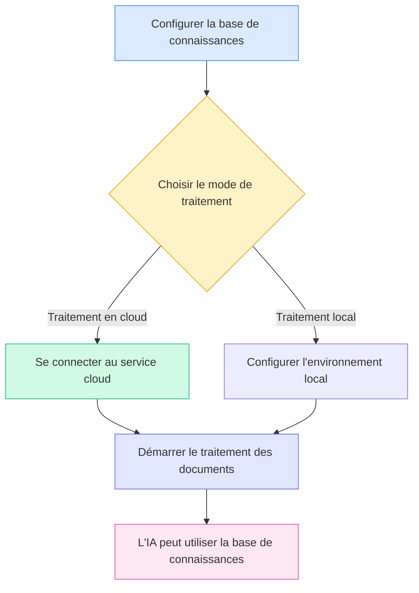
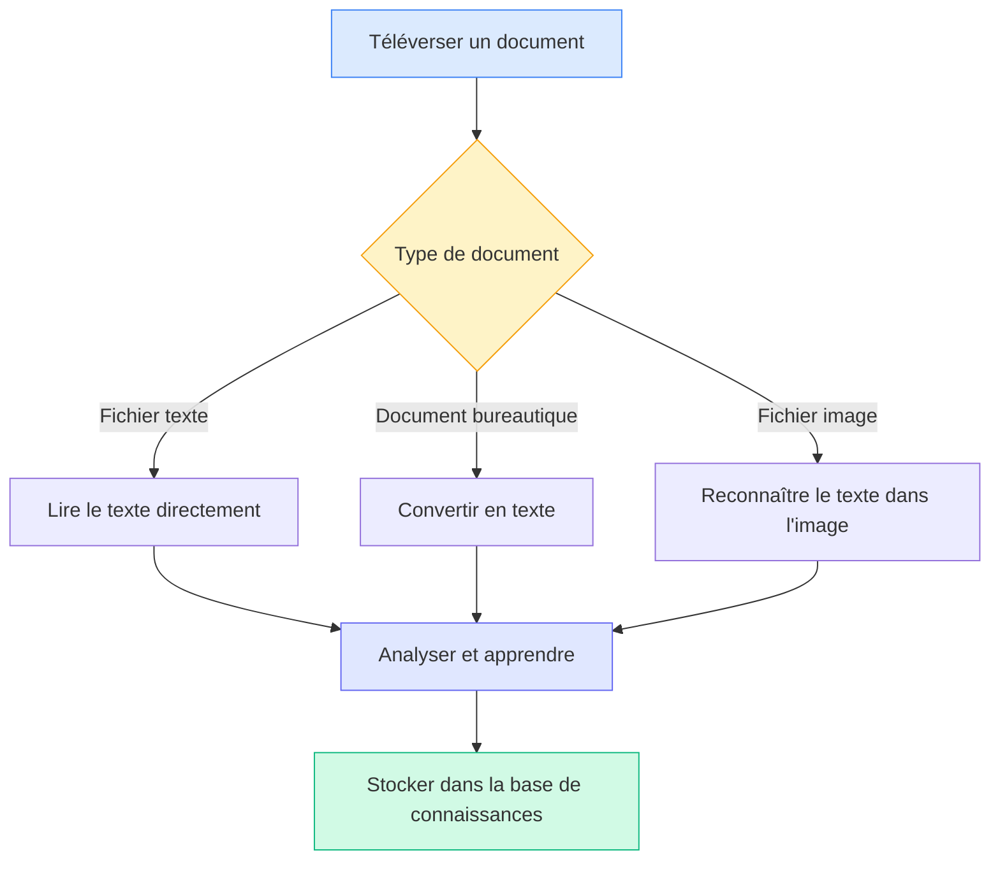
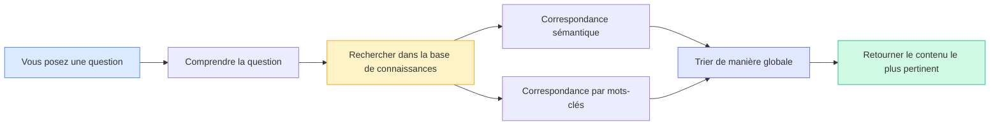

# Configuration de la base de connaissances

## Vue d'ensemble

La base de connaissances est le système de gestion intelligente des documents de MetaDoc. En "apprenant" vos documents dans la base de connaissances, l'IA peut comprendre et référencer ce contenu, vous fournissant ainsi des réponses et des suggestions plus précises.

Ce guide vous aidera à configurer la base de connaissances pour qu'elle vous serve au mieux.

## Activer la fonctionnalité de base de connaissances

Sur la page des paramètres de la base de connaissances, vous devez d'abord activer la fonctionnalité :

1.  Trouvez l'interrupteur "Activer la base de connaissances"
2.  Basculez l'interrupteur sur la position "Activé"
3.  Configurez les paramètres associés à la base de connaissances

Vous pouvez accéder à la gestion de la base de connaissances via la barre de menu supérieure :

<KnowledgeBase mode="demo" />

L'illustration ci-dessus montre les principales zones fonctionnelles de l'interface de gestion de la base de connaissances :

-   **Panneau de gauche** : Liste des bases de connaissances et fonction de recherche
-   **Zone centrale** : Liste des documents ajoutés
-   **Détails à droite** : Informations détaillées et état de traitement du document sélectionné
-   **Barre d'outils en bas** : Boutons d'action pour ajouter un document, démarrer le traitement, supprimer, etc.

## Choisir le mode de traitement

### Présentation des deux modes

MetaDoc propose deux modes de traitement des documents :

**Traitement en cloud (recommandé)**

-   Envoie les documents au service cloud pour analyse
-   Traitement rapide, n'utilise pas de ressources locales
-   Nécessite une connexion Internet

**Traitement local (en développement)**

-   Traite les documents directement sur votre ordinateur
-   Les données restent entièrement locales, préservant la confidentialité
-   Nécessite une configuration informatique plus puissante

La version actuelle ne prend en charge que le mode de traitement en cloud. Vous pouvez le sélectionner dans les paramètres :

<MenuItemsDemo mode="demo" :items='[{"id": "settings"}]' />

### Avantages du traitement en cloud

Pour la plupart des utilisateurs, nous recommandons le traitement en cloud :

-   **Prise en main rapide** : Aucune configuration complexe d'environnement local nécessaire
-   **Gain de temps** : Plus rapide pour traiter de grands volumes de documents
-   **Économie de ressources** : N'utilise pas la mémoire vive ni le processeur de votre ordinateur
-   **Maintenance simple** : Mises à jour automatiques, pas de gestion manuelle

### Quand opter pour le traitement local

Si vous avez les besoins suivants, vous pouvez attendre la disponibilité de la fonctionnalité de traitement local :

-   Traiter des documents confidentiels hautement sensibles
-   Travailler fréquemment dans des environnements sans réseau
-   Posséder une configuration informatique performante (avec carte graphique dédiée)
-   Devoir traiter une quantité massive de documents (plus de 10 Go)

<SettingKnowledgeBaseSection mode="demo" />

## Comprendre le fonctionnement de la base de connaissances

### Comment les documents sont "appris"

<RAGToolDisplay mode="demo" />

Lorsque vous ajoutez un document à la base de connaissances, MetaDoc exécute les étapes suivantes :

1.  **Lire le contenu du document**

    -   Extrait le texte des formats PDF, Word, images, etc.
    -   Préserve la structure et les informations de formatage du document

2.  **Comprendre la signification du document**

    -   Convertit le texte en une "représentation sémantique" compréhensible par l'IA
    -   C'est comme ajouter des étiquettes intelligentes au document

3.  **Construire un index**

    -   Crée un index pour une recherche rapide
    -   Permet à l'IA de trouver le contenu pertinent en un instant

4.  **Stocker les connaissances**
    -   Enregistre les résultats du traitement dans la base de données locale
    -   Peut être appelé à tout moment

<KnowledgeBase mode="demo" />

## Types de documents pris en charge

### Formats pouvant être traités directement

La base de connaissances MetaDoc prend en charge de nombreux formats de documents courants :

**Documents texte**

-   Documents Markdown (.md) – Format privilégié pour la documentation technique
-   Documents LaTeX (.tex) – Format couramment utilisé pour les articles académiques
-   Fichiers texte brut (.txt) – Enregistrements textuels simples

**Documents bureautiques**

-   Fichiers PDF (.pdf) – Format de document le plus universel
-   Documents Word (.docx) – Format Microsoft Office

**Images**

-   Images PNG (.png) – Captures d'écran, diagrammes
-   Images JPEG (.jpg, .jpeg) – Photos, documents scannés

### Modes de traitement selon le type de document

MetaDoc traite les différents types de documents de manières distinctes :

**Documents texte** (Markdown, LaTeX, TXT)

-   Lecture directe du contenu textuel
-   Préservation de la structure des titres et du formatage
-   Traitement le plus rapide

**Documents bureautiques** (PDF, Word)

-   Conversion préalable en texte brut
-   Extraction de la structure (titres, paragraphes, etc.)
-   Préservation de la hiérarchie logique du document

**Documents image** (PNG, JPG)

-   Utilisation de la technologie OCR pour reconnaître le texte dans l'image
-   Adapté au traitement de documents papier scannés
-   Temps de traitement relativement plus long

<RAGToolDisplay mode="demo" />

## Mécanisme de recherche intelligente

### Comment la base de connaissances trouve le contenu pertinent

Lorsque l'IA a besoin d'utiliser la base de connaissances, MetaDoc adopte une stratégie de recherche intelligente :

**Correspondance sémantique**

-   Ne se contente pas de correspondre aux mots-clés, comprend également le sens de la question
-   Par exemple : une recherche pour "comment installer" peut aussi trouver du contenu lié comme "étapes d'installation", "guide de déploiement"

**Recherche hybride**

-   Combine la compréhension sémantique et la correspondance par mots-clés
-   Garantit à la fois la précision et améliore le rappel
-   Tri automatique, le contenu le plus pertinent est affiché en premier

**Réponse rapide**

-   Utilise des algorithmes d'indexation efficaces
-   Temps de réponse en millisecondes, n'affecte pas la fluidité de la conversation

<KnowledgeBase mode="demo" />

## Explication du traitement par blocs

### Pourquoi un traitement par blocs est nécessaire

Pour une recherche plus efficace, MetaDoc divise les documents longs en petits blocs :

**Avantages du découpage en blocs**

-   **Localisation précise** : Permet de trouver des paragraphes spécifiques dans le document
-   **Augmentation de la vitesse** : Les petits blocs sont traités plus rapidement, la recherche est plus rapide
-   **Préservation du contexte** : Chevauchement entre les blocs adjacents, ne coupe pas la sémantique

**Paramètres par défaut**

-   Environ 500 caractères par bloc (environ 250 caractères chinois)
-   Chevauchement de 50 caractères entre les blocs adjacents
-   Ces paramètres offrent un équilibre entre précision et efficacité

### Exemple de découpage en blocs

Supposons un long article :

Texte original : [Paragraphe d'introduction... Paragraphe central... Paragraphe de conclusion...]

Après découpage en blocs :

-   Bloc 1 : Paragraphe d'introduction + partie du contenu central
-   Bloc 2 : Partie du contenu central (zone de chevauchement) + plus de contenu central
-   Bloc 3 : Plus de contenu central + paragraphe de conclusion

Ainsi, même si la question ne concerne que le "contenu central", la partie pertinente peut être trouvée avec précision.

<SettingKnowledgeBaseSection mode="demo" />

## Recommandations de configuration

### Paramètres recommandés pour une première utilisation

Si vous utilisez la base de connaissances pour la première fois, nous vous recommandons les paramètres suivants :

-   **Mode de traitement** : Traitement en cloud (par défaut)
-   **Sensibilité de la recherche** : Moyenne (valeur par défaut)
    -   Sensibilité trop élevée : Peut renvoyer trop de contenu non pertinent
    -   Sensibilité trop faible : Peut omettre certains contenus pertinents
    -   Paramètre moyen : Équilibre les deux

### Pour différents types de documents

**Documentation technique / manuels**

-   Convient pour créer une base de connaissances dédiée
-   L'IA peut répondre avec précision aux questions techniques
-   Prend en charge la recherche d'extraits de code

**Articles académiques**

-   Préserve les informations de citation complètes
-   Prend en charge les liens de connaissances entre documents
-   Convient pour les revues de littérature et la recherche

**Notes quotidiennes**

-   Crée une base de connaissances personnelle
-   Recherche rapide des enregistrements passés
-   Soutient la référence lors de l'écriture créative

### Conseils d'utilisation

**1. Maintenance régulière**

-   Supprimez les documents obsolètes ou non nécessaires
-   Mettez à jour les nouvelles versions des documents existants
-   Maintenez la base de connaissances propre et précise

**2. Classification raisonnable**

-   Regroupez les documents sur des thèmes similaires
-   Donnez des noms clairs aux bases de connaissances
-   Facilite la gestion et l'utilisation

**3. Considérations de confidentialité**

-   Téléversez les documents confidentiels avec prudence
-   Comprenez le mode de traitement des données
-   Choisissez le mode de traitement adapté

<RAGToolDisplay mode="demo" />

## Points d'attention

### À savoir avant utilisation

1.  **Temps de traitement**

    -   Petit document (1-10 pages) : Quelques secondes
    -   Document moyen (10-50 pages) : Quelques dizaines de secondes
    -   Gros document (plus de 50 pages) : Peut nécessiter quelques minutes
    -   Veuillez patienter jusqu'à la fin du traitement

2.  **Espace de stockage**

    -   La base de connaissances occupe un certain espace disque
    -   Environ 2 à 3 fois la taille du document original
    -   Nettoyer régulièrement les documents inutilisés peut libérer de l'espace

3.  **Exigences réseau**

    -   Une connexion Internet est nécessaire pour ajouter des documents
    -   Aucun réseau n'est nécessaire pour la recherche (stockée localement)
    -   Un réseau instable peut affecter la vitesse de traitement

4.  **Format des fichiers**
    -   Assurez-vous que le format des fichiers téléversés est correct
    -   Les fichiers corrompus peuvent ne pas être traités
    -   Les PDF cryptés doivent d'abord être décryptés

### Questions fréquentes

**Q : Les documents dans la base de connaissances sont-ils sécurisés ?**
**R :** Les données vectorielles des documents après traitement sont stockées localement. Si vous utilisez le traitement en cloud, le document original est envoyé au service cloud pour traitement, puis supprimé après traitement. Il est recommandé de ne pas téléverser de contenu hautement sensible.

**Q : Quelle est la taille maximale de document pouvant être traitée ?**
**R :** Il est recommandé qu'un document individuel ne dépasse pas 100 Mo. Les documents très volumineux peuvent être divisés en plusieurs petits documents pour le traitement.

**Q : Les documents traités peuvent-ils encore être modifiés ?**
**R :** Le contenu dans la base de connaissances est un "instantané" du document original. Si un document est mis à jour, il doit être réajouté à la base de connaissances.

**Q : Pourquoi certains contenus ne sont-ils pas retrouvés lors de la recherche ?**
**R :** Raisons possibles : 1) Le document n'est pas encore complètement traité ; 2) Le contenu est dans une image et la reconnaissance OCR a échoué ; 3) Les termes de recherche et l'expression du contenu du document diffèrent considérablement.

## Documentation associée

-   [[knowledge-base.management|Gestion de la base de connaissances]] - Apprenez à ajouter, supprimer et gérer les documents dans la base de connaissances
-   [[knowledge-base.usage|Utilisation de la base de connaissances]] - Comprenez comment utiliser la base de connaissances dans les conversations avec l'IA
-   [[ai.chat|Fonctionnalité de conversation IA]] - Explorez les fonctionnalités avancées de la conversation IA