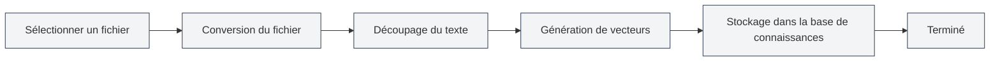

# Gestion de la base de connaissances

## Vue d'ensemble

<KnowledgeBase mode="demo" />

La gestion de la base de connaissances est une fonctionnalité centrale du système RAG (Recherche Augmentée par Génération) de MetaDoc. Elle vous permet d'ajouter des documents à la base de connaissances, fournissant ainsi un contexte pour les conversations IA via la recherche vectorielle. La base de connaissances aide l'IA à mieux comprendre le contenu de vos documents et à fournir des réponses plus précises.

## Activer la base de connaissances

### Activer la fonctionnalité de base de connaissances

Sur la page des paramètres de la base de connaissances, vous devez d'abord activer la fonctionnalité :

1.  Trouvez l'interrupteur "Activer la base de connaissances"
2.  Basculez l'interrupteur sur "Activé"
3.  Configurez les paramètres associés à la base de connaissances

Vous pouvez accéder à la gestion de la base de connaissances via la barre de menu supérieure :

<MenuItemsDemo mode="demo" :items='[{"id": "settings"}]' />

### Paramètres de la base de connaissances

<SettingKnowledgeBaseSection mode="demo" />

Avant d'activer la base de connaissances, vous pouvez configurer les paramètres associés sur la page des paramètres :

L'illustration ci-dessus montre les principales options de l'interface des paramètres de la base de connaissances :

-   **Activer la base de connaissances** : Active ou désactive la fonctionnalité.
-   **Mode d'embedding** : Choisissez le traitement cloud ou local (en développement).
-   **Seuil de confiance** : Contrôle le filtrage de la pertinence des résultats de recherche.
-   **Nombre maximum de résultats** : Limite le nombre maximum de résultats retournés par recherche.

### Interface de gestion de la base de connaissances

<KnowledgeBase mode="demo" />

Une fois la base de connaissances activée, vous pouvez ajouter et gérer des documents via l'interface de gestion :

L'interface de gestion de la base de connaissances offre les fonctionnalités suivantes :

-   **Liste des documents** : Affiche tous les documents ajoutés à la base de connaissances.
-   **Ajouter un document** : Prend en charge de nombreux formats (PDF, Word, images, Markdown, etc.).
-   **État du traitement** : Affiche en temps réel la progression du traitement des documents.
-   **Test de recherche** : Testez l'efficacité de la recherche dans la base de connaissances.

Après activation, les fonctionnalités IA (comme le chat IA, la complétion IA) utiliseront automatiquement les informations de la base de connaissances pour améliorer la qualité des réponses.

**Points à noter** :

-   Une fois activée, les fonctions IA recherchent dans la base de connaissances, ce qui peut affecter la vitesse de réponse.
-   La base de connaissances nécessite l'ajout de fichiers pour être utile.
-   Il est recommandé d'ajouter des fichiers avant d'activer la base de connaissances.

<RAGToolDisplay mode="demo" />

## Configuration du seuil de confiance

### Comprendre le seuil de confiance

Le seuil de confiance (Score Threshold) contrôle les critères de filtrage des résultats de recherche de la base de connaissances :

-   **Seuil bas (0.1-0.3)** : Retourne plus de résultats, mais peut inclure du contenu non pertinent.
-   **Seuil moyen (0.4-0.6)** : Équilibre pertinence et quantité, recommandé.
-   **Seuil élevé (0.7-0.9)** : Ne retourne que les résultats très pertinents, mais peut omettre des informations connexes.

### Recommandations de configuration

-   **Scénario général** : Recommandé 0.5, pour un équilibre précision/couverture.
-   **Besoins de haute précision** : Recommandé 0.7-0.8, pour garantir une haute pertinence.
-   **Recherche exploratoire** : Recommandé 0.3-0.4, pour obtenir plus d'informations connexes.

Le réglage du seuil affecte toutes les fonctions IA utilisant la base de connaissances, y compris le chat IA, la complétion IA, etc.

<SettingKnowledgeBaseSection mode="demo" />

## Gestion des fichiers de la base de connaissances

### Ajouter un fichier à la base de connaissances

1.  Sur la page de gestion de la base de connaissances, cliquez sur le bouton "Ajouter un fichier".
2.  Sélectionnez le fichier à ajouter (formats multiples supportés).
3.  Le système traite automatiquement le fichier :
    -   Conversion du fichier en texte
    -   Découpage du texte en blocs
    -   Génération des embeddings vectoriels
    -   Stockage dans la base de connaissances

**Formats de fichiers supportés** :

-   Markdown (.md)
-   LaTeX (.tex)
-   PDF (.pdf)
-   Word (.docx)
-   Images (.png, .jpg, etc., via reconnaissance OCR)
-   Texte brut (.txt)

### Processus de traitement des fichiers

### Gestion de la liste des fichiers

<KnowledgeBase mode="demo" />

La page de gestion de la base de connaissances affiche tous les fichiers ajoutés :

-   **Nom du fichier** : Affiche le nom du fichier.
-   **Statut** : Indique si le fichier est activé.
-   **Nombre de blocs** : Affiche le nombre de blocs dans lesquels le fichier a été découpé.
-   **Nombre de vecteurs** : Affiche le nombre de vecteurs générés.
-   **Actions** : Fournit les opérations de gestion du fichier.

### Activer/Désactiver un fichier

Vous pouvez désactiver temporairement un fichier sans le supprimer :

1.  Dans la liste des fichiers, trouvez le fichier concerné.
2.  Cliquez sur le bouton "Activer" ou "Désactiver".
3.  Une fois désactivé, le fichier ne sera pas recherché, mais ses données seront conservées.

**Cas d'utilisation** :

-   Exclure temporairement certains fichiers.
-   Tester l'effet de différentes combinaisons de fichiers.
-   Conserver un fichier sans l'utiliser pour le moment.

### Supprimer un fichier

1.  Dans la liste des fichiers, trouvez le fichier à supprimer.
2.  Cliquez sur le bouton "Supprimer".
3.  Confirmez l'opération de suppression.

La suppression d'un fichier entraîne :

-   La suppression de l'enregistrement du fichier.
-   La suppression de tous les blocs de données associés.
-   La suppression de tous les vecteurs associés.
-   L'opération est irréversible.

**Points à noter** :

-   L'opération de suppression est irréversible, soyez prudent.
-   La suppression de fichiers volumineux peut prendre du temps.
-   Pour restaurer, vous devrez réajouter le fichier.

### Renommer un fichier

1.  Dans la liste des fichiers, trouvez le fichier à renommer.
2.  Cliquez sur le bouton "Renommer".
3.  Saisissez le nouveau nom de fichier.
4.  Confirmez le renommage.

Le renommage ne change que le nom d'affichage, sans affecter le contenu du fichier ou les données vectorielles.

### Prévisualiser un fichier

Vous pouvez prévisualiser le contenu d'un fichier dans la base de connaissances :

1.  Dans la liste des fichiers, trouvez le fichier à prévisualiser.
2.  Cliquez sur le bouton "Prévisualiser".
3.  Consultez le contenu textuel du fichier.

La fonction de prévisualisation vous aide à :

-   Vérifier que le contenu du fichier est correct.
-   Vérifier que le fichier a été correctement traité.
-   Comprendre la structure textuelle du fichier.

### Télécharger un fichier

Vous pouvez télécharger un fichier depuis la base de connaissances :

1.  Dans la liste des fichiers, trouvez le fichier à télécharger.
2.  Cliquez sur le bouton "Télécharger".
3.  Choisissez l'emplacement de sauvegarde.

Le fichier téléchargé est une copie du fichier original, utilisable pour sauvegarde ou partage.

<RAGToolDisplay mode="demo" />

## Reconstruction vectorielle

### Reconstruire les vecteurs

Si les données vectorielles d'un fichier posent problème, ou si vous avez mis à jour le modèle d'embedding, vous pouvez reconstruire les vecteurs :

1.  Dans la liste des fichiers, trouvez le fichier à reconstruire.
2.  Cliquez sur le bouton "Reconstruire les vecteurs".
3.  Attendez la fin de la reconstruction.

La reconstruction des vecteurs va :

-   Retraiter le texte du fichier.
-   Regénérer les embeddings vectoriels.
-   Mettre à jour l'index vectoriel.

**Cas d'utilisation** :

-   Changement de modèle d'embedding.
-   Données vectorielles corrompues.
-   Besoin de mettre à jour la représentation vectorielle.

### Reconstruire tous les vecteurs

Si vous devez reconstruire les vecteurs de tous les fichiers :

1.  Cliquez sur le bouton "Reconstruire tous les vecteurs".
2.  Confirmez l'opération.
3.  Attendez la fin de la reconstruction pour tous les fichiers.

La reconstruction complète peut prendre du temps, surtout avec de nombreux fichiers.

<KnowledgeBase mode="demo" />

## Test de recherche dans la base de connaissances

### Tester la fonction de recherche

Vous pouvez tester la fonction de recherche sur la page de gestion de la base de connaissances :

1.  Saisissez votre requête dans la zone de recherche.
2.  Cliquez sur le bouton "Rechercher".
3.  Consultez les résultats de la recherche.

Les résultats de recherche affichent :

-   Les extraits de texte correspondants.
-   Le score de similarité.
-   Le fichier source.
-   Les informations contextuelles.

### Paramètres de recherche

Lors du test, vous pouvez ajuster :

-   **Texte de la requête** : Saisissez le contenu à rechercher.
-   **Nombre de résultats** : Définissez le nombre de résultats à retourner.
-   **Seuil** : Définissez le seuil de similarité minimum.

<RAGToolDisplay mode="demo" />

## Vider la base de connaissances

### Supprimer toutes les données

Si vous devez vider entièrement la base de connaissances :

1.  Cliquez sur le bouton "Vider la base de connaissances".
2.  Confirmez l'opération.
3.  Attendez la fin du vidage.

Vider la base de connaissances va :

-   Supprimer tous les enregistrements de fichiers.
-   Supprimer tous les blocs de données.
-   Supprimer tous les vecteurs.
-   L'opération est irréversible.

**Points à noter** :

-   L'opération de vidage est irréversible, soyez prudent.
-   Il est recommandé de sauvegarder les fichiers importants avant.
-   Après le vidage, vous devrez réajouter les fichiers.

## Bonnes pratiques

1.  **Organisation des fichiers** : Organisez les fichiers par thème ou projet pour une gestion facilitée.
2.  **Mises à jour régulières** : Après une mise à jour du contenu d'un fichier, reconstruisez rapidement les vecteurs.
3.  **Ajustement du seuil** : Ajustez le seuil de confiance en fonction des résultats d'utilisation réels.
4.  **Nettoyage des fichiers** : Supprimez régulièrement les fichiers devenus inutiles pour maintenir la base propre.
5.  **Sauvegarde des fichiers importants** : Sauvegardez les fichiers importants avant de les ajouter à la base de connaissances.

## Points d'attention

1.  **Taille des fichiers** : Le traitement des fichiers volumineux est plus long, soyez patient.
2.  **Espace de stockage** : La base de connaissances occupe un certain espace de stockage.
3.  **Temps de traitement** : L'ajout de fichiers et le traitement vectoriel prennent du temps, ne les interrompez pas.
4.  **Format des fichiers** : Assurez-vous que le format du fichier est correct, sinon il pourrait ne pas être traité.
5.  **Connexion réseau** : L'utilisation du mode API pour générer des vecteurs nécessite une connexion réseau.

## Documentation associée

-   [[knowledge-base.config|Configuration de la base de connaissances]]
-   [[knowledge-base.usage|Utilisation de la base de connaissances]]
-   [[settings.llm|Configuration LLM]]
-   [[ai.chat|Fonctionnalité de chat IA]]
