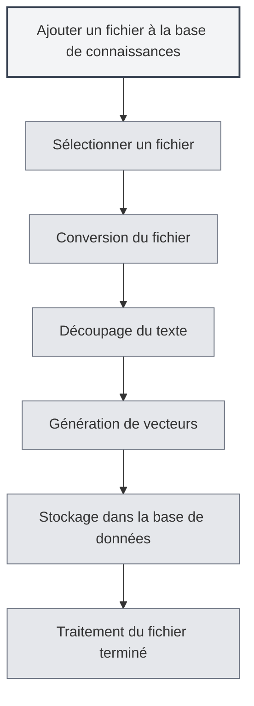

# Utilisation de la base de connaissances

## Vue d'ensemble

La base de connaissances est le système RAG (Retrieval-Augmented Generation) de MetaDoc. Elle fournit des informations contextuelles pour les fonctionnalités d'IA via la recherche vectorielle. Une utilisation appropriée de la base de connaissances peut améliorer significativement la précision et la pertinence des réponses de l'IA.

<KnowledgeBase mode="demo" />

## Présentation de la base de connaissances

### Qu'est-ce qu'une base de connaissances

Une base de connaissances est un système de stockage et de recherche de documents capable de :

- **Stocker des documents** : Convertir les documents en vecteurs et les stocker
- **Recherche sémantique** : Rechercher du contenu pertinent basé sur la similarité sémantique
- **Améliorer l'IA** : Fournir des informations contextuelles pour les conversations avec l'IA

### Comment cela fonctionne

<RAGToolDisplay mode="demo" />

La base de connaissances utilise la technologie d'embedding vectoriel :

1. **Traitement des documents** : Découper les documents en blocs de texte
2. **Vectorisation** : Générer un embedding vectoriel pour chaque bloc de texte
3. **Stockage** : Stocker les vecteurs dans la base de données
4. **Recherche** : Générer un vecteur pour la requête, rechercher un contenu similaire

```mermaid
graph LR
    A[Ajouter un document] --> B[Découpage du texte]
    B --> C[Génération de vecteurs]
    C --> D[Stockage des vecteurs]
    D --> E[Recherche par requête]
    E --> F[Retour des résultats]
    style A fill:#f3f4f6,stroke:#374151
    style B fill:#f3f4f6,stroke:#374151
    style C fill:#f3f4f6,stroke:#374151
    style D fill:#f3f4f6,stroke:#374151
    style E fill:#f3f4f6,stroke:#374151
    style F fill:#f3f4f6,stroke:#374151
```

<KnowledgeBase mode="demo" />

## Ajouter des fichiers à la base de connaissances

### Ajouter un fichier

1. Ouvrez la page de gestion de la base de connaissances
2. Cliquez sur le bouton "Ajouter un fichier"
3. Sélectionnez le fichier à ajouter
4. Attendez la fin du traitement du fichier

### Formats de fichiers pris en charge

La base de connaissances prend en charge les formats de fichiers suivants :

- **Markdown** (.md) : Documents Markdown
- **LaTeX** (.tex) : Documents LaTeX
- **PDF** (.pdf) : Documents PDF
- **Word** (.docx) : Documents Word
- **Images** (.png, .jpg, etc.) : Reconnaissance de texte par OCR
- **Texte brut** (.txt) : Fichiers texte brut

### Traitement des fichiers

<RAGToolDisplay mode="demo" />

Après l'ajout d'un fichier, le système effectue automatiquement :

1. **Conversion en texte** : Convertir le fichier en contenu textuel
2. **Découpage du texte** : Diviser le texte en blocs de taille fixe
3. **Génération de vecteurs** : Générer un embedding vectoriel pour chaque bloc
4. **Stockage des données** : Stocker les vecteurs et le texte dans la base de données

Le temps de traitement dépend de la taille du fichier. Les fichiers volumineux peuvent nécessiter plus de temps.

<KnowledgeBase mode="demo" />

## Gestion des fichiers de la base de connaissances

### Liste des fichiers

La page de gestion de la base de connaissances affiche tous les fichiers ajoutés :

- **Nom du fichier** : Le nom du fichier
- **Taille / Nombre de blocs** : La taille du fichier et le nombre de blocs de données
- **Statut** : Indique si le fichier est activé

### Opérations sur les fichiers

<RAGToolDisplay mode="demo" />

#### Activer / Désactiver un fichier

- **Activer** : Le fichier sera utilisé pour la recherche, pour les fonctionnalités d'IA
- **Désactiver** : Le fichier ne sera pas utilisé pour la recherche, mais les données sont conservées

#### Prévisualiser un fichier

Cliquez sur un fichier pour prévisualiser son contenu :

- **Voir le contenu** : Consultez le texte du fichier dans le panneau de prévisualisation
- **Ouvrir l'éditeur** : Ouvrir le fichier dans l'éditeur

#### Renommer un fichier

1. Sélectionnez le fichier à renommer
2. Cliquez sur le bouton d'édition à côté du nom du fichier
3. Saisissez le nouveau nom de fichier
4. Confirmez le renommage

#### Supprimer un fichier

1. Sélectionnez le fichier à supprimer
2. Cliquez sur le bouton "Supprimer"
3. Confirmez l'opération de suppression

La suppression d'un fichier supprime tous les vecteurs et blocs de données associés.

#### Télécharger un fichier

Vous pouvez télécharger les fichiers de la base de connaissances :

1. Sélectionnez le fichier à télécharger
2. Cliquez sur le bouton "Télécharger"
3. Choisissez l'emplacement de sauvegarde

<KnowledgeBase mode="demo" />

## Recherche vectorielle

### Principe de recherche

La recherche vectorielle utilise l'algorithme ANN (Approximate Nearest Neighbor) :

- **Similarité vectorielle** : Calcule la similarité entre le vecteur de la requête et les vecteurs des documents
- **Similarité cosinus** : Utilise la similarité cosinus pour mesurer le degré de similarité
- **Tri des résultats** : Retourne les résultats triés par similarité

### Méthodes de recherche

<RAGToolDisplay mode="demo" />

La base de connaissances prend en charge deux méthodes de recherche :

- **Recherche vectorielle** : Basée sur la similarité sémantique
- **Recherche hybride** : Combine la recherche vectorielle et la correspondance par mots-clés

### Test de recherche

Vous pouvez tester la fonction de recherche sur la page de gestion de la base de connaissances :

1. Saisissez le texte de la requête dans la zone de recherche
2. Ajustez le seuil de confiance
3. Cliquez sur le bouton "Rechercher"
4. Consultez les résultats de la recherche

### Seuil de confiance

Le seuil de confiance contrôle le filtrage des résultats de recherche :

- **Seuil bas (0.1-0.3)** : Retourne plus de résultats, mais peut inclure du contenu non pertinent
- **Seuil moyen (0.4-0.6)** : Équilibre pertinence et quantité (recommandé)
- **Seuil élevé (0.7-0.9)** : Ne retourne que les résultats très pertinents

<KnowledgeBase mode="demo" />

## Recherche hybride

### Mécanisme de recherche

La recherche hybride combine deux méthodes :

- **Recherche vectorielle** : Basée sur la similarité sémantique
- **Correspondance par mots-clés** : Basée sur la correspondance textuelle

### Mécanisme de notation

La recherche hybride utilise un score composite :

- **Similarité vectorielle** : Score de similarité sémantique
- **Correspondance par mots-clés** : Score de correspondance textuelle
- **Score composite** : Score final combinant les deux scores

### Avantages

Les avantages de la recherche hybride :

- **Précision** : La recherche vectorielle fournit une compréhension sémantique
- **Exactitude** : La correspondance par mots-clés fournit une correspondance exacte
- **Équilibre** : Combine les avantages des deux méthodes

<RAGToolDisplay mode="demo" />

## Test de recherche

### Tester la recherche

Vous pouvez tester la recherche sur la page de gestion de la base de connaissances :

1. **Saisir la requête** : Saisissez le contenu à rechercher dans la zone de recherche
2. **Ajuster le seuil** : Utilisez le curseur pour ajuster le seuil de confiance
3. **Exécuter la recherche** : Cliquez sur le bouton "Rechercher" ou appuyez sur Entrée
4. **Consulter les résultats** : Consultez les résultats de la recherche dans la zone des résultats

### Résultats de la recherche

Les résultats de la recherche affichent :

- **Texte correspondant** : Extrait de texte pertinent par rapport à la requête
- **Similarité** : Score de similarité entre le texte et la requête
- **Fichier source** : Fichier d'origine du texte

### Tri des résultats

Les résultats de recherche sont triés par similarité :

- **Plus pertinent** : Les résultats avec la similarité la plus élevée apparaissent en premier
- **Pertinence décroissante** : Tri par ordre décroissant de similarité

## Reconstruction vectorielle

### Reconstruire les vecteurs

Si les données vectorielles d'un fichier présentent un problème, vous pouvez les reconstruire :

1. Sélectionnez le fichier à reconstruire
2. Cliquez sur le bouton "Reconstruire les vecteurs"
3. Attendez la fin de la reconstruction

### Reconstruire tous les vecteurs

Vous pouvez reconstruire les vecteurs de tous les fichiers :

1. Cliquez sur le bouton "Reconstruire tous les vecteurs"
2. Confirmez l'opération
3. Attendez la fin de la reconstruction de tous les fichiers

### Scénarios de reconstruction

Scénarios nécessitant une reconstruction des vecteurs :

- **Changement de modèle d'Embedding** : Nécessaire après un changement de modèle
- **Données vectorielles corrompues** : Lorsque les données vectorielles présentent un problème
- **Mise à jour de la représentation vectorielle** : Lorsqu'une mise à jour est nécessaire

## Vider la base de connaissances

### Opération de vidage

Si vous devez vider toute la base de connaissances :

1. Cliquez sur le bouton "Vider la base de connaissances"
2. Confirmez l'opération
3. Attendez la fin du vidage

### Impact du vidage

Vider la base de connaissances va :

- Supprimer tous les enregistrements de fichiers
- Supprimer tous les blocs de données
- Supprimer tous les vecteurs
- L'opération est irréversible

**Remarques importantes** :

- L'opération de vidage est irréversible, veuillez l'effectuer avec prudence
- Il est recommandé de sauvegarder les fichiers importants avant le vidage
- Après le vidage, vous devrez réajouter les fichiers

<KnowledgeBase mode="demo" />

## Utilisation dans les fonctionnalités d'IA

### Conversation avec l'IA

La base de connaissances fournit automatiquement un contexte pour les conversations avec l'IA :

- **Recherche automatique** : Recherche automatique des connaissances pertinentes en fonction du contenu de la conversation
- **Injection de contexte** : Injection des résultats de recherche dans le contexte de la conversation
- **Réponses améliorées** : Génération de réponses plus précises basées sur le contenu de la base de connaissances

### Complétion par l'IA

La base de connaissances peut améliorer la fonction de complétion par l'IA :

- **Compréhension du contexte** : Comprendre le contexte basé sur le contenu de la base de connaissances
- **Génération de contenu** : Générer du contenu lié au contenu de la base de connaissances
- **Amélioration de la précision** : Améliorer la précision du contenu complété

### Outils Agent

La base de connaissances peut être utilisée comme un outil Agent :

- **Outil RAG** : Utiliser la recherche RAG dans les flux de travail Agent
- **Fourniture de contexte** : Fournir des informations contextuelles pertinentes à l'Agent
- **Exécution de tâches** : Aider l'Agent à accomplir des tâches nécessitant des connaissances

## Bonnes pratiques

1. **Organisation des fichiers** : Organisez les fichiers par thème ou projet
2. **Mises à jour régulières** : Reconstruisez les vecteurs après la mise à jour du contenu des fichiers
3. **Ajustement des seuils** : Ajustez le seuil de confiance en fonction des résultats d'utilisation
4. **Nettoyage des fichiers** : Supprimez régulièrement les fichiers devenus inutiles
5. **Test de recherche** : Testez régulièrement la fonction de recherche pour garantir son bon fonctionnement

## Remarques importantes

1. **Activer la base de connaissances** : Vous devez activer la fonction de base de connaissances avant de l'utiliser
2. **Traitement des fichiers** : Le traitement des fichiers volumineux prend du temps, soyez patient
3. **Espace de stockage** : La base de connaissances occupe un certain espace de stockage
4. **Connexion réseau** : Le mode API nécessite une connexion réseau
5. **Sécurité des données** : Veillez à protéger les informations sensibles dans la base de connaissances

## Documentation associée

- [[knowledge-base.management|Gestion de la base de connaissances]]
- [[knowledge-base.config|Configuration de la base de connaissances]]
- [[settings.llm|Configuration LLM]]
- [[ai.chat|Fonctionnalité de conversation avec l'IA]]

<KnowledgeBase mode="demo" />

<RAGToolDisplay mode="demo" />