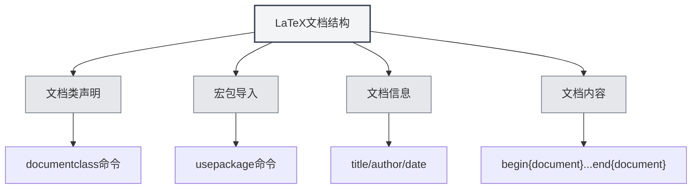

# Syntaxe LaTeX

## Vue d'ensemble

LaTeX est un système de composition basé sur TeX, largement utilisé pour la rédaction de documents académiques et scientifiques. MetaDoc offre une prise en charge complète de l'édition, de la compilation et de la prévisualisation LaTeX.

<LaTeXEditorDemo mode="demo" />

<PdfPreviewPanel mode="demo" />

<LaTeXCompilerPanel mode="demo" />

<LaTeXConsole mode="demo" />

## Syntaxe de base

### Structure du document

La structure de base d'un document LaTeX :

```latex
\documentclass{article}
\usepackage[utf8]{inputenc}

\title{Titre du document}
\author{Auteur}
\date{\today}

\begin{document}
\maketitle

\section{Titre de la section}
Contenu...

\end{document}
```



### Formules mathématiques

**Formule en ligne** :

```latex
Ceci est une formule en ligne : $E = mc^2$
```

**Formule en bloc** :

```latex
\begin{equation}
\int_{-\infty}^{\infty} e^{-x^2} dx = \sqrt{\pi}
\end{equation}
```

**Formules multi-lignes** :

```latex
\begin{align}
x &= a + b \\
y &= c + d
\end{align}
```

### Tableaux

Utilisez l'environnement `tabular` :

```latex
\begin{tabular}{|c|c|c|}
\hline
Colonne 1 & Colonne 2 & Colonne 3 \\
\hline
Donnée 1 & Donnée 2 & Donnée 3 \\
\hline
\end{tabular}
```

### Insertion d'images

Utilisez l'environnement `figure` :

```latex
\begin{figure}[h]
\centering
\includegraphics[width=0.8\textwidth]{image.png}
\caption{Légende de l'image}
\label{fig:exemple}
\end{figure}
```

### Bibliographie

Utilisez `BibTeX` ou `natbib` :

```latex
\bibliographystyle{plain}
\bibliography{references}
```

## Compilation et prévisualisation

Un document LaTeX doit être compilé pour générer un PDF. Voir [[latex.compilation|Compilation et prévisualisation LaTeX]].

Une fois la compilation terminée, vous pouvez consulter le résultat dans la [[latex.pdf-preview|Fonction de prévisualisation PDF]].

## Documents connexes

- [[latex.editor|Guide d'utilisation de l'éditeur LaTeX]]
- [[latex.compilation|Compilation et prévisualisation LaTeX]]
- [[latex.pdf-preview|Fonction de prévisualisation PDF]]
- [[latex.console|Sortie de la console]]