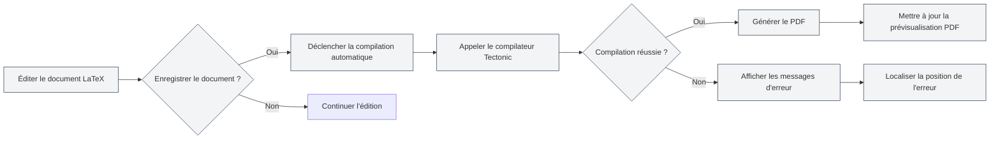
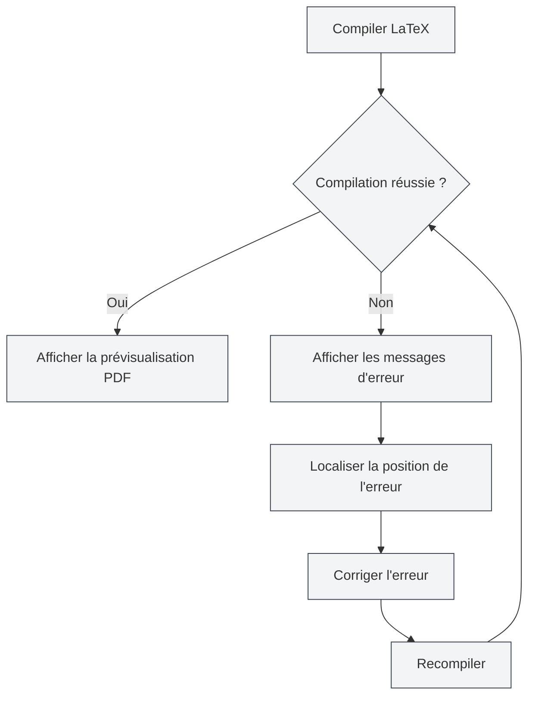

# Compilation et prévisualisation LaTeX

## Vue d'ensemble

Les documents LaTeX nécessitent une compilation pour générer un PDF. MetaDoc utilise le compilateur Tectonic, qui prend en charge la compilation automatique, la prévisualisation en temps réel, la localisation des erreurs et d'autres fonctionnalités, vous permettant de rédiger et de déboguer efficacement vos documents LaTeX.

Le processus de compilation télécharge automatiquement les packages requis, sans configuration manuelle, simplifiant grandement l'utilisation de LaTeX.

## Compiler un document LaTeX

<LaTeXCompilerPanel mode="demo" />

### Compilation automatique

MetaDoc prend en charge la compilation automatique :

- **Compilation à l'enregistrement** : La compilation est déclenchée automatiquement lors de l'enregistrement du document LaTeX.
- **Compilation manuelle** : Déclenchez manuellement la compilation en cliquant sur le bouton "Compiler" de la barre d'outils.
- **État de la compilation** : La progression et l'état sont affichés pendant la compilation.

### Processus de compilation

<LaTeXConsole mode="demo" />

Le processus de compilation comprend les étapes suivantes :

1.  **Préparer l'environnement de compilation** : Vérifier si le compilateur Tectonic est disponible.
2.  **Télécharger les packages** : Télécharger automatiquement les packages LaTeX utilisés dans le document.
3.  **Exécuter la compilation** : Lancer le compilateur Tectonic pour générer le PDF.
4.  **Traiter la sortie** : Traiter les journaux de compilation et les messages d'erreur.
5.  **Mettre à jour la prévisualisation** : Si la compilation réussit, mettre à jour la prévisualisation PDF.

### Options de compilation

<LaTeXEditorDemo mode="demo" />

La compilation prend en charge les options suivantes :

- **Compilateur** : Utilisation du compilateur Tectonic (par défaut).
- **Mode de compilation** : Mode non interactif, s'arrête en cas d'erreur.
- **Répertoire de sortie** : Le fichier PDF est enregistré dans le même répertoire que le document.

### Temps de compilation

<ConsoleTerminal mode="demo" consoleKey="demo" :history='[{"content": "Tectonic编译器启动...", "type": "out"}, {"content": "解析文档结构", "type": "out"}]' />

Le temps de compilation dépend de :

- **La taille du document** : Plus le document est volumineux, plus la compilation est longue.
- **Le nombre de packages** : Plus de packages utilisés signifie un temps de compilation initial plus long (nécessite des téléchargements).
- **Le nombre d'images** : Plus d'images incluses signifie un temps de compilation plus long.

La première compilation peut prendre plus de temps car elle nécessite de télécharger les packages. Les compilations suivantes seront plus rapides.

## Prévisualisation PDF

<PdfPreviewPanel mode="demo" pdfUrl="" />

### Mise à jour automatique

La prévisualisation PDF se met à jour automatiquement après une compilation réussie :

- **Prévisualisation en temps réel** : Affiche immédiatement la prévisualisation PDF après une compilation réussie.
- **Rafraîchissement automatique** : Rafraîchit automatiquement la prévisualisation lorsque le contenu PDF change.
- **Défilement synchronisé** : Prend en charge la localisation synchronisée entre le PDF et le code.

### Fonctionnalités de prévisualisation

<LaTeXCompilerPanel mode="demo" />

Le panneau de prévisualisation PDF offre les fonctionnalités suivantes :

- **Navigation par pages** : Page précédente, page suivante, aller à une page spécifique.
- **Contrôle du zoom** : Zoom avant, zoom arrière, réinitialiser le zoom.
- **Rafraîchir la prévisualisation** : Rafraîchir manuellement la prévisualisation PDF.
- **Localiser dans le code** : Aller du PDF à la position correspondante dans le code LaTeX.

Voir [[latex.pdf-preview|Fonctionnalités de prévisualisation PDF]].

L'interface du panneau de prévisualisation PDF est la suivante :

<PdfPreviewPanel mode="demo" pdfUrl="" />

## Sortie console

<LaTeXConsole mode="demo" />

### Journaux de compilation

Les journaux du processus de compilation sont affichés dans le panneau de sortie console :

- **Sortie standard** : Sortie normale du processus de compilation.
- **Messages d'erreur** : Erreurs de compilation et messages d'avertissement.
- **Mise à jour en temps réel** : Les journaux sont mis à jour en temps réel pendant la compilation.

L'interface du panneau de sortie console est la suivante :

<ConsoleTerminal mode="demo" consoleKey="demo" :history='[{"content": "编译开始...", "type": "out"}, {"content": "正在下载宏包: amsmath", "type": "out"}, {"content": "警告: 未定义的引用", "type": "warn"}, {"content": "编译完成", "type": "out"}]' />

### Messages d'erreur

<ConsoleTerminal mode="demo" consoleKey="demo" :history='[{"content": "错误: 未定义的命令", "type": "error"}, {"content": "警告: 超文本引用未找到", "type": "warn"}]' />

Les erreurs de compilation sont affichées avec des couleurs différentes :

- **Erreur** : Affichée en rouge, indique un échec de compilation.
- **Avertissement** : Affiché en jaune, indique un problème potentiel.
- **Information** : Affichée en gris, informations générales.

### Localisation des erreurs

Les erreurs de compilation affichent :

- **Position de l'erreur** : Numéro de ligne et de colonne où l'erreur s'est produite.
- **Type d'erreur** : Type et description de l'erreur.
- **Accès rapide** : Cliquer sur un message d'erreur permet de sauter à la position correspondante dans le code.

Voir [[latex.console|Sortie console]].

## Localisation vers le PDF

<LaTeXEditorDemo mode="demo" />

### Du code vers le PDF

Dans l'éditeur LaTeX, vous pouvez :

1.  **Sélectionner du code** : Sélectionnez le code LaTeX.
2.  **Menu contextuel** : Faites un clic droit et choisissez "Localiser dans le PDF".
3.  **Sauter vers la prévisualisation** : La prévisualisation PDF sautera automatiquement à la position correspondante.

### Du PDF vers le code

Dans la prévisualisation PDF, vous pouvez :

1.  **Cliquer sur une position PDF** : Cliquez sur un emplacement dans le PDF.
2.  **Saut automatique** : L'éditeur sautera automatiquement à la position correspondante dans le code LaTeX.

Cette fonctionnalité vous permet de basculer rapidement entre le PDF et le code, facilitant le débogage et l'édition.

## Gestion des erreurs de compilation

<LaTeXConsole mode="demo" />

### Types d'erreurs courants

La compilation LaTeX peut rencontrer les erreurs suivantes :

- **Erreurs de syntaxe** : Syntaxe LaTeX incorrecte.
- **Package manquant** : Utilisation d'un package non installé (Tectonic le télécharge automatiquement).
- **Fichier manquant** : Fichier référencé inexistant.
- **Erreur d'encodage** : Encodage de fichier incorrect.

### Processus de gestion des erreurs

### Techniques de débogage

1.  **Consulter la console** : Examinez attentivement les messages d'erreur dans la sortie console.
2.  **Localiser l'erreur** : Utilisez la fonction de localisation d'erreur pour trouver rapidement le code problématique.
3.  **Corriger progressivement** : Commencez par la première erreur et corrigez-les une par une.
4.  **Vérifier la syntaxe** : Assurez-vous que la syntaxe LaTeX est correcte.
5.  **Vérifier les fichiers** : Assurez-vous que les fichiers référencés existent et que les chemins sont corrects.

## Compilateur Tectonic

<LaTeXCompilerPanel mode="demo" />

### Présentation du compilateur

MetaDoc utilise le compilateur Tectonic, qui présente les caractéristiques suivantes :

- **Aucune installation de distribution TeX requise** : Tectonic est un binaire autonome.
- **Téléchargement automatique des packages** : Télécharge automatiquement les packages nécessaires depuis CTAN lors de la compilation.
- **Compilation rapide** : Plus rapide que les distributions TeX traditionnelles.
- **Support multiplateforme** : Pris en charge sur Windows, macOS et Linux.

### Gestion des packages

Tectonic gère automatiquement les packages LaTeX :

- **Téléchargement automatique** : Téléchargés automatiquement lors de la première utilisation.
- **Gestion du cache** : Les packages téléchargés sont mis en cache, accélérant les compilations suivantes.
- **Gestion des versions** : Gère automatiquement les versions des packages.

Vous n'avez pas besoin de télécharger ou configurer manuellement les packages. Il suffit d'utiliser la commande `\usepackage{}` dans votre document.

## Astuces d'utilisation

<LaTeXEditorDemo mode="demo" />

### Améliorer la vitesse de compilation

1.  **Réduire les images** : Diminuez le nombre d'images dans le document.
2.  **Optimiser le code** : Optimisez la structure du code LaTeX.
3.  **Utiliser le cache** : Profitez du cache de packages de Tectonic.

### Déboguer les erreurs de compilation

1.  **Consulter les journaux complets** : Examinez les journaux de compilation complets dans la console.
2.  **Vérifier la syntaxe** : Vérifiez attentivement la syntaxe LaTeX.
3.  **Compiler progressivement** : Commentez des parties du code pour localiser progressivement le problème.
4.  **Consulter la documentation** : Référez-vous à la documentation des packages LaTeX.

### Optimiser le flux de compilation

1.  **Compilation à l'enregistrement** : Activez la compilation automatique à l'enregistrement.
2.  **Utiliser la prévisualisation** : Utilisez la prévisualisation PDF pour voir rapidement le résultat.
3.  **Fonction de localisation** : Utilisez la fonction de localisation pour basculer rapidement entre le code et le PDF.

## Questions fréquentes

### Q : Que faire en cas d'échec de compilation ?

R : Consultez les messages d'erreur dans la sortie console et corrigez le code selon les indications. Les problèmes courants incluent les erreurs de syntaxe, les fichiers manquants, etc.

### Q : La compilation prend beaucoup de temps ?

R : La première compilation nécessite de télécharger les packages, un temps plus long est normal. Les compilations suivantes seront plus rapides. Si cela reste lent, vérifiez la taille du document et le nombre d'images.

### Q : Échec du téléchargement d'un package ?

R : Vérifiez votre connexion réseau pour vous assurer d'avoir accès à CTAN. Tectonic réessayera automatiquement le téléchargement.

### Q : La prévisualisation PDF ne se met pas à jour ?

R : Cliquez sur le bouton "Rafraîchir" pour actualiser manuellement la prévisualisation, ou vérifiez si la compilation a réussi.

### Q : Comment consulter les journaux de compilation ?

R : Les journaux de compilation sont affichés dans le panneau de sortie console, où vous pouvez voir la sortie standard, les messages d'erreur et d'avertissement.

## Documentation associée

- [[latex.editor|Guide d'utilisation de l'éditeur LaTeX]]
- [[latex.basics|Syntaxe LaTeX]]
- [[latex.pdf-preview|Fonctionnalités de prévisualisation PDF]]
- [[latex.console|Sortie console]]

<LaTeXCompilerPanel mode="demo" />

<LaTeXEditorDemo mode="demo" />