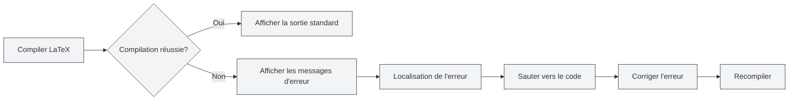

# Sortie de la console

## Vue d'ensemble

Le panneau de sortie de la console affiche les informations de journal du processus de compilation LaTeX, y compris la sortie standard, les messages d'erreur, les avertissements, etc. En consultant la sortie de la console, vous pouvez comprendre le processus de compilation, localiser les erreurs et déboguer les problèmes.

La sortie de la console utilise l'éditeur Monaco pour l'affichage, prenant en charge la coloration syntaxique, la localisation des erreurs, le filtrage des journaux et d'autres fonctionnalités, vous permettant de visualiser et d'analyser efficacement les journaux de compilation.

## Sortie de la compilation LaTeX

<LaTeXConsole mode="demo" />

### Sortie standard

La sortie standard du processus de compilation s'affiche dans la console :

- **Progression de la compilation** : Affiche les différentes étapes de la compilation
- **Téléchargement des packages** : Affiche les informations sur les packages téléchargés
- **Informations de compilation** : Affiche les informations détaillées du processus de compilation

La sortie standard est affichée en texte brut, vous aidant à comprendre le processus de compilation.

L'interface du panneau de sortie de la console est la suivante :

<ConsoleTerminal mode="demo" consoleKey="demo" :history='[{"content": "Compilation démarrée...", "type": "out"}, {"content": "Avertissement : référence non définie", "type": "warn"}, {"content": "Compilation terminée", "type": "out"}]' />

### Format de sortie

<ConsoleTerminal mode="demo" consoleKey="demo" :history='[{"content": "Message de sortie standard", "type": "out"}, {"content": "Message d'avertissement", "type": "warn"}, {"content": "Message d'erreur", "type": "error"}]' />

La sortie de la console utilise différentes couleurs pour distinguer les types d'informations :

- **Sortie standard** : Texte gris, affichant les informations normales de compilation
- **Messages d'erreur** : Texte rouge, affichant les erreurs de compilation
- **Messages d'avertissement** : Texte jaune, affichant les avertissements de compilation
- **Informations de débogage** : Texte gris foncé, affichant les informations de débogage

## Affichage des messages d'erreur

<LaTeXConsole mode="demo" />

### Format des erreurs

Les erreurs de compilation sont affichées dans un format spécifique :

- **Emplacement de l'erreur** : Affiche le nom du fichier, le numéro de ligne et le numéro de colonne où l'erreur s'est produite
- **Type d'erreur** : Affiche le type d'erreur (par exemple, erreur de syntaxe, fichier manquant, etc.)
- **Description de l'erreur** : Affiche une description détaillée de l'erreur

### Localisation des erreurs

La sortie de la console prend en charge la fonction de localisation des erreurs :

- **Cliquer sur l'erreur** : Cliquer sur un message d'erreur permet de sauter à la position correspondante dans le code
- **Mise en évidence** : La ligne de code correspondant à l'erreur est mise en évidence
- **Correction rapide** : Permet de localiser rapidement la position de l'erreur pour faciliter la correction

### Types d'erreurs courants

La compilation LaTeX peut rencontrer les erreurs suivantes :

- **Erreur de syntaxe** : Syntaxe LaTeX incorrecte
- **Commande non définie** : Utilisation d'une commande LaTeX non définie
- **Environnement non fermé** : Environnement non correctement fermé
- **Fichier manquant** : Fichier référencé inexistant
- **Erreur de package** : Échec de chargement ou conflit de package

## Affichage des messages d'avertissement

<ConsoleTerminal mode="demo" consoleKey="demo" :history='[{"content": "Avertissement: référence non définie", "type": "warn"}]' />

### Format des avertissements

Les avertissements de compilation sont affichés dans un format spécifique :

- **Emplacement de l'avertissement** : Affiche l'emplacement où l'avertissement s'est produit
- **Type d'avertissement** : Affiche le type d'avertissement
- **Description de l'avertissement** : Affiche une description détaillée de l'avertissement

### Traitement des avertissements

Les messages d'avertissement n'empêchent généralement pas la compilation, mais peuvent affecter le résultat final :

- **Consulter l'avertissement** : Examiner attentivement le message d'avertissement pour comprendre les problèmes potentiels
- **Corriger l'avertissement** : Corriger le code en fonction du message d'avertissement
- **Ignorer l'avertissement** : Si l'avertissement n'affecte pas le résultat, il peut être temporairement ignoré

## Filtrage des journaux

<LaTeXConsole mode="demo" />

### Fonctionnalité de filtrage

La sortie de la console prend en charge le filtrage des journaux :

- **Filtrer par type** : N'afficher que les erreurs, les avertissements ou la sortie standard
- **Filtrer par mot-clé** : Filtrer les journaux contenant des mots-clés spécifiques
- **Filtrer par temps** : Filtrer les journaux d'une période spécifique

### Configuration du filtrage

Le filtrage des journaux peut être configuré dans le panneau de la console :

1. Ouvrir le panneau de sortie de la console
2. Utiliser les options de filtrage pour sélectionner le contenu à afficher
3. Saisir des mots-clés pour effectuer une recherche filtrée

### Effacer les journaux

Effacer la sortie de la console :

- **Bouton Effacer** : Cliquer sur le bouton "Effacer" de la console
- **Raccourci clavier** : `Ctrl+L` (si configuré)

L'effacement des journaux supprime toutes les informations de journal déjà affichées.

## Opérations sur les journaux

<ConsoleTerminal mode="demo" consoleKey="demo" :history='[{"content": "Contenu du journal de compilation...", "type": "out"}]' />

### Copier le journal

Copier la sortie de la console dans le presse-papiers :

- **Bouton Copier** : Cliquer sur le bouton "Copier" de la console
- **Raccourci clavier** : `Ctrl+C` (après avoir sélectionné le texte)

La copie du journal permet de le sauvegarder ailleurs ou de le partager avec d'autres.

### Sauvegarder le journal

Sauvegarder la sortie de la console dans un fichier :

- **Bouton Sauvegarder** : Cliquer sur le bouton "Sauvegarder le journal" de la console
- **Sélection du fichier** : Choisir l'emplacement de sauvegarde et le nom du fichier

Le fichier journal sauvegardé peut être utilisé pour des analyses ultérieures ou des rapports de problèmes.

### Analyse IA

La sortie de la console prend en charge la fonctionnalité d'analyse IA :

- **Activer l'analyse IA** : Activer le commutateur d'analyse IA dans le panneau de la console
- **Analyse automatique** : L'IA analyse automatiquement les messages d'erreur et fournit des suggestions de correction
- **Consulter les suggestions** : Consulter les suggestions de correction d'erreur fournies par l'IA

La fonctionnalité d'analyse IA peut vous aider à comprendre et corriger rapidement les erreurs de compilation.

## Paramètres de la console

<LaTeXConsole mode="demo" />

### Options d'affichage

La sortie de la console prend en charge les options d'affichage suivantes :

- **Affichage des numéros de ligne** : Afficher les numéros de ligne des entrées de journal
- **Retour à la ligne automatique** : Les lignes longues s'affichent avec un retour à la ligne automatique
- **Taille de la police** : Ajuster la taille de la police d'affichage du journal

### Paramètres du thème

La sortie de la console suit le thème de l'éditeur :

- **Thème clair** : Utiliser un fond clair sous le thème clair
- **Thème sombre** : Utiliser un fond sombre sous le thème sombre
- **Synchronisation automatique** : Synchronisation automatique avec les paramètres de thème de l'éditeur

## Astuces d'utilisation

<ConsoleTerminal mode="demo" consoleKey="demo" :history='[{"content": "Localisation de la position de l'erreur...", "type": "out"}]' />

### Localisation rapide des erreurs

1. **Consulter le message d'erreur** : Examiner attentivement le format et le contenu du message d'erreur
2. **Utiliser la fonction de localisation** : Cliquer sur le message d'erreur pour sauter rapidement à la position du code
3. **Vérifier le contexte** : Examiner le code contextuel autour de la position de l'erreur

### Comprendre le journal de compilation

1. **Lire la sortie standard** : Comprendre les différentes étapes du processus de compilation
2. **Porter attention aux messages d'erreur** : Se concentrer sur les messages d'erreur et les corriger en priorité
3. **Consulter les messages d'avertissement** : Consulter les messages d'avertissement pour comprendre les problèmes potentiels

### Techniques de débogage

1. **Compilation étape par étape** : Commenter des parties du code pour localiser progressivement le problème
2. **Consulter le journal complet** : Consulter l'intégralité du journal de compilation pour comprendre le processus
3. **Utiliser l'analyse IA** : Activer la fonctionnalité d'analyse IA pour obtenir des suggestions de correction

## Questions fréquentes

<LaTeXConsole mode="demo" />

### Q : La sortie de la console ne s'affiche pas ?

R : Assurez-vous que le panneau de sortie de la console est ouvert. Il s'ouvre automatiquement lors de la compilation d'un document LaTeX.

### Q : Comment trouver rapidement une erreur ?

R : Les messages d'erreur s'affichent en rouge. Cliquer sur un message d'erreur permet de sauter rapidement à la position du code.

### Q : Que faire s'il y a trop de journaux ?

R : Utiliser la fonction de filtrage pour filtrer les journaux inutiles, ou utiliser la fonction d'effacement pour supprimer les anciens journaux.

### Q : Comment sauvegarder le journal de compilation ?

R : Cliquer sur le bouton "Sauvegarder le journal" de la console, puis choisir l'emplacement de sauvegarde pour enregistrer le fichier journal.

### Q : L'analyse IA n'est pas précise ?

R : L'analyse IA est fournie à titre indicatif. Il est recommandé de la combiner avec les messages d'erreur et le contexte du code pour juger. Vous pouvez corriger manuellement ou relancer l'analyse.

## Documentation associée

- [[latex.compilation|Compilation et prévisualisation LaTeX]]
- [[latex.editor|Guide d'utilisation de l'éditeur LaTeX]]
- [[latex.pdf-preview|Fonctionnalité de prévisualisation PDF]]

<PdfPreviewPanel mode="demo" pdfUrl="" />

<LaTeXCompilerPanel mode="demo" />

<LaTeXEditorDemo mode="demo" />
