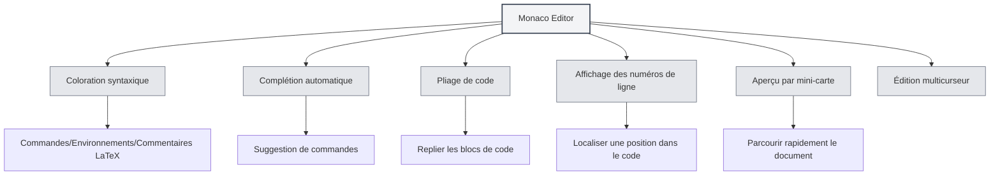

# Guide d'utilisation de l'éditeur LaTeX

## Vue d'ensemble

L'éditeur LaTeX de MetaDoc est basé sur Monaco Editor, offrant une expérience d'édition de code LaTeX professionnelle. L'éditeur prend en charge la coloration syntaxique, la complétion automatique, le pliage de code et d'autres fonctionnalités pour vous aider à rédiger des documents LaTeX efficacement.

Monaco Editor est le moteur d'édition utilisé par Visual Studio Code, doté de puissantes capacités d'édition de code et de riches fonctionnalités.

<PdfPreviewPanel mode="demo" pdfUrl="" />

<ConsoleTerminal mode="demo" consoleKey="demo" :history='[{"content": "Compilation terminée", "type": "out"}]' />

<LaTeXEditor mode="demo" />

## Présentation de Monaco Editor

Monaco Editor offre les caractéristiques suivantes pour l'édition LaTeX :

- **Coloration syntaxique** : Les commandes LaTeX, les environnements, les commentaires et autres éléments syntaxiques sont affichés avec des couleurs différentes.
- **Complétion automatique** : Des suggestions de complétion s'affichent automatiquement lors de la saisie de commandes LaTeX.
- **Pliage de code** : Permet de replier des blocs de code pour faciliter la navigation dans les longs documents.
- **Affichage des numéros de ligne** : Affiche les numéros de ligne pour faciliter le repérage dans le code.
- **Aperçu par mini-carte** : Une vignette du code est affichée sur le côté droit pour une navigation rapide de la structure du document.
- **Édition multicurseur** : Permet d'éditer simultanément avec plusieurs curseurs.

<LaTeXEditorDemo mode="demo" />

## Coloration syntaxique et suggestions

### Coloration syntaxique

L'éditeur LaTeX identifie et met automatiquement en évidence :

- **Commandes** : Les commandes LaTeX comme `\documentclass`, `\usepackage`, etc.
- **Environnements** : Les balises d'environnement comme `\begin{document}`, `\end{document}`, etc.
- **Commentaires** : Les lignes de commentaires commençant par `%`.
- **Formules mathématiques** : Les zones de formules mathématiques délimitées par `$` ou `$$`.
- **Caractères spéciaux** : Les caractères spéciaux comme `&`, `#`, `$`, etc.

La coloration syntaxique rend la structure du code plus claire, facilitant la lecture et l'édition.

### Suggestions syntaxiques

L'éditeur affiche des suggestions syntaxiques dans les situations suivantes :

- **Saisie de commandes** : Affiche automatiquement les commandes LaTeX disponibles après avoir tapé `\`.
- **Saisie d'environnements** : Affiche les noms d'environnements disponibles après avoir tapé `\begin{`.
- **Saisie de noms de packages** : Affiche les noms de packages courants après avoir tapé `\usepackage{`.

Les suggestions syntaxiques vous aident à saisir rapidement les bonnes commandes LaTeX et à réduire les erreurs de saisie.

<LaTeXEditor mode="demo" />

## Affichage des numéros de ligne

### Afficher les numéros de ligne

Les numéros de ligne s'affichent sur le côté gauche de l'éditeur et vous aident à :

- **Localiser le code** : Atteindre rapidement une ligne spécifique.
- **Trouver les erreurs** : Les erreurs de compilation indiquent un numéro de ligne, facilitant la localisation du problème.
- **Référencer le code** : Faciliter la référence à des lignes de code spécifiques dans le document.

### Configurer l'affichage des numéros de ligne

L'affichage des numéros de ligne peut être configuré dans les paramètres :

1. Ouvrez la page des paramètres.
2. Trouvez l'option "Affichage des numéros de ligne".
3. Activez ou désactivez l'option.

Le paramètre des numéros de ligne affecte tous les éditeurs Monaco (éditeur LaTeX, éditeur de texte brut, etc.).

<LaTeXEditorDemo mode="demo" />

## Aperçu par mini-carte

### Fonctionnalité de la mini-carte

La mini-carte (Minimap) est une vignette du code affichée sur le côté droit de l'éditeur :

- **Navigation rapide** : Vous permet de voir la structure globale du document dans la mini-carte.
- **Positionnement rapide** : Cliquez sur la mini-carte pour sauter rapidement à la position correspondante.
- **Aperçu de la structure** : Comprenez les différentes parties du document grâce aux différences de couleur.

### Afficher/Masquer la mini-carte

La mini-carte peut être contrôlée de la manière suivante :

1. Faites un clic droit dans l'éditeur.
2. Recherchez l'option "Mini-carte" ou "Minimap".
3. Basculez l'état d'affichage.

La mini-carte est particulièrement utile pour éditer de longs documents, vous aidant à comprendre rapidement la structure du document.

## Pliage de code

### Fonctionnalité de pliage

Le pliage de code vous permet de replier des blocs de code, masquant les parties que vous n'avez pas besoin de voir :

- **Replier les environnements** : Repliez les blocs d'environnement `\begin{...}...\end{...}`.
- **Replier les fonctions** : Repliez les définitions de commandes personnalisées.
- **Replier les commentaires** : Repliez les longs blocs de commentaires.

### Utiliser le pliage

- **Replier** : Cliquez sur l'icône de pliage à gauche du numéro de ligne, ou utilisez le raccourci `Ctrl+Shift+[`.
- **Déplier** : Cliquez sur le marqueur de pliage, ou utilisez le raccourci `Ctrl+Shift+]`.
- **Tout replier** : Utilisez le raccourci `Ctrl+K Ctrl+0` pour replier tous les blocs de code.
- **Tout déplier** : Utilisez le raccourci `Ctrl+K Ctrl+J` pour déplier tous les blocs de code.

Le pliage de code vous permet de vous concentrer sur la partie que vous éditez actuellement, améliorant ainsi l'efficacité de l'édition.

<LaTeXEditorDemo mode="demo" />

## Complétion automatique

### Déclenchement de la complétion

L'éditeur affiche automatiquement des suggestions de complétion dans les situations suivantes :

- **Saisie de commandes** : Affiche une liste de commandes LaTeX après avoir tapé `\`.
- **Saisie d'environnements** : Affiche les noms d'environnements après avoir tapé `\begin{`.
- **Saisie de noms de packages** : Affiche les noms de packages courants après avoir tapé `\usepackage{`.
- **Autres caractères** : Peut afficher des suggestions connexes après avoir tapé d'autres caractères.

### Accepter une suggestion

- **Touche Entrée** : Accepte la suggestion de complétion actuellement sélectionnée.
- **Touche Tab** : Accepte la suggestion de complétion actuellement sélectionnée.
- **Touches directionnelles** : Déplacez la sélection vers le haut ou le bas dans la liste de complétion.
- **Touche Échap** : Annule la suggestion de complétion.

### Configuration de la complétion

La fonctionnalité de complétion peut être configurée dans les paramètres de l'éditeur :

- **Suggestions rapides** : Affiche automatiquement des suggestions de complétion après d'autres caractères.
- **Caractères de déclenchement** : Affiche automatiquement la complétion après des caractères spécifiques (comme `\`).
- **Caractères d'acceptation** : Accepte automatiquement la complétion lors de la saisie de caractères de validation.

<LaTeXEditor mode="demo" />

## Fonctionnalités d'édition

### Édition multicurseur

Monaco Editor prend en charge l'édition simultanée avec plusieurs curseurs :

- **Alt+clic** : Ajoute un nouveau curseur à la position cliquée.
- **Ctrl+Alt+flèche haut/bas** : Ajoute un curseur au-dessus/en dessous.
- **Ctrl+D** : Sélectionne le mot identique suivant et ajoute un curseur.
- **Ctrl+Shift+L** : Sélectionne tous les mots identiques et ajoute des curseurs.

L'édition multicurseur permet de modifier plusieurs positions simultanément, améliorant l'efficacité de l'édition.

### Sélection en colonne

Prend en charge le mode de sélection en colonne :

- **Alt+Shift+glisser** : Sélectionne une zone rectangulaire.
- **Alt+Shift+touches directionnelles** : Étend la sélection en colonne.

La sélection en colonne est adaptée à l'édition de tableaux ou de code aligné.

### Formatage du code

L'éditeur prend en charge un formatage de code de base :

- **Indentation automatique** : Indente automatiquement en fonction de la structure du code.
- **Retour à la ligne automatique** : Affiche les longues lignes avec un retour à la ligne automatique.
- **Type d'indentation** : Prend en charge différents types d'indentation (espaces, tabulations).

<LaTeXEditorDemo mode="demo" />

## Rechercher et remplacer

### Fonctionnalité de recherche

- **Raccourci** : `Ctrl+F` pour ouvrir la boîte de dialogue de recherche.
- **Mise en évidence** : Les résultats de la recherche sont mis en évidence dans le document.
- **Recherche circulaire** : Reprend automatiquement depuis le début après avoir atteint la fin du document.

### Fonctionnalité de remplacement

- **Raccourci** : `Ctrl+H` pour ouvrir la boîte de dialogue de recherche et remplacement.
- **Remplacer un par un** : Remplace les textes correspondants un par un.
- **Tout remplacer** : Remplace tous les textes correspondants en une seule fois.

### Options avancées

La recherche et le remplacement prennent en charge les options suivantes :

- **Sensible à la casse** : Ne correspond qu'aux textes dont la casse est identique.
- **Mot entier** : Ne correspond qu'aux mots complets.
- **Expression régulière** : Utilise des expressions régulières pour la correspondance de motifs.

<LaTeXEditorDemo mode="demo" />

## Référence des raccourcis clavier

### Raccourcis d'édition

| Opération | Windows/Linux | macOS   |
| --------- | ------------- | ------- |
| Annuler   | `Ctrl+Z`      | `Cmd+Z` |
| Rétablir  | `Ctrl+Y`      | `Cmd+Y` |
| Copier    | `Ctrl+C`      | `Cmd+C` |
| Coller    | `Ctrl+V`      | `Cmd+V` |
| Tout sélectionner | `Ctrl+A` | `Cmd+A` |
| Rechercher | `Ctrl+F`     | `Cmd+F` |
| Remplacer | `Ctrl+H`     | `Cmd+H` |

### Raccourcis pour le pliage de code

| Opération     | Windows/Linux   | macOS          |
| ------------- | --------------- | -------------- |
| Replier       | `Ctrl+Shift+[`  | `Cmd+Option+[` |
| Déplier       | `Ctrl+Shift+]`  | `Cmd+Option+]` |
| Tout replier  | `Ctrl+K Ctrl+0` | `Cmd+K Cmd+0`  |
| Tout déplier  | `Ctrl+K Ctrl+J` | `Cmd+K Cmd+J`  |

### Raccourcis multicurseur

| Opération                     | Windows/Linux  | macOS          |
| ----------------------------- | -------------- | -------------- |
| Ajouter un curseur            | `Alt+clic`     | `Option+clic`  |
| Ajouter un curseur au-dessus  | `Ctrl+Alt+↑`   | `Cmd+Option+↑` |
| Ajouter un curseur en dessous | `Ctrl+Alt+↓`   | `Cmd+Option+↓` |
| Sélectionner le mot identique suivant | `Ctrl+D` | `Cmd+D` |
| Sélectionner tous les mots identiques | `Ctrl+Shift+L` | `Cmd+Shift+L` |

<LaTeXEditor mode="demo" />

## Astuces d'utilisation

### Saisie rapide

1. **Complétion de commandes** : Tapez `\`, utilisez les touches directionnelles pour sélectionner une commande, appuyez sur Entrée pour l'accepter.
2. **Complétion d'environnements** : Tapez `\begin{`, sélectionnez un nom d'environnement, l'éditeur complétera automatiquement `\end{...}`.
3. **Complétion de noms de packages** : Tapez `\usepackage{`, sélectionnez un nom de package pour ajouter rapidement un package.

<LaTeXEditor mode="demo" />

### Organisation du code

1. **Utilisez le pliage** : Repliez les blocs de code que vous n'avez pas besoin de voir pour garder la zone d'édition propre.
2. **Utilisez les commentaires** : Ajoutez des commentaires pour expliquer le code, facilitant la maintenance ultérieure.
3. **Indentez de manière cohérente** : Maintenez une indentation cohérente pour améliorer la lisibilité.

<LaTeXEditorDemo mode="demo" />

### Localisation des erreurs

1. **Consultez les numéros de ligne** : Les erreurs de compilation affichent un numéro de ligne, permettant une localisation rapide dans l'éditeur.
2. **Utilisez la recherche** : Utilisez la fonction de recherche pour localiser rapidement une commande ou un texte spécifique.
3. **Utilisez la mini-carte** : Parcourez rapidement la structure du document dans la mini-carte.

## Questions fréquentes

### Q : La complétion automatique ne s'affiche pas ?

R : Vérifiez que l'option "Suggestions rapides" est activée dans les paramètres de l'éditeur. Les suggestions de complétion devraient s'afficher automatiquement après avoir tapé `\`.

### Q : Comment replier le code ?

R : Cliquez sur l'icône de pliage à gauche du numéro de ligne, ou utilisez le raccourci `Ctrl+Shift+[`. Les blocs d'environnement repliés afficheront un marqueur de pliage à gauche du numéro de ligne.

### Q : La mini-carte ne s'affiche pas ?

R : Vérifiez que l'option "Mini-carte" est activée dans les paramètres de l'éditeur. La mini-carte s'affiche sur le côté droit de l'éditeur.

### Q : Comment sauter rapidement à une ligne spécifique ?

R : Utilisez le raccourci `Ctrl+G` (Windows/Linux) ou `Cmd+G` (macOS) pour ouvrir la boîte de dialogue "Aller à la ligne", entrez le numéro de ligne pour y sauter.

### Q : Le formatage du code est incorrect ?

R : Monaco Editor effectue une indentation automatique basée sur la syntaxe LaTeX. Si l'indentation est incorrecte, vous pouvez l'ajuster manuellement ou utiliser la touche Tab.

## Documentation connexe

- [[latex.basics|Syntaxe LaTeX]]
- [[latex.compilation|Compilation et prévisualisation LaTeX]]
- [[latex.pdf-preview|Fonctionnalité de prévisualisation PDF]]
- [[latex.console|Sortie de la console]]
- [[core.editor-basics|Opérations de base de l'éditeur]]
- [[core.editor-settings|Paramètres de l'éditeur]]
