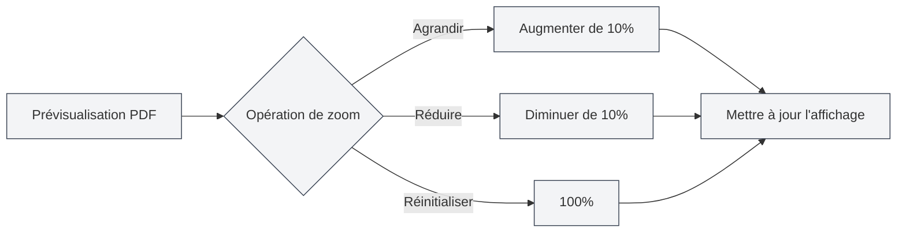

# Fonctionnalité de prévisualisation PDF

## Vue d'ensemble

La fonctionnalité de prévisualisation PDF vous permet de visualiser en temps réel l'effet du PDF compilé pendant que vous éditez un document LaTeX. Le panneau de prévisualisation offre des fonctionnalités interactives riches, incluant le zoom, le changement de page, le positionnement, etc., vous permettant d'éditer et de déboguer vos documents LaTeX efficacement.

La prévisualisation PDF s'affiche automatiquement après une compilation LaTeX réussie. Elle prend en charge un positionnement bidirectionnel avec l'éditeur de code, facilitant la navigation rapide entre le PDF et le code source.

<PdfPreviewPanel mode="demo" pdfUrl="" />

## Présentation de la prévisualisation PDF

### Panneau de prévisualisation

Le panneau de prévisualisation PDF s'affiche à droite ou en dessous de l'éditeur LaTeX et contient :

- **Zone de contenu PDF** : affiche le contenu des pages du PDF
- **Barre d'outils** : propose des boutons d'action pour le zoom, le changement de page, l'actualisation, etc.
- **Informations sur la page** : affiche le numéro de page actuel et le nombre total de pages

L'interface du panneau de prévisualisation PDF est la suivante :

<PdfPreviewPanel mode="demo" pdfUrl="" />

<LaTeXCompilerPanel mode="demo" />

### Affichage automatique

La prévisualisation PDF s'affiche automatiquement dans les cas suivants :

- **Compilation réussie** : s'affiche automatiquement après une compilation LaTeX réussie
- **Ouverture de document** : s'affiche automatiquement à l'ouverture d'un document LaTeX existant avec un PDF
- **Ouverture manuelle** : cliquer sur le bouton "Prévisualiser" de la barre d'outils pour l'ouvrir manuellement

<PdfPreviewPanel mode="demo" pdfUrl="" />

## Zoom PDF

### Agrandir le PDF

Pour agrandir la prévisualisation PDF :

- **Bouton de la barre d'outils** : cliquer sur le bouton "Agrandir" (icône +) de la barre d'outils
- **Molette de la souris** : maintenir la touche `Ctrl` et faire défiler la molette vers le haut
- **Raccourci clavier** : `Ctrl+=` (si configuré)

Chaque agrandissement augmente le niveau de zoom de 10%.

<LaTeXEditorDemo mode="demo" />

### Réduire le PDF

Pour réduire la prévisualisation PDF :

- **Bouton de la barre d'outils** : cliquer sur le bouton "Réduire" (icône -) de la barre d'outils
- **Molette de la souris** : maintenir la touche `Ctrl` et faire défiler la molette vers le bas
- **Raccourci clavier** : `Ctrl+-` (si configuré)

Chaque réduction diminue le niveau de zoom de 10%.

### Réinitialiser le zoom

Pour réinitialiser le zoom PDF à 100% :

- **Bouton de la barre d'outils** : cliquer sur le bouton "Réinitialiser le zoom" de la barre d'outils
- **Raccourci clavier** : `Ctrl+0` (si configuré)

### Plage de zoom

La plage de zoom prise en charge pour le PDF est :

- **Valeur minimale** : 20% (x0.2)
- **Valeur maximale** : 500% (x5)
- **Valeur par défaut** : 100% (x1)

Le niveau de zoom est automatiquement limité à la plage valide.

<PdfPreviewPanel mode="demo" pdfUrl="" />

## Actualisation PDF

### Actualisation manuelle

Pour actualiser manuellement la prévisualisation PDF :

- **Bouton de la barre d'outils** : cliquer sur le bouton "Actualiser" de la barre d'outils
- **Raccourci clavier** : `F5` (si configuré)

L'actualisation recharge le fichier PDF et affiche le résultat de la compilation le plus récent.

### Actualisation automatique

La prévisualisation PDF s'actualise automatiquement dans les cas suivants :

- **Compilation réussie** : s'actualise automatiquement après une compilation LaTeX réussie
- **Mise à jour du fichier PDF** : s'actualise automatiquement lors de la détection d'une mise à jour du fichier PDF

### Moments pour actualiser

Il est recommandé d'actualiser le PDF dans les situations suivantes :

- **Après modification du code** : après avoir modifié le code LaTeX et recompilé
- **Prévisualisation anormale** : lorsque l'affichage de la prévisualisation PDF est anormal ou incorrect
- **Édition prolongée** : après une longue période d'édition pour voir l'effet le plus récent

<LaTeXEditorDemo mode="demo" />

## Positionnement du PDF vers le code

### Du PDF vers le code

En cliquant sur un emplacement dans la prévisualisation PDF, l'éditeur saute automatiquement vers la position correspondante dans le code LaTeX :

1. **Cliquer sur un emplacement PDF** : cliquer sur l'emplacement à consulter dans la prévisualisation PDF
2. **Saut automatique** : l'éditeur saute automatiquement vers le code LaTeX correspondant
3. **Mise en surbrillance** : la ligne de code correspondante est mise en surbrillance

Cette fonctionnalité vous permet de passer rapidement de l'effet PDF au code source, facilitant le débogage et les modifications.

<PdfPreviewPanel mode="demo" pdfUrl="" />

### Du code vers le PDF

Dans l'éditeur LaTeX, vous pouvez :

1. **Sélectionner du code** : sélectionner le code LaTeX à consulter
2. **Menu contextuel** : clic droit et sélectionner "Positionner vers le PDF"
3. **Saut de prévisualisation** : la prévisualisation PDF saute automatiquement vers l'emplacement correspondant

### Positionnement bidirectionnel

Fonctionnalité de positionnement bidirectionnel entre le PDF et le code :

- **PDF → Code** : cliquer sur un emplacement PDF pour sauter vers le code
- **Code → PDF** : sélectionner du code pour sauter vers l'emplacement PDF
- **Défilement synchronisé** : prend en charge le défilement synchronisé entre le PDF et le code

<ConsoleTerminal mode="demo" consoleKey="demo" :history='[{"content": "Navigation dans les pages PDF...", "type": "out"}]' />

## Navigation dans les pages PDF

### Opérations de changement de page

La prévisualisation PDF prend en charge les opérations de changement de page suivantes :

- **Page précédente** : cliquer sur le bouton "Page précédente" de la barre d'outils, ou utiliser les touches directionnelles
- **Page suivante** : cliquer sur le bouton "Page suivante" de la barre d'outils, ou utiliser les touches directionnelles
- **Aller à une page** : saisir un numéro de page dans la zone de saisie et appuyer sur Entrée

### Informations sur la page

La prévisualisation PDF affiche les informations de page suivantes :

- **Numéro de page actuel** : affiche le numéro de la page en cours de consultation
- **Nombre total de pages** : affiche le nombre total de pages du PDF
- **Zone de saisie du numéro de page** : permet de saisir directement un numéro de page pour y accéder

### Affichage multipage

La prévisualisation PDF prend en charge le mode d'affichage multipage :

- **Mode page unique** : affiche une page à la fois
- **Mode multipage** : affiche plusieurs pages à la fois (dans la prévisualisation principale)

Le mode multipage est adapté pour parcourir rapidement l'ensemble du document.

<PdfPreviewPanel mode="demo" pdfUrl="" />

## Enregistrement PDF

### Enregistrer le PDF

Pour enregistrer le fichier PDF actuel :

- **Bouton de la barre d'outils** : cliquer sur le bouton "Enregistrer" de la barre d'outils
- **Menu** : cliquer sur "Fichier" → "Enregistrer le PDF"
- **Raccourci clavier** : `Ctrl+S` (si le PDF est le document actif)

L'enregistrement du PDF sauvegarde le fichier PDF dans le même répertoire que le document.

### Ouvrir le répertoire PDF

Pour ouvrir le répertoire contenant le fichier PDF :

- **Bouton de la barre d'outils** : cliquer sur le bouton "Ouvrir le répertoire" de la barre d'outils
- **Menu** : cliquer sur "Fichier" → "Ouvrir le répertoire PDF"

Après ouverture du répertoire, vous pouvez consulter et gérer le fichier PDF dans l'explorateur de fichiers.

<LaTeXEditorDemo mode="demo" />

## Modes d'interaction PDF

### Mode pointeur

Le mode pointeur est le mode d'interaction par défaut :

- **Sélectionner du texte** : permet de sélectionner du texte dans le PDF
- **Copier du texte** : permet de copier le texte sélectionné
- **Cliquer pour positionner** : cliquer sur un emplacement PDF permet de se positionner sur le code

### Mode main

Le mode main est utilisé pour faire glisser le PDF :

- **Faire glisser le PDF** : maintenir le bouton gauche de la souris pour faire glisser le contenu du PDF
- **Déplacer la vue** : déplacer la position de la vue du PDF
- **Adapté aux grands PDF** : adapté pour consulter des PDF de grande taille

Pour changer de mode :

- **Bouton de la barre d'outils** : cliquer sur le bouton de changement de mode de la barre d'outils
- **Raccourci clavier** : touche `H` pour basculer en mode main

## Astuces d'utilisation

### Prévisualisation efficace

1. **Utiliser le zoom** : ajuster un niveau de zoom approprié selon le contenu
2. **Utiliser le positionnement** : utiliser la fonction de positionnement pour basculer rapidement entre le code et le PDF
3. **Utiliser l'actualisation** : actualiser après modification du code pour voir l'effet rapidement

### Astuces de débogage

1. **Localiser les erreurs** : se positionner du PDF vers le code pour trouver rapidement l'emplacement du problème
2. **Comparer les effets** : comparer l'effet PDF et le code pour vérifier la justesse du formatage
3. **Parcourir plusieurs pages** : utiliser le mode multipage pour parcourir rapidement l'ensemble du document

### Optimisation des performances

1. **Zoom raisonnable** : ne pas utiliser un niveau de zoom excessif
2. **Fermer la prévisualisation** : fermer le panneau de prévisualisation lorsqu'il n'est pas nécessaire pour économiser des ressources
3. **Stratégie d'actualisation** : choisir l'actualisation automatique ou manuelle selon les besoins

## Questions fréquentes

### Q : La prévisualisation PDF ne s'affiche pas ?

R : Assurez-vous que le document LaTeX a été compilé avec succès. Si la compilation échoue, la prévisualisation PDF ne s'affichera pas. Vérifiez les messages d'erreur dans la sortie de la console.

### Q : La prévisualisation PDF ne se met pas à jour ?

R : Cliquez sur le bouton "Actualiser" pour rafraîchir manuellement la prévisualisation, ou recompilez le document LaTeX. Assurez-vous que le fichier PDF a été généré avec succès.

### Q : Comment se positionner du PDF vers le code ?

R : Cliquez sur l'emplacement à consulter dans la prévisualisation PDF, l'éditeur sautera automatiquement vers le code LaTeX correspondant.

### Q : Comment se positionner du code vers le PDF ?

R : Sélectionnez le code LaTeX, faites un clic droit et choisissez "Positionner vers le PDF", la prévisualisation PDF sautera automatiquement vers l'emplacement correspondant.

### Q : Le zoom PDF ne fonctionne pas ?

R : Assurez-vous que le panneau de prévisualisation PDF est complètement chargé. Si le problème persiste, essayez d'actualiser la prévisualisation PDF.

## Documentation associée

- [[latex.compilation|Compilation et prévisualisation LaTeX]]
- [[latex.editor|Guide d'utilisation de l'éditeur LaTeX]]
- [[latex.console|Sortie de la console]]

<LaTeXCompilerPanel mode="demo" />

<LaTeXEditorDemo mode="demo" />

<ConsoleTerminal mode="demo" consoleKey="demo" :history='[{"content": "Journal de compilation...", "type": "out"}]' />
