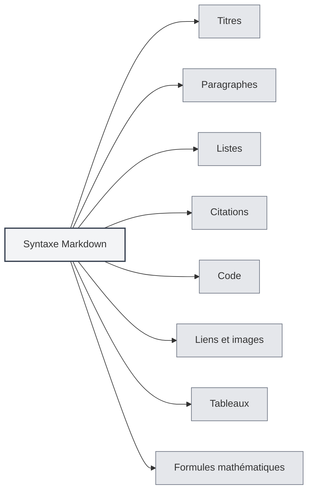

# Syntaxe Markdown

## Vue d'ensemble

Markdown est un langage de balisage léger qui vous permet de rédiger des documents en utilisant un format de texte brut facile à lire et à écrire. MetaDoc offre une prise en charge complète de l'édition et de la prévisualisation Markdown.

<ViewMenuItemsDemo mode="demo" :items='["outline", "preview"]' />

## Syntaxe de base

### Titres

Utilisez le symbole `#` pour créer un titre. Le nombre de `#` indique le niveau du titre :

```markdown
# Titre de niveau 1

## Titre de niveau 2

### Titre de niveau 3
```



### Paragraphes

Séparez les paragraphes par une ligne vide.

### Listes

**Liste non ordonnée** : utilisez `-`, `*` ou `+` :

```markdown
- Élément 1
- Élément 2
- Élément 3
```

**Liste ordonnée** : utilisez des chiffres :

```markdown
1. Premier élément
2. Deuxième élément
3. Troisième élément
```

### Citations

Utilisez `>` pour créer une citation :

```markdown
> Ceci est un texte de citation
```

### Code

**Code en ligne** : utilisez des accents graves :

```markdown
Utilisez `console.log()` pour afficher du contenu
```

**Bloc de code** : utilisez trois accents graves :

````markdown
```javascript
function hello() {
  console.log('Hello, World!')
}
```
````

### Liens et images

**Lien** :

```markdown
[Texte du lien](https://example.com)
```

**Image** :

```markdown

```

### Tableaux

```markdown
| Colonne 1 | Colonne 2 | Colonne 3 |
| --------- | --------- | --------- |
| Donnée 1  | Donnée 2  | Donnée 3  |
```

## Formules mathématiques

### Formule en ligne

Encadrez avec `$` :

```markdown
Voici une formule en ligne : $E = mc^2$
```

### Formule en bloc

Encadrez avec `$$` :

```markdown
$$
\int_{-\infty}^{\infty} e^{-x^2} dx = \sqrt{\pi}
$$
```

## Fonctionnalités avancées

### Conversion de formules LaTeX

MetaDoc prend en charge la conversion des formules mathématiques en Markdown au format LaTeX. Voir [[latex.basics|Syntaxe LaTeX]].

### Prise en charge des diagrammes

MetaDoc prend en charge plusieurs formats de diagrammes :

- [[charts.mermaid|Diagrammes Mermaid]]
- [[charts.plantuml|Diagrammes PlantUML]]
- [[charts.echarts|Diagrammes ECharts]]

## Documentation associée

- [[markdown.editor|Guide d'utilisation de l'éditeur Markdown]]
- [[markdown.advanced|Fonctionnalités avancées de Markdown]]
- [[markdown.features|Fonctionnalités de l'éditeur Markdown]]
- [[core.editor-basics|Opérations de base de l'éditeur]]

<LaTeXEditorDemo mode="demo" />

<Outline mode="demo" />

<ViewMenuItemsDemo mode="demo" :items='["outline"]' />

<MenuItemsDemo mode="demo" :items='[{"id": "file", "items": ["new", "open", "save"]}]' />

<TitleMenu mode="demo" title="Exemple de document Markdown" path="1" :tree='{}' />

<ViewMenuItemsDemo mode="demo" :items='["editor", "preview"]' />
