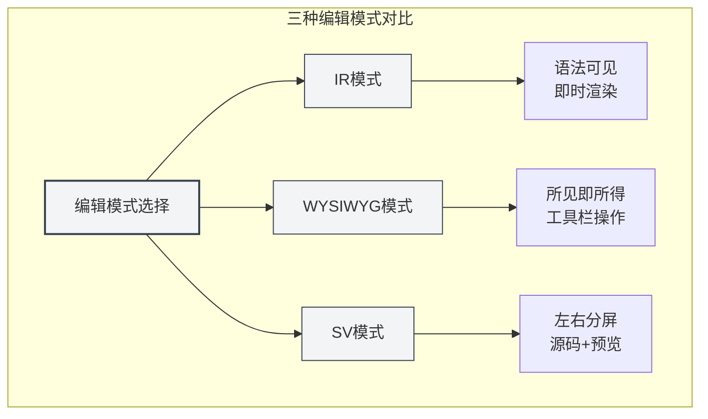
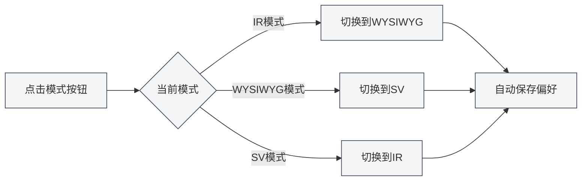
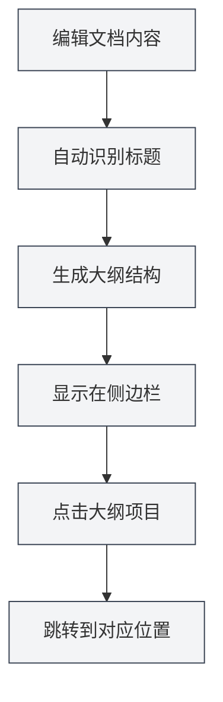
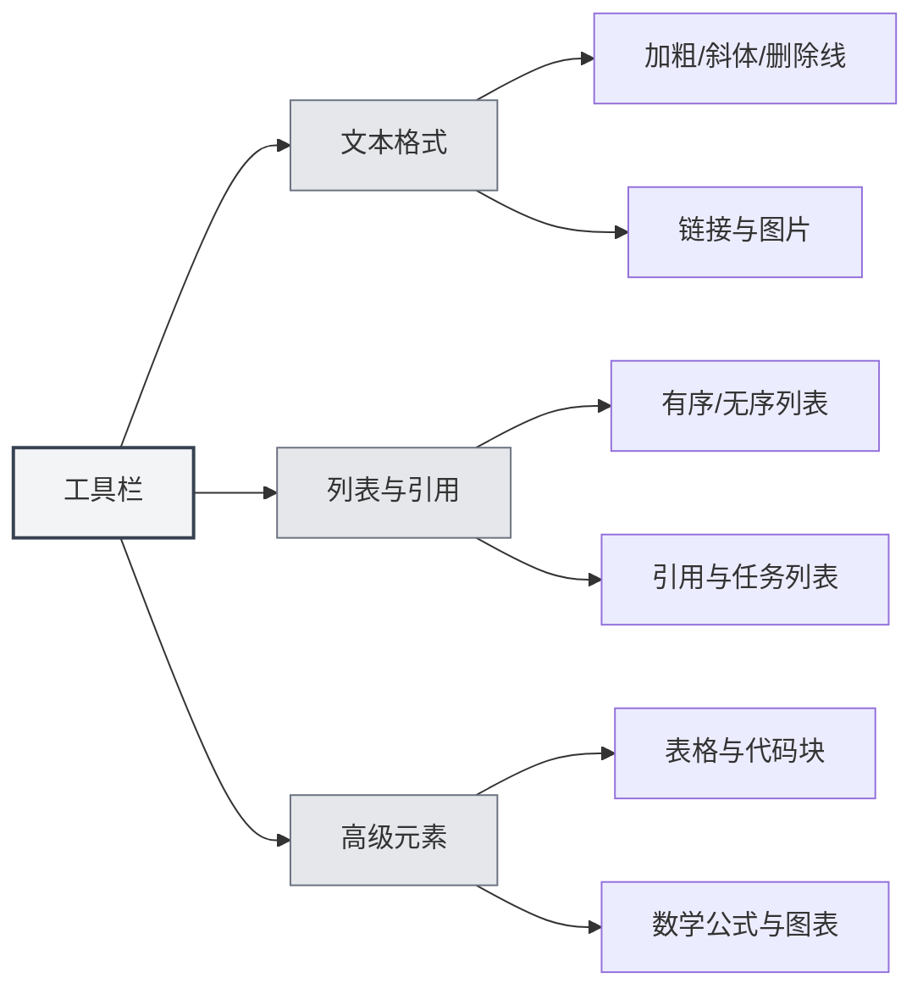

# Guide d'utilisation de l'éditeur Markdown

## Vue d'ensemble

L'éditeur Markdown de MetaDoc vous offre un environnement d'écriture professionnel et élégant. Il ne se contente pas d'être une simple zone de saisie de texte, mais constitue un espace de création profondément optimisé – prenant en charge trois modes d'édition flexibles, un aperçu en temps réel du contenu et de riches outils de mise en page, vous permettant de vous concentrer sur le contenu lui-même sans vous soucier du formatage.

Que vous rédigiez un blog technique, organisiez des notes d'apprentissage ou rédigiez la documentation d'un projet, cet éditeur répondra à vos besoins. En particulier, ses capacités d'IA profondément intégrées peuvent fournir des complétions et suggestions intelligentes pendant que vous écrivez, rendant la création plus fluide.

<TitleMenu mode="demo" title="Markdown编辑器示例" path="1" :tree='{}' />

<SectionOptimizer mode="demo" title="段落优化示例" path="1" :tree='{}' language="markdown" :adapter='null' />

<QuickStartMarkdown mode="demo" />

## Les trois modes d'édition

MetaDoc comprend que différents utilisateurs ont différentes habitudes d'édition, c'est pourquoi il propose trois modes d'édition parmi lesquels choisir :

### Mode IR (Rendu Instantané)

C'est le mode d'édition par défaut et le choix préféré de la plupart des utilisateurs Markdown. Dans ce mode :

- **Retour instantané** : Pendant que vous saisissez la syntaxe Markdown, le contenu s'affiche immédiatement sous sa forme formatée.
- **Syntaxe visible** : Les symboles de balisage Markdown (comme `#`, ` **`) restent visibles, vous permettant de contrôler le formatage avec précision.
- **Édition fluide** : La vitesse de rendu est rapide, même l'édition de longs documents ne provoque pas de ralentissement.
- **Convivial pour l'apprentissage** : Pour les utilisateurs apprenant la syntaxe Markdown, la correspondance entre la syntaxe et l'effet est visible immédiatement.

**Scénarios d'utilisation** :

- Utilisateurs familiers avec la syntaxe Markdown.
- Scénarios nécessitant un contrôle précis du formatage des documents.
- Édition de longs documents techniques ou d'articles de blog.

### Mode WYSIWYG (Ce que vous voyez est ce que vous obtenez)

Si vous êtes plus habitué à une expérience d'édition de type Word, ce mode vous semblera familier :

- **Édition directe** : Ce que vous voyez est le résultat final, vous pouvez cliquer directement pour éditer.
- **Pas besoin de mémoriser la syntaxe** : Effectuez des opérations comme le gras, les titres, les listes via les boutons de la barre d'outils.
- **Opérations intuitives** : Sélectionnez du texte et cliquez sur un bouton pour appliquer le formatage.
- **Réduction de la courbe d'apprentissage** : Les utilisateurs peu familiers avec la syntaxe Markdown peuvent démarrer rapidement.

**Scénarios d'utilisation** :

- Utilisateurs découvrant Markdown pour la première fois.
- Scénarios nécessitant une mise en page rapide, sans se préoccuper de la syntaxe sous-jacente.
- Utilisateurs préférant l'édition visuelle.

### Mode SV (Aperçu en Split View)

Ce mode divise la zone d'édition en deux :

- **Comparaison côte à côte** : Le côté gauche affiche le code source Markdown, le côté droit affiche l'effet rendu.
- **Synchronisation en temps réel** : Lorsque vous éditez à gauche, l'aperçu se met à jour instantanément à droite.
- **Outil d'apprentissage puissant** : Permet de voir simultanément la syntaxe et le résultat final, renforçant la compréhension de Markdown.
- **Vérification précise** : Facilite la vérification de la correction des formats complexes (comme les tableaux, les listes imbriquées).

**Scénarios d'utilisation** :

- Utilisateurs apprenant la syntaxe Markdown.
- Besoin de vérifier en regardant à la fois le code source et le résultat.
- Édition de documents contenant des formats complexes.



### Comment changer de mode

Changer de mode d'édition est très simple :

1. **Bouton de la barre d'outils** : Trouvez le bouton de changement de mode dans la barre d'outils en haut de l'éditeur.
2. **Changement cyclique** : Cliquer sur le bouton fait basculer entre les trois modes.
3. **Mémorisation des préférences** : Le système mémorise le dernier mode utilisé et le restaure automatiquement à l'ouverture suivante du document.



## Aperçu en temps réel

La fonction d'aperçu en temps réel de MetaDoc rend l'écriture agréable :

- **Rendu automatique** : Vous saisissez du contenu à gauche, l'effet rendu s'affiche immédiatement à droite (ou en dessous).
- **Prise en charge complète** : Des titres et listes de base aux formules mathématiques et diagrammes complexes, tout est correctement rendu.
- **Coloration syntaxique** : Les blocs de code sont automatiquement colorés selon le type de langage, rendant le code plus lisible.
- **Formules mathématiques** : Prend en charge les formules mathématiques en syntaxe LaTeX, qu'il s'agisse de formules en ligne `$E=mc^2$` ou de blocs de formules indépendants, tout s'affiche parfaitement.
- **Images adaptatives** : Les images insérées s'adaptent automatiquement à la largeur de l'éditeur, un clic permet de les agrandir pour les visualiser.

## Synchronisation du plan

Naviguer dans un long document n'a jamais été aussi simple :

- **Extraction automatique** : L'éditeur identifie automatiquement les titres dans le document et génère un plan hiérarchique clair.
- **Mise à jour en temps réel** : Lorsque vous ajoutez, modifiez ou supprimez un titre, le plan se met à jour en synchronisation.
- **Navigation en un clic** : Cliquez sur n'importe quel titre dans le plan, l'éditeur saute immédiatement à la position correspondante.
- **Aperçu de la structure** : Le plan permet de comprendre rapidement la structure globale du document.

Vous pouvez accéder à la vue Plan via la barre latérale :

<ViewMenuItemsDemo mode="demo" :items='["editor", "outline"]' />



Pour une présentation détaillée de la fonction Plan, consultez [[outline.basics|Fonctionnalités de la vue Plan]].

## Fonctions de la barre d'outils

La barre d'outils en haut de l'éditeur regroupe les fonctions de mise en page les plus utilisées :



### Formatage de texte

- **Gras** (`Ctrl+B`) : Rendez le contenu important plus visible.
- **Italique** (`Ctrl+I`) : Utilisé pour l'emphase ou pour indiquer une signification spéciale.
- **Barré** : Indique un contenu obsolète ou modifié.
- **Code en ligne** : Marque des fragments de code ou des termes techniques.
- **Lien** (`Ctrl+K`) : Insère un hyperlien cliquable.
- **Image** : Insère une image locale ou une image web.

### Listes et citations

- **Liste non ordonnée** : Énumère le contenu avec des puces.
- **Liste ordonnée** : Énumère le contenu avec une numérotation.
- **Bloc de citation** : Cite le point de vue d'autrui ou une note importante.
- **Liste de tâches** : Liste de choses à faire avec des cases à cocher.

### Éléments avancés

- **Tableau** : Crée des tableaux de données structurés, prenant en charge l'alignement et l'imbrication.
- **Bloc de code** : Insère du code multiligne, prenant en charge la coloration syntaxique pour des dizaines de langages de programmation.
- **Formule mathématique** : Insère des formules mathématiques en utilisant la syntaxe LaTeX.
- **Diagramme** : Insère des diagrammes Mermaid, PlantUML, ECharts, etc.

## Raccourcis clavier

Maîtriser les raccourcis clavier peut considérablement améliorer l'efficacité de l'écriture :

### Raccourcis de formatage

| Opération     | Windows/Linux  | macOS         |
| ------------- | -------------- | ------------- |
| Gras          | `Ctrl+B`       | `Cmd+B`       |
| Italique      | `Ctrl+I`       | `Cmd+I`       |
| Insérer un lien | `Ctrl+K`       | `Cmd+K`       |
| Insérer du code | `Ctrl+Shift+K` | `Cmd+Shift+K` |

### Raccourcis d'édition

| Opération | Windows/Linux | macOS         |
| --------- | ------------- | ------------- |
| Annuler   | `Ctrl+Z`      | `Cmd+Z`       |
| Rétablir  | `Ctrl+Y`      | `Cmd+Shift+Z` |
| Tout sélectionner | `Ctrl+A` | `Cmd+A`       |
| Rechercher | `Ctrl+F`      | `Cmd+F`       |

## Astuces d'utilisation

### Saisie rapide

1. **Créer un titre rapidement** : Saisissez `#` puis appuyez sur Espace, cela se transforme automatiquement en format titre.
2. **Créer une liste rapidement** : Saisissez `-` ou `*` puis appuyez sur Espace, cela se transforme automatiquement en élément de liste.
3. **Insérer un bloc de code rapidement** : Saisissez trois backticks ` ``` ` puis appuyez sur Entrée.
4. **Insérer une ligne de séparation rapidement** : Saisissez trois tirets `---` puis appuyez sur Entrée.

### Astuces de formatage

1. **Formater après sélection** : Sélectionnez d'abord le texte, puis cliquez sur le bouton de la barre d'outils ou utilisez le raccourci clavier.
2. **Remplacer en masse** : Utilisez la fonction de recherche-remplacement (`Ctrl+H`) pour modifier le formatage en masse.
3. **Coloration syntaxique** : Spécifiez le langage sur la première ligne du bloc de code, par exemple ````python`.

### Astuces d'aperçu

1. **Aperçu par changement de mode** : En mode SV, vous pouvez voir à la fois le code source et le résultat.
2. **Aperçu des formules mathématiques** : Entourez la formule avec `$` pour voir l'effet de rendu en temps réel.
3. **Rendu en temps réel des diagrammes** : Les diagrammes Mermaid sont automatiquement rendus après l'édition.

## Questions fréquentes

### Q : Comment insérer une image ?

R : Il y a trois façons :

1. Cliquez sur le bouton Image de la barre d'outils.
2. Utilisez le raccourci clavier `Ctrl+Shift+I`.
3. Collez directement une image depuis le presse-papiers.

Les images peuvent être enregistrées dans le répertoire local du document ou téléchargées vers un hébergeur d'images.

### Q : Comment créer un tableau ?

R : Il est recommandé d'utiliser le bouton Tableau de la barre d'outils pour créer un tableau visuellement. Vous pouvez également saisir manuellement la syntaxe Markdown pour les tableaux :

```markdown
| Colonne 1 | Colonne 2 | Colonne 3 |
| --------- | --------- | --------- |
| Contenu   | Contenu   | Contenu   |
```

### Q : Que faire si une formule mathématique ne s'affiche pas ?

R : Vérifiez que la syntaxe est correcte :

- Formule en ligne : Entourez avec un seul `$`, par exemple `$E=mc^2$`.
- Formule indépendante : Entourez avec deux `$$`, sur une ligne dédiée.

### Q : Comment voir le plan du document ?

R : Cliquez sur l'icône "Plan" dans la barre latérale, ou utilisez le raccourci clavier pour basculer vers la vue Plan. Les titres du document sont automatiquement extraits pour former le plan.

### Q : Le contenu est-il perdu après un changement de mode d'édition ?

R : Non. Les trois modes partagent le même contenu de document. Changer de mode modifie seulement la façon d'afficher et d'éditer, le contenu est entièrement conservé.

## Documentation connexe

- [[markdown.basics|Syntaxe Markdown]] - Apprendre les bases de la syntaxe Markdown.
- [[markdown.features|Fonctionnalités de l'éditeur Markdown]] - Découvrir plus de fonctionnalités avancées.
- [[core.editor-basics|Opérations de base de l'éditeur]] - Astuces d'édition générales.
- [[core.editor-settings|Paramètres de l'éditeur]] - Configuration personnalisée.
- [[outline.basics|Fonctionnalités de la vue Plan]] - Comprendre en profondeur la fonction Plan.

<LaTeXEditorDemo mode="demo" />

<Outline mode="demo" />

<MenuItemsDemo mode="demo" :items='[{"id": "file", "items": ["new", "open", "save"]}]' />

<TitleMenu mode="demo" title="Markdown编辑器示例" path="1" :tree='{}' />

<SectionOptimizer mode="demo" title="段落优化示例" path="1" :tree='{}' language="markdown" :adapter='null' />