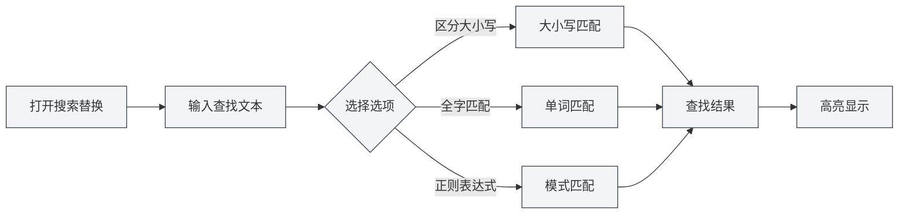
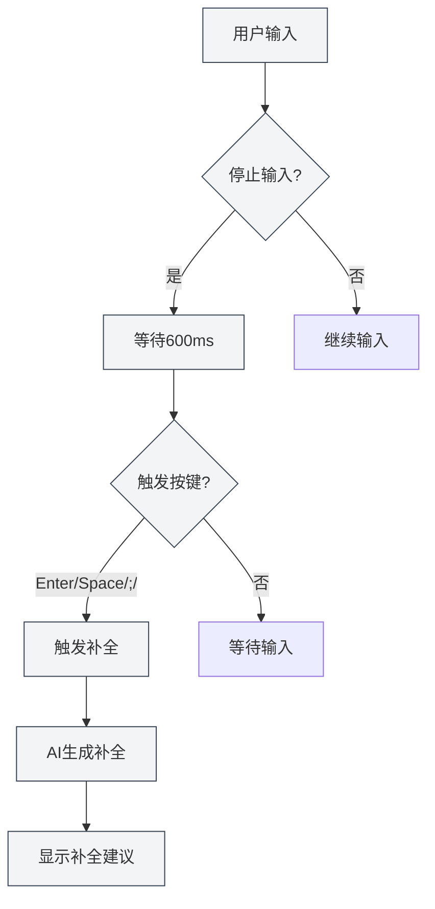

# Fonctionnalités de l'éditeur Markdown

## Vue d'ensemble

L'éditeur Markdown offre de riches fonctionnalités, incluant la recherche et le remplacement, le menu contextuel, la complétion automatique par IA, l'intégration de base de connaissances, etc. Ces fonctionnalités peuvent améliorer significativement votre efficacité d'édition et la qualité de vos documents.

Ce document présente les différentes fonctionnalités de l'éditeur Markdown et leur mode d'utilisation.

## Recherche et remplacement

### Ouvrir la recherche et le remplacement

Il existe plusieurs façons d'ouvrir la fonctionnalité de recherche et remplacement :

- **Raccourci clavier** : `Ctrl+F` pour ouvrir la recherche, `Ctrl+H` pour ouvrir la recherche et remplacement
- **Menu** : Cliquez sur "Édition" → "Rechercher" ou "Remplacer"
- **Barre d'outils** : Cliquez sur l'icône de recherche dans la barre d'outils

Vous pouvez accéder aux opérations sur les fichiers via le menu Fichier de la barre de menu supérieure, et aux fonctions d'édition via le menu Édition :

<MenuItemsDemo mode="demo" :items='[{"id": "file", "items": ["new", "open", "save"]}]' />

### Fonction de recherche

La fonction de recherche prend en charge les options suivantes :

- **Sensible à la casse** : Ne correspond qu'au texte ayant exactement la même casse
- **Mot entier** : Ne correspond qu'aux mots complets (ne correspond pas à une partie d'un mot)
- **Expression régulière** : Utilise des expressions régulières pour la correspondance de motifs
- **Conserver la casse** : Conserve le formatage de la casse du texte original lors du remplacement

L'interface du menu de recherche et remplacement est la suivante :

<SearchReplaceMenu mode="demo" :adapter='null' />

### Fonction de remplacement

La fonction de remplacement prend en charge :

- **Remplacer un par un** : Remplacer les textes correspondants un par un
- **Tout remplacer** : Remplacer tous les textes correspondants en une fois
- **Aperçu du remplacement** : Prévisualiser le résultat avant de remplacer

### Liste des correspondances

Le panneau de recherche et remplacement affiche une liste des correspondances :

- **Afficher l'emplacement** : Affiche le numéro de ligne et de colonne de chaque correspondance
- **Aperçu du contexte** : Affiche le contenu contextuel de la correspondance
- **Navigation rapide** : Cliquer sur une correspondance permet de sauter rapidement à sa position

### Astuces d'utilisation

1. **Expressions régulières** : Utiliser des expressions régulières permet des modèles de recherche et remplacement complexes
2. **Remplacement par lot** : Utiliser "Tout remplacer" permet de modifier rapidement un document par lots
3. **Conserver le formatage** : Utiliser l'option "Conserver la casse" permet de maintenir le formatage de la casse du texte original

## Menu contextuel

### Opérations d'édition de base

Le menu contextuel offre les opérations d'édition de base suivantes :

- **Couper** : `Ctrl+X` ou clic droit et sélection de "Couper"
- **Copier** : `Ctrl+C` ou clic droit et sélection de "Copier"
- **Coller** : `Ctrl+V` ou clic droit et sélection de "Coller"
- **Tout sélectionner** : `Ctrl+A` ou clic droit et sélection de "Tout sélectionner"

### Fonctionnalités IA

Le menu contextuel offre les fonctionnalités IA suivantes :

- **Analyse IA** : Analyse le contenu du document actuel, ouvre la fenêtre de dialogue IA
- **Optimisation de paragraphe** : Optimise le contenu du paragraphe actuel
- **Insérer un graphique** : Utilise l'IA pour générer du code de graphique et l'insère dans le document

### Activation/Désactivation des fonctionnalités

Le menu contextuel permet d'activer/désactiver rapidement les fonctionnalités suivantes :

- **Complétion automatique IA** : Activer/désactiver la fonction de complétion automatique par IA
- **Intégration de base de connaissances** : Activer/désactiver la fonction d'intégration de base de connaissances

### Déclenchement manuel de la complétion

Le menu contextuel offre l'option "Déclencher manuellement la complétion" :

- **Raccourci clavier** : `Shift+Tab`
- **Menu contextuel** : Clic droit et sélection de "Déclencher manuellement la complétion"

Le déclenchement manuel de la complétion lance immédiatement la complétion IA, sans attendre le déclenchement automatique.

## Complétion automatique IA

### Activer/Désactiver

La fonction de complétion automatique IA peut être activée ou désactivée aux emplacements suivants :

- **Menu contextuel** : Clic droit et sélection de "Activer/Désactiver la complétion automatique IA"
- **Page des paramètres** : Configurer les options de complétion automatique IA dans les paramètres

### Déclenchement automatique

La complétion automatique IA se déclenche automatiquement dans les situations suivantes :

- **Arrêt de la saisie** : Déclenchement automatique après 600 ms d'arrêt de la saisie
- **Touches de déclenchement** : Déclenchement après la saisie de touches spécifiques (Entrée, Espace, `;`, `,`)

### Déclenchement manuel

Méthodes de déclenchement manuel de la complétion :

- **Raccourci clavier** : `Shift+Tab`
- **Menu contextuel** : Clic droit et sélection de "Déclencher manuellement la complétion"

Le déclenchement manuel lance immédiatement la complétion, en contournant le délai du déclenchement automatique.

### Mode de complétion

La complétion automatique IA prend en charge deux modes :

- **Génération complète** : Génère un contenu de complétion complet
- **Génération partielle** : Génère uniquement une partie du contenu (selon les paramètres)

Le mode de complétion peut être configuré dans les paramètres.

### Configuration des touches de déclenchement

Les touches de déclenchement de la complétion peuvent être configurées dans les paramètres :

- **Entrée** : Déclenchement par la touche Entrée
- **Espace** : Déclenchement par la barre d'espace
- **;** : Déclenchement par le point-virgule
- **,** : Déclenchement par la virgule

Il est possible d'activer plusieurs touches de déclenchement simultanément.

### Nombre maximum de Tokens pour la complétion

Le nombre maximum de Tokens pour la complétion peut être configuré dans les paramètres :

- **Valeur minimale** : 20 Tokens
- **Valeur maximale** : Illimitée (définir à 0 signifie illimité)
- **Valeur par défaut** : 50 Tokens

Plus le nombre de Tokens est élevé, plus le contenu de la complétion est important, mais le temps de génération est également plus long.

### Accepter la complétion

Une fois la suggestion de complétion affichée, vous pouvez :

- **Touche Tab** : Accepter la suggestion de complétion
- **Touche Échap** : Annuler la suggestion de complétion
- **Continuer la saisie** : Annuler la complétion et continuer à saisir

<TitleMenu mode="demo" title="Markdown编辑器示例" path="1" :tree='{}' />

<SectionOptimizer mode="demo" title="段落优化示例" path="1" :tree='{}' language="markdown" :adapter='null' />

<ViewMenuItemsDemo mode="demo" :items='["editor", "outline", "agent"]' />

## Intégration de la base de connaissances

### Activer/Désactiver

La fonction d'intégration de la base de connaissances peut être activée ou désactivée aux emplacements suivants :

- **Menu contextuel** : Clic droit et sélection de "Activer/Désactiver la base de connaissances"
- **Page des paramètres** : Configurer les options de la base de connaissances dans les paramètres

### Recherche contextuelle

Une fois l'intégration de la base de connaissances activée, les fonctionnalités IA recherchent automatiquement le contenu pertinent dans la base de connaissances :

- **Complétion IA** : La complétion prend en compte le contenu pertinent de la base de connaissances
- **Analyse IA** : L'analyse du document utilise les connaissances de la base de connaissances
- **Optimisation de paragraphe** : L'optimisation du paragraphe fait référence au contenu de la base de connaissances

### Principe de recherche

La recherche dans la base de connaissances utilise la technologie de recherche vectorielle :

- **Correspondance sémantique** : Correspond au contenu pertinent en fonction de la similarité sémantique
- **Correspondance par mots-clés** : Utilise simultanément la correspondance par mots-clés pour améliorer la précision
- **Recherche hybride** : Combine la recherche vectorielle et la correspondance par mots-clés

### Seuil de confiance

La recherche dans la base de connaissances permet de définir un seuil de confiance :

- **Plage du seuil** : 0.0 - 1.0
- **Valeur par défaut** : 0.5
- **Effet** : Ne renvoie que le contenu dont la similarité est supérieure au seuil

Le seuil de confiance peut être configuré dans les paramètres, voir [[knowledge-base.config|Configuration de la base de connaissances]].

## Utilisation combinée des fonctionnalités

### Recherche et remplacement + Complétion IA

Combiner l'utilisation de la recherche et remplacement avec la complétion IA :

1. Utiliser la recherche et remplacement pour trouver le contenu à modifier
2. Utiliser la complétion IA pour générer le nouveau contenu
3. Utiliser la fonction de remplacement pour mettre à jour par lots

### Menu contextuel + Base de connaissances

Combiner l'utilisation du menu contextuel avec la base de connaissances :

1. Activer l'intégration de la base de connaissances
2. Utiliser les fonctionnalités IA du menu contextuel
3. Les fonctionnalités IA utilisent automatiquement le contenu de la base de connaissances

### Analyse IA + Optimisation de paragraphe

Combiner l'utilisation de l'analyse IA avec l'optimisation de paragraphe :

1. Utiliser l'analyse IA pour comprendre le contenu du document
2. Utiliser l'optimisation de paragraphe pour améliorer des paragraphes spécifiques
3. Optimiser en fonction des suggestions de l'analyse IA

## Astuces d'utilisation

### Améliorer la qualité de la complétion

1. **Activer la base de connaissances** : Activer l'intégration de la base de connaissances peut améliorer la qualité de la complétion
2. **Ajuster le nombre de Tokens** : Ajuster le nombre maximum de Tokens pour la complétion selon les besoins
3. **Déclenchement manuel** : Utiliser le déclenchement manuel si nécessaire pour obtenir de meilleurs résultats de complétion

### Recherche et remplacement efficaces

1. **Utiliser des expressions régulières** : Utiliser des expressions régulières pour les modèles complexes
2. **Prévisualiser le remplacement** : Prévisualiser le résultat avant de remplacer
3. **Opérations par lots** : Utiliser "Tout remplacer" pour modifier rapidement par lots

### Utilisation de la base de connaissances

1. **Ajouter des documents pertinents** : Ajouter des documents pertinents à la base de connaissances
2. **Ajuster le seuil de confiance** : Ajuster le seuil de confiance selon les besoins
3. **Mettre à jour régulièrement** : Mettre à jour régulièrement le contenu de la base de connaissances

## Questions fréquentes

### Q : La complétion IA ne s'affiche pas ?

R : Vérifiez si la complétion automatique IA est activée, assurez-vous que la configuration LLM est correcte. Essayez de déclencher manuellement la complétion (`Shift+Tab`).

### Q : La recherche et remplacement ne trouve pas le contenu ?

R : Vérifiez si les options "Sensible à la casse" ou "Mot entier" sont activées. Si vous utilisez une expression régulière, vérifiez qu'elle est correcte.

### Q : L'intégration de la base de connaissances ne fonctionne pas ?

R : Vérifiez si la base de connaissances est activée, assurez-vous qu'il y a des documents pertinents dans la base de connaissances. Ajuster le seuil de confiance peut aider à retrouver plus de contenu.

### Q : Comment désactiver la complétion IA ?

R : Dans le menu contextuel, sélectionnez "Désactiver la complétion automatique IA", ou désactivez l'option de complétion automatique IA dans les paramètres.

### Q : Le contenu de la complétion est inexact ?

R : Essayez d'activer l'intégration de la base de connaissances, ajustez le nombre maximum de Tokens pour la complétion, ou utilisez le déclenchement manuel pour de meilleurs résultats.

## Documents connexes

- [[markdown.editor|Guide d'utilisation de l'éditeur Markdown]]
- [[markdown.basics|Syntaxe Markdown]]
- [[ai.completion|Complétion automatique IA]]
- [[knowledge-base.usage|Utilisation de la base de connaissances]]
- [[core.editor-basics|Opérations de base de l'éditeur]]

<LaTeXEditorDemo mode="demo" />

<Outline mode="demo" />

<MenuItemsDemo mode="demo" :items='[{"id": "file", "items": ["new", "open", "save"]}]' />

<TitleMenu mode="demo" title="Markdown编辑器功能示例" path="1" :tree='{}' />

<SearchReplaceMenu mode="demo" :adapter='null' />

<ViewMenuItemsDemo mode="demo" :items='["editor", "outline", "agent"]' />

<MenuItemsDemo mode="demo" :items='[{"id": "edit", "items": ["find", "replace"]}]' />
