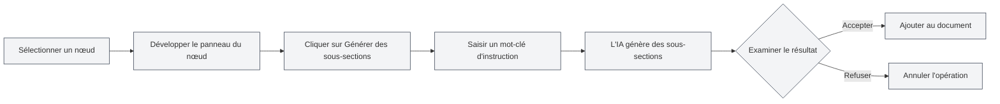
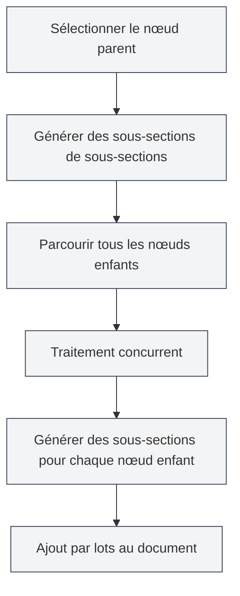

# Fonctionnalités IA de plan

## Vue d'ensemble

La fonctionnalité IA de plan utilise la technologie d'IA pour vous aider à générer et optimiser rapidement la structure de vos documents. Grâce à l'IA, vous pouvez générer des sous-sections, créer le contenu des chapitres, optimiser la structure du plan, etc., améliorant ainsi considérablement l'efficacité de la rédaction.

<Outline mode="demo" />

La fonctionnalité IA de plan prend en charge plusieurs modes d'opération, y compris les opérations sur un nœud unique et les opérations par lots, vous permettant d'utiliser l'assistance IA de manière flexible pour la création de documents.

<Outline mode="demo" />

## Générer des sous-sections

### Générer des sous-sections pour un nœud

Pour générer des sous-sections pour un nœud spécifique :

<OutlineAiToolbar mode="demo" />

1.  **Sélectionner un nœud** : Dans la vue Plan, sélectionnez le nœud pour lequel vous souhaitez générer des sous-sections.
2.  **Développer le nœud** : Cliquez sur le nœud pour ouvrir le panneau de détails.
3.  **Générer des sous-sections** : Cliquez sur le bouton "Générer des sous-sections".
4.  **Saisir une instruction** : Optionnellement, saisissez un mot-clé d'instruction pour guider la génération par l'IA.
5.  **Attendre la génération** : L'IA générera des sous-sections basées sur le titre et le contenu du nœud.
6.  **Confirmer l'acceptation** : Examinez le résultat généré et acceptez-le après confirmation.

Vous pouvez accéder à la vue Plan via la barre latérale :

<ViewMenuItemsDemo mode="demo" :items='["outline"]' />

Les sous-sections générées sont automatiquement ajoutées au document et la structure du plan est mise à jour.

### Principe de génération

<OutlineTreeDisplay mode="demo" />

Lors de la génération de sous-sections, l'IA prend en compte :

-   **Le titre du nœud** : Comprend le thème du chapitre à partir du titre du nœud.
-   **La structure du document** : Considère la structure globale du document.
-   **L'instruction utilisateur** : Ajuste le contenu généré en fonction des mots-clés d'instruction de l'utilisateur.
-   **Les exigences de format** : Génère le format de titre correct en fonction du format du document (Markdown/LaTeX).

### Astuces d'utilisation

1.  **Fournir des instructions claires** : Saisissez des mots-clés d'instruction précis pour guider l'IA vers la génération de sous-sections répondant à vos besoins.
2.  **Se référer à la structure existante** : L'IA s'appuie sur la structure existante du document pour maintenir une cohérence de style.
3.  **Générer plusieurs fois** : Si le résultat ne vous satisfait pas, vous pouvez générer plusieurs fois et choisir le meilleur résultat.

## Générer le contenu d'un chapitre

<Outline mode="demo" />

### Générer du contenu pour un nœud

Pour générer le contenu principal pour un nœud spécifique :

1.  **Sélectionner un nœud** : Dans la vue Plan, sélectionnez le nœud pour lequel vous souhaitez générer du contenu.
2.  **Développer le nœud** : Cliquez sur le nœud pour ouvrir le panneau de détails.
3.  **Générer du contenu** : Cliquez sur le bouton "Générer du contenu".
4.  **Saisir une instruction** : Optionnellement, saisissez un mot-clé d'instruction pour guider la génération par l'IA.
5.  **Définir le nombre de mots** : Optionnellement, définissez un nombre cible de mots.
6.  **Attendre la génération** : L'IA générera du contenu basé sur le titre du nœud et la structure du document.
7.  **Confirmer l'acceptation** : Examinez le résultat généré et acceptez-le après confirmation.

Le contenu généré est automatiquement ajouté au chapitre correspondant dans le document.

### Modes de génération de contenu

<OutlineAiToolbar mode="demo" />

La génération de contenu prend en charge les modes suivants :

-   **Génération complète** : Génère l'intégralité du contenu du chapitre.
-   **Génération partielle** : Génère uniquement une partie du contenu (selon les paramètres).
-   **Ajout de contenu** : Ajoute du nouveau contenu au contenu existant.

### Contrôle du nombre de mots

Vous pouvez définir un nombre cible de mots lors de la génération de contenu :

-   **Définir le nombre de mots** : Saisissez le nombre cible de mots dans la boîte de dialogue de génération.
-   **Ajustement par l'IA** : L'IA ajustera le niveau de détail du contenu généré en fonction de l'exigence de nombre de mots.
-   **Contrôle flexible** : Vous pouvez définir des nombres de mots différents selon l'importance du chapitre.

<OutlineTreeDisplay mode="demo" />

## Générer des sous-sections de sous-sections

### Génération par lots de sous-sections

Pour générer en masse des sous-sections pour tous les nœuds enfants d'un nœud spécifique :

1.  **Sélectionner un nœud** : Sélectionnez le nœud sur lequel effectuer l'opération par lots.
2.  **Développer le nœud** : Cliquez sur le nœud pour ouvrir le panneau de détails.
3.  **Générer des sous-sections de sous-sections** : Cliquez sur le bouton "Générer des sous-sections de sous-sections".
4.  **Saisir une instruction** : Saisissez un mot-clé d'instruction pour guider la génération par l'IA.
5.  **Attendre la génération** : L'IA traitera tous les nœuds enfants en parallèle, générant des sous-sections pour chacun.
6.  **Confirmer l'acceptation** : Examinez le résultat généré et acceptez-le après confirmation.

Cette fonctionnalité utilise un mécanisme de traitement concurrent, permettant de générer rapidement des sous-sections pour plusieurs chapitres en masse.

### Avantages du traitement concurrent

<OutlineAiToolbar mode="demo" />

La génération par lots utilise un mécanisme de traitement concurrent :

-   **Traitement efficace** : Traite plusieurs nœuds simultanément, multipliant la vitesse par plusieurs dizaines.
-   **Synchronisation automatique** : Synchronise automatiquement avec le document une fois la génération terminée.
-   **Affichage de la progression** : Affiche la progression de génération pour chaque nœud.

### Scénarios d'utilisation

Convient aux scénarios suivants :

-   **Génération à grande échelle** : Lorsque vous devez générer des sous-sections pour de nombreux chapitres.
-   **Opérations par lots** : Générer des sous-sections pour tous les chapitres en un clic.
-   **Génération structurée** : Générer du contenu en masse selon la structure du plan.

## Générer le contenu des sous-sections

### Génération par lots de contenu

Pour générer en masse du contenu pour tous les nœuds enfants d'un nœud spécifique :

1.  **Sélectionner un nœud** : Sélectionnez le nœud sur lequel effectuer l'opération par lots.
2.  **Développer le nœud** : Cliquez sur le nœud pour ouvrir le panneau de détails.
3.  **Générer le contenu des sous-sections** : Cliquez sur le bouton "Générer le contenu des sous-sections".
4.  **Saisir une instruction** : Saisissez un mot-clé d'instruction pour guider la génération par l'IA.
5.  **Définir le nombre de mots** : Optionnellement, définissez un nombre cible de mots.
6.  **Attendre la génération** : L'IA traitera tous les nœuds enfants en parallèle, générant du contenu pour chacun.
7.  **Confirmer l'acceptation** : Examinez le résultat généré et acceptez-le après confirmation.

Cette fonctionnalité permet de générer rapidement du contenu pour tous les chapitres d'un document entier.

### Génération récursive

La génération du contenu des sous-sections est traitée de manière récursive :

-   **Parcourir tous les nœuds enfants** : Parcourt récursivement tous les nœuds enfants.
-   **Générer du contenu** : Génère du contenu pour chaque nœud enfant.
-   **Maintenir la structure** : Préserve la structure hiérarchique du document.

### Suivi de la progression

La progression est affichée lors d'une génération par lots :

-   **Progression par nœud** : Affiche le nœud actuellement en cours de traitement.
-   **Progression globale** : Affiche la progression globale de la génération.
-   **Mise à jour en temps réel** : Met à jour le contenu généré en temps réel.

<Outline mode="demo" />

## Optimisation du plan

### Fonctionnalités d'optimisation

La fonction d'optimisation du plan peut vous aider à :

-   **Ajuster la structure** : Optimiser la structure et la hiérarchie du document.
-   **Optimiser les titres** : Optimiser la dénomination et le format des titres.
-   **Réorganiser la structure** : Réorganiser la structure du document.

### Opérations d'optimisation

L'optimisation du plan prend en charge les opérations suivantes :

-   **Déplacer un nœud** : Déplacer un nœud vers une nouvelle position.
-   **Supprimer un nœud** : Supprimer les nœuds inutiles.
-   **Ajuster le niveau hiérarchique** : Ajuster les relations hiérarchiques des nœuds.
-   **Fusionner des nœuds** : Fusionner des nœuds similaires.

### Utilisation de l'optimisation

<OutlineTreeDisplay mode="demo" />

1.  **Analyser la structure** : L'IA analyse la structure actuelle du document.
2.  **Fournir des suggestions** : Fournit des suggestions d'optimisation.
3.  **Appliquer l'optimisation** : Applique les résultats d'optimisation après confirmation.

## Configuration des fonctionnalités IA

### Réglage de la température

Vous pouvez définir le paramètre de température lors de la génération par IA :

-   **Plage de température** : 0.0 - 1.0
-   **Valeur par défaut** : Selon la configuration.
-   **Effet** : Contrôle la créativité de la génération par IA (plus la température est élevée, plus la génération est créative).

### Configuration des mots-clés d'instruction

Vous pouvez définir des mots-clés d'instruction pour chaque opération :

-   **Instruction générale** : Définir des mots-clés d'instruction généraux.
-   **Instruction par opération** : Définir des mots-clés d'instruction spécifiques pour chaque opération.
-   **Exigence de nombre de mots** : Inclure l'exigence de nombre de mots dans les mots-clés d'instruction.

### Reconnaissance du format

L'IA reconnaît automatiquement le format du document :

-   **Format Markdown** : Génère des titres et du contenu au format Markdown.
-   **Format LaTeX** : Génère des titres et du contenu au format LaTeX.
-   **Adaptation automatique** : Ajuste automatiquement le contenu généré en fonction du format du document.

## Astuces d'utilisation

### Génération efficace

1.  **Utiliser les opérations par lots** : Lorsque vous devez générer beaucoup de contenu, utilisez les opérations par lots pour améliorer l'efficacité.
2.  **Fournir des instructions claires** : Saisissez des mots-clés d'instruction clairs pour obtenir de meilleurs résultats.
3.  **Générer par étapes** : Générer d'abord la structure, puis le contenu, pour perfectionner progressivement le document.

### Contrôle de la qualité

1.  **Vérifier les résultats générés** : Après la génération, vérifiez attentivement les résultats pour vous assurer qu'ils répondent aux exigences.
2.  **Générer plusieurs fois** : Si vous n'êtes pas satisfait, vous pouvez générer plusieurs fois et choisir le meilleur résultat.
3.  **Ajuster manuellement** : Après la génération, vous pouvez ajuster et perfectionner manuellement le contenu.

### Planification de la structure

1.  **Planifier d'abord la structure** : Utilisez l'IA pour générer des sous-sections et planifier la structure du document.
2.  **Générer ensuite le contenu** : Une fois la structure déterminée, générez le contenu spécifique.
3.  **Perfectionner progressivement** : Perfectionnez le document étape par étape, ne générez pas tout le contenu en une seule fois.

## Questions fréquentes

### Q : Le contenu généré par l'IA est-il inexact ?

**R :** Le contenu généré par l'IA est fourni à titre indicatif uniquement. Il est recommandé de le vérifier et de l'ajuster après génération. Vous pouvez fournir des mots-clés d'instruction plus détaillés pour obtenir de meilleurs résultats.

### Q : La génération par lots est-elle lente ?

**R :** La génération par lots utilise un traitement concurrent et est déjà rapide. Si elle reste lente, cela peut être dû à des problèmes de réseau ou à une réponse lente du service d'IA.

### Q : Comment annuler une génération ?

**R :** Vous pouvez cliquer sur le bouton "Annuler" pendant la génération pour interrompre l'opération. Le contenu déjà généré ne sera pas perdu.

### Q : Le format du contenu généré est-il incorrect ?

**R :** L'IA reconnaît automatiquement le format du document. Si le format est incorrect, vérifiez les paramètres de format du document ou ajustez manuellement le contenu généré.

### Q : Puis-je modifier le contenu généré ?

**R :** Oui. Le contenu généré peut être édité et modifié à tout moment. La génération n'est qu'une aide à la création, le contenu final dépend de vous.

## Documentation associée

-   [[outline.basics|Fonctionnalités de la vue Plan]]
-   [[ai.llm-config|Configuration LLM]]
-   [[markdown.editor|Guide d'utilisation de l'éditeur Markdown]]
-   [[latex.editor|Guide d'utilisation de l'éditeur LaTeX]]

<Outline mode="demo" />

<OutlineAiToolbar mode="demo" />

<ViewMenuItemsDemo mode="demo" :items='["ai"]' />
