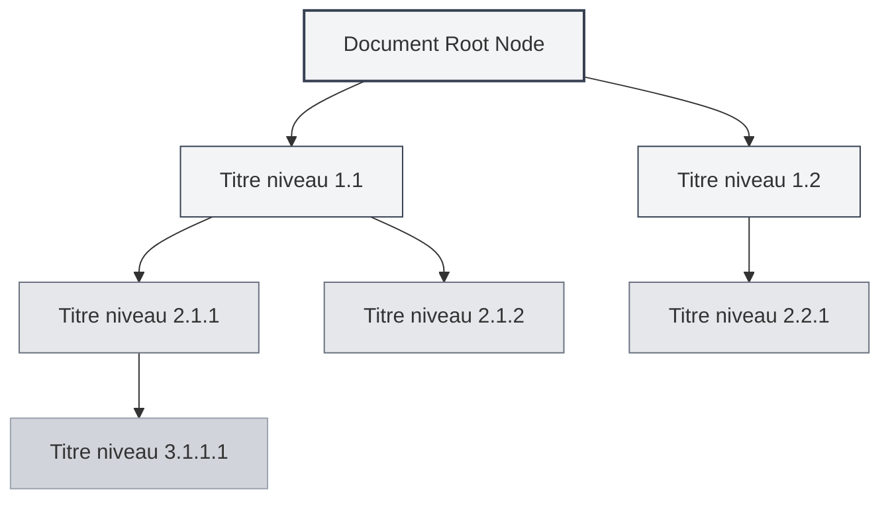
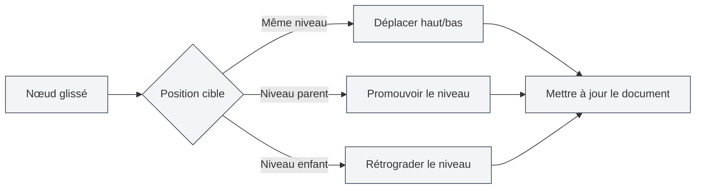

# Fonctionnalité de vue en plan

## Vue d'ensemble

La vue en plan affiche la hiérarchie des titres du document sous forme d'arborescence, vous aidant à parcourir et éditer rapidement la structure du document. Grâce à la vue en plan, vous pouvez accéder rapidement à n'importe quelle partie du document, éditer sa structure et utiliser les fonctionnalités d'IA pour générer du contenu.

La vue en plan de MetaDoc prend en charge l'extraction automatique, l'édition manuelle, le tri par glisser-déposer, la génération par IA, et d'autres fonctionnalités, vous permettant d'organiser et de gérer efficacement la structure de vos documents.

## Présentation de la vue en plan

### Emplacement de la vue

La vue en plan s'affiche généralement dans la barre latérale, à gauche ou à droite de l'éditeur :

- **Barre latérale** : La vue en plan s'affiche comme une partie de la barre latérale.
- **Panneau indépendant** : La vue en plan peut être affichée ou masquée indépendamment.
- **Ajustement de la largeur** : La largeur de la vue en plan peut être ajustée.

Vous pouvez accéder à la vue en plan via la barre latérale, qui permet de basculer entre les vues de l'éditeur, du plan, etc. :

<ViewMenuItemsDemo mode="demo" :items='["editor", "outline"]' />

### Aperçu de l'interface

La vue en plan présente la hiérarchie des titres du document sous forme d'arborescence, prenant en charge le tri par glisser-déposer et l'édition des nœuds :

<Outline mode="demo" />

<ViewMenuItemsDemo mode="demo" :items='["outline"]' />

### Structure du plan

La vue en plan affiche la hiérarchie des titres du document sous forme d'arborescence :

- **Nœud racine** : Le nœud racine du document (généralement non affiché).
- **Titre de niveau 1** : Les titres de niveau 1 (H1) du document.
- **Titre de niveau 2** : Les titres de niveau 2 (H2) du document.
- **Imbrication multi-niveaux** : Prend en charge l'affichage imbriqué des titres sur plusieurs niveaux.

### Extraction automatique

La vue en plan extrait automatiquement la structure des titres du document :

- **Documents Markdown** : Extraction à partir des titres Markdown (`#`, `##`, etc.).
- **Documents LaTeX** : Extraction à partir des commandes de section LaTeX (`\section`, `\subsection`, etc.).
- **Mise à jour en temps réel** : La structure du plan est mise à jour automatiquement lors de l'édition du document.

## Opérations sur les nœuds du plan

### Ajouter un nœud enfant

Ajouter un nouveau nœud enfant dans le plan :

1. **Sélectionner un nœud** : Cliquez sur le nœud auquel vous souhaitez ajouter un enfant.
2. **Bouton d'ajout** : Cliquez sur le bouton "Ajouter un nœud enfant" (icône +) à côté du nœud.
3. **Saisir le titre** : Saisissez le titre du nouveau nœud.
4. **Confirmer la création** : Confirmez pour créer le nouveau nœud.

Le nouveau nœud sera ajouté à la position correspondante dans le document et le contenu du document sera mis à jour automatiquement.

<Outline mode="demo" />

### Éditer un nœud

Modifier le titre d'un nœud du plan :

1. **Sélectionner un nœud** : Cliquez sur le nœud à éditer.
2. **Bouton d'édition** : Cliquez sur le bouton "Éditer" à côté du nœud.
3. **Modifier le titre** : Modifiez le titre du nœud.
4. **Confirmer l'enregistrement** : Confirmez pour enregistrer les modifications.

La modification du titre d'un nœud mettra automatiquement à jour le titre correspondant dans le document.

<TitleMenu mode="demo" title="Exemple de titre" path="1" :tree='{}' />

<ViewMenuItemsDemo mode="demo" :items='["outline"]' />

### Supprimer un nœud

Supprimer un nœud du plan :

1. **Sélectionner un nœud** : Cliquez sur le nœud à supprimer.
2. **Bouton de suppression** : Cliquez sur le bouton "Supprimer" à côté du nœud.
3. **Confirmer la suppression** : Confirmez pour supprimer le nœud.

La suppression d'un nœud supprimera également le titre et le contenu correspondants dans le document (si configuré).

<SectionOptimizer mode="demo" title="Exemple d'optimisation de nœud de plan" path="1" :tree='{}' language="markdown" :adapter='null' />

<OutlineTreeDisplay mode="demo" />

### Déplacer un nœud

Déplacer la position d'un nœud dans le plan :

- **Déplacement haut/bas** : Utilisez les boutons "Monter" et "Descendre" pour changer l'ordre des nœuds.
- **Déplacement gauche/droite** : Utilisez les boutons "Déplacer à gauche" et "Déplacer à droite" pour changer le niveau hiérarchique du nœud.
- **Déplacement par glisser-déposer** : Glissez-déposez directement le nœud vers la position cible.

Le déplacement d'un nœud mettra automatiquement à jour la structure du document.

<OutlineTreeDisplay mode="demo" />

## Glisser-déposer des nœuds du plan

### Opération de glisser-déposer

La vue en plan prend en charge les opérations de glisser-déposer pour réorganiser la structure du document :

1. **Maintenir la souris** : Maintenez le bouton gauche de la souris enfoncé sur un nœud.
2. **Glisser le nœud** : Faites glisser le nœud vers la position cible.
3. **Relâcher la souris** : Relâchez le bouton de la souris pour terminer le déplacement.

Un retour visuel est fourni pendant le glisser-déposer, indiquant la position cible du nœud.

### Modes de glisser-déposer

Le glisser-déposer prend en charge les modes suivants :

- **Déplacement haut/bas** : Déplacer le nœud vers le haut ou le bas au sein du même niveau hiérarchique.
- **Déplacement gauche/droite** : Changer le niveau hiérarchique du nœud (promotion ou rétrogradation).
- **Déplacement inter-niveaux** : Déplacer le nœud vers un autre niveau hiérarchique.

### Restrictions du glisser-déposer

L'opération de glisser-déposer est soumise aux restrictions suivantes :

- **Nœud racine** : Le nœud racine ne peut pas être glissé-déposé.
- **Auto-contenu** : Un nœud ne peut pas être glissé-déposé dans l'un de ses propres nœuds enfants (pour éviter les cycles).
- **Limites de niveau** : Certaines opérations peuvent être limitées par des contraintes de niveau hiérarchique.

<Outline mode="demo" />

## Déplier/Replier le plan

### Déplier un nœud

Déplier un nœud pour voir ses enfants :

- **Cliquer sur le nœud** : Cliquez sur le titre du nœud pour le déplier ou le replier.
- **Icône de dépliage** : Cliquez sur l'icône de dépliage devant le nœud.
- **Tout déplier** : Utilisez la fonctionnalité "Tout déplier" pour déplier tous les nœuds.

### Replier un nœud

Replier un nœud pour masquer ses enfants :

- **Cliquer sur le nœud** : Cliquez à nouveau sur un nœud déjà déplié pour le replier.
- **Icône de repliage** : Cliquez sur l'icône de repliage devant le nœud.
- **Tout replier** : Utilisez la fonctionnalité "Tout replier" pour replier tous les nœuds.

### État de dépliage

L'état de dépliage du plan est sauvegardé :

- **Sauvegarde automatique** : L'état de dépliage est sauvegardé automatiquement.
- **Restauration de l'état** : L'état de dépliage est restauré à l'ouverture suivante du document.
- **États indépendants** : L'état de dépliage est sauvegardé indépendamment pour chaque document.

## Ajustement de la largeur du plan

### Ajuster la largeur

La largeur de la vue en plan peut être ajustée :

1. **Glisser la bordure** : Placez le curseur sur la bordure de la vue en plan.
2. **Maintenir et glisser** : Maintenez le bouton gauche de la souris enfoncé et glissez pour ajuster la largeur.
3. **Relâcher la souris** : Relâchez le bouton de la souris pour terminer l'ajustement.

### Limites de largeur

La largeur du plan est soumise aux limites suivantes :

- **Largeur minimale** : Ne peut pas être inférieure à la largeur minimale (généralement 150px).
- **Largeur maximale** : Ne peut pas dépasser la largeur maximale (généralement 50% de la largeur de l'écran).
- **Ajustement automatique** : La largeur s'ajuste automatiquement en fonction du contenu.

<ResizableDivider mode="demo" />

## Navigation rapide

### Navigation par clic

Cliquer sur un nœud du plan permet d'accéder rapidement à la position correspondante dans le document :

- **Cliquer sur un nœud** : Cliquez sur le titre d'un nœud pour accéder à sa position.
- **Mise en surbrillance** : Le titre correspondant est mis en surbrillance après la navigation.
- **Positionnement par défilement** : L'éditeur défile automatiquement jusqu'à la position correspondante.

### Défilement synchronisé

La vue en plan prend en charge le défilement synchronisé avec l'éditeur :

- **Synchronisation à l'édition** : Lors de l'édition du document, le plan met automatiquement en surbrillance la position en cours d'édition.
- **Synchronisation au défilement** : Lors du défilement de l'éditeur, le plan met automatiquement en surbrillance les titres visibles.
- **Synchronisation bidirectionnelle** : Synchronisation bidirectionnelle entre le plan et l'éditeur.

## Affichage des informations des nœuds

### Titre du nœud

Un nœud du plan affiche les informations suivantes :

- **Texte du titre** : Affiche le contenu textuel du titre.
- **Niveau hiérarchique** : Affiche le niveau hiérarchique du titre via l'indentation.
- **État du nœud** : Affiche l'état du nœud (déplié/replié).

### Opérations sur les nœuds

Chaque nœud propose les boutons d'opération suivants :

- **Ajouter un nœud enfant** : Ajouter un nœud enfant sous le nœud actuel.
- **Éditer** : Éditer le titre du nœud.
- **Supprimer** : Supprimer le nœud.
- **Déplacer** : Déplacer le nœud vers le haut, le bas, la gauche ou la droite.

Les boutons d'opération s'affichent au survol de la souris ou lors de la sélection du nœud.

<OutlineTreeDisplay mode="demo" />

<ViewMenuItemsDemo mode="demo" :items='["editor", "outline"]' />

## Astuces d'utilisation

### Organiser la structure du document

1. **Utiliser le plan pour la conception** : Planifiez d'abord la structure du document dans le plan, puis remplissez le contenu.
2. **Ajuster les niveaux** : Utilisez le glisser-déposer pour ajuster rapidement les niveaux hiérarchiques des titres.
3. **Opérations par lot** : Utilisez la vue en plan pour gérer plusieurs titres en lot.

### Navigation rapide

1. **Utiliser la navigation** : Cliquez sur un nœud du plan pour accéder rapidement à une position du document.
2. **Utiliser la recherche** : Recherchez un titre dans le plan pour le localiser rapidement.
3. **Utiliser le repliage** : Repliez les sections non nécessaires pour vous concentrer sur le contenu actuel.

### Efficacité d'édition

1. **Tri par glisser-déposer** : Utilisez le glisser-déposer pour ajuster rapidement la structure du document.
2. **Édition par lot** : Éditez plusieurs titres en lot dans le plan.
3. **Aperçu de la structure** : Utilisez le plan pour prévisualiser toute la structure du document.

<OutlineTreeDisplay mode="demo" />

## Questions fréquentes

### Q : Le plan ne se met pas à jour ?

R : Le plan se met à jour automatiquement. S'il n'est pas mis à jour, essayez de changer de vue ou de rafraîchir le document. Assurez-vous que le document utilise le format de titre correct.

### Q : Comment ajouter rapidement plusieurs titres ?

R : Utilisez la fonctionnalité "Ajouter un nœud enfant" pour ajouter rapidement des titres, ou saisissez directement les titres dans l'éditeur, le plan se mettra à jour automatiquement.

### Q : Le glisser-déposer d'un nœud échoue ?

R : Vérifiez que vous ne glissez-déposez pas le nœud dans l'un de ses propres nœuds enfants (cela créerait un cycle). Assurez-vous que la position cible est valide.

### Q : Le plan s'affiche incorrectement ?

R : Vérifiez que le format des titres dans le document est correct. Markdown utilise `#`, LaTeX utilise des commandes comme `\section`, etc.

### Q : Comment réinitialiser le plan ?

R : Le plan est extrait automatiquement du document. Si nécessaire, vous pouvez rouvrir le document ou éditer manuellement la structure du document.

## Documentation associée

- [[outline.ai-features|Fonctionnalités IA du plan]]
- [[markdown.editor|Guide d'utilisation de l'éditeur Markdown]]
- [[latex.editor|Guide d'utilisation de l'éditeur LaTeX]]
- [[core.editor-basics|Opérations de base de l'éditeur]]
