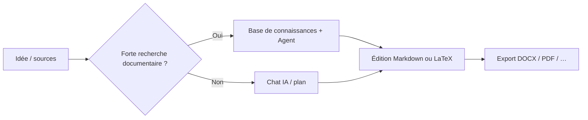

# 🚀 MetaDoc – Bonnes pratiques

MetaDoc n’est pas un logiciel à **workflow unique et figé**.

C’est plutôt une **boîte à outils** : pour rédiger, faire des graphiques ou traduire, **plusieurs chemins** mènent souvent au même résultat.

👉 Concrètement :

* Une même tâche peut avoir **plusieurs itinéraires**
* Chaque itinéraire a ses compromis en **vitesse, coût et maîtrise**
* Choisir la bonne voie compte plus que de tout mémoriser

Ce guide ne liste pas les fonctions : il répond à une question pratique :

> 👉 **Dans ma situation, par où commencer ?**

---

## 🧭 Lire les repères

| Repère     | Signification                                      |
| ---------- | -------------------------------------------------- |
| ⭐⭐⭐⭐⭐ | Choix par défaut pour la plupart des cas           |
| ⭐⭐⭐⭐   | Fiable ; parfois une étape en plus                 |
| ⭐⭐⭐     | Utile dans des situations spécifiques              |
| ⚠️       | Qualité, conformité ou risques à surveiller        |
| 💰         | Consommation de tokens / coût API plus élevée      |

---

Onglets de la fenêtre principale (aperçu) :

<MainTabs mode="demo" />

---

# 📝 1. Rédaction : de l’idée au texte final

Trois grands chemins suffisent en général. Choisissez celui qui colle à votre objectif.

---

## ⭐⭐⭐⭐⭐ Chemin 1 (recommandation par défaut)

### Brouillon dans le chat IA → retouches Markdown → export

**Enchaînement** :
[[ai.chat|Chat IA]] → édition Markdown → [[core.export|Export]]

**À privilégier si vous :**

* voulez démarrer vite
* prévoyez plusieurs cycles de révision
* devez livrer Word, PDF ou LaTeX

---

**Pourquoi c’est le choix par défaut**

* Markdown limite le **bruit de mise en forme** : le contenu passe avant
* On affine d’abord le fond et la structure, le style ensuite
* Après export, finitions possibles dans Word ou LaTeX

👉 En résumé : **le fond d’abord, la forme après**

---

**Points d’attention**

* Vérifiez toujours faits, citations et chiffres issus de l’IA
* Contrôlez rapidement la mise en page après export

---

Chat IA (aperçu) :

<AIChat mode="demo" />

---

## ⭐⭐⭐⭐ Chemin 2

### Rédaction appuyée sur la base de connaissances (surtout technique / sourcée)

**Enchaînement** :
[[knowledge-base.usage|Base de connaissances]] → [[agent.introduction|Agent]] → consolidation dans l’éditeur

---

**À privilégier si vous :**

* rédigez des textes **argumentés** (articles, synthèses, rapports)
* disposez déjà de PDF, documents ou notes

---

**Atouts**

* La génération peut s’appuyer sur vos fichiers importés
* Plus simple d’ancrer le propos dans **des sources que vous maîtrisez**

---

**À noter**

* ⚠️ La qualité dépend des fichiers et du découpage (chunks)
* 💰 Les dialogues multi-tours coûtent souvent plus de tokens

---

👉 En bref :

> Pour écrire **avec des sources**, commencez ici.

---

Base de connaissances (aperçu) :

<KnowledgeBase mode="demo" />

---

## ⭐⭐⭐ Chemin 3

### L’Agent génère tout un projet LaTeX

**Enchaînement** :
Agent → projet LaTeX → compilation PDF

---

**À privilégier si vous :**

* voulez une structure « article » classique
* avez déjà choisi LaTeX
* êtes très contraint par le temps

---

### ⚠️ Avant de vous y fier

* 💰 Coût en tokens souvent **supérieur** aux courts échanges ou petites actions contextuelles
* Paquets, chemins ou encodage peuvent encore nécessiter du travail manuel
* Contenus sensibles ou très réglementés : ne pas tout déléguer à l’automatisation

---

Agent (aperçu) :

<AgentView mode="demo" />

---

**Modèle de prompt (remplacer le titre)**

```text
Vous êtes rédacteur technique LaTeX. Pour le sujet « (titre du mémoire ou rapport ici) », générez un projet LaTeX compilable dans l’espace de travail actuel.

Exigences :
1) Classe article ou celle indiquée ; fichier principal main.tex ; chapitres en plusieurs .tex inclus avec \input.
2) Arborescence claire : figures/, sections/, bib/ ; figures d’exemple et entrées bibliographiques.
3) Paquets standards pour maths (amsmath), figures (graphicx), citations (biblatex ou natbib) ; lister les paquets supplémentaires à installer.
4) Indiquer la compilation recommandée (latexmk -pdf ; pour l’Unicode/CJK, XeLaTeX ou LuaLaTeX).
5) Ne pas omettre le contenu des fichiers ; chemins cohérents. Si des informations manquent, énoncer d’abord les hypothèses, puis générer.
```

---

# 📊 2. Graphiques et visualisation

La vraie question n’est pas « où est le bouton ? » mais :

> 👉 **Vous voulez aller vite ou peaufiner ?**

---


| Voie | Action | Note | Quand |
| ---- | ------ | ---- | ----- |
| A | Chat IA ou Agent pour produire du code Mermaid / PlantUML / ECharts, collé dans le Markdown | ⭐⭐⭐⭐ | Itérer vite à côté du texte |
| B | Fenêtre graphiques ([[charts.introduction|Graphiques]]) | ⭐⭐⭐⭐ | Vous préférez une interface |
| C | Sélection → menu contextuel → insérer un graphique | ⭐⭐⭐⭐⭐ | Lien serré avec le paragraphe en cours |

Voir aussi : [[ai.chat|Chat IA]], [[agent.introduction|Agent]].

---

**Conseils rapides**

* Rédaction courante → menu contextuel souvent le plus rapide
* Schémas complexes → fenêtre graphiques
* Explorer des variantes → code généré par l’IA

---

Fenêtre graphiques (aperçu) :

<GraphWindow mode="demo" />

---

# 🌐 3. Traduction

En une phrase :

> 👉 **Plus le texte est court, plus l’outil peut rester simple**

---


| Voie | Note | Pour |
| ---- | ---- | ---- |
| Traduire via le menu contextuel | ⭐⭐⭐⭐⭐ | Phrases / courts paragraphes |
| Chat IA | ⭐⭐⭐⭐   | Plusieurs blocs |
| Agent | ⭐⭐⭐⭐   | Longs documents |

---

👉 Règle simple :

* Court → menu contextuel
* Long → chat IA ou Agent

---

Barre de séparation redimensionnable (aperçu) :

<ResizableDivider mode="demo" />

---

# ✨ 4. Peaufiner les paragraphes

Envoyer tout le manuscrit d’un coup est souvent plus lent et plus cher.

Mieux :

---


| Voie | Note | Pourquoi |
| ---- | ---- | -------- |
| Optimiser au clic droit dans le paragraphe | ⭐⭐⭐⭐⭐ | Petit contexte, coût modéré |
| Passes par l’arborescence | ⭐⭐⭐⭐   | Remettre de l’ordre dans la structure |
| Chat IA / Agent | ⭐⭐⭐⭐   | Réécritures larges |

---

👉 Idée centrale :

> **Découper en petits morceaux**

---

Vue plan (aperçu) :

<Outline mode="demo" />

---

# 🎯 5. Choisir selon le cas

Si vous hésitez, lisez seulement cette partie.

---

## 🎒 Prise de notes en cours

**Pistes**

* ⭐⭐⭐⭐⭐ Markdown rapide en cours → développement avec l’IA après
* ⭐⭐⭐⭐ PDF / diapos dans la base → fiches de révision

👉 Noter d’abord, structurer ensuite

---

## 🧪 Comptes rendus de labo

**Pistes**

* ⭐⭐⭐⭐⭐ Markdown → export DOCX pour les brouillons
* ⭐⭐⭐⭐ Base de connaissances pour les parties analyse

⚠️ Les données mesurées : à valider vous-même

---

## 🛠️ Documentation technique

**Pistes**

* ⭐⭐⭐⭐⭐ Markdown + retouches locales au clic droit
* ⭐⭐⭐⭐ Agent + base pour s’aligner sur d’anciennes docs

👉 Clarté et cohérence avant le style

---

## 💬 Q&R et articles de blog

**Pistes**

* ⭐⭐⭐⭐⭐ Plan d’abord → corps ensuite
* ⭐⭐⭐⭐ Arborescence pour les longs textes

👉 La structure avant le volume

---

## 📱 Newsletters / création de contenu

**Pistes**

* ⭐⭐⭐⭐⭐ Finaliser en Markdown → exporter → mise en page dans l’outil de publication
* ⭐⭐⭐⭐ IA pour variantes de titres et de chapô

⚠️ Tout générer d’un bloc : coût élevé, voix éditoriale difficile à contrôler

---

# 🔁 Vue d’ensemble du flux



---

# 📚 Pour aller plus loin

* [[quick-start.guide|Guide de démarrage rapide]]
* [[core.export|Export]]
* [[features.paragraph-optimization|Optimisation de paragraphes]]
* [[charts.introduction|Introduction aux graphiques]]
