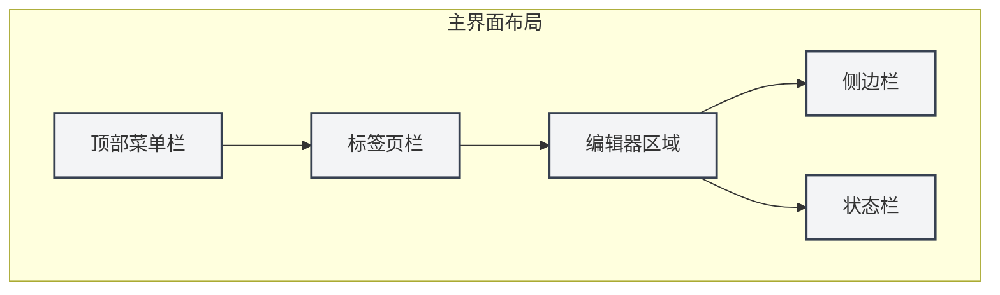
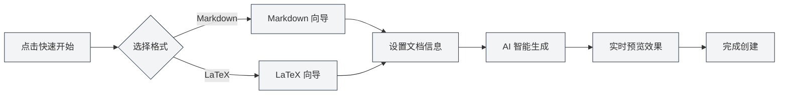

# Guide de démarrage rapide

## Vue d'ensemble

Bienvenue dans MetaDoc ! Il s'agit d'un outil intelligent de traitement de documents conçu pour les travailleurs du savoir. Que vous rédigiez un blog technique, organisiez des notes d'apprentissage ou prépariez un article académique, MetaDoc vous offre une expérience d'édition professionnelle et élégante.

MetaDoc intègre profondément des capacités d'intelligence artificielle et prend en charge deux formats de documents principaux : Markdown et LaTeX. Ce n'est pas seulement un éditeur de texte, c'est votre assistant d'écriture intelligent — avec des fonctionnalités intégrées telles que le dialogue IA, la complétion automatique, la correction intelligente, etc., qui rendent la création de documents plus efficace et agréable.

## Première utilisation

### Lancer l'application

Après avoir lancé MetaDoc, la première chose que vous voyez est la page d'accueil. Il s'agit d'un point de départ soigneusement conçu pour vous permettre de commencer rapidement à travailler :

- **Démarrage rapide** : Un assistant intelligent vous guide pour choisir le format du document et en créer un nouveau.
- **Nouveau document** : Créez directement un document vierge en choisissant le format dont vous avez besoin.
- **Ouvrir un fichier** : Parcourez et ouvrez des documents existants.
- **Manuel utilisateur** : Consultez le guide d'utilisation détaillé à tout moment.

### Présentation de l'interface

La conception de l'interface de MetaDoc suit les principes de mise en page des éditeurs modernes, claire et intuitive :

1. **Barre de menus supérieure**

   Située en haut de la fenêtre, elle regroupe les fonctions principales telles que Fichier, Édition, Affichage, etc. Que vous ayez besoin de créer un nouveau document, de rechercher/remplacer du texte ou de changer de mode d'affichage, vous trouverez ici l'entrée correspondante. La barre de menus est personnalisable ; vous pouvez ajuster l'affichage et l'ordre des éléments de menu selon vos habitudes.

2. **Barre d'onglets**

   Située sous la barre de menus, elle affiche tous les documents actuellement ouverts. Chaque document correspond à un onglet, cliquez pour basculer. Les onglets peuvent être réorganisés par glisser-déposer, et vous pouvez épingler les documents fréquents pour éviter de les fermer par erreur. Lorsqu'il y a beaucoup d'onglets, vous pouvez également organiser les documents entre plusieurs fenêtres.

3. **Zone de l'éditeur**

   C'est votre espace de travail principal. MetaDoc fournit des environnements d'édition spécialisés pour différents types de documents :

   - **Éditeur Markdown** : Expérience d'édition WYSIWYG, avec prise en charge de l'aperçu en temps réel, des formules mathématiques, des diagrammes et de nombreuses autres fonctionnalités.
   - **Éditeur LaTeX** : Environnement d'écriture académique professionnel, avec prise en charge de la coloration syntaxique, des suggestions intelligentes, de la prévisualisation de la compilation, etc.

4. **Barre latérale**

   Située à gauche de l'éditeur, c'est votre centre de navigation pour les documents. Vous pouvez y :

   - Basculer entre différentes vues : éditeur, plan, Agent, etc.
   - Voir la structure hiérarchique du document
   - Gérer la base de connaissances et les références

5. **Barre d'état**

   Située en bas de la fenêtre, elle affiche en temps réel les informations d'état du document actuel, y compris le nombre de mots, l'état de sauvegarde, les paramètres de langue, etc., vous donnant un aperçu clair de votre progression.

Ci-dessous se trouvent les contrôles d'interface réels correspondants, pour faciliter votre prise en main :

**Barre de menus supérieure**

Située en haut de la fenêtre, elle contient les menus principaux Fichier, Édition, Affichage, etc., fournissant des points d'entrée pour les opérations au niveau de l'application. Vous pouvez utiliser la barre de menus pour créer, ouvrir, enregistrer des documents, ainsi que pour accéder à diverses fonctions d'édition et d'affichage.

<MenuItemsDemo mode="demo" :items='[{"id": "file", "items": ["new", "open", "save"]}, {"id": "edit", "items": ["undo", "redo", "find"]}, {"id": "view", "items": ["editor", "outline"]}]' />

**Barre d'onglets**

Située sous la barre de menus, elle affiche tous les onglets des documents actuellement ouverts. Vous pouvez basculer entre les documents en cliquant sur les onglets, réorganiser les onglets par glisser-déposer, ou cliquer avec le bouton droit sur un onglet pour plus d'actions (comme fermer, épingler, déplacer vers une nouvelle fenêtre, etc.).

<MainTabs mode="demo" />

**Barre latérale**

Située à gauche de l'éditeur, elle fournit l'accès à plusieurs panneaux de fonctionnalités d'assistance. Vous pouvez utiliser la barre latérale pour basculer rapidement entre la vue Éditeur, la vue Plan, la vue Agent, etc., améliorant ainsi l'efficacité de l'édition de documents.

<ViewMenuItemsDemo mode="demo" :items='["editor", "outline", "home"]' />

## Créer rapidement un document

### Méthode 1 : Utiliser l'assistant de démarrage rapide

L'assistant de démarrage rapide de MetaDoc est une conception réfléchie. Il ne se contente pas de créer un document vierge, mais agit comme un assistant expérimenté, vous guidant à chaque étape de la création du document :

1. Cliquez sur le bouton "Démarrage rapide" sur la page d'accueil.
2. Choisissez le format du document selon vos besoins :
   - **Markdown** : Si vous rédigez un blog, une documentation technique, des comptes-rendus de réunion ou tout contenu textuel quotidien, c'est l'option la plus légère. La syntaxe Markdown est simple et intuitive, tout en répondant à des besoins de mise en page riches.
   - **LaTeX** : Si vous préparez un article académique, une thèse ou un document scientifique nécessitant une mise en page précise, LaTeX est la norme reconnue dans le monde académique. MetaDoc rend la compilation complexe de LaTeX simple et compréhensible.
3. L'assistant fournira des modèles et des fonctionnalités d'assistance IA adaptés à votre choix.

#### Interface de sélection du format

La première étape de l'assistant consiste à choisir le format du document. MetaDoc recommandera intelligemment les options appropriées en fonction de votre scénario d'utilisation :

<QuickStartPanel mode="demo" />

#### Démarrage rapide Markdown

Après avoir choisi Markdown, l'assistant fournira :

- **Suggestions de titre intelligentes** : L'IA suggérera des titres de document appropriés en fonction de votre saisie initiale.
- **Plan structuré** : Génération automatique d'un cadre de document pour vous aider à organiser vos idées.
- **Aperçu en temps réel** : Écrivez et voyez immédiatement l'effet de rendu final du document.

<QuickStartMarkdown mode="demo" />

#### Démarrage rapide LaTeX

Après avoir choisi LaTeX, l'assistant fournira :

- **Modèles professionnels** : Modèles optimisés pour différents scénarios académiques (article, rapport, présentation, etc.).
- **Guide de structure** : Génération automatique d'une structure de document LaTeX standard.
- **Complétion intelligente** : Assistance IA pour générer du code LaTeX, réduisant la courbe d'apprentissage.

<QuickStartLatex mode="demo" />

#### Valeur centrale de l'assistant

L'essence de l'assistant de démarrage rapide est de **réduire la barrière d'entrée et d'améliorer l'efficacité** :

- **Convivial pour les débutants** : Pas besoin de mémoriser une syntaxe complexe, l'assistant vous guide étape par étape.
- **Efficace pour les experts** : Les fonctionnalités d'assistance IA peuvent générer rapidement un cadre de document, économisant un travail répétitif.
- **Conscient du contexte** : Si vous avez déjà quelques idées, vous pouvez les communiquer directement à l'IA, qui vous aidera à les développer en une structure de document complète.

#### Flux de travail de l'assistant

### Méthode 2 : Créer directement un nouveau document

Si vous êtes déjà familier avec MetaDoc, vous pouvez commencer à travailler en créant directement un document vierge :

1. Cliquez sur le bouton "Nouveau document" de la page d'accueil, ou utilisez le raccourci `Ctrl+N`.
2. Choisissez le format du document (Markdown / LaTeX / Texte brut).
3. Le document s'ouvre immédiatement dans l'éditeur et vous pouvez commencer à créer.

Cette méthode convient aux utilisateurs expérimentés ou aux scénarios où le plan d'écriture est clair.

### Méthode 3 : Ouvrir un fichier existant

Reprendre votre travail précédent est également simple :

1. Cliquez sur le bouton "Ouvrir un fichier" de la page d'accueil, ou utilisez `Ctrl+O`.
2. Trouvez votre document dans l'explorateur de fichiers.
3. Le fichier sélectionné s'ouvre dans un nouvel onglet, vous permettant de continuer l'édition de manière transparente.

MetaDoc prend en charge la mémorisation automatique des documents récemment ouverts, vous permettant de reprendre rapidement votre travail.

## Opérations de base

### Éditer un document

L'expérience d'édition de MetaDoc est soigneusement conçue pour que votre attention reste concentrée sur le contenu lui-même :

- **Saisie fluide** : Que vous notiez rapidement une inspiration ou polissiez méticuleusement un texte, l'éditeur suit votre rythme de pensée.
- **Formatage intelligent** : L'éditeur Markdown prend en charge le WYSIWYG, l'éditeur LaTeX fournit la coloration syntaxique et des suggestions intelligentes.
- **Éléments riches** : Insérez facilement des images, des tableaux, des blocs de code, des formules mathématiques, etc., rendant le document plus vivant et professionnel.
- **Aperçu en temps réel** : Les documents Markdown peuvent être écrits et prévisualisés simultanément, pour un effet final immédiat.

### Enregistrer un document

MetaDoc offre plusieurs méthodes d'enregistrement pour garantir que votre travail ne soit pas perdu :

- **Enregistrement instantané** : `Ctrl+S` pour enregistrer rapidement le document actuel, c'est l'opération la plus courante.
- **Enregistrer sous un nouveau nom** : `Ctrl+Maj+S` à utiliser lorsque vous devez enregistrer le document actuel sous forme de copie.
- **Enregistrement par lot** : `Ctrl+K S` pour enregistrer en une fois tous les documents ouverts, idéal pour finaliser une session de travail.

De plus, vous pouvez activer la fonction de sauvegarde automatique dans les paramètres, permettant à MetaDoc d'enregistrer automatiquement vos documents à intervalles réguliers.

### Changer de vue

MetaDoc propose plusieurs modes d'affichage pour répondre aux besoins des différentes phases de travail :

- **Vue Éditeur** : Espace de travail principal pour l'édition de documents, offrant toutes les fonctionnalités d'édition.
- **Vue Plan** : Affiche la hiérarchie des titres du document sous forme d'arborescence, idéale pour une navigation rapide et des ajustements de structure.
- **Prévisualisation PDF** : Aperçu du document LaTeX après compilation, pratique pour vérifier la mise en page finale.

Via la barre latérale ou les raccourcis clavier, vous pouvez basculer rapidement entre les différentes vues.

## Obtenir de l'aide

MetaDoc intègre un manuel utilisateur détaillé, prêt à répondre à vos questions à tout moment :

1. Appuyez sur la touche `F1` ou cliquez sur le bouton "Manuel utilisateur" de la page d'accueil.
2. Le manuel est organisé par thèmes, couvrant tout des opérations de base aux fonctionnalités avancées.
3. Utilisez la fonction de recherche pour localiser rapidement le contenu dont vous avez besoin.

Le manuel couvre les sujets suivants :

- Guide d'utilisation détaillé de l'éditeur
- Techniques de gestion des fichiers et des projets
- Tutoriels approfondis sur les fonctionnalités IA
- Fonctionnement du cadre Agent
- Options de personnalisation

## Explorer davantage

Terminer le démarrage rapide n'est que la première étape. MetaDoc possède de nombreuses autres fonctionnalités puissantes à découvrir :

1. **Maîtriser les techniques d'édition** : Comprenez les [[core.editor-basics|opérations de base de l'éditeur]] pour améliorer votre efficacité d'écriture.
2. **Exceller en gestion de fichiers** : Apprenez les meilleures pratiques pour les [[core.file-operations|opérations sur les fichiers]].
3. **Approfondir les fonctionnalités de l'éditeur** :
   - Utilisateurs Markdown : Consultez le [[markdown.editor|guide d'utilisation de l'éditeur Markdown]].
   - Utilisateurs LaTeX : Consultez le [[latex.editor|guide d'utilisation de l'éditeur LaTeX]].
4. **Expérimenter les capacités IA** : Essayez les fonctionnalités de [[ai.chat|dialogue IA]] et de [[ai.completion|complétion automatique IA]].

Le principe de conception de MetaDoc est de **rendre la technologie invisible et la création libre**. Nous espérons que cet outil deviendra un assistant précieux pour votre travail intellectuel.

## Documentation associée

- [[core.file-operations|Opérations sur les fichiers]]
- [[core.editor-basics|Opérations de base de l'éditeur]]
- [[markdown.editor|Guide d'utilisation de l'éditeur Markdown]]
- [[latex.editor|Guide d'utilisation de l'éditeur LaTeX]]
- [[settings.basic|Paramètres de base]]