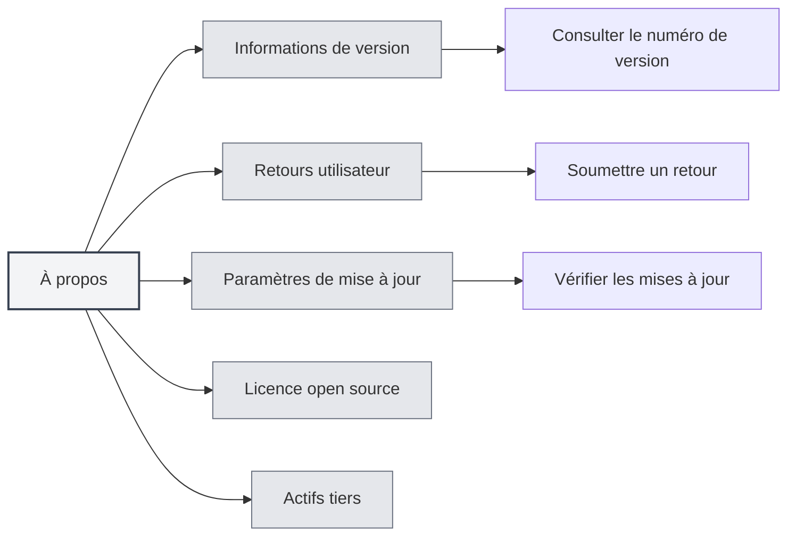
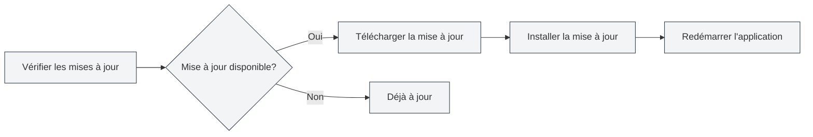

# À propos des informations

## Vue d'ensemble

La page À propos fournit les informations de version de MetaDoc, les paramètres de mise à jour, la licence open source et les informations sur les actifs tiers. Vous pouvez utiliser cette page pour connaître les informations de l'application, vérifier les mises à jour, soumettre des retours, etc.

## Informations de version

### Consulter la version

Sur la page À propos, vous pouvez consulter les informations suivantes :

- **Nom de l'application** : MetaDoc
- **Numéro de version** : Numéro de version actuellement installée
- **Date de publication** : Date de publication de la version actuelle
- **Environnement de compilation** : Version de développement ou version de publication

Vous pouvez accéder à la page À propos via la barre de menu supérieure :

<MenuItemsDemo mode="demo" :items='[{"id": "settings", "items": ["about"]}]' />



### Format de version

Le numéro de version utilise le format de version sémantique :

```
Numéro de version majeure.Numéro de version mineure.Numéro de révision
```

Par exemple : `0.12.1`

### Environnement de compilation

- **Version de développement** : Version compilée en environnement de développement, peut contenir des informations de débogage
- **Version de publication** : Version officiellement publiée, testée et optimisée

<SettingAboutSection mode="demo" />

## Retours utilisateur

### Soumettre un retour

Vous pouvez soumettre des retours de la manière suivante :

1. Sur la page À propos, cliquez sur le bouton "Retours utilisateur"
2. Remplissez le contenu du retour sur la page de retour
3. Soumettez le retour

### Contenu du retour

Le retour peut inclure les informations suivantes :

- **Description du problème** : Décrivez en détail le problème rencontré
- **Étapes de reproduction** : Expliquez comment reproduire le problème
- **Comportement attendu** : Expliquez le comportement souhaité
- **Comportement réel** : Expliquez le comportement qui s'est réellement produit
- **Informations sur l'environnement** : Système d'exploitation, numéro de version, etc.

### Suggestions pour les retours

- **Description détaillée** : Décrivez le problème de manière aussi détaillée que possible
- **Fournir des captures d'écran** : Si nécessaire, fournissez des captures d'écran ou des enregistrements
- **Informations de version** : Incluez le numéro de version et les informations sur l'environnement de compilation
- **Étapes de reproduction** : Fournissez des étapes de reproduction claires

<UserFeedbackView mode="demo" />

## Groupe QQ officiel

### Rejoindre le groupe QQ

Groupe QQ officiel de MetaDoc : **1079841705**

Rejoindre le groupe QQ permet de :

- Obtenir les dernières informations et notifications de mise à jour
- Échanger des expériences d'utilisation avec d'autres utilisateurs
- Obtenir un support technique
- Participer aux discussions sur les fonctionnalités

### Ressources du groupe

Le groupe QQ fournit les ressources suivantes :

- **Tutoriels d'utilisation** : Tutoriels d'utilisation dans les fichiers du groupe
- **Réponses aux questions** : Entraide entre les membres du groupe
- **Notifications de mise à jour** : Obtenir les informations de mise à jour en premier
- **Suggestions de fonctionnalités** : Participer aux discussions et suggestions de fonctionnalités

## Paramètres de mise à jour

### Vérification automatique des mises à jour

Lorsque "Vérification automatique des mises à jour" est activée, MetaDoc vérifie automatiquement s'il existe une nouvelle version au démarrage :

- **Activée** : Vérification automatique des mises à jour au démarrage
- **Désactivée** : Pas de vérification automatique des mises à jour

### Canal de mise à jour

Vous pouvez choisir le canal de mise à jour :

- **Version stable** : Utiliser la version officiellement publiée (recommandé)
- **Version de développement** : Utiliser la version de développement (peut être instable)

<MainTabs mode="demo" />

### Vérification manuelle des mises à jour

Vous pouvez vérifier manuellement les mises à jour à tout moment :

1. Dans l'onglet "Paramètres de mise à jour" de la page À propos
2. Cliquez sur le bouton "Vérifier les mises à jour"
3. Attendez la fin de la vérification

### État de la mise à jour

Après la vérification, les états suivants peuvent s'afficher :

- **Mise à jour disponible** : Affiche les informations sur la nouvelle version, possibilité de télécharger la mise à jour
- **Déjà à jour** : La version actuelle est la plus récente
- **Échec de la vérification** : Affiche un message d'erreur

### Téléchargement et installation des mises à jour

Si une mise à jour est disponible :

1. **Télécharger la mise à jour** : Cliquez sur le bouton "Télécharger la mise à jour"
2. **Attendre le téléchargement** : Consultez la progression du téléchargement
3. **Installer la mise à jour** : Une fois le téléchargement terminé, cliquez sur le bouton "Installer et redémarrer"
4. **Redémarrage automatique** : L'application redémarre automatiquement et installe la mise à jour



<QuickStartPanel mode="demo" />

## Licence open source

### Consulter la licence

Dans l'onglet "Licence open source" de la page À propos, vous pouvez consulter :

- **Licence open source** : La licence open source utilisée par MetaDoc
- **Contenu de la licence** : Le texte complet de la licence

### Informations sur la licence

MetaDoc suit une licence open source, vous pouvez :

- Consulter le contenu de la licence
- Comprendre les conditions d'utilisation
- Comprendre les droits et obligations

## Actifs tiers

### Consulter les actifs tiers

Dans l'onglet "Actifs tiers" de la page À propos, vous pouvez consulter :

- **Bibliothèques tierces** : Les bibliothèques open source tierces utilisées par MetaDoc
- **Informations sur les actifs** : Les licences et informations de provenance des actifs tiers

### Liste des actifs

La liste des actifs tiers comprend :

- **Nom de la bibliothèque** : Nom de la bibliothèque tierce
- **Version** : Numéro de version utilisé
- **Licence** : Type de licence de la bibliothèque
- **Provenance** : Lien vers la source de la bibliothèque

## Bonnes pratiques

1. **Mises à jour régulières** : Il est recommandé d'activer la vérification automatique des mises à jour pour obtenir rapidement les nouvelles versions
2. **Signaler les problèmes** : Soumettez des retours rapidement en cas de problème
3. **Rejoindre le groupe QQ** : Rejoignez le groupe QQ officiel pour obtenir du support et des informations
4. **Consulter la licence** : Comprenez les conditions d'utilisation de la licence open source
5. **Suivre les mises à jour** : Suivez les notifications de mise à jour pour connaître les nouvelles fonctionnalités et corrections

## Points d'attention

1. **Sauvegarde avant mise à jour** : Il est recommandé de sauvegarder les données importantes avant une mise à jour
2. **Connexion réseau** : La vérification des mises à jour nécessite une connexion réseau
3. **Compatibilité des versions** : Après une mise à jour, certains paramètres peuvent nécessiter une reconfiguration
4. **Informations dans les retours** : Protégez les informations privées lors de la soumission de retours
5. **Respect de la licence** : Veuillez respecter la licence open source lors de l'utilisation de MetaDoc

<ResizableDivider mode="demo" />

## Documentation associée

- [[settings.basic|Paramètres de base]]
- [[settings.logging|Configuration des journaux]]
- [[quick-start.guide|Guide de démarrage rapide]]

<SettingAboutSection mode="demo" />

<UserFeedbackView mode="demo" />

<MenuItemsDemo mode="demo" :items='[{"id": "settings", "items": ["about"]}]' />

<MainTabs mode="demo" />