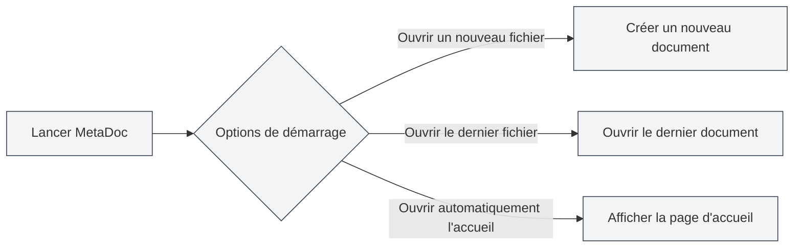
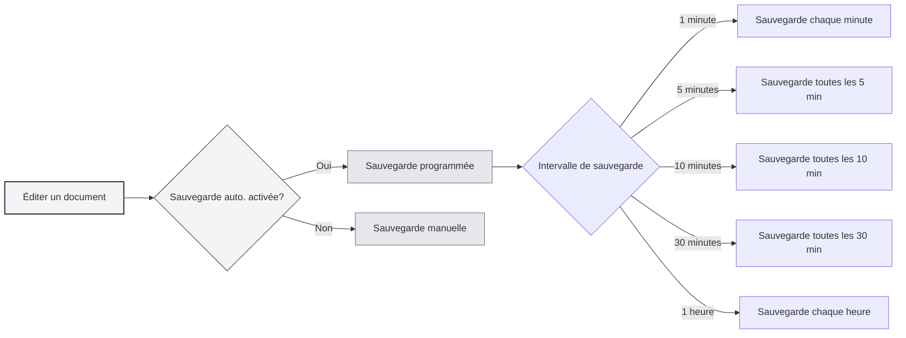
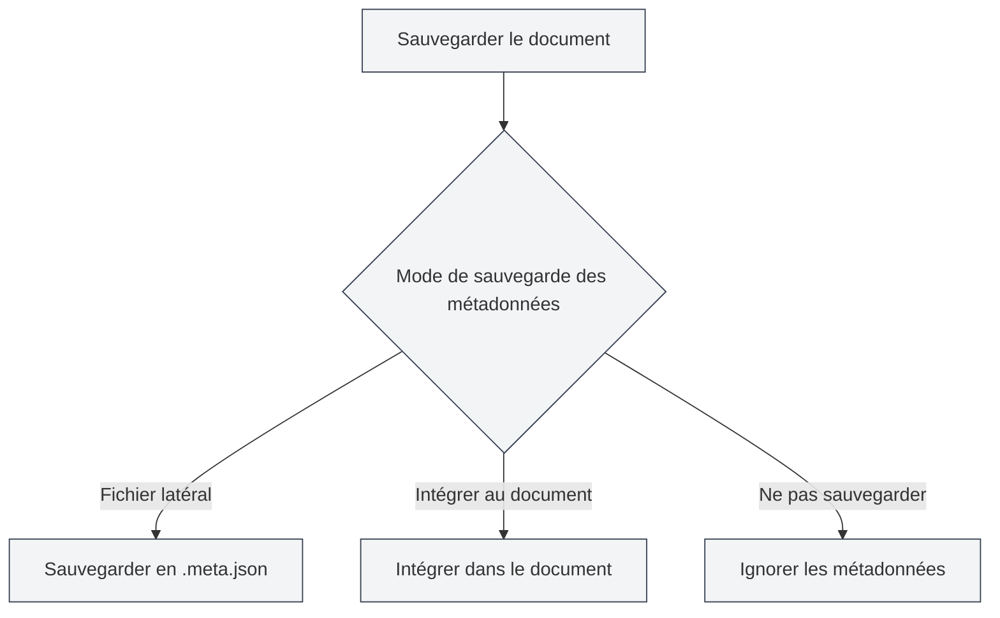

# Paramètres de base

## Vue d'ensemble

Les paramètres de base sont les options de configuration centrales de MetaDoc, couvrant des fonctionnalités importantes telles que le comportement au démarrage, la sauvegarde automatique, les statistiques de documents, la gestion des métadonnées, etc. Une configuration appropriée de ces options peut améliorer votre expérience d'utilisation et votre productivité.

## Options de démarrage

### Définir le comportement au démarrage

Les options de démarrage déterminent le comportement par défaut de MetaDoc au lancement :

- **Ouvrir un nouveau fichier** : Crée un nouveau document vierge à chaque démarrage.
- **Ouvrir le dernier fichier édité** : Ouvre automatiquement le document en cours d'édition lors de la dernière fermeture au démarrage.

Vous pouvez choisir l'option de démarrage adaptée à vos habitudes. Si vous devez souvent reprendre votre travail là où vous l'avez laissé, il est recommandé de choisir "Ouvrir le dernier fichier édité".

Vous pouvez accéder aux paramètres via la barre de menu supérieure :

<MenuItemsDemo mode="demo" :items='[{"id": "settings"}]' />

### Interface des paramètres de base

L'illustration suivante montre l'interface complète de la page des paramètres de base :

<SettingBasicSection mode="demo" />

L'interface des paramètres de base comprend les zones de configuration principales suivantes :

- **Options de démarrage** : Définit le comportement par défaut au démarrage de l'application (ouvrir un nouveau fichier / le dernier fichier édité).
- **Sauvegarde automatique** : Configure l'intervalle de sauvegarde automatique pour prévenir la perte de données.
- **Sauvegarde des métadonnées** : Choisit le mode de stockage des métadonnées (dans le document / fichier séparé).
- **Répertoire de référence** : Gère l'emplacement de stockage des fichiers externes référencés par les documents.
- **Autres options** : Paramètres avancés pour le traitement des blocs de code, l'intégration d'images, les formules mathématiques, etc.

### Ouvrir automatiquement la page d'accueil au démarrage

Lorsque cette option est activée, MetaDoc ouvre automatiquement l'onglet de la page d'accueil au démarrage. La page d'accueil offre des fonctionnalités telles que le démarrage rapide, la liste des documents récents, etc., facilitant l'accès rapide aux fonctions couramment utilisées.

## Sauvegarde automatique

<SettingBasicSection mode="demo" />

### Configurer la sauvegarde automatique

La fonction de sauvegarde automatique permet de prévenir la perte de contenu due à des incidents imprévus (comme un plantage du programme, une coupure de courant, etc.). MetaDoc prend en charge les intervalles de sauvegarde automatique suivants :

- **Désactivée** : Pas de sauvegarde automatique, nécessite une sauvegarde manuelle.
- **1 minute** : Sauvegarde automatique toutes les minutes.
- **5 minutes** : Sauvegarde automatique toutes les 5 minutes.
- **10 minutes** : Sauvegarde automatique toutes les 10 minutes.
- **30 minutes** : Sauvegarde automatique toutes les 30 minutes.
- **1 heure** : Sauvegarde automatique toutes les heures.

### Recommandations d'utilisation

- **Édition fréquente** : Il est recommandé de définir un intervalle de sauvegarde automatique court (1-5 minutes) pour garantir la sauvegarde rapide du contenu.
- **Rédaction longue** : Un intervalle plus long (10-30 minutes) peut être défini pour réduire la fréquence d'écriture sur le disque.
- **Documents importants** : Il est recommandé d'activer la sauvegarde automatique et de l'associer à des sauvegardes manuelles (`Ctrl+S`) pour garantir la sécurité des données.

La sauvegarde automatique s'effectue silencieusement en arrière-plan, sans interrompre votre travail d'édition.

## Paramètres des statistiques de documents

<SettingBasicSection mode="demo" />

### Exclure les blocs de code des statistiques

Lorsque cette option est activée, le contenu des blocs de code est exclu lors du comptage des mots, de l'analyse de fréquence, etc. Ceci est particulièrement utile pour les documents techniques, car le contenu des blocs de code ne devrait généralement pas être inclus dans les statistiques textuelles du document.

**Cas d'utilisation** :

- Les documents techniques contiennent de nombreux exemples de code.
- Besoin de compter précisément le contenu textuel réel du document.
- Éviter que le code n'affecte les résultats de l'analyse de fréquence.

## Paramètres de traitement des images

<SettingBasicSection mode="demo" />

### Analyser les images intégrées (fonction OCR)

Lorsque cette option est activée, MetaDoc effectue un traitement OCR (reconnaissance optique de caractères) sur les images intégrées dans le document pour en extraire le contenu textuel. Ceci est particulièrement utile pour traiter des documents contenant des images (comme des PDF, des documents Word).

**Description de la fonction** :

- Les images contenues dans les fichiers DOCX, PPTX, PDF téléchargés sont traitées par OCR.
- Les fichiers image téléchargés directement continueront d'être traités par OCR (non affectés par cette option).
- Les résultats OCR peuvent être utilisés pour la recherche dans la base de connaissances et les fonctions d'assistance IA.

**Remarques** :

- Le traitement OCR nécessite des ressources de calcul et peut affecter la vitesse de chargement des documents.
- Si l'extraction de texte à partir des images n'est pas nécessaire, cette fonction peut être désactivée pour améliorer les performances.

### Nombres en ligne dans les formules mathématiques

Lorsque cette option est activée, les nombres dans les formules mathématiques s'affichent en mode en ligne plutôt qu'en mode bloc. Cela permet aux formules de mieux s'intégrer dans le flux de texte, adapté à l'insertion d'expressions mathématiques simples dans un paragraphe.

## Mode de sauvegarde des métadonnées

<SettingBasicSection mode="demo" />

### Définir le mode de sauvegarde

Les métadonnées du document (titre, auteur, description, mots-clés, etc.) peuvent être sauvegardées de trois manières :

- **Fichier latéral** : Sauvegarde les métadonnées dans un fichier séparé (`.meta.json`) situé dans le même répertoire que le document.
  - Avantage : N'affecte pas le contenu original du document, facilite le contrôle de version.
  - Inconvénient : Nécessite de gérer deux fichiers simultanément.
- **Intégrer au document** : Intègre les métadonnées à l'intérieur du fichier du document.
  - Avantage : Gestion en un seul fichier, facile à partager.
  - Inconvénient : Certains formats peuvent ne pas supporter l'intégration.
- **Ne pas sauvegarder** : Ne sauvegarde pas les métadonnées.
  - Cas d'utilisation : Documents temporaires ou ne nécessitant pas de métadonnées.

### Suggestions de choix

- **Documents techniques** : Recommande le mode "Fichier latéral", facilitant la gestion avec des systèmes de contrôle de version comme Git.
- **Notes personnelles** : Peut utiliser le mode "Intégrer au document" pour maintenir un seul fichier propre.
- **Documents temporaires** : Peut choisir le mode "Ne pas sauvegarder".

## Gestion du répertoire des fichiers de référence

<SettingBasicSection mode="demo" />

### Consulter les informations du répertoire

Le répertoire des fichiers de référence est utilisé pour stocker les fichiers externes référencés dans les documents (comme les images, les pièces jointes, etc.). Sur la page des paramètres de base, vous pouvez :

- **Voir la taille du répertoire** : Affiche l'espace disque occupé par le répertoire des fichiers de référence.
- **Actualiser** : Met à jour les informations sur la taille du répertoire.
- **Ouvrir le répertoire** : Ouvre le répertoire des fichiers de référence dans l'explorateur de fichiers.
- **Vider le répertoire** : Supprime tous les fichiers du répertoire (opération irréversible).

### Cas d'utilisation

Le répertoire des fichiers de référence est généralement utilisé pour :

- Stocker les images insérées dans les documents.
- Sauvegarder les pièces jointes des documents.
- Gérer les fichiers ressources associés aux documents.

**Remarques** :

- L'opération de vidage du répertoire est irréversible, veuillez l'utiliser avec prudence.
- Il est recommandé de sauvegarder les fichiers importants avant de vider le répertoire.
- La taille du répertoire augmente avec l'ajout de fichiers référencés dans les documents.

## Points d'attention

1. **Options de démarrage** : Les modifications apportées aux options de démarrage ne prendront effet qu'au prochain lancement de l'application.
2. **Sauvegarde automatique** : La sauvegarde automatique ne remplace pas vos opérations de sauvegarde manuelle ; les deux peuvent être utilisées conjointement.
3. **Mode des métadonnées** : Après avoir changé le mode de sauvegarde des métadonnées, les nouveaux documents sauvegardés utiliseront le nouveau mode ; les documents existants ne sont pas affectés.
4. **Répertoire de référence** : Avant de vider le répertoire de référence, assurez-vous qu'aucun document n'utilise ces fichiers.

## Documentation associée

- [[core.file-operations|Opérations sur les fichiers]]
- [[core.document-metadata|Métadonnées des documents]]
- [[settings.theme|Paramètres du thème]]
- [[settings.image|Paramètres des images]]

<MenuItemsDemo mode="demo" :items='[{"id": "settings", "items": ["basic"]}]' />
