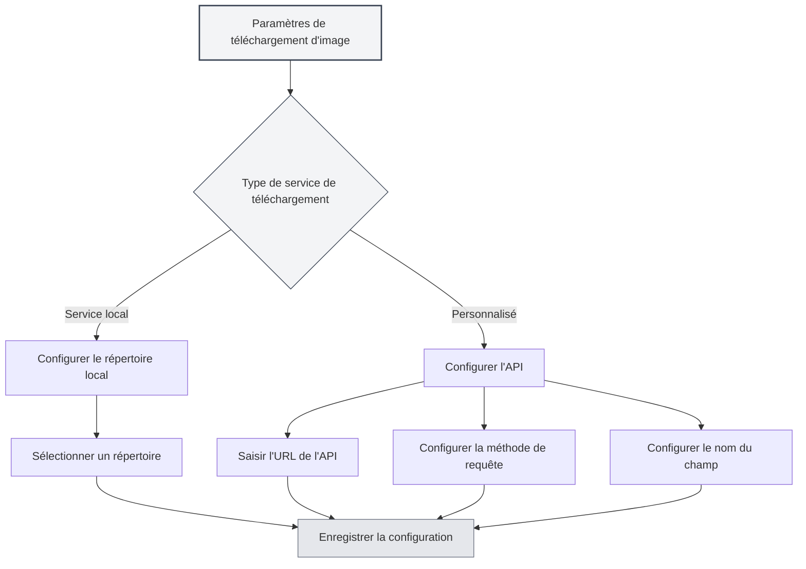

# Configuration du service de téléchargement

## Vue d'ensemble

La configuration du service de téléchargement vous permet de définir le service cible pour le téléchargement des images. MetaDoc prend en charge deux modes de téléchargement : le service local et l'API personnalisée. Vous pouvez choisir le service adapté à vos besoins.

## Types de services de téléchargement

### Choix du service

Dans la page des paramètres d'image, lorsque l'action "Insérer une image" est définie sur "Télécharger", vous pouvez sélectionner le service de téléchargement :

- **Service local** : Enregistre les images dans un répertoire local.
- **Personnalisé** : Utilise une API personnalisée pour télécharger les images.

Vous pouvez accéder aux paramètres de téléchargement d'image via la barre de menu supérieure :

<MenuItemsDemo mode="demo" :items='[{"id": "settings"}]' />



### Service local

Le service local enregistre les images sur le système de fichiers local :

- **Avantages** : Contrôle entièrement local, sécurité des données.
- **Inconvénients** : Nécessite la configuration d'un répertoire local.
- **Cas d'utilisation** : Utilisation locale, exigences élevées en matière de confidentialité des données.

<SettingImageSection mode="demo" />

### Service personnalisé

Le service personnalisé utilise une API externe pour télécharger les images :

- **Avantages** : Permet de télécharger vers un stockage cloud, un hébergeur d'images, etc.
- **Inconvénients** : Nécessite la configuration d'une interface API.
- **Cas d'utilisation** : Nécessite un stockage cloud, un CDN d'images, etc.

<MainTabs mode="demo" />

## Configuration du répertoire d'images local

### Définir le répertoire

Lors de l'utilisation du service local, vous devez configurer le répertoire de sauvegarde des images :

1. Dans la page des paramètres d'image, sélectionnez "Service local".
2. Cliquez sur le bouton "Parcourir" pour sélectionner un répertoire.
3. Ou saisissez directement le chemin du répertoire dans le champ de saisie.
4. Cliquez sur le bouton "Ouvrir" pour ouvrir le répertoire dans l'explorateur de fichiers.

### Sélection du répertoire

Lors de la sélection du répertoire d'images :

- **Bouton Parcourir** : Ouvre la boîte de dialogue de sélection de répertoire.
- **Saisie du chemin** : Saisissez directement le chemin du répertoire.
- **Bouton Ouvrir** : Ouvre le répertoire déjà défini dans l'explorateur de fichiers.

### Répertoire par défaut

Si aucun répertoire d'images local n'est défini, le système utilise le répertoire par défaut :

- **Windows** : `%APPDATA%/MetaDoc/images`
- **macOS** : `~/Library/Application Support/MetaDoc/images`
- **Linux** : `~/.config/MetaDoc/images`

<QuickStartPanel mode="demo" />

### Gestion du répertoire

- **Voir le répertoire** : Cliquez sur le bouton "Ouvrir" pour voir le contenu du répertoire.
- **Changer de répertoire** : Cliquez sur le bouton "Parcourir" pour sélectionner un nouveau répertoire.
- **Exigences du répertoire** : Assurez-vous que le répertoire existe et dispose des permissions d'écriture.

## Configuration de l'API de téléchargement personnalisée

### Configuration de l'URL de l'API

Lors de l'utilisation du service personnalisé, vous devez configurer l'adresse de l'API :

1. Dans la page des paramètres d'image, sélectionnez le service "Personnalisé".
2. Saisissez l'adresse de l'API dans le champ "URL de l'API de téléchargement personnalisée".
3. Exemple de format : `https://api.example.com/upload`

### Configuration de la méthode API

Configurez la méthode de requête de l'API :

- **POST** : Utilise la méthode POST pour le téléchargement (recommandé).
- **PUT** : Utilise la méthode PUT pour le téléchargement.

La plupart des API utilisent la méthode POST, certaines API spécifiques peuvent utiliser la méthode PUT.

### Configuration du nom du champ

Configurez le nom du champ pour le fichier téléchargé :

- **Valeur par défaut** : `file`
- **Personnalisé** : Définissez le nom du champ selon les exigences de l'API.

Différentes API peuvent utiliser différents noms de champ, tels que `file`, `image`, `upload`, etc.

### Exemples de configuration d'API

**Exemple 1 : API d'hébergeur d'images standard**

```
URL de l'API : https://api.example.com/upload
Méthode : POST
Nom du champ : file
```

**Exemple 2 : API avec nom de champ personnalisé**

```
URL de l'API : https://api.example.com/image
Méthode : POST
Nom du champ : image
```

**Exemple 3 : API utilisant la méthode PUT**

```
URL de l'API : https://api.example.com/upload
Méthode : PUT
Nom du champ : file
```

<ViewMenuItemsDemo mode="demo" :items='["home", "editor"]'
/>

## Format de réponse de l'API

### Exigences de réponse

L'API personnalisée doit renvoyer une réponse JSON au format suivant :

```json
{
  "success": true,
  "imagePath": "https://example.com/image.png"
}
```

### Champs de réponse

- **success** : Valeur booléenne, indique si le téléchargement a réussi.
- **imagePath** : Chaîne de caractères, renvoie l'URL ou le chemin de l'image.

### Gestion des erreurs

Si le téléchargement échoue, l'API doit renvoyer :

```json
{
  "success": false,
  "message": "Message d'erreur"
}
```

<DialogDemo mode="demo" dialogType="api-config" />

## Validation de la configuration

### Tester la configuration

Après avoir configuré l'API personnalisée, il est recommandé de tester la configuration :

1. Insérez une image dans le document.
2. Vérifiez le résultat du téléchargement.
3. En cas d'échec, vérifiez si la configuration est correcte.

### Problèmes courants

**Échec de connexion** :

- Vérifiez si l'URL de l'API est correcte.
- Vérifiez la connexion réseau.
- Vérifiez si le service API fonctionne normalement.

**Échec du téléchargement** :

- Vérifiez si la méthode API est correcte.
- Vérifiez si le nom du champ est correct.
- Vérifiez si le format de réponse de l'API répond aux exigences.

**Problèmes de permissions** :

- Vérifiez si l'API nécessite une authentification.
- Vérifiez si la clé API ou le token est correct.

<SettingBasicSection mode="demo" />

## Configuration du service local

### Permissions du répertoire

Lors de l'utilisation du service local, assurez-vous que le répertoire dispose des permissions d'écriture :

- **Windows** : Vérifiez les paramètres de permissions du dossier.
- **macOS/Linux** : Vérifiez les permissions du répertoire (chmod).

### Structure du répertoire

Le service local enregistre les images dans le répertoire spécifié :

- **Nommage des fichiers** : Utilise un horodatage + le nom de fichier d'origine.
- **Format des fichiers** : Conserve le format d'origine.
- **Structure du répertoire** : Toutes les images sont enregistrées dans le même répertoire.

<OcrWindow mode="demo" />

### Accès aux images

Les images du service local sont accessibles de la manière suivante :

- **Service HTTP** : Accès via le chemin `/images/` du serveur d'exécution (l'adresse par défaut est configurée par l'application, par exemple `http://127.0.0.1:52521/images/`).
- **Chemin de fichier** : Utilisez directement le chemin du système de fichiers.

## Bonnes pratiques

1. **Utilisation locale** : Pour une utilisation locale, le service local est recommandé.
2. **Stockage cloud** : Utilisez une API personnalisée lorsque vous avez besoin d'un stockage cloud.
3. **Gestion du répertoire** : Nettoyez régulièrement le répertoire d'images pour éviter d'occuper trop d'espace.
4. **Test d'API** : Testez d'abord après avoir configuré l'API personnalisée.
5. **Stratégie de sauvegarde** : Il est recommandé de sauvegarder simultanément les images importantes.

<MenuItemsDemo mode="demo" :items='[{"id": "file", "items": ["new", "open", "save"]}]' />

## Points à noter

1. **Application de la configuration** : Les nouvelles configurations ne s'appliqueront qu'aux images nouvellement insérées après modification.
2. **Compatibilité de l'API** : Assurez-vous que l'API personnalisée respecte les exigences de format de réponse.
3. **Permissions du répertoire** : Assurez-vous que le répertoire local dispose des permissions d'écriture.
4. **Connexion réseau** : L'API personnalisée nécessite une connexion réseau.
5. **Espace de stockage** : Le service local occupe de l'espace de stockage local.

## Documentation associée

- [[settings.image|Configuration du téléchargement d'images]]
- [[settings.basic|Paramètres de base]]
- [[core.file-operations|Opérations sur les fichiers]]

<ResizableDivider mode="demo" />