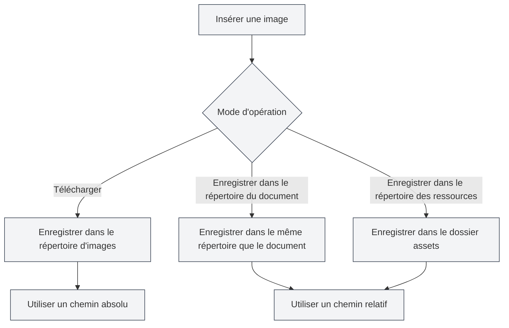

# Configuration du téléchargement d'images

## Vue d'ensemble

La configuration du téléchargement d'images détermine le mode de traitement lors de l'insertion d'images dans un document. MetaDoc prend en charge plusieurs modes de traitement d'images, vous permettant de choisir la configuration adaptée à vos besoins.

## Opération d'insertion d'image

### Modes d'opération

Lors de l'insertion d'une image, vous pouvez choisir parmi les modes d'opération suivants :

- **Télécharger** : Télécharger l'image vers un répertoire d'images spécifié
- **Enregistrer dans le répertoire du document** : Enregistrer l'image dans le répertoire où se trouve le document
- **Enregistrer dans le répertoire des ressources** : Enregistrer l'image dans le dossier `assets` sous le répertoire du document

Vous pouvez accéder aux paramètres d'image via la barre de menu supérieure :

<MenuItemsDemo mode="demo" :items='[{"id": "settings"}]' />

### Interface des paramètres d'image

L'illustration ci-dessous montre l'interface complète de la page des paramètres d'image :

<SettingImageSection mode="demo" />

L'interface des paramètres d'image comprend les zones de configuration principales suivantes :

- **Service de téléchargement d'images** : Choisir le stockage local ou un hébergeur d'images tiers
- **Chemin de stockage local** : Définir le répertoire local où les images sont enregistrées
- **Traitement des images réseau** : Configurer des options telles que la conservation de l'URL d'origine, le transfert automatique, etc.

### Mode Téléchargement

Le mode Téléchargement enregistre l'image dans le répertoire d'images local configuré :

- **Avantages** : Gestion centralisée de toutes les images, facilitant la sauvegarde et la migration
- **Inconvénients** : Séparation des images et du document, nécessitant de déplacer les images en même temps que le document
- **Cas d'utilisation** : Partage d'images entre plusieurs documents, gestion centralisée des ressources d'images

<DialogDemo mode="demo" dialogType="image-upload" />

### Enregistrer dans le répertoire du document

Enregistre l'image dans le répertoire où se trouve le document :

- **Avantages** : L'image et le document sont dans le même répertoire, facilitant la gestion
- **Inconvénients** : Chaque répertoire de document contient des images, pouvant entraîner des doublons
- **Cas d'utilisation** : Projets à document unique, documents nécessitant un empaquetage indépendant

<DialogDemo mode="demo" dialogType="file-save" />

### Enregistrer dans le répertoire des ressources

Enregistre l'image dans le dossier `assets` sous le répertoire du document :

- **Avantages** : Les images sont stockées de manière unifiée dans le dossier `assets`, structure claire
- **Inconvénients** : Nécessite la création d'un dossier `assets`
- **Cas d'utilisation** : Besoin d'une structure de fichiers claire, documents à exporter et partager

<DialogDemo mode="demo" dialogType="folder-select" />

## Conserver l'URL des images réseau

### Description de la fonctionnalité

Lorsque "Conserver l'URL des images réseau" est activé, les images réseau insérées ne sont pas téléchargées, mais l'URL d'origine est utilisée directement :

- **Activé** : Conserve l'URL d'origine de l'image réseau, ne la télécharge pas localement
- **Désactivé** : Télécharge l'image réseau localement, utilise un chemin local

### Cas d'utilisation

- **Scénarios d'activation** :

  - Les ressources d'images sont volumineuses, pas besoin de sauvegarde locale
  - Les images sont mises à jour régulièrement, nécessitant un affichage en temps réel de la dernière version
  - Économiser l'espace de stockage local

- **Scénarios de désactivation** :
  - Nécessité d'accéder aux images hors ligne
  - Nécessité de sauvegarder les ressources d'images
  - Les images réseau peuvent devenir indisponibles

### Points d'attention

- Lors de la conservation de l'URL réseau, une connexion Internet est nécessaire pour afficher l'image
- Si l'image réseau devient indisponible, l'image dans le document ne s'affichera pas
- Il est recommandé de désactiver cette option pour les images importantes, afin de garantir leur disponibilité

## Échapper automatiquement les URL d'images

### Description de la fonctionnalité

Lorsque "Échapper automatiquement les URL d'images" est activé, les caractères spéciaux dans l'URL sont automatiquement échappés lors de l'insertion d'une image :

- **Activé** : Échappe automatiquement les caractères spéciaux dans l'URL (comme les espaces, caractères chinois, etc.)
- **Désactivé** : Garde l'URL telle quelle, sans échappement

### Règles d'échappement

Le système échappe automatiquement les caractères suivants :

- **Espaces** : Convertis en `%20`
- **Caractères chinois** : Encodage URL appliqué
- **Caractères spéciaux** : Échappés au format sécurisé pour URL

### Recommandations d'utilisation

- **Activé** : Recommandé d'activer, pour garantir que l'URL est correctement analysée dans tous les environnements
- **Désactivé** : Désactiver uniquement lorsque le format de l'URL est correct et ne nécessite pas d'échappement

## Format des chemins

### Chemin absolu

Lors de l'utilisation du mode Téléchargement, les images utilisent un chemin absolu :

- **Format** : `/chemin/vers/image.png`
- **Avantages** : Chemin explicite, non affecté par l'emplacement du document
- **Inconvénients** : Le chemin devient invalide après déplacement du document ou de l'image

### Chemin relatif

Lors de l'utilisation des modes "Enregistrer dans le répertoire du document" ou "Enregistrer dans le répertoire des ressources", les images utilisent un chemin relatif :

- **Format** : `./image.png` ou `./assets/image.png`
- **Avantages** : Le document et les images peuvent être déplacés ensemble
- **Inconvénients** : Le chemin doit être ajusté après un changement d'emplacement du document

## Application de la configuration

### Moment d'application

Les modifications de la configuration du téléchargement d'images prennent effet dans les cas suivants :

- **Nouvelles images insérées** : Utilisent immédiatement la nouvelle configuration
- **Documents déjà ouverts** : Nécessitent de rouvrir le document pour que les changements prennent effet
- **Documents déjà enregistrés** : Les documents déjà enregistrés ne sont pas affectés

### Rouvrir le fichier

Certains changements de configuration nécessitent de rouvrir le fichier pour prendre effet :

1. Modifier la configuration du téléchargement d'images
2. Fermer le document actuel
3. Rouvrir le document
4. La nouvelle configuration est appliquée

## Bonnes pratiques

1. **Gestion unifiée** : Utiliser le mode Téléchargement pour une gestion centralisée des images
2. **Indépendance des documents** : Utiliser le mode "Enregistrer dans le répertoire du document" lorsque les documents doivent être indépendants
3. **Structure claire** : Utiliser le mode répertoire des ressources pour maintenir une structure de fichiers claire
4. **Images réseau** : Pour les images importantes, il est recommandé de désactiver l'option de conservation de l'URL
5. **Échappement des chemins** : Il est recommandé d'activer l'échappement automatique pour garantir la compatibilité

## Points d'attention

1. **Application de la configuration** : Certaines configurations nécessitent de rouvrir le fichier pour prendre effet
2. **Format des chemins** : Attention à la différence entre chemin absolu et chemin relatif
3. **Images réseau** : Une connexion réseau est nécessaire lors de la conservation de l'URL réseau
4. **Sauvegarde des images** : Pour les images importantes, il est recommandé de désactiver la conservation de l'URL pour garantir une sauvegarde
5. **Espace de stockage** : Le mode Téléchargement utilise de l'espace de stockage local

## Documents connexes

- [[settings.image-upload|Paramètres du service de téléchargement]]
- [[settings.basic|Paramètres de base]]
- [[core.file-operations|Opérations sur les fichiers]]

<SettingImageSection mode="demo" />

<MenuItemsDemo mode="demo" :items='[{"id": "settings", "items": ["image"]}]' />

<DialogDemo mode="demo" dialogType="image-upload" />

<DialogDemo mode="demo" dialogType="file-save" />
