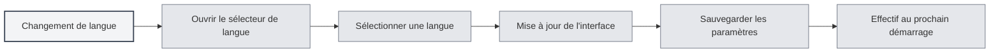

# Prise en charge multilingue

## Vue d'ensemble

MetaDoc prend en charge une interface multilingue, vous permettant de choisir la langue qui correspond à vos habitudes d'utilisation. Après avoir changé de langue, l'interface se met immédiatement à jour dans la langue sélectionnée.

## Langues prises en charge

MetaDoc prend actuellement en charge les langues suivantes :

- **Chinois simplifié** (zh_CN) : Langue par défaut
- **English** (en_US) : Anglais
- **日本語** (ja_JP) : Japonais
- **한국어** (ko_KR) : Coréen
- **Français** (fr_FR) : Français
- **Deutsch** (de_DE) : Allemand

## Changement de langue

### Changer de langue

1. Cliquez sur le sélecteur de langue en bas du menu de gauche
2. Sélectionnez la langue que vous souhaitez utiliser
3. L'interface se met immédiatement à jour dans la langue sélectionnée

Vous pouvez accéder aux paramètres de langue via la barre de menu supérieure :

<MenuItemsDemo mode="demo" :items='[{"id": "settings"}]' />

<SettingBasicSection mode="demo" />

<SettingLlmSection mode="demo" />



### Sauvegarde de la langue

La langue choisie est automatiquement sauvegardée :

- **Sauvegarde automatique** : Sauvegardée immédiatement après la sélection de la langue
- **Prochain démarrage** : L'application utilisera la dernière langue sélectionnée au prochain démarrage
- **Synchronisation multi-fenêtres** : Toutes les fenêtres synchronisent automatiquement les paramètres de langue

<SettingThemeSection mode="demo" />

## Localisation de l'interface

### Périmètre de localisation

Le changement de langue affecte les éléments d'interface suivants :

- **Éléments de menu** : Tous les menus et éléments de menu
- **Texte des boutons** : Le texte de tous les boutons
- **Boîtes de dialogue** : Toutes les boîtes de dialogue et messages d'information
- **Pages de paramètres** : Les étiquettes et descriptions de toutes les pages de paramètres
- **Messages d'erreur** : Les messages d'erreur et d'avertissement

### Langue du contenu

Les paramètres de langue n'affectent que la langue de l'interface, pas :

- **Contenu des documents** : Le contenu des documents reste inchangé
- **Chemins de fichiers** : Les chemins de fichiers restent inchangés
- **Saisie utilisateur** : Le contenu saisi par l'utilisateur n'est pas affecté

<ViewMenuItemsDemo mode="demo" :items='["settings"]' />

## Suggestions pour le choix de la langue

### Selon les habitudes d'utilisation

- **Utilisateurs chinois** : Utilisez le chinois simplifié, l'interface sera plus familière
- **Utilisateurs anglophones** : Utilisez l'anglais, cela correspond aux habitudes d'utilisation
- **Autres langues** : Choisissez selon vos préférences personnelles

### Selon la langue des documents

- **Documents en chinois** : Vous pouvez utiliser l'interface en chinois
- **Documents en anglais** : Vous pouvez utiliser l'interface en anglais
- **Documents multilingues** : Choisissez la langue la plus couramment utilisée

## Effet du changement de langue

### Prise d'effet immédiate

Le changement de langue prend effet immédiatement :

- **Mise à jour de l'interface** : Tous les éléments de l'interface sont mis à jour immédiatement
- **Aucun redémarrage requis** : Il n'est pas nécessaire de redémarrer l'application
- **État préservé** : L'état d'édition en cours n'est pas perdu

<MainTabs mode="demo" />

### Synchronisation multi-fenêtres

Toutes les fenêtres synchronisent automatiquement la langue :

- **Fenêtre principale** : Changement de langue de la fenêtre principale
- **Fenêtres auxiliaires** : Toutes les fenêtres auxiliaires sont mises à jour de manière synchrone
- **Nouvelles fenêtres** : Les nouvelles fenêtres ouvertes utilisent la langue actuelle

## Fichiers de langue

### Emplacement des fichiers de langue

Les fichiers de langue sont stockés dans le répertoire de l'application :

- **Format de fichier** : Format JSON
- **Emplacement du fichier** : `src/renderer/src/locales/`
- **Nommage des fichiers** : Utilise le code de langue (par exemple `zh_cn.json`)

### Structure des fichiers de langue

Les fichiers de langue utilisent une structure clé-valeur :

```json
{
  "common": {
    "confirm": "Confirmer",
    "cancel": "Annuler"
  },
  "setting": {
    "basic": "Paramètres de base"
  }
}
```

## Points à noter

1. **Code de langue** : Les codes de langue utilisent le format avec un trait de soulignement (par exemple `zh_CN`)
2. **Complétude de la traduction** : Certaines nouvelles fonctionnalités peuvent temporairement n'être traduites que dans certaines langues
3. **Langue de repli** : Si une traduction est manquante, le système revient au chinois simplifié
4. **Contenu des documents** : Les paramètres de langue n'affectent pas le contenu des documents
5. **Chemins de fichiers** : Les paramètres de langue n'affectent pas l'affichage des chemins de fichiers

## Documentation connexe

- [[settings.basic|Paramètres de base]]
- [[quick-start.guide|Guide de démarrage rapide]]

<ViewMenuItemsDemo mode="demo" :items='["settings"]' />