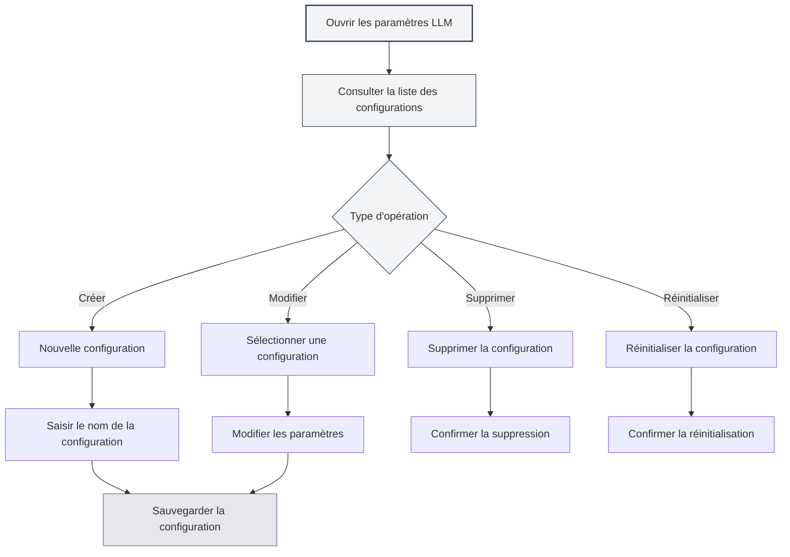

# Gestion de configuration LLM

## Vue d'ensemble

La gestion de configuration LLM vous permet de créer, modifier, supprimer et gérer plusieurs configurations LLM. Grâce à la gestion des configurations, vous pouvez configurer différents services LLM pour différents scénarios d'utilisation et basculer entre eux de manière flexible pour répondre à divers besoins.

## Créer une configuration

### Créer une nouvelle configuration

1. Sur la page des paramètres LLM, cliquez sur le bouton "Nouvelle configuration" (icône +) au-dessus de la liste des configurations à gauche.
2. Saisissez le nom de la configuration dans la boîte de dialogue qui s'affiche.
3. Le système créera une nouvelle configuration basée sur les paramètres actuels.
4. Après la création réussie, le système basculera automatiquement vers la nouvelle configuration.

Vous pouvez accéder aux paramètres LLM via la barre de menu supérieure :

<MenuItemsDemo mode="demo" :items='[{"id": "settings"}]' />

### Démonstration de l'interface de configuration

L'illustration suivante présente les principales fonctionnalités de l'interface de gestion des configurations LLM :

<SettingLlmSection mode="demo" />

**Points à noter** :

- Le nom de la configuration ne peut pas être vide.
- Le nom de la configuration doit être descriptif pour faciliter son identification.
- La nouvelle configuration créée héritera de tous les paramètres actuels.
- Le type de configuration manuelle (manual) ne prend pas en charge la création de nouvelles configurations.



### Créer à partir des paramètres actuels

Lors de la création d'une nouvelle configuration, le système :

- Copie le type LLM actuellement sélectionné.
- Copie tous les paramètres de configuration actuels (URL de l'API, Clé API, modèle, etc.).
- Crée un nouvel ID de configuration.
- Ajoute la nouvelle configuration à la liste des configurations.

Vous pouvez créer une nouvelle configuration basée sur une configuration existante, puis modifier les paramètres, ce qui permet de créer rapidement des configurations similaires.

<DialogDemo mode="demo" dialogType="llm-config" />

## Modifier une configuration

### Modifier les paramètres de configuration

1. Sélectionnez la configuration à modifier dans la liste des configurations.
2. Modifiez les différents paramètres dans le formulaire à droite.
3. Après modification, le système marquera la configuration comme "Modifications non enregistrées".
4. Cliquez sur le bouton "Enregistrer les modifications" pour sauvegarder les modifications.

<DialogDemo mode="demo" dialogType="api-config" />

### Explication des paramètres de configuration

Les paramètres de configuration diffèrent selon le type de LLM :

- **API MetaDoc** : Sélection du modèle.
- **Ollama** : URL de l'API, Sélection du modèle, Nombre maximum de tokens.
- **Compatible OpenAI** : URL de l'API, Clé API, Sélection du modèle, Configuration du suffixe.
- **OpenAI officiel** : Clé API, Sélection du modèle.
- **DeepSeek** : Clé API, Sélection du modèle.
- **Gemini** : Clé API, Sélection du modèle.

### Aperçu en temps réel

Lors de la modification des paramètres de configuration, le système détecte les changements en temps réel :

- Un avertissement s'affiche lorsqu'il y a des modifications non enregistrées.
- Vous pouvez cliquer sur "Abandonner les modifications" à tout moment pour revenir à l'état précédent.
- Les modifications prennent effet immédiatement après l'enregistrement.

<AIChat mode="demo" />

## Supprimer une configuration

### Supprimer une configuration

1. Cliquez sur le bouton "Plus" (icône à trois points) à droite de l'élément de configuration.
2. Sélectionnez "Supprimer la configuration".
3. Confirmez l'opération de suppression.

**Restrictions** :

- Au moins une configuration doit être conservée ; la dernière configuration ne peut pas être supprimée.
- La configuration par défaut (isDefault) ne peut pas être supprimée, elle peut seulement être réinitialisée.
- L'opération de suppression est irréversible ; veuillez l'effectuer avec prudence.

### Confirmation de suppression

Avant de supprimer une configuration, le système vous demandera de confirmer :

- Après confirmation, la configuration sera définitivement supprimée.
- Si la configuration actuellement utilisée est supprimée, le système basculera automatiquement vers une autre configuration.
- La suppression est irréversible ; assurez-vous de ne plus avoir besoin de cette configuration.

<DialogDemo mode="demo" dialogType="confirm-delete" />

## Réinitialiser une configuration

### Réinitialiser la configuration par défaut

Pour la configuration par défaut (par exemple, "Ollama (par défaut)"), vous pouvez la réinitialiser à ses valeurs initiales :

1. Cliquez sur le bouton "Plus" à droite de l'élément de configuration.
2. Sélectionnez "Réinitialiser la configuration".
3. Confirmez l'opération de réinitialisation.

Après la réinitialisation, la configuration reviendra à ses valeurs par défaut d'origine, et toutes les modifications personnalisées seront effacées.

**Cas d'utilisation** :

- La configuration a été modifiée accidentellement et doit être restaurée aux valeurs par défaut.
- Réinitialisation nécessaire après des tests de configuration.
- Nettoyage des paramètres personnalisés inutiles.

## Exporter une configuration

### Exporter une configuration individuelle

1. Cliquez sur le bouton "Plus" à droite de l'élément de configuration.
2. Sélectionnez "Exporter la configuration".
3. Le système générera un fichier de configuration au format JSON.
4. Enregistrez le fichier localement.

<DialogDemo mode="demo" dialogType="export-config" />

Le fichier de configuration exporté contient :

- L'ID et le nom de la configuration.
- Le type de LLM.
- Tous les paramètres de configuration.
- Les dates de création et de mise à jour.

### Exporter toutes les configurations

1. Cliquez sur le bouton "Exporter toutes les configurations" (icône de téléchargement) au-dessus de la liste des configurations.
2. Le système exportera toutes les configurations dans un seul fichier JSON.
3. Enregistrez le fichier localement.

L'exportation de toutes les configurations peut être utilisée pour :

- Sauvegarder toutes les configurations.
- Migrer vers un autre appareil.
- Partager des configurations avec d'autres utilisateurs.

## Importer une configuration

### Importer une configuration

1. Cliquez sur le bouton "Importer une configuration" (icône de copie de document) au-dessus de la liste des configurations.
2. Sélectionnez le fichier de configuration précédemment exporté.
3. Le système analysera et importera la configuration.
4. La configuration importée sera ajoutée à la liste des configurations.

<DialogDemo mode="demo" dialogType="import-config" />

**Règles d'importation** :

- Prend en charge l'importation d'une configuration individuelle ou d'un tableau de configurations.
- Si l'ID de la configuration importée existe déjà, un nouvel ID sera créé pour éviter les conflits.
- Après l'importation, vous devez basculer manuellement vers la nouvelle configuration.

### Format d'importation

Le fichier de configuration doit être au format JSON et prendre en charge les structures suivantes :

```json
{
  "id": "config-xxx",
  "name": "Nom de la configuration",
  "type": "ollama",
  "ollama": {
    "apiUrl": "http://localhost:11434/api",
    "selectedModel": "llama2"
  }
}
```

Ou un tableau de configurations :

```json
[
  { "id": "config-1", ... },
  { "id": "config-2", ... }
]
```

## Trier les configurations

### Tri par glisser-déposer

La liste des configurations prend en charge le tri par glisser-déposer :

1. Cliquez et maintenez l'élément de configuration.
2. Faites-le glisser vers la position souhaitée.
3. Relâchez la souris pour terminer le tri.

L'ordre après tri sera sauvegardé et conservé lors de la prochaine ouverture de la page des paramètres.

**Cas d'utilisation** :

- Placer les configurations fréquemment utilisées en haut.
- Trier par fréquence d'utilisation.
- Grouper par type de LLM.

## État de la configuration

### Configuration actuelle

La configuration actuellement utilisée :

- Sera mise en évidence dans la liste.
- Affichera l'étiquette "Modifications non enregistrées" (s'il y a des modifications non sauvegardées).
- Toutes les fonctionnalités d'IA utiliseront le service LLM de cette configuration.

### Changement de configuration

Lors du changement de configuration :

- Le système vérifiera si la configuration actuelle a des modifications non enregistrées.
- S'il y a des modifications non enregistrées, il est recommandé de les enregistrer ou de les abandonner d'abord.
- Le changement prend effet immédiatement ; toutes les fonctionnalités d'IA utiliseront la nouvelle configuration.

## Bonnes pratiques

1. **Conventions de nommage** : Utilisez des noms de configuration clairs, tels que "Travail-Ollama", "Expérimentation-OpenAI".
2. **Sauvegarde régulière** : Exportez régulièrement des sauvegardes des configurations importantes.
3. **Tester la configuration** : Testez d'abord une nouvelle configuration après sa création, et ne l'utilisez qu'après avoir confirmé qu'elle fonctionne.
4. **Nettoyer les configurations inutiles** : Supprimez régulièrement les configurations qui ne sont plus utilisées pour garder la liste propre.
5. **Documentation** : Ajoutez des notes ou une documentation pour les configurations complexes.

## Points à noter

1. **Sécurité des configurations** : Conservez soigneusement les configurations contenant une clé API ; ne les partagez pas.
2. **Conflits de configuration** : Faites attention aux conflits d'ID lors de l'importation de configurations.
3. **Configuration par défaut** : La configuration par défaut ne peut pas être supprimée, seulement réinitialisée.
4. **Dépendances de configuration** : Certaines fonctionnalités peuvent dépendre de configurations spécifiques ; vérifiez avant de supprimer.
5. **Synchronisation multi-fenêtres** : Les modifications de configuration seront synchronisées entre toutes les fenêtres.

## Documentation associée

- [[settings.llm|Configuration LLM]]
- [[settings.llm-types|Configuration des types LLM]]
- [[ai.chat|Fonctionnalité de dialogue IA]]
- [[agent.config|Gestion de configuration Agent]]

<QuickStartPanel mode="demo" />

<MainTabs mode="demo" />