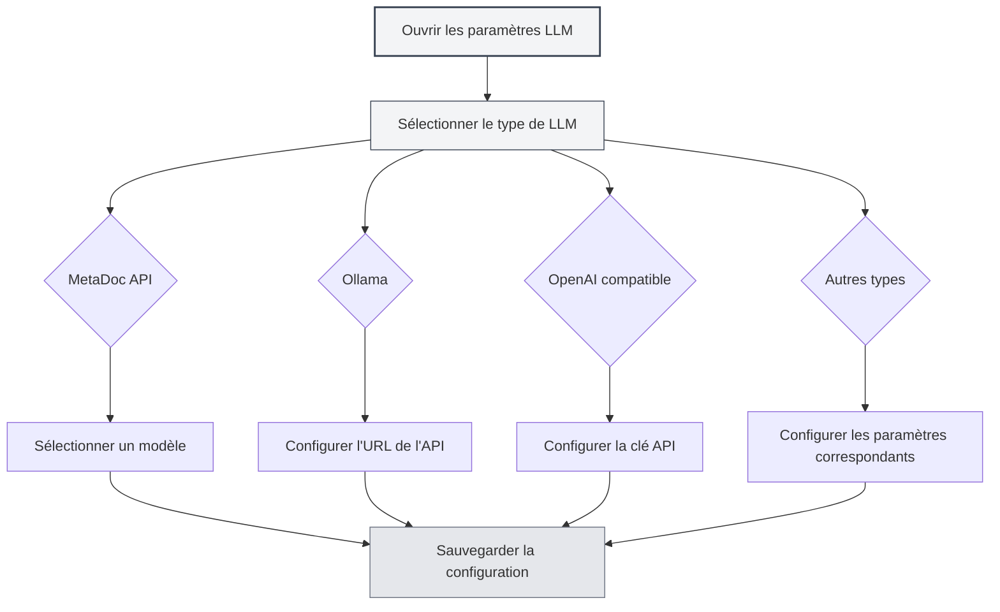

# Configuration des types de LLM

## Vue d'ensemble

MetaDoc prend en charge plusieurs fournisseurs de services LLM, chaque type ayant des exigences de configuration différentes. Ce document explique comment configurer les différents types de LLM, notamment MetaDoc API, Ollama, OpenAI, DeepSeek et Gemini.

## MetaDoc API

### Instructions de configuration

MetaDoc API est le service LLM officiel fourni par MetaDoc, simple à utiliser et ne nécessitant pas de clé API.

### Étapes de configuration

1. Sélectionnez "MetaDoc" dans la liste déroulante des types de LLM
2. Choisissez un modèle disponible dans la liste déroulante "Sélectionner un modèle"
3. Configurez le nombre maximum de tokens (optionnel)

Vous pouvez accéder aux paramètres LLM via la barre de menu supérieure :

<MenuItemsDemo mode="demo" :items='[{"id": "settings"}]' />

### Démonstration de l'interface de configuration LLM

L'illustration ci-dessous montre les principales zones fonctionnelles de la page de configuration LLM :

<SettingLlmSection mode="demo" />

### Exigences de configuration

- **Compte connecté** : Nécessite d'être connecté à un compte MetaDoc
- **Sélection du modèle** : Choisir dans la liste des modèles disponibles
- **Nombre maximum de tokens** : Optionnel, limite le nombre maximum de tokens par requête

<MainTabs mode="demo" />

### Cas d'utilisation

- Démarrer rapidement avec les fonctionnalités IA
- Pas besoin de configurer de service externe
- Utilisation du service officiel MetaDoc

<DialogDemo mode="demo" dialogType="llm-config" />

## Ollama

### Instructions de configuration

Ollama est un environnement d'exécution LLM local permettant d'exécuter des modèles de langage volumineux en local, sans connexion Internet.

### Étapes de configuration

1. Sélectionnez "Ollama" dans la liste déroulante des types de LLM
2. Configurez l'URL de base de l'API (par défaut : `http://localhost:11434/api`)
3. Cliquez sur la liste déroulante "Sélectionner un modèle", le système récupérera automatiquement la liste des modèles disponibles localement
4. Sélectionnez le modèle à utiliser
5. Configurez le nombre maximum de tokens (optionnel)

### Exigences de configuration

- **Installation d'Ollama** : Ollama doit être installé et son service démarré
- **URL de l'API** : Par défaut `http://localhost:11434/api`, à modifier si Ollama fonctionne sur une autre adresse
- **Téléchargement du modèle** : Le modèle doit d'abord être téléchargé via Ollama (ex : `ollama pull llama2`)

### Obtenir la liste des modèles

Lorsque vous cliquez sur la liste déroulante "Sélectionner un modèle", MetaDoc se connecte automatiquement au service Ollama et récupère la liste des modèles disponibles. En cas d'échec de connexion, vérifiez :

- Si le service Ollama est en cours d'exécution
- Si l'URL de l'API est correcte
- Si la connexion réseau fonctionne correctement

### Cas d'utilisation

- Exécution locale de LLM pour protéger la confidentialité des données
- Pas besoin de connexion Internet
- Ressources de calcul suffisantes (GPU recommandé)

<DialogDemo mode="demo" dialogType="api-config" />

## OpenAI compatible

### Instructions de configuration

L'API OpenAI compatible prend en charge tous les services compatibles avec le format d'API OpenAI, y compris l'API officielle OpenAI et les services tiers compatibles.

### Étapes de configuration

1. Sélectionnez "OpenAI compatible" dans la liste déroulante des types de LLM
2. Configurez l'URL de base de l'API (par défaut : `https://api.openai.com/v1`)
3. Saisissez la clé API
4. Cliquez sur la liste déroulante "Sélectionner un modèle" pour obtenir la liste des modèles disponibles
5. Sélectionnez le modèle à utiliser
6. Configurez les suffixes Completion et Chat (optionnel, pour personnaliser les chemins d'API)
7. Configurez le nombre maximum de tokens (optionnel)

### Exigences de configuration

- **URL de l'API** : Adresse de l'API officielle OpenAI ou d'un service compatible
- **Clé API** : Clé API obtenue auprès du fournisseur de service
- **Liste des modèles** : Le système récupère automatiquement la liste des modèles disponibles

### Configuration des suffixes d'API

Certains services compatibles peuvent nécessiter des chemins d'API personnalisés :

- **Suffixe Completion** : Suffixe de chemin personnalisé pour l'API Completion
- **Suffixe Chat** : Suffixe de chemin personnalisé pour l'API Chat

Dans la plupart des cas, aucune configuration n'est nécessaire, les valeurs par défaut suffisent.

### Cas d'utilisation

- Utilisation de l'API officielle OpenAI
- Utilisation de services tiers compatibles avec l'API OpenAI
- Services nécessitant des chemins d'API personnalisés

<MainTabs mode="demo" />

## OpenAI officiel

### Instructions de configuration

La configuration OpenAI officielle est spécifiquement destinée à l'API officielle OpenAI, plus simple à configurer, avec une URL d'API fixe.

### Étapes de configuration

1. Sélectionnez "OpenAI officiel" dans la liste déroulante des types de LLM
2. Saisissez la clé API OpenAI
3. Cliquez sur la liste déroulante "Sélectionner un modèle" pour obtenir la liste des modèles disponibles
4. Sélectionnez le modèle à utiliser
5. Configurez le nombre maximum de tokens (optionnel)

### Exigences de configuration

- **Clé API** : Clé API obtenue sur le site officiel d'OpenAI
- **URL de l'API** : Fixée à `https://api.openai.com/v1`, non modifiable

### Obtenir une clé API

1. Visitez le [site officiel d'OpenAI](https://platform.openai.com/)
2. Créez un compte ou connectez-vous
3. Accédez à la page API Keys
4. Créez une nouvelle clé API
5. Copiez la clé API et collez-la dans la configuration MetaDoc

<ResizableDivider mode="demo" />

### Cas d'utilisation

- Utilisation des modèles GPT officiels d'OpenAI
- Besoin d'un service officiel stable
- Possession d'un compte OpenAI et de quotas API

## DeepSeek

### Instructions de configuration

DeepSeek est un fournisseur de services LLM haute performance offrant de solides capacités de compréhension du chinois.

### Étapes de configuration

1. Sélectionnez "DeepSeek" dans la liste déroulante des types de LLM
2. Saisissez la clé API DeepSeek
3. Sélectionnez le modèle (deepseek-chat ou deepseek-reasoner)
4. Configurez le nombre maximum de tokens (optionnel)

### Exigences de configuration

- **Clé API** : Clé API obtenue sur le site officiel de DeepSeek
- **Sélection du modèle** :
  - `deepseek-chat` : Modèle de dialogue général
  - `deepseek-reasoner` : Modèle de raisonnement

### Obtenir une clé API

1. Visitez le [site officiel de DeepSeek](https://www.deepseek.com/)
2. Créez un compte ou connectez-vous
3. Accédez à la page API Keys
4. Créez une nouvelle clé API
5. Copiez la clé API et collez-la dans la configuration MetaDoc

### Cas d'utilisation

- Nécessité de solides capacités de compréhension du chinois
- Besoin de capacités de raisonnement (utiliser deepseek-reasoner)
- Service LLM offrant un bon rapport qualité-prix

<SettingKnowledgeBaseSection mode="demo" />

<CompletionSettingsPanel mode="demo" />

## Gemini

### Instructions de configuration

Gemini est le service LLM fourni par Google, prenant en charge les capacités multimodales.

### Étapes de configuration

1. Sélectionnez "Gemini" dans la liste déroulante des types de LLM
2. Saisissez la clé API Gemini
3. Cliquez sur la liste déroulante "Sélectionner un modèle" pour obtenir la liste des modèles disponibles
4. Sélectionnez le modèle à utiliser
5. Configurez le nombre maximum de tokens (optionnel)

### Exigences de configuration

- **Clé API** : Clé API obtenue depuis Google AI Studio
- **Sélection du modèle** : Le système récupère automatiquement la liste des modèles disponibles

### Obtenir une clé API

1. Visitez [Google AI Studio](https://makersuite.google.com/app/apikey)
2. Connectez-vous avec un compte Google
3. Créez une nouvelle clé API
4. Copiez la clé API et collez-la dans la configuration MetaDoc

### Cas d'utilisation

- Utilisation du service LLM de Google
- Besoin de capacités multimodales
- Possession d'un compte Google

<AgentView mode="demo" />

## Configuration du nombre maximum de tokens

### Description de la fonctionnalité

Le nombre maximum de tokens limite la quantité maximale de tokens pouvant être générés par une seule requête. Activer cette fonctionnalité permet de :

- Contrôler la longueur du contenu généré
- Économiser sur les coûts d'API
- Éviter la génération de contenus trop longs

### Méthode de configuration

1. Activez l'interrupteur "Nombre maximum de tokens"
2. Définissez le nombre de tokens (plage : 1-32768)
3. Sauvegardez la configuration

### Recommandations d'utilisation

- **Génération de texte court** : 100-500 tokens
- **Longueur moyenne** : 500-2000 tokens
- **Génération de texte long** : 2000-8000 tokens
- **Illimité** : Désactivez cette option

## Validation de la configuration

### Tester la configuration

Après avoir configuré, il est recommandé de tester si la configuration fonctionne correctement :

1. Sauvegardez la configuration
2. Activez la fonctionnalité LLM
3. Essayez d'utiliser la fonction de dialogue IA
4. En cas d'erreur, vérifiez si la configuration est correcte

### Problèmes courants

**Échec de connexion** :

- Vérifiez si l'URL de l'API est correcte
- Vérifiez la connexion réseau
- Vérifiez si le service fonctionne normalement

**Échec d'authentification** :

- Vérifiez si la clé API est correcte
- Vérifiez si la clé API a expiré
- Vérifiez si le compte dispose de quotas suffisants

**Modèle non disponible** :

- Vérifiez si le nom du modèle est correct
- Vérifiez si le compte a l'autorisation d'utiliser ce modèle
- Vérifiez si le service prend en charge ce modèle

## Points à noter

1. **Sécurité des clés API** : Conservez vos clés API en lieu sûr, ne les partagez pas
2. **Contrôle des coûts** : L'utilisation d'API externes peut engendrer des frais, surveillez votre consommation
3. **Exigences réseau** : L'utilisation d'API externes nécessite une connexion réseau stable
4. **Disponibilité du service** : La disponibilité et la stabilité peuvent varier selon les services
5. **Sélection du modèle** : Différents modèles ont différentes capacités et limites, choisissez en fonction de vos besoins

## Documentation associée

- [[settings.llm|Configuration LLM]]
- [[settings.llm-management|Gestion de la configuration LLM]]
- [[ai.chat|Fonction de dialogue IA]]
- [[ai.completion|Complétion automatique IA]]

<MenuItemsDemo mode="demo" :items='[{"id": "file"}]' />

<ViewMenuItemsDemo mode="demo" :items='["settings"]' />

<SettingLlmSection mode="demo" />

<DialogDemo mode="demo" dialogType="llm-config" />

<MainTabs mode="demo" />
