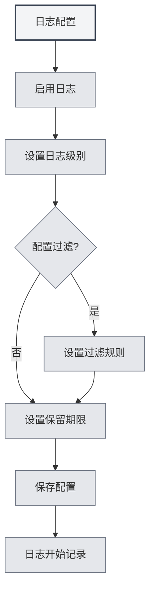

# Configuration des journaux

## Vue d'ensemble

La configuration des journaux vous permet de gérer la fonctionnalité de journalisation de MetaDoc. En configurant les journaux, vous pouvez enregistrer l'état d'exécution de l'application, facilitant ainsi le dépannage et l'analyse des performances.

<Demo component="SettingLoggerSection" mode="demo" />

## Activer les journaux

### Activer la fonction de journalisation

Sur la page des paramètres des journaux, vous devez d'abord activer la fonction de journalisation :

1. Trouvez l'interrupteur "Activer les journaux"
2. Basculez l'interrupteur sur l'état "Activé"
3. Les journaux commenceront à être enregistrés dans un fichier

Vous pouvez accéder aux paramètres des journaux via la barre de menu supérieure :

<MenuItemsDemo mode="demo" :items='[{"id": "settings"}]' />

Une fois les journaux activés, le système enregistrera les informations d'exécution de l'application, y compris :

- Les enregistrements d'opérations
- Les messages d'erreur
- Les messages d'avertissement
- Les informations de débogage (si activées)



**Points à noter** :

- Les journaux occupent un certain espace disque
- Il est recommandé de les activer uniquement lors du dépannage de problèmes
- En environnement de production, ils peuvent être désactivés pour réduire la consommation de ressources

## Niveau des journaux

### Description des niveaux

Le niveau de journalisation détermine quels niveaux de journaux sont enregistrés :

<ConsoleTerminal mode="demo" consoleKey="log-levels" :history='[{"content": "[INFO] 应用启动完成", "type": "out"}, {"content": "[DEBUG] 加载配置文件", "type": "out"}, {"content": "[WARN] 配置项缺失，使用默认值", "type": "warn"}, {"content": "[ERROR] 连接失败，正在重试...", "type": "error"}]' />

- **DEBUG** : Informations détaillées de débogage, incluant tous les détails des opérations
- **INFO** : Informations générales, enregistrant les opérations et états importants
- **WARN** : Messages d'avertissement, enregistrant les problèmes potentiels
- **ERROR** : Messages d'erreur, enregistrant les erreurs et exceptions

### Priorité des niveaux

Les niveaux de journalisation ont une relation de priorité :

```
DEBUG < INFO < WARN < ERROR
```

Lorsque vous sélectionnez un niveau, les journaux de ce niveau et des niveaux supérieurs sont enregistrés. Par exemple :

- Sélectionner INFO : enregistre INFO, WARN, ERROR
- Sélectionner WARN : enregistre uniquement WARN, ERROR
- Sélectionner ERROR : enregistre uniquement ERROR

### Suggestions pour le choix du niveau

- **Développement/Débogage** : Utilisez le niveau DEBUG pour obtenir des informations détaillées
- **Utilisation quotidienne** : Utilisez le niveau INFO pour enregistrer les opérations importantes
- **Dépannage de problèmes** : Utilisez le niveau WARN pour vous concentrer sur les avertissements et erreurs
- **Environnement de production** : Utilisez le niveau ERROR pour n'enregistrer que les erreurs

<SettingLoggerSection mode="demo" />

## Filtrage des journaux

### Fonction de filtrage

Le filtrage des journaux vous permet de n'enregistrer que les journaux d'une portée spécifique :

- **Filtrer par scope** : N'enregistrer que les journaux de modules spécifiques
- **Correspondance par préfixe** : Prend en charge la correspondance par préfixe, par exemple "ai-graph" correspondra à tous les scopes commençant par "ai-graph"
- **Correspondance exacte** : Prend en charge la correspondance exacte, par exemple "[ai-graph][WorkflowTool]"

### Règles de filtrage

Les règles de filtrage prennent en charge les formats suivants :

- **Correspondance simple** : `ai-graph` - Correspond à tous les scopes contenant "ai-graph"
- **Correspondance par préfixe** : `ai-` - Correspond à tous les scopes commençant par "ai-"
- **Correspondance exacte** : `[ai-graph][WorkflowTool]` - Correspond exactement à ce scope

### Cas d'utilisation

- **Déboguer un module spécifique** : N'enregistrer que les journaux d'un module particulier
- **Réduire le volume de journaux** : Filtrer les journaux non pertinents
- **Localiser un problème** : Se concentrer sur les journaux d'une fonctionnalité spécifique

<SettingDebugSection mode="demo" />

### Exemples de filtrage

**Exemple 1 : N'enregistrer que les journaux liés à l'IA**

```
Condition de filtrage : ai-
```

**Exemple 2 : N'enregistrer que les journaux de flux de travail**

```
Condition de filtrage : workflow
```

**Exemple 3 : N'enregistrer que les journaux d'un outil spécifique**

```
Condition de filtrage : [ai-graph][WorkflowTool]
```

## Durée de conservation des journaux

### Paramétrage de la durée de conservation

La durée de conservation des journaux détermine combien de temps les fichiers journaux sont conservés :

- **Ne pas conserver** : Ne pas nettoyer automatiquement les journaux
- **1 jour** : Conserver les journaux pendant 1 jour
- **3 jours** : Conserver les journaux pendant 3 jours
- **7 jours** : Conserver les journaux pendant 7 jours
- **1 mois** : Conserver les journaux pendant 1 mois
- **3 mois** : Conserver les journaux pendant 3 mois
- **6 mois** : Conserver les journaux pendant 6 mois
- **1 an** : Conserver les journaux pendant 1 an
- **Permanent** : Conserver les journaux indéfiniment

### Nettoyage automatique

Après avoir défini une durée de conservation, le système nettoie automatiquement les fichiers journaux expirés :

- **Moment du nettoyage** : Le nettoyage est exécuté immédiatement lors du changement de la durée de conservation
- **Règle de nettoyage** : Suppression des fichiers journaux dépassant la durée de conservation
- **Portée du nettoyage** : Seuls les fichiers du répertoire des journaux sont nettoyés

<ConsoleTerminal mode="demo" consoleKey="cleanup" :history='[{"content": "[INFO] 开始清理过期日志文件...", "type": "out"}, {"content": "[INFO] 删除: 2026-02-10 10-30-45.log (超过保留期限)", "type": "out"}, {"content": "[INFO] 删除: 2026-02-11 14-20-30.log (超过保留期限)", "type": "out"}, {"content": "[INFO] 清理完成，共删除 2 个文件", "type": "out"}]' />

### Suggestions de choix

- **Environnement de développement** : Utilisez une durée de conservation courte (1-3 jours)
- **Environnement de production** : Utilisez une durée de conservation moyenne (7 jours - 1 mois)
- **Projets importants** : Utilisez une durée de conservation longue (3-6 mois)
- **Besoins d'audit** : Utilisez la conservation permanente

## Chemin des fichiers journaux

### Voir le chemin des journaux

Sur la page des paramètres des journaux, vous pouvez voir :

- **Chemin du fichier journal** : Le chemin complet du fichier journal actuel
- **Chemin du répertoire des journaux** : Le chemin du répertoire contenant les fichiers journaux

### Ouvrir un fichier journal

1. Sur la page des paramètres des journaux, trouvez "Chemin du fichier journal"
2. Cliquez sur le bouton "Ouvrir le fichier journal"
3. Le système ouvrira le fichier journal avec l'éditeur de texte par défaut

### Ouvrir le répertoire des journaux

1. Sur la page des paramètres des journaux, trouvez "Répertoire des journaux"
2. Cliquez sur le bouton "Ouvrir le répertoire des journaux"
3. Le système ouvrira le répertoire des journaux dans l'explorateur de fichiers

<ViewMenuItemsDemo mode="demo" :items='["home", "editor"]'
/>

## Console des journaux

### Voir les journaux en temps réel

La page des paramètres des journaux fournit une console pour visualiser les journaux en temps réel :

- **Affichage en temps réel** : Affiche les entrées de journal les plus récentes
- **Historique** : Affiche l'historique récent des journaux (jusqu'à 500 entrées)
- **Niveau des journaux** : Les différents niveaux de journaux sont affichés avec des couleurs différentes

<ConsoleTerminal mode="demo" consoleKey="realtime-logs" :history='[{"content": "[2026-02-24 10:30:15] [INFO] [main][App] 应用启动完成", "type": "out"}, {"content": "[2026-02-24 10:30:16] [DEBUG] [renderer][Editor] 编辑器初始化", "type": "out"}, {"content": "[2026-02-24 10:30:18] [INFO] [renderer][Workspace] 加载工作目录", "type": "out"}]' />

### Fonctionnalités de la console

- **Voir les journaux** : Visualiser les journaux de l'application en temps réel
- **Filtrer l'affichage** : Filtrer l'affichage en fonction du niveau de journalisation
- **Rechercher dans les journaux** : Rechercher du contenu dans la console

## Format des fichiers journaux

### Nommage des fichiers

Les fichiers journaux utilisent le format de nommage suivant :

```
YYYY-MM-DD HH-mm-ss.log
```

Par exemple : `2026-02-19 14-30-45.log`

### Format des journaux

Chaque entrée de journal contient les informations suivantes :

- **Horodatage** : L'heure à laquelle le journal a été enregistré
- **Niveau** : Le niveau du journal (DEBUG/INFO/WARN/ERROR)
- **Type de processus** : main (processus principal) ou renderer (processus de rendu)
- **Scope** : Le module ou composant source du journal
- **Message** : Le contenu du message du journal

### Exemple de journal

```
[2026-02-19 14:30:45] [INFO] [main][Logger] 日志配置更新: enabled=true, level=info
[2026-02-19 14:30:46] [DEBUG] [renderer][Editor] 文档已保存
[2026-02-19 14:30:47] [WARN] [main][RAG] 知识库文件未找到
[2026-02-19 14:30:48] [ERROR] [renderer][LLM] API调用失败
```

<ConsoleTerminal mode="demo" consoleKey="log-examples" :history='[{"content": "[2026-02-19 14:30:45] [INFO] [main][Logger] 日志配置更新: enabled=true, level=info", "type": "out"}, {"content": "[2026-02-19 14:30:46] [DEBUG] [renderer][Editor] 文档已保存", "type": "out"}, {"content": "[2026-02-19 14:30:47] [WARN] [main][RAG] 知识库文件未找到", "type": "warn"}, {"content": "[2026-02-19 14:30:48] [ERROR] [renderer][LLM] API调用失败", "type": "error"}]' />

## Bonnes pratiques

1. **Définir un niveau approprié** : Choisissez un niveau de journalisation adapté à votre scénario d'utilisation
2. **Utiliser le filtrage** : Utilisez la fonction de filtrage pour réduire le volume de journaux
3. **Nettoyer régulièrement** : Définissez une durée de conservation raisonnable pour éviter d'occuper trop d'espace
4. **Dépanner les problèmes** : En cas de problème, augmentez temporairement le niveau de journalisation pour obtenir des informations détaillées
5. **Sauvegarder les journaux** : Il est recommandé de sauvegarder les journaux importants

<MainTabs mode="demo" />

## Points à noter

1. **Espace disque** : Les journaux occupent de l'espace disque, pensez à les nettoyer régulièrement
2. **Impact sur les performances** : Le niveau DEBUG peut affecter les performances, il est recommandé de l'utiliser uniquement lors du débogage
3. **Confidentialité et sécurité** : Les journaux peuvent contenir des informations sensibles, veillez à protéger les fichiers journaux
4. **Permissions des fichiers** : Assurez-vous que le répertoire des journaux a les permissions d'écriture
5. **Emplacement des journaux** : L'emplacement des fichiers journaux est géré automatiquement par le système, il n'est pas recommandé de le modifier manuellement

## Documentation associée

- [[settings.basic|Paramètres de base]]
- [[settings.about|Informations]]

<QuickStartPanel mode="demo" />

<ResizableDivider mode="demo" />