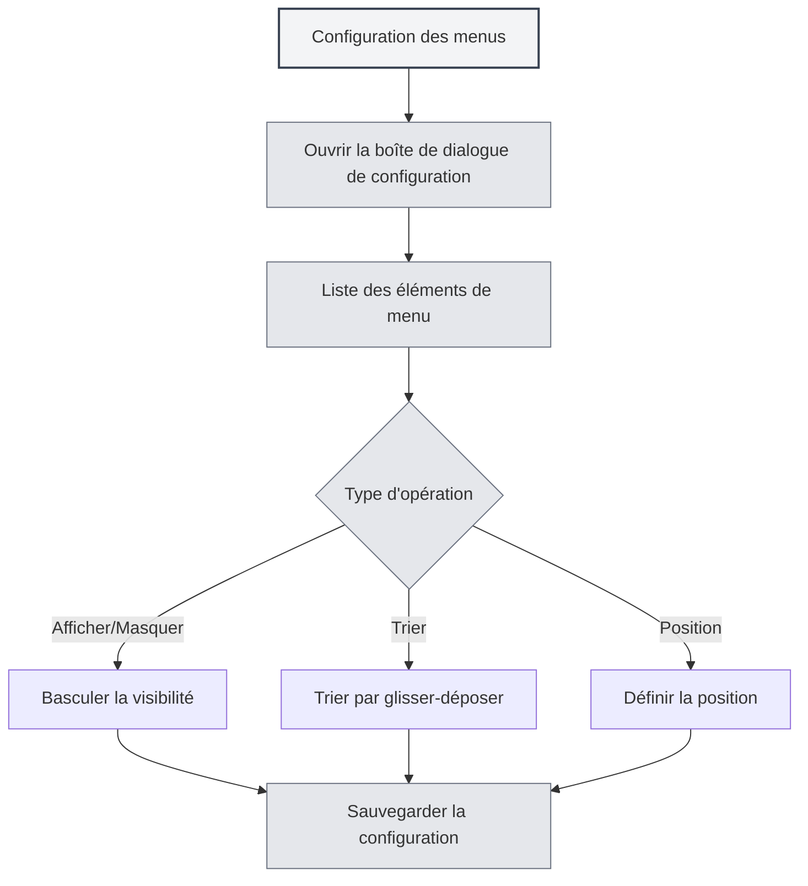

# Configuration des menus

## Vue d'ensemble

La fonction de configuration des menus vous permet de personnaliser l'affichage et l'ordre du menu latéral. Grâce à cette configuration, vous pouvez masquer les éléments de menu non nécessaires, ajuster leur ordre, définir leur position et créer une disposition d'interface personnalisée.

## Ouvrir la configuration des menus

### Méthodes d'accès

Vous pouvez ouvrir la configuration des menus de plusieurs façons :

- **Page des paramètres** : Un accès à la configuration des menus peut être présent dans la page des paramètres.
- **Option de menu** : Une option de configuration des menus peut se trouver dans "Plus de fonctionnalités" du menu latéral.
- **Menu contextuel** : Certains éléments de menu peuvent avoir une option de configuration.

Vous pouvez accéder à la configuration des menus via la barre de menu supérieure :

<MenuItemsDemo mode="demo" :items='[{"id": "settings"}]' />

## Gestion des éléments de menu

### Liste des éléments de menu

La page de configuration des menus affiche tous les éléments configurables :

- **Nom de l'élément** : Affiche le nom de l'élément de menu.
- **Visibilité** : Indique si l'élément de menu est visible.
- **Position** : Indique la position de l'élément (haut/bas).
- **Identifiant cœur** : Identifie les éléments de menu cœur (ne peuvent pas être masqués).

### Types d'éléments de menu

Il existe deux types d'éléments de menu :

- **Éléments de menu cœur** : Doivent être affichés, ne peuvent pas être masqués.
  - Accueil
  - Fichier
  - Paramètres
  - Plus de fonctionnalités
  - Quitter
- **Éléments de menu standard** : Peuvent être masqués.
  - Assistant IA
  - Fichiers récents
  - Base de connaissances
  - Répertoire de travail
  - Manuel utilisateur
  - Retour utilisateur
  - Statistiques LLM
  - Outils de débogage (environnement de développement)

## Afficher/Masquer les éléments de menu

### Masquer un élément de menu

Vous pouvez masquer les éléments de menu non nécessaires :

1. **Ouvrir la configuration** : Ouvrez la boîte de dialogue de configuration des menus.
2. **Trouver l'élément** : Localisez l'élément de menu à masquer.
3. **Basculer la visibilité** : Basculez l'interrupteur de visibilité de l'élément.
4. **Sauvegarder** : Cliquez sur le bouton "Sauvegarder".

<DialogDemo mode="demo" dialogType="menu-config" />

### Afficher un élément de menu

Vous pouvez afficher un élément de menu précédemment masqué :

1. **Ouvrir la configuration** : Ouvrez la boîte de dialogue de configuration des menus.
2. **Trouver l'élément** : Localisez l'élément de menu à afficher.
3. **Basculer la visibilité** : Basculez l'interrupteur de visibilité de l'élément.
4. **Sauvegarder** : Cliquez sur le bouton "Sauvegarder".

### Restrictions pour les éléments cœur

Les éléments de menu cœur ne peuvent pas être masqués :

- **Affichage forcé** : Les éléments cœur sont toujours affichés.
- **Impossible à masquer** : L'interrupteur de visibilité des éléments cœur est désactivé.
- **Restauration automatique** : Si vous tentez de masquer un élément cœur, il reviendra automatiquement à l'état visible.

## Tri des éléments de menu

### Tri par glisser-déposer

Vous pouvez ajuster l'ordre des éléments de menu par glisser-déposer :

1. **Ouvrir la configuration** : Ouvrez la boîte de dialogue de configuration des menus.
2. **Glisser l'élément** : Cliquez et faites glisser la poignée de l'élément de menu.
3. **Ajuster la position** : Déposez l'élément à la position souhaitée.
4. **Sauvegarder** : Cliquez sur le bouton "Sauvegarder".

### Règles de tri

Le tri des éléments de menu suit les règles suivantes :

- **Regroupement par position** : Les éléments du haut et du bas sont triés séparément.
- **Séparateur** : Une ligne de séparation apparaît entre les sections haut et bas.
- **Ajustement automatique** : Le glissement vers une position différente ajuste automatiquement l'attribut de position.

## Définition de la position des éléments

### Types de position

Les éléments de menu peuvent avoir deux positions :

- **Haut** : Affiché dans la zone supérieure de la barre de menu.
- **Bas** : Affiché dans la zone inférieure de la barre de menu.

### Définir la position

Vous pouvez définir la position d'un élément de menu :

1. **Ouvrir la configuration** : Ouvrez la boîte de dialogue de configuration des menus.
2. **Glisser vers la position** : Faites glisser l'élément vers la zone du haut ou du bas.
3. **Ajustement automatique** : Le système ajuste automatiquement l'attribut de position.
4. **Sauvegarder** : Cliquez sur le bouton "Sauvegarder".

<LeftMenu mode="demo" />

### Séparateur de position

Une ligne de séparation apparaît entre les sections haut et bas :

- **Affichage automatique** : La ligne s'affiche automatiquement s'il y a des éléments en haut et en bas.
- **Non déplaçable** : La ligne de séparation ne peut pas être déplacée, elle sert de séparateur visuel.
- **Masquage automatique** : La ligne est automatiquement masquée s'il n'y a des éléments que dans une seule section.

## Sauvegarde de la configuration

### Sauvegarde automatique

Certaines actions sauvegardent automatiquement la configuration :

- **Basculement de visibilité** : Sauvegarde automatique lors du changement de visibilité d'un élément.
- **Ajustement de position** : Sauvegarde automatique lors du changement de position d'un élément.

### Sauvegarde manuelle

Vous pouvez également sauvegarder manuellement la configuration :

1. **Ajuster la configuration** : Modifiez l'ordre et la visibilité des éléments.
2. **Cliquer sur Sauvegarder** : Cliquez sur le bouton "Sauvegarder".
3. **Application de la configuration** : La configuration prend effet immédiatement.

### Réinitialiser la configuration

Vous pouvez réinitialiser la configuration des menus :

1. **Ouvrir la configuration** : Ouvrez la boîte de dialogue de configuration des menus.
2. **Cliquer sur Réinitialiser** : Cliquez sur le bouton "Réinitialiser".
3. **Confirmer la réinitialisation** : Confirmez l'opération de réinitialisation.
4. **Restauration par défaut** : La configuration revient à son état par défaut.

**Remarques** :

- L'opération de réinitialisation est irréversible.
- Après réinitialisation, les éléments de menu cœur restent affichés.

<DialogDemo mode="demo" dialogType="confirm-reset" />

## Persistance de la configuration

### Stockage de la configuration

La configuration des menus est enregistrée localement :

- **Stockage local** : La configuration est sauvegardée dans les paramètres locaux.
- **Chargement automatique** : La configuration est automatiquement chargée au prochain démarrage de l'application.
- **Synchronisation multi-fenêtres** : La configuration est synchronisée entre toutes les fenêtres.

### Migration de la configuration

Les configurations des anciennes versions sont migrées automatiquement :

- **Migration de position** : L'ancienne position "middle" est automatiquement migrée vers "bottom".
- **Traitement de compatibilité** : Le système gère automatiquement les formats de configuration des anciennes versions.
- **Mise à niveau fluide** : Après une mise à niveau, la configuration s'adapte automatiquement à la nouvelle version.

## Bonnes pratiques

1. **Simplifier le menu** : Masquez les éléments rarement utilisés pour garder l'interface épurée.
2. **Trier judicieusement** : Placez les éléments fréquemment utilisés en premier pour un accès facile.
3. **Regrouper par position** : Placez les éléments liés dans la même zone de position.
4. **Ajuster régulièrement** : Ajustez périodiquement la configuration en fonction de vos habitudes d'utilisation.
5. **Sauvegarder la configuration** : Sauvegardez les configurations importantes pour faciliter la restauration.

## Points d'attention

1. **Éléments de menu cœur** : Ils ne peuvent pas être masqués et doivent être affichés.
2. **Sauvegarde de configuration** : Certaines actions sauvegardent automatiquement, d'autres nécessitent une sauvegarde manuelle.
3. **Opération de réinitialisation** : Elle est irréversible, utilisez-la avec prudence.
4. **Synchronisation multi-fenêtres** : La configuration est synchronisée entre toutes les fenêtres.
5. **Outils de développement** : Les outils de débogage ne sont visibles qu'en environnement de développement.

## Documentation associée

- [[settings.basic|Paramètres de base]]
- [[core.multi-tab|Gestion des onglets multiples]]

<MainTabs mode="demo" />

<LeftMenu mode="demo" />

<MenuItemsDemo mode="demo" :items='[{"id": "settings"}]' />

<DialogDemo mode="demo" dialogType="menu-config" />

<MenuItemsDemo mode="demo" :items='[{"id": "file", "items": ["new", "open"]}]' />

<DialogDemo mode="demo" dialogType="confirm-reset" />