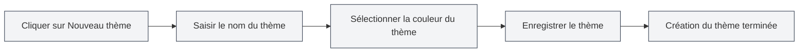

# Gestion des thèmes personnalisés

## Vue d'ensemble

La gestion des thèmes personnalisés vous permet de créer, modifier, supprimer et dupliquer des thèmes personnalisés. Grâce aux thèmes personnalisés, vous pouvez façonner l'apparence de l'interface selon vos préférences personnelles, améliorant ainsi votre expérience d'utilisation.

## Créer un nouveau thème personnalisé

### Créer un nouveau thème

1. Sur la page des paramètres du thème, cliquez sur la carte "Nouveau thème" (icône +)
2. Dans la boîte de dialogue qui s'affiche :
   - Saisissez un nom pour le thème (optionnel, la valeur de couleur est utilisée par défaut)
   - Sélectionnez la couleur du thème (à l'aide du sélecteur de couleurs)
3. Cliquez sur le bouton "Enregistrer"

Vous pouvez accéder aux paramètres du thème via la barre de menu supérieure :

<MenuItemsDemo mode="demo" :items='[{"id": "settings"}]' />

### Sélection de la couleur du thème

Le sélecteur de couleurs offre les fonctionnalités suivantes :

- **Sélection de couleur** : Cliquez sur la zone de couleur pour choisir une couleur
- **Couleurs prédéfinies** : Choisissez dans la liste des couleurs prédéfinies
- **Ajustement de la transparence** : Ajustez la transparence de la couleur (canal Alpha)
- **Saisie de la valeur de couleur** : Saisissez directement la valeur de couleur HEX

### Nommage du thème

- **Nommage automatique** : Si aucun nom n'est saisi, le système utilise la valeur de couleur comme nom
- **Nom personnalisé** : Saisissez un nom significatif pour faciliter l'identification et la gestion
- **Conseil de nommage** : Utilisez des noms descriptifs, tels que "Thème travail", "Mode nuit", etc.

<SettingThemeSection mode="demo" />

## Modifier un thème personnalisé

### Modifier un thème

1. Dans la liste des thèmes, trouvez le thème personnalisé à modifier
2. Cliquez sur le bouton "Plus" (icône à trois points) sur la carte du thème
3. Sélectionnez "Modifier"
4. Modifiez le nom ou la couleur du thème dans la boîte de dialogue
5. Cliquez sur le bouton "Enregistrer"

<DialogDemo mode="demo" dialogType="theme-edit" />

### Modification rapide de la couleur

Vous pouvez également modifier la couleur directement sur la carte du thème :

1. Cliquez sur le sélecteur de couleur sur la carte du thème
2. Sélectionnez une nouvelle couleur
3. La couleur est appliquée immédiatement

**Points à noter** :

- Les thèmes prédéfinis ne peuvent pas être modifiés
- Seuls les thèmes personnalisés peuvent être modifiés
- Les modifications doivent être enregistrées pour être permanentes

## Supprimer un thème personnalisé

### Supprimer un thème

1. Dans la liste des thèmes, trouvez le thème personnalisé à supprimer
2. Cliquez sur le bouton "Plus" sur la carte du thème
3. Sélectionnez "Supprimer"
4. Confirmez l'opération de suppression

**Points à noter** :

- L'opération de suppression est irréversible
- Si le thème actuellement utilisé est supprimé, le système bascule automatiquement vers le thème par défaut
- Les thèmes prédéfinis ne peuvent pas être supprimés

## Dupliquer un thème

### Dupliquer un thème existant

1. Dans la liste des thèmes, trouvez le thème à dupliquer
2. Cliquez sur le bouton "Plus" sur la carte du thème
3. Sélectionnez "Dupliquer"
4. Le système crée une copie, avec "Copie" ajouté au nom
5. Vous pouvez modifier la copie pour créer un nouveau thème

### Cas d'utilisation

- **Créer un nouveau thème basé sur un thème existant** : Dupliquer puis modifier la couleur
- **Créer une variante de thème** : Créer des thèmes similaires mais légèrement différents
- **Sauvegarder un thème** : Dupliquer pour en faire une sauvegarde

## Paramètres de couleur du thème

### Fonctionnalités du sélecteur de couleurs

Le sélecteur de couleurs offre des fonctionnalités de sélection de couleurs riches :

- **Panneau de couleurs** : Cliquez pour sélectionner une couleur
- **Couleurs prédéfinies** : Sélection rapide de couleurs courantes
- **Saisie de la valeur de couleur** : Saisie directe des formats HEX, RGB, HSL, etc.
- **Ajustement de la transparence** : Ajustez la transparence de la couleur

<DialogDemo mode="demo" dialogType="color-picker" />

### Couleurs prédéfinies

MetaDoc propose plusieurs couleurs prédéfinies :

- **Couleurs de base** : Rouge, Orange, Jaune, Vert, Cyan, Bleu, Violet, Gris
- **Palette claire** : Rouge clair, Orange clair, Jaune clair, etc.
- **Palette foncée** : Rouge foncé, Orange foncé, Jaune foncé, etc.

### Formats de couleur

Formats de couleur pris en charge :

- **HEX** : `#FF5733` (le plus couramment utilisé)
- **RGB** : `rgb(255, 87, 51)`
- **HSL** : `hsl(9, 100%, 60%)`

## Application du thème

### Appliquer un thème personnalisé

1. Dans la liste des thèmes, cliquez sur la carte du thème personnalisé à utiliser
2. Le thème est appliqué immédiatement
3. Les couleurs de l'interface sont générées automatiquement en fonction de la couleur du thème

### Impact de la couleur du thème

La couleur du thème affecte les éléments d'interface suivants :

- **Couleur de fond** : Arrière-plan principal et secondaire
- **Couleur du texte** : Texte principal et texte secondaire
- **Barre latérale** : Arrière-plan et texte de la barre latérale
- **Éditeur** : Arrière-plan et barre d'outils de l'éditeur
- **Autres éléments** : Boutons, bordures, surbrillance, etc.

### Palette de couleurs automatique

MetaDoc génère automatiquement une palette de couleurs en fonction de la couleur du thème :

- **Thème clair** : Lorsque la couleur du thème est claire, une palette de couleurs claires est générée
- **Thème sombre** : Lorsque la couleur du thème est sombre, une palette de couleurs sombres est générée
- **Algorithme de palette** : Utilise le mélange de couleurs et l'ajustement de la saturation

## Gestion des thèmes

### Liste des thèmes

La page des paramètres du thème affiche tous les thèmes disponibles :

- **Thèmes prédéfinis** : Thèmes intégrés au système
- **Thèmes personnalisés** : Thèmes créés par l'utilisateur
- **Thème actuel** : Affiche un indicateur de sélection

### Tri des thèmes

Les thèmes sont affichés dans l'ordre suivant :

1. Thème synchronisé avec le système (suivi du système)
2. Thèmes prédéfinis clairs/sombres
3. Thèmes personnalisés (par date de création)

### État du thème

Chaque carte de thème affiche :

- **Aperçu de la couleur du thème** : Affiche la couleur principale du thème
- **Nom du thème** : Affiche le nom du thème
- **Valeur de couleur** : Affiche la valeur HEX de la couleur
- **Indicateur de sélection** : Thème actuellement utilisé

## Bonnes pratiques

1. **Nommage du thème** : Utilisez des noms significatifs pour faciliter l'identification
2. **Sélection des couleurs** : Choisissez des couleurs reposantes pour les yeux, évitez les couleurs trop vives
3. **Sauvegarde du thème** : Il est recommandé de dupliquer les thèmes importants comme sauvegarde
4. **Nettoyage régulier** : Supprimez les thèmes inutilisés pour garder la liste propre
5. **Test de l'effet** : Testez l'effet réel après avoir créé un thème et ajustez en fonction de l'expérience d'utilisation

## Points à noter

1. **Thèmes prédéfinis** : Les thèmes prédéfinis ne peuvent pas être modifiés ou supprimés
2. **Compatibilité des thèmes** : Certains thèmes peuvent avoir un rendu différent dans différents environnements
3. **Sélection des couleurs** : Il est recommandé de choisir des couleurs avec un contraste modéré pour garantir la lisibilité
4. **Nombre de thèmes** : Il est recommandé de ne pas créer trop de thèmes pour garder la liste concise
5. **Synchronisation des thèmes** : Les modifications de thème sont synchronisées entre toutes les fenêtres

## Documentation associée

- [[settings.theme|Configuration du thème]]
- [[settings.basic|Paramètres de base]]
- [[core.editor-settings|Paramètres de l'éditeur]]

<ResizableDivider mode="demo" />

<SettingThemeSection mode="demo" />

<MenuItemsDemo mode="demo" :items='[{"id": "settings", "items": ["theme"]}]' />

<DialogDemo mode="demo" dialogType="color-picker" />

<DialogDemo mode="demo" dialogType="theme-edit" />

<MenuItemsDemo mode="demo" :items='[{"id": "settings"}]' />