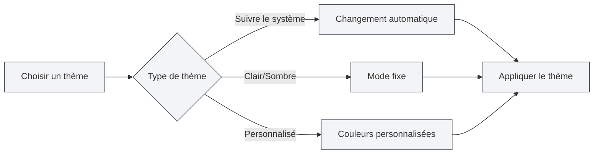

# Configuration des thèmes

## Vue d'ensemble

La configuration des thèmes vous permet de personnaliser l'apparence de MetaDoc, y compris le thème global, le thème du contenu, le thème du code, etc. Une configuration appropriée des thèmes peut améliorer l'expérience utilisateur et réduire la fatigue visuelle.

## Thème global

### Types de thèmes

MetaDoc prend en charge les types de thèmes globaux suivants :

- **Suivre le mode clair/sombre du système** : suit automatiquement le mode clair/sombre du système d'exploitation
- **Suivre la couleur du système** : suit la couleur de thème du système d'exploitation (Windows 11)
- **Clair** : utilise un thème clair de manière fixe
- **Sombre** : utilise un thème sombre de manière fixe
- **Personnalisé** : utilise des couleurs de thème personnalisées

### Choisir un thème

1. Sur la page des paramètres de thème, parcourez les cartes de thème
2. Cliquez sur la carte du thème que vous souhaitez utiliser
3. Le thème est appliqué immédiatement

Vous pouvez accéder aux paramètres de thème via la barre de menu supérieure :

<MenuItemsDemo mode="demo" :items='[{"id": "settings"}]' />

### Aperçu du thème clair

<SettingThemeSection mode="demo" theme="light" />

### Aperçu du thème sombre

<SettingThemeSection mode="demo" theme="dark" />

### Interface des paramètres de thème

L'image ci-dessous montre l'interface complète de la page des paramètres de thème :

<SettingThemeSection mode="demo" />

<ViewMenuItemsDemo mode="demo" :items='["editor", "outline"]' />

L'interface des paramètres de thème comprend les zones fonctionnelles principales suivantes :

- **Thème global** : choisir un thème clair, sombre, suivant le système ou personnalisé
- **Thème du contenu** : définir le thème d'affichage de la zone de l'éditeur
- **Thème du code** : choisir le thème de surlignage syntaxique pour les blocs de code
- **Affichage des numéros de ligne** : contrôler si les blocs de code affichent les numéros de ligne
- **Thème personnalisé** : créer et gérer des thèmes de couleurs personnalisés

### Aperçu des thèmes

Chaque carte de thème affiche :

- **Aperçu de la couleur du thème** : montre la couleur principale du thème
- **Nom du thème** : affiche le nom du thème
- **Marque de sélection** : le thème actuellement utilisé affiche une marque de sélection

## Thème du contenu

<SettingThemeSection mode="demo" />

### Définir le thème du contenu

Le thème du contenu contrôle le thème d'affichage de la zone d'édition des documents :

- **Automatique** : suit le thème global
- **Clair** : utilise un thème de contenu clair de manière fixe
- **Sombre** : utilise un thème de contenu sombre de manière fixe

### Cas d'utilisation

- **Global sombre, contenu clair** : adapté pour éditer des documents clairs dans un environnement sombre
- **Global clair, contenu sombre** : adapté pour éditer des documents sombres dans un environnement clair
- **Mode automatique** : le thème du contenu suit automatiquement le thème global

## Thème du code

<SettingThemeSection mode="demo" />

### Définir le thème du code

Le thème du code contrôle le thème de surlignage syntaxique pour les blocs de code :

- **Automatique** : sélection automatique basée sur le thème global
- **Personnalisé** : choisir dans la liste des thèmes de code

### Liste des thèmes de code

MetaDoc prend en charge de nombreux thèmes de code, notamment :

- **Thèmes clairs** : GitHub, VS, OneLight, etc.
- **Thèmes sombres** : Monokai, Dracula, OneDark, etc.

### Suggestions de choix

- **Document clair** : utiliser un thème de code clair
- **Document sombre** : utiliser un thème de code sombre
- **Mode automatique** : laisser le système choisir automatiquement pour maintenir la cohérence

## Affichage des numéros de ligne

<SettingThemeSection mode="demo" />

### Afficher les numéros de ligne

Lorsque "Afficher les numéros de ligne dans les blocs de code" est activé, les blocs de code affichent les numéros de ligne :

- **Activé** : les numéros de ligne sont affichés à gauche du bloc de code
- **Désactivé** : les numéros de ligne ne sont pas affichés

### Cas d'utilisation

- **Débogage du code** : les numéros de ligne aident à localiser des positions dans le code
- **Partage de code** : les numéros de ligne facilitent la référence à des lignes spécifiques
- **Lecture de code** : les numéros de ligne aident à comprendre la structure du code

## Changement de thème

<SettingThemeSection mode="demo" />

<ViewMenuItemsDemo mode="demo" :items='["editor", "outline"]' />

### Changement en temps réel

Le changement de thème prend effet immédiatement :

1. Sélectionnez un nouveau thème
2. L'interface se met à jour immédiatement
3. Toutes les fenêtres appliquent le changement de manière synchronisée

### Synchronisation des thèmes

- **Synchronisation multi-fenêtres** : toutes les fenêtres synchronisent automatiquement le thème
- **Sauvegarde des paramètres** : le choix du thème est automatiquement sauvegardé
- **Prochain démarrage** : le thème choisi précédemment sera utilisé au prochain démarrage

## Thèmes prédéfinis

<SettingThemeSection mode="demo" />

### Thèmes intégrés

MetaDoc propose plusieurs thèmes prédéfinis :

- **Thèmes clairs** : adaptés aux environnements lumineux
- **Thèmes sombres** : adaptés aux environnements sombres
- **Synchronisation système** : suit automatiquement les paramètres du système

### Caractéristiques des thèmes prédéfinis

- **Palette de couleurs optimisée** : schémas de couleurs soigneusement conçus
- **Conception respectueuse des yeux** : réduit la fatigue visuelle
- **Cohérence** : garantit l'uniformité des éléments de l'interface

## Bonnes pratiques

1. **Adapter à l'environnement** : choisir un thème en fonction de l'environnement d'utilisation
2. **Faire correspondre le contenu** : faire correspondre le thème du contenu au type de document
3. **Lisibilité du code** : choisir un thème de code offrant une bonne lisibilité
4. **Ajustements réguliers** : ajuster les paramètres de thème en fonction de l'expérience d'utilisation

## Points à noter

1. **Compatibilité système** : la fonction "suivre le thème du système" nécessite le support du système d'exploitation
2. **Cohérence des thèmes** : il est recommandé de maintenir la cohérence entre le thème global et le thème du contenu
3. **Thème du code** : le thème du code affecte la lisibilité du code
4. **Thème personnalisé** : les thèmes personnalisés nécessitent une création et une gestion manuelles

## Documentation associée

- [[settings.theme-custom|Gestion des thèmes personnalisés]]
- [[settings.basic|Paramètres de base]]
- [[core.editor-settings|Paramètres de l'éditeur]]
