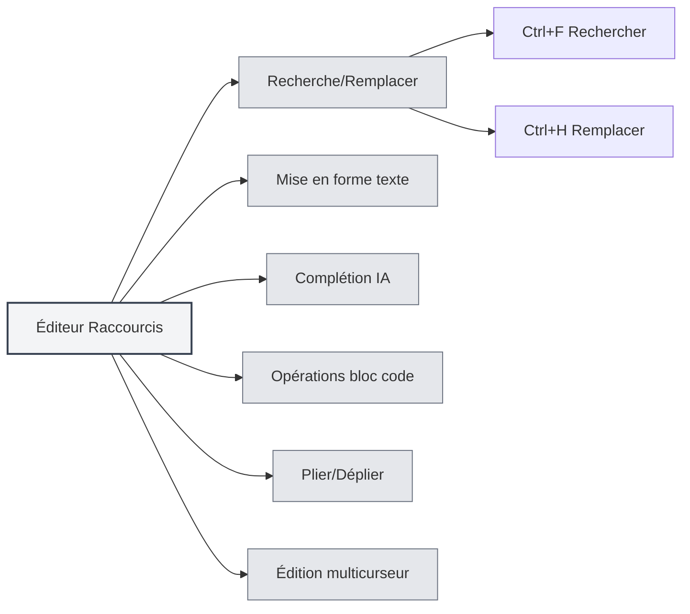

# Raccourcis clavier de l'éditeur

## Vue d'ensemble

Les raccourcis clavier de l'éditeur sont des combinaisons de touches utilisées dans l'interface de l'éditeur, incluant des fonctions telles que l'édition de texte, la recherche et le remplacement, la mise en forme, etc. Maîtriser ces raccourcis permet d'améliorer l'efficacité de l'édition.

<MenuItemsDemo mode="demo" :items='[{"id": "edit"}]' />

<ViewMenuItemsDemo mode="demo" :items='["editor", "outline"]' />

**Remarque** : La recherche/remplacement (Ctrl+F, Ctrl+H) est implémentée globalement par l'application ; le gras/l'italique/les liens/les blocs de code, etc., sont fournis par l'éditeur sous-jacent (Vditor pour Markdown, Monaco pour LaTeX). S'ils ne fonctionnent pas, référez-vous au comportement réel de l'éditeur.

## Recherche et remplacement

### Rechercher

- **Raccourci** : `Ctrl+F` (Windows/Linux) ou `Cmd+F` (macOS)
- **Fonction** : Ouvre la boîte de dialogue de recherche
- **Cas d'utilisation** : Rechercher un texte spécifique dans le document

### Remplacer

- **Raccourci** : `Ctrl+H` (Windows/Linux) ou `Cmd+H` (macOS)
- **Fonction** : Ouvre la boîte de dialogue de recherche et remplacement
- **Cas d'utilisation** : Rechercher et remplacer du texte

### Fonctionnalités de recherche

La boîte de dialogue de recherche prend en charge les fonctionnalités suivantes :

- **Rechercher du texte** : Saisir le texte à rechercher
- **Remplacer par** : Saisir le texte de remplacement
- **Expression régulière** : Prise en charge de la recherche par expressions régulières
- **Respecter la casse** : Différencier les majuscules/minuscules
- **Mot entier** : Correspondre au mot complet

L'interface du menu de recherche/remplacement est la suivante :

<SearchReplaceMenu mode="demo" :position='{"top": 100, "left": 200}' :adapter='null' />

<SearchReplaceMenu mode="demo" :position='{"top": 150, "left": 200}' :adapter='null' />

## Mise en forme du texte

<TextFormatToolbar mode="demo" />

### Gras

- **Raccourci** : `Ctrl+B` (Windows/Linux) ou `Cmd+B` (macOS)
- **Fonction** : Met le texte sélectionné en gras
- **Cas d'utilisation** : Mettre en avant un contenu important

### Italique

- **Raccourci** : `Ctrl+I` (Windows/Linux) ou `Cmd+I` (macOS)
- **Fonction** : Met le texte sélectionné en italique
- **Cas d'utilisation** : Indiquer une citation ou une emphase

### Insérer un lien

- **Raccourci** : `Ctrl+K` (Windows/Linux) ou `Cmd+K` (macOS)
- **Fonction** : Insère un lien
- **Cas d'utilisation** : Ajouter un hyperlien

**Note** : Ce raccourci peut entrer en conflit avec "Enregistrer tout" (Ctrl+K S). Il faut d'abord appuyer sur Ctrl+K, puis sur K, et non les deux simultanément.

## Complétion IA

<AISuggestionGhost mode="demo" />

<CompletionSettingsPanel mode="demo" />

### Déclenchement manuel de la complétion

- **Raccourci** : `Shift+Tab`
- **Fonction** : Déclenche manuellement la complétion automatique par IA
- **Cas d'utilisation** : Déclencher manuellement la complétion IA lorsque nécessaire

### Touches de déclenchement de la complétion

La complétion IA peut également être déclenchée automatiquement par les touches suivantes :

- **Entrée** : Déclenchée par la touche Entrée
- **Espace** : Déclenchée par la barre d'espace
- **Point-virgule** : Déclenchée par le point-virgule (;)
- **Barre oblique** : Déclenchée par la barre oblique (/)

Ces touches de déclenchement peuvent être configurées dans les [[settings.llm|paramètres LLM]].

## Opérations sur les blocs de code

### Insérer un bloc de code

- **Raccourci** : `Ctrl+Shift+K` (Éditeur Markdown)
- **Fonction** : Insère un bloc de code
- **Cas d'utilisation** : Ajouter un exemple de code

## Plier/Déplier

### Plier un bloc de code

- **Raccourci** : `Ctrl+Shift+[` (Windows/Linux) ou `Cmd+Option+[` (macOS)
- **Fonction** : Plie le bloc de code ou l'environnement actuel
- **Cas d'utilisation** : Masquer le code qu'il n'est pas nécessaire de voir

### Déplier un bloc de code

- **Raccourci** : `Ctrl+Shift+]` (Windows/Linux) ou `Cmd+Option+]` (macOS)
- **Fonction** : Déplie le bloc de code ou l'environnement replié
- **Cas d'utilisation** : Voir le contenu replié

## Édition multicurseur

### Sélectionner tous les mots identiques

- **Raccourci** : `Ctrl+Shift+L` (Windows/Linux) ou `Cmd+Shift+L` (macOS)
- **Fonction** : Sélectionne toutes les occurrences identiques d'un mot dans le document et ajoute des curseurs
- **Cas d'utilisation** : Éditer en masse un texte identique

## Annuler et Rétablir

### Annuler

- **Raccourci** : `Ctrl+Z` (Windows/Linux) ou `Cmd+Z` (macOS)
- **Fonction** : Annule la dernière opération
- **Cas d'utilisation** : Annuler une opération erronée

### Rétablir

- **Raccourci** : `Ctrl+Y` ou `Ctrl+Shift+Z` (Windows/Linux) ou `Cmd+Shift+Z` (macOS)
- **Fonction** : Rétablit l'opération annulée
- **Cas d'utilisation** : Restaurer une opération annulée

## Opérations de sélection

### Tout sélectionner

- **Raccourci** : `Ctrl+A` (Windows/Linux) ou `Cmd+A` (macOS)
- **Fonction** : Sélectionne tout le texte
- **Cas d'utilisation** : Sélectionner tout le contenu pour copier ou supprimer

### Copier

- **Raccourci** : `Ctrl+C` (Windows/Linux) ou `Cmd+C` (macOS)
- **Fonction** : Copie le texte sélectionné
- **Cas d'utilisation** : Copier du contenu dans le presse-papiers

### Coller

- **Raccourci** : `Ctrl+V` (Windows/Linux) ou `Cmd+V` (macOS)
- **Fonction** : Colle le contenu du presse-papiers
- **Cas d'utilisation** : Coller le contenu copié

### Couper

- **Raccourci** : `Ctrl+X` (Windows/Linux) ou `Cmd+X` (macOS)
- **Fonction** : Coupe le texte sélectionné
- **Cas d'utilisation** : Déplacer du contenu texte

## Liste des raccourcis de l'éditeur

### Raccourcis Windows/Linux

| Fonction                     | Raccourci                     |
| ---------------------------- | ----------------------------- |
| Rechercher                   | `Ctrl+F`                      |
| Remplacer                    | `Ctrl+H`                      |
| Gras                         | `Ctrl+B`                      |
| Italique                     | `Ctrl+I`                      |
| Insérer un lien              | `Ctrl+K`                      |
| Insérer un bloc de code      | `Ctrl+Shift+K`                |
| Plier                        | `Ctrl+Shift+[`                |
| Déplier                      | `Ctrl+Shift+]`                |
| Sélectionner mots identiques | `Ctrl+Shift+L`                |
| Annuler                      | `Ctrl+Z`                      |
| Rétablir                     | `Ctrl+Y` ou `Ctrl+Shift+Z`    |
| Tout sélectionner            | `Ctrl+A`                      |
| Copier                       | `Ctrl+C`                      |
| Coller                       | `Ctrl+V`                      |
| Couper                       | `Ctrl+X`                      |
| Complétion IA                | `Shift+Tab`                   |

### Raccourcis macOS

| Fonction                     | Raccourci         |
| ---------------------------- | ----------------- |
| Rechercher                   | `Cmd+F`           |
| Remplacer                    | `Cmd+H`           |
| Gras                         | `Cmd+B`           |
| Italique                     | `Cmd+I`           |
| Insérer un lien              | `Cmd+K`           |
| Insérer un bloc de code      | `Cmd+Shift+K`     |
| Plier                        | `Cmd+Option+[`    |
| Déplier                      | `Cmd+Option+]`    |
| Sélectionner mots identiques | `Cmd+Shift+L`     |
| Annuler                      | `Cmd+Z`           |
| Rétablir                     | `Cmd+Shift+Z`     |
| Tout sélectionner            | `Cmd+A`           |
| Copier                       | `Cmd+C`           |
| Coller                       | `Cmd+V`           |
| Couper                       | `Cmd+X`           |
| Complétion IA                | `Shift+Tab`       |

## Raccourcis spécifiques à l'éditeur Markdown

<LaTeXEditorDemo mode="demo" />

### Raccourcis Vditor

L'éditeur Markdown, basé sur Vditor, prend en charge les raccourcis suivants :

- **Gras** : `Ctrl+B`
- **Italique** : `Ctrl+I`
- **Insérer un lien** : `Ctrl+K`
- **Insérer un bloc de code** : `Ctrl+Shift+K`

## Raccourcis spécifiques à l'éditeur LaTeX

<LaTeXEditorDemo mode="demo" />

### Raccourcis de l'éditeur Monaco

L'éditeur LaTeX, basé sur Monaco Editor, prend en charge les raccourcis suivants :

- **Plier** : `Ctrl+Shift+[`
- **Déplier** : `Ctrl+Shift+]`
- **Sélectionner tous les mots identiques** : `Ctrl+Shift+L`
- **Édition multicurseur** : `Alt+Click` pour ajouter un curseur

## Astuces d'utilisation des raccourcis

<LaTeXEditorDemo mode="demo" />

<Outline mode="demo" />

### Utilisation combinée

Il est possible de combiner plusieurs raccourcis :

1. **Rechercher et remplacer** : `Ctrl+H` pour ouvrir la recherche/remplacement, puis utiliser la touche Tab pour naviguer entre les champs.
2. **Mettre en forme le texte** : Sélectionner le texte puis utiliser `Ctrl+B` ou `Ctrl+I` pour le formater.
3. **Édition en masse** : Utiliser `Ctrl+Shift+L` pour sélectionner tous les mots identiques, puis les éditer uniformément.

### Mémorisation des raccourcis

- **Mise en forme** : B (Bold/Gras), I (Italic/Italique) correspondent au gras et à l'italique.
- **Recherche** : F (Find/Chercher), H (Hunt/Rechercher-Remplacer).
- **Plier/Déplier** : `[` et `]` correspondent au pliage et au dépliage.

## Bonnes pratiques

<MainTabs mode="demo" />

1. **Maîtriser l'usage** : Maîtriser les raccourcis d'édition courants.
2. **Combiner les opérations** : Associer plusieurs raccourcis pour réaliser des éditions complexes.
3. **Édition en masse** : Utiliser la fonction multicurseur pour éditer en masse.
4. **Mise en forme rapide** : Utiliser les raccourcis pour formater rapidement le texte.
5. **Recherche/remplacement** : Utiliser la fonction de recherche/remplacement pour gagner en efficacité.

## Points d'attention

1. **Différences de plateforme** : Windows/Linux utilisent Ctrl, macOS utilise Cmd.
2. **Conflits de raccourcis** : Certains raccourcis peuvent entrer en conflit avec des fonctionnalités de l'éditeur.
3. **Contexte dépendant** : Certains raccourcis ne sont actifs que dans des contextes spécifiques.
4. **Différences entre éditeurs** : Les raccourcis pris en charge peuvent différer entre les éditeurs Markdown et LaTeX.
5. **Complétion IA** : Shift+Tab est un déclenchement manuel ; le déclenchement automatique nécessite la configuration des touches de déclenchement.

## Documentation associée

- [[shortcuts.global|Raccourcis globaux]]
- [[core.editor-basics|Opérations de base de l'éditeur]]
- [[markdown.features|Fonctionnalités de l'éditeur Markdown]]
- [[ai.completion|Complétion automatique IA]]

<MenuItemsDemo mode="demo" :items='[{"id": "file"}]' />

<ViewMenuItemsDemo mode="demo" :items='["editor"]' />

<AISuggestionGhost mode="demo" />

<CompletionSettingsPanel mode="demo" />

<LaTeXEditorDemo mode="demo" />
