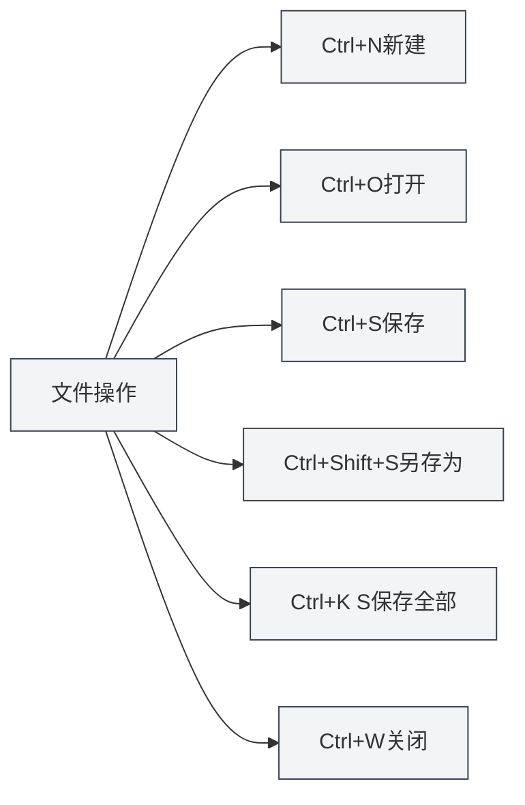

# Raccourcis globaux

## Vue d'ensemble

Les raccourcis globaux sont des raccourcis clavier utilisables dans n'importe quelle interface de MetaDoc. Les maîtriser peut améliorer considérablement l'efficacité du travail.

**Note** : Les raccourcis de ce document ont été vérifiés par rapport à l'implémentation actuelle du code ; ils sont tous implémentés et fonctionnels dans le processus principal ou de rendu.

## Opérations sur les fichiers

### Nouveau document

- **Raccourci** : `Ctrl+N` (Windows/Linux) ou `Cmd+N` (macOS)
- **Fonction** : Crée un nouveau document vierge
- **Cas d'utilisation** : Démarrer rapidement la rédaction d'un nouveau document

### Ouvrir un document

- **Raccourci** : `Ctrl+O` (Windows/Linux) ou `Cmd+O` (macOS)
- **Fonction** : Ouvre la boîte de dialogue de sélection de fichiers
- **Cas d'utilisation** : Ouvrir un document existant

### Enregistrer le document

- **Raccourci** : `Ctrl+S` (Windows/Linux) ou `Cmd+S` (macOS)
- **Fonction** : Enregistre le document actuel
- **Cas d'utilisation** : Sauvegarder les modifications, éviter les pertes

### Enregistrer sous

- **Raccourci** : `Ctrl+Shift+S` (Windows/Linux) ou `Cmd+Shift+S` (macOS)
- **Fonction** : Enregistre le document actuel sous un nouveau fichier
- **Cas d'utilisation** : Créer une copie du document ou changer son emplacement d'enregistrement

### Enregistrer tous les documents

- **Raccourci** : `Ctrl+K S` (Windows/Linux) ou `Cmd+K S` (macOS)
- **Fonction** : Enregistre tous les documents ouverts
- **Mode d'emploi** : Appuyez d'abord sur `Ctrl+K` (ou `Cmd+K`), puis sur `S`
- **Cas d'utilisation** : Sauvegarder tous les documents en une seule fois

<MenuItemsDemo mode="demo" :items='[{"id": "file", "items": ["save-all"]}]' />

### Fermer le fichier

- **Raccourci** : `Ctrl+W` (Windows/Linux) ou `Cmd+W` (macOS)
- **Fonction** : Ferme l'onglet actuel
- **Cas d'utilisation** : Fermer un document non désiré

## Opérations sur les onglets

La barre d'onglets affiche tous les documents ouverts et prend en charge les opérations de création, de basculement, de fermeture, etc. :

<MainTabs mode="demo" />

<ViewMenuItemsDemo mode="demo" :items='["editor", "outline"]' />

### Nouvel onglet

- **Raccourci** : `Ctrl+T` (Windows/Linux) ou `Cmd+T` (macOS)
- **Fonction** : Crée un nouvel onglet
- **Cas d'utilisation** : Créer rapidement un nouveau document

### Basculer entre les onglets

#### Onglet suivant

- **Raccourci** : `Ctrl+Tab` (Windows/Linux) ou `Cmd+Tab` (macOS)
- **Fonction** : Passe à l'onglet suivant
- **Mode d'emploi** : Maintenir `Ctrl+Tab` affiche une superposition de sélection d'onglets ; vous pouvez continuer à appuyer sur Tab pour choisir ou cliquer directement
- **Cas d'utilisation** : Basculer rapidement entre plusieurs documents

<TabSwitcherOverlay mode="demo" />

#### Onglet précédent

- **Raccourci** : `Ctrl+Shift+Tab` (Windows/Linux) ou `Cmd+Shift+Tab` (macOS)
- **Fonction** : Passe à l'onglet précédent
- **Cas d'utilisation** : Basculer dans le sens inverse entre les onglets

### Rouvrir un onglet fermé

- **Raccourci** : `Ctrl+Shift+T` (Windows/Linux) ou `Cmd+Shift+T` (macOS)
- **Fonction** : Rouvre le dernier onglet fermé
- **Mode d'emploi** : Peut être utilisé plusieurs fois de suite pour restaurer les onglets fermés récemment (jusqu'à 20 maximum)
- **Cas d'utilisation** : Restaurer rapidement un onglet fermé par erreur

<MainTabs mode="demo" />

## Autres raccourcis

### Ouvrir le manuel utilisateur

- **Raccourci** : `F1`
- **Fonction** : Ouvre la page du manuel utilisateur
- **Cas d'utilisation** : Lorsque vous avez besoin de consulter la documentation d'aide

<MenuItemsDemo mode="demo" :items='[{"id": "help"}]' />

## Liste des raccourcis

### Raccourcis Windows/Linux

| Fonction                     | Raccourci           |
| ---------------------------- | ------------------- |
| Nouveau document             | `Ctrl+N`            |
| Ouvrir un document           | `Ctrl+O`            |
| Enregistrer le document      | `Ctrl+S`            |
| Enregistrer sous             | `Ctrl+Shift+S`      |
| Enregistrer tout             | `Ctrl+K S`          |
| Fermer l'onglet              | `Ctrl+W`            |
| Nouvel onglet                | `Ctrl+T`            |
| Onglet suivant               | `Ctrl+Tab`          |
| Onglet précédent             | `Ctrl+Shift+Tab`    |
| Rouvrir un onglet fermé      | `Ctrl+Shift+T`      |
| Ouvrir le manuel utilisateur | `F1`                |

### Raccourcis macOS

| Fonction                     | Raccourci          |
| ---------------------------- | ------------------ |
| Nouveau document             | `Cmd+N`            |
| Ouvrir un document           | `Cmd+O`            |
| Enregistrer le document      | `Cmd+S`            |
| Enregistrer sous             | `Cmd+Shift+S`      |
| Enregistrer tout             | `Cmd+K S`          |
| Fermer l'onglet              | `Cmd+W`            |
| Nouvel onglet                | `Cmd+T`            |
| Onglet suivant               | `Cmd+Tab`          |
| Onglet précédent             | `Cmd+Shift+Tab`    |
| Rouvrir un onglet fermé      | `Cmd+Shift+T`      |
| Ouvrir le manuel utilisateur | `F1`               |

## Astuces d'utilisation des raccourcis

### Ordre des touches de combinaison

Certains raccourcis nécessitent d'appuyer sur les touches dans un ordre précis :

- **Enregistrer tout** : Appuyez d'abord sur `Ctrl+K`, puis sur `S` (pas simultanément)
- **Basculement d'onglets** : Maintenez `Ctrl+Tab` pour afficher la superposition, puis continuez à appuyer sur Tab pour sélectionner

### Conflits de raccourcis

Si un raccourci entre en conflit avec le système ou un autre logiciel :

- **Raccourcis système** : Certains raccourcis système peuvent avoir la priorité
- **Autres logiciels** : Fermez le logiciel conflictuel ou modifiez ses raccourcis
- **Raccourcis personnalisés** : Les versions futures pourraient prendre en charge la personnalisation des raccourcis

### Astuces de mémorisation

- **Opérations sur les fichiers** : Utilisez les raccourcis standards (Ctrl+N/O/S)
- **Opérations sur les onglets** : Utilisez les combinaisons liées à la touche Tab
- **Enregistrer tout** : Utilisez Ctrl+K comme préfixe de commande

## Bonnes pratiques

1.  **Maîtrise** : Maîtrisez les raccourcis courants pour améliorer votre efficacité
2.  **Combinaison** : Combinez plusieurs raccourcis pour effectuer des opérations complexes
3.  **Basculement d'onglets** : Utilisez Ctrl+Tab pour basculer rapidement, évitez les manipulations à la souris
4.  **Sauvegarde régulière** : Prenez l'habitude d'utiliser Ctrl+S pour sauvegarder régulièrement
5.  **Restauration rapide** : Utilisez Ctrl+Shift+T pour restaurer rapidement un onglet fermé par erreur

## Points d'attention

1.  **Différences entre plateformes** : Windows/Linux utilisent Ctrl, macOS utilise Cmd
2.  **Conflits de raccourcis** : Attention aux conflits avec les raccourcis d'autres logiciels
3.  **Ordre des touches de combinaison** : Certains raccourcis doivent être saisis dans un ordre précis
4.  **Basculement d'onglets** : Ctrl+Tab affiche une superposition, vous pouvez ensuite continuer à sélectionner
5.  **Enregistrer tout** : Ctrl+K S nécessite d'appuyer d'abord sur Ctrl+K, puis sur S

## Documentation associée

- [[shortcuts.editor|Raccourcis de l'éditeur]]
- [[core.file-operations|Opérations sur les fichiers]]
- [[core.multi-tab|Gestion des onglets multiples]]

<MenuItemsDemo mode="demo" :items='[{"id": "file"}]' />

<MainTabs mode="demo" />

<ViewMenuItemsDemo mode="demo" :items='["editor", "outline", "agent"]' />

<QuickStartPanel mode="demo" />