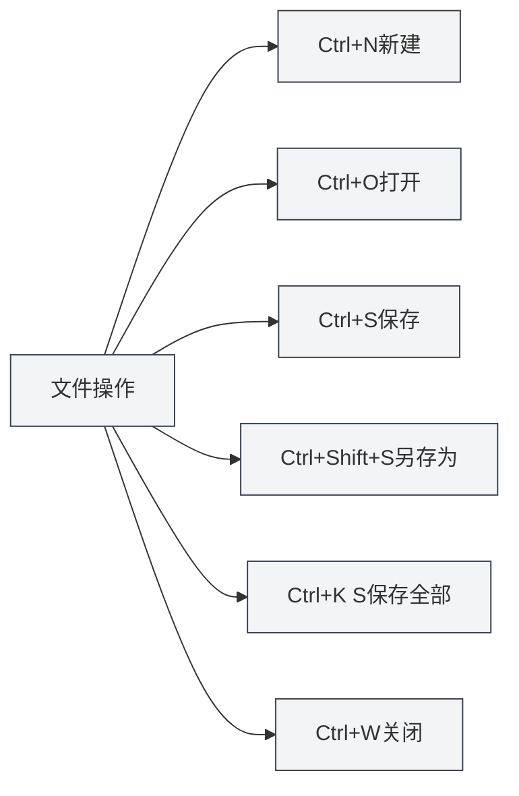

# Raccourcis globaux

## Vue d'ensemble

Les raccourcis globaux sont des raccourcis clavier utilisables dans n'importe quelle interface de MetaDoc. Maîtriser ces raccourcis peut améliorer considérablement l'efficacité du travail.

**Note** : Les raccourcis de ce document ont été vérifiés par rapport à l'implémentation actuelle du code ; ils sont tous implémentés et fonctionnels dans le processus principal ou de rendu.

## Opérations sur les fichiers

### Nouveau document

- **Raccourci** : `Ctrl+N` (Windows/Linux) ou `Cmd+N` (macOS)
- **Fonction** : Créer un nouveau document vierge
- **Cas d'utilisation** : Démarrer rapidement une nouvelle édition de document

### Ouvrir un document

- **Raccourci** : `Ctrl+O` (Windows/Linux) ou `Cmd+O` (macOS)
- **Fonction** : Ouvrir la boîte de dialogue de sélection de fichiers
- **Cas d'utilisation** : Ouvrir un document existant

### Enregistrer le document

- **Raccourci** : `Ctrl+S` (Windows/Linux) ou `Cmd+S` (macOS)
- **Fonction** : Enregistrer le document actuel
- **Cas d'utilisation** : Sauvegarder le contenu édité pour éviter toute perte

### Enregistrer sous

- **Raccourci** : `Ctrl+Shift+S` (Windows/Linux) ou `Cmd+Shift+S` (macOS)
- **Fonction** : Enregistrer le document actuel sous un nouveau fichier
- **Cas d'utilisation** : Créer une copie d'un document ou changer son emplacement de sauvegarde

### Enregistrer tous les documents

- **Raccourci** : `Ctrl+K S` (Windows/Linux) ou `Cmd+K S` (macOS)
- **Fonction** : Enregistrer tous les documents ouverts
- **Mode d'emploi** : Appuyez d'abord sur `Ctrl+K` (ou `Cmd+K`), puis sur `S`
- **Cas d'utilisation** : Sauvegarder tous les documents en une seule fois

<MenuItemsDemo mode="demo" :items='[{"id": "file", "items": ["save-all"]}]' />

### Fermer le fichier

- **Raccourci** : `Ctrl+W` (Windows/Linux) ou `Cmd+W` (macOS)
- **Fonction** : Fermer l'onglet actuel
- **Cas d'utilisation** : Fermer un document non désiré

## Opérations sur les onglets

La barre d'onglets affiche tous les documents ouverts et prend en charge des opérations telles que la création, la navigation et la fermeture :

<MainTabs mode="demo" />

<ViewMenuItemsDemo mode="demo" :items='["editor", "outline"]' />

### Nouvel onglet

- **Raccourci** : `Ctrl+T` (Windows/Linux) ou `Cmd+T` (macOS)
- **Fonction** : Créer un nouvel onglet
- **Cas d'utilisation** : Créer rapidement un nouveau document

### Naviguer entre les onglets

#### Onglet suivant

- **Raccourci** : `Ctrl+Tab` (Windows/Linux) ou `Cmd+Tab` (macOS)
- **Fonction** : Passer à l'onglet suivant
- **Mode d'emploi** : Maintenir `Ctrl+Tab` affiche une superposition de navigation entre les onglets ; vous pouvez continuer à appuyer sur Tab pour sélectionner ou cliquer directement
- **Cas d'utilisation** : Naviguer rapidement entre plusieurs documents

<TabSwitcherOverlay mode="demo" />

#### Onglet précédent

- **Raccourci** : `Ctrl+Shift+Tab` (Windows/Linux) ou `Cmd+Shift+Tab` (macOS)
- **Fonction** : Passer à l'onglet précédent
- **Cas d'utilisation** : Naviguer entre les onglets en sens inverse

### Rouvrir un onglet fermé

- **Raccourci** : `Ctrl+Shift+T` (Windows/Linux) ou `Cmd+Shift+T` (macOS)
- **Fonction** : Rouvrir l'onglet fermé le plus récemment
- **Mode d'emploi** : Peut être utilisé de manière consécutive pour restaurer les onglets fermés récemment (jusqu'à 20 maximum)
- **Cas d'utilisation** : Restaurer rapidement un onglet fermé par erreur

<MainTabs mode="demo" />

## Autres raccourcis

### Ouvrir le manuel utilisateur

- **Raccourci** : `F1`
- **Fonction** : Ouvrir la page du manuel utilisateur
- **Cas d'utilisation** : Lorsque vous avez besoin de consulter la documentation d'aide

<MenuItemsDemo mode="demo" :items='[{"id": "help"}]' />

## Liste des raccourcis

### Raccourcis Windows/Linux

| Fonction                    | Raccourci           |
| --------------------------- | ------------------- |
| Nouveau document            | `Ctrl+N`            |
| Ouvrir un document          | `Ctrl+O`            |
| Enregistrer le document     | `Ctrl+S`            |
| Enregistrer sous            | `Ctrl+Shift+S`      |
| Enregistrer tout            | `Ctrl+K S`          |
| Fermer l'onglet             | `Ctrl+W`            |
| Nouvel onglet               | `Ctrl+T`            |
| Onglet suivant              | `Ctrl+Tab`          |
| Onglet précédent            | `Ctrl+Shift+Tab`    |
| Rouvrir un onglet fermé     | `Ctrl+Shift+T`      |
| Ouvrir le manuel utilisateur | `F1`                |

### Raccourcis macOS

| Fonction                    | Raccourci          |
| --------------------------- | ------------------ |
| Nouveau document            | `Cmd+N`            |
| Ouvrir un document          | `Cmd+O`            |
| Enregistrer le document     | `Cmd+S`            |
| Enregistrer sous            | `Cmd+Shift+S`      |
| Enregistrer tout            | `Cmd+K S`          |
| Fermer l'onglet             | `Cmd+W`            |
| Nouvel onglet               | `Cmd+T`            |
| Onglet suivant              | `Cmd+Tab`          |
| Onglet précédent            | `Cmd+Shift+Tab`    |
| Rouvrir un onglet fermé     | `Cmd+Shift+T`      |
| Ouvrir le manuel utilisateur | `F1`               |

## Astuces d'utilisation des raccourcis

### Ordre des combinaisons de touches

Certains raccourcis nécessitent d'appuyer sur les touches dans un ordre spécifique :

- **Enregistrer tout** : Appuyez d'abord sur `Ctrl+K`, puis sur `S` (pas simultanément)
- **Navigation entre onglets** : Maintenez `Ctrl+Tab` pour afficher la superposition, puis continuez à appuyer sur Tab pour sélectionner

### Personnaliser les raccourcis

Vous pouvez gérer les raccourcis globaux dans **Paramètres → Raccourcis clavier** :

- **Schéma de touches** : L'application propose trois schémas par défaut (Windows, Linux, macOS) ; le schéma approprié est automatiquement sélectionné au premier démarrage selon le système
- **Créer/Modifier un schéma** : Vous pouvez créer un schéma personnalisé et modifier les touches pour chaque action
- **Importer/Exporter** : Prise en charge de l'exportation d'un schéma vers un fichier JSON ou de l'importation d'un schéma depuis un fichier
- **Restaurer les valeurs par défaut** : Pour chaque entrée de raccourci différente du schéma par défaut, vous pouvez cliquer sur « Restaurer la valeur par défaut »

Les modifications apportées à un schéma ne prennent effet qu'après avoir cliqué sur « Enregistrer » en bas de la page.

### Conflits de raccourcis

Si un raccourci entre en conflit avec le système ou un autre logiciel :

- **Raccourcis système** : Certains raccourcis système peuvent avoir la priorité
- **Autres logiciels** : Fermez le logiciel conflictuel ou modifiez ses raccourcis
- **Raccourcis personnalisés** : Vous pouvez modifier les touches dans **Paramètres → Raccourcis clavier**

### Astuces de mémorisation

- **Opérations sur les fichiers** : Utilisez les raccourcis standards (Ctrl+N/O/S)
- **Opérations sur les onglets** : Utilisez les combinaisons liées à la touche Tab
- **Enregistrer tout** : Utilisez Ctrl+K comme préfixe de commande

## Bonnes pratiques

1.  **Maîtriser l'utilisation** : Maîtrisez les raccourcis courants pour améliorer votre efficacité
2.  **Combiner les raccourcis** : Combinez plusieurs raccourcis pour effectuer des opérations complexes
3.  **Navigation entre onglets** : Utilisez Ctrl+Tab pour naviguer rapidement, évitant ainsi l'utilisation de la souris
4.  **Sauvegarde régulière** : Prenez l'habitude d'utiliser Ctrl+S pour sauvegarder régulièrement
5.  **Restauration rapide** : Utilisez Ctrl+Shift+T pour restaurer rapidement un onglet fermé par erreur

## Points à noter

1.  **Différences entre plateformes** : Windows/Linux utilisent Ctrl, macOS utilise Cmd
2.  **Conflits de raccourcis** : Faites attention aux conflits potentiels avec d'autres logiciels
3.  **Ordre des combinaisons** : Certains raccourcis nécessitent d'appuyer sur les touches dans un ordre spécifique
4.  **Navigation entre onglets** : Ctrl+Tab affiche une superposition permettant une sélection continue
5.  **Enregistrer tout** : Ctrl+K S nécessite d'appuyer d'abord sur Ctrl+K, puis sur S

## Documentation associée

- [[shortcuts.editor|Raccourcis de l'éditeur]]
- [[core.file-operations|Opérations sur les fichiers]]
- [[core.multi-tab|Gestion des onglets multiples]]

<MenuItemsDemo mode="demo" :items='[{"id": "file"}]' />

<MainTabs mode="demo" />

<ViewMenuItemsDemo mode="demo" :items='["editor", "outline", "agent"]' />

<QuickStartPanel mode="demo" />